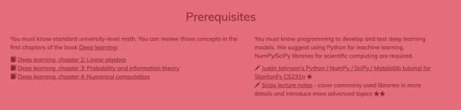

# 资源 | 深度学习资料大全：从基础到各种网络模型

选自 Yerevann

**机器之心编译**

**参与：Jane W、Rick、蒋思源**

> *深度学习是发展迅速的一个计算机科学和数学交叉的领域。它是更宽泛的机器学习领域一个相对新的分支。机器学习的目的是教计算机完成基于给定数据的各种任务。本教程是为那些知道一些数学，又懂一些编程语言，并想研究深度学习的人准备的。*

文中的链接请点击网址：http://yerevann.com/a-guide-to-deep-learning/

**预备知识**

 

你必须有大学数学知识。你可以在深度学习这本书的前几章中回顾这些概念：

*   深度学习，第二章：线性代数

*   深度学习，第三章：概率与信息论

*   深度学习，第四章：数值计算

你必须知道编程知识以便开发和测试深度学习模型。我们建议使用 Python 进行机器学习。这里需要用到科学计算的 NumPy / SciPy 库。

*   斯坦福 CS231n 课程，Justin Johnson 的 Python / NumPy / SciPy / Matplotlib 教程 ★

*   Scipy 讲义——更详细地描述了常用库，并介绍更多高级主题 ★★

当你满足了这些预备条件时，我们有四个备选建议用来学习深度学习。你可以选择下列选项中的任何一个或几个。星星数量表示困难程度。

*   Hugo Larochelle 在 YouTube 上的课程视频（Hugo Larochelle's video course）。虽然视频是在 2013 年录制的，但大部分内容仍然很新。视频详细地解释了神经网络背后的数学知识。附带幻灯片和相关材料。★★

*   斯坦福 CS231n 课程（卷积神经网络的视觉识别/ Convolutional Neural Networks for Visual Recognition）由李飞飞、Andrej Karpathy 和 Justin Johnson 教课。本课程侧重于图像处理，但涵盖了深度学习中的大多数重要概念。附带视频（2016 年）和讲义。★★

*   Michael Nielsen 的网络书籍《神经网络和深度学习》（Neural Networks and Deep Learning）是研究神经网络的最容易入门的书籍。它没有涵盖所有重要的主题，但包含直观解释和基本概念的代码实现。★

*   Ian Goodfellow、Yoshua Bengio 和 Aaron Courville 的书《深度学习》（Deep Learning），是研究深度学习最全面的资源。它比所有其它课程涵盖了更多的内容。★★★

有许多软件框架为机器学习和深度学习提供了必要的函数、类和模块。我们建议在研究的早期阶段不要使用这些框架，而是从头开始实现基本算法。并且大多数课程都能足够详细地描述算法背后的数学，因而这些算法可以很容易从头实现。

*   Jupyter notebook 软件可以方便地交互编译 Python 代码。软件能很好地与流行的可视化库 matplotlib 集成。我们建议在这样的环境中实现算法。★

**机器学习基础**

机器学习是基于数据训练计算机的一门艺术和科学。它是计算机科学和数学交叉的相对确定的领域，而深度学习只是它的一个很小的子领域。机器学习的概念和工具对于理解深度学习非常重要。

 

*   视觉化介绍机器学习（Visual introduction to machine learning）——决策树 ★

*   Coursera 上最受欢迎的课程，Andrew Ng 的机器学习课程（Andrew Ng's course on machine learning）★★

*   Larochelle 的课程，没有单独的通用机器学习的介绍性讲座，但是定义和解释了所有必要的概念。

1\. 训练和测试模型（K 最近邻/kNN）★★

2\. 线性分类（支持向量机/SVM）★★

3\. 优化（随机梯度下降/ stochastic gradient descent）★★

5\. 机器学习基础 ★★★

*   可视化的主成分分析讲解 ★

*   如何有效地用 t-SNE 算法 ★★

大多数流行的机器学习算法都是在 Python 库 Scikit-learn 中实现的。从头开始实现这些算法助于理解机器学习的原理。

*   Python 的实用机器学习教程（Practical Machine Learning Tutorial with Python），包含了线性回归、kNN 和支持向量机。首先介绍了如何从 scikit-learn 调用算法，然后从头实现算法。★

*   Coursera 上 Andrew Ng 的课程的许多作业使用 Octave 语言。也可以在 Python 中实现这些算法。★★

**神经网络基础**

神经网络是强大的机器学习算法。它们构成了深度学习的基础。

*   一个交互可视化的教程，介绍了神经网络的基础——显示简单的神经网络如何做线性回归 ★

1\. 前馈神经网络（feedforward neural network）★★

2\. 训练神经网络（直到 2.7）★★

4\. 反向传播（backpropagation）★★

5\. 神经网络的架构 ★★

1\. 使用神经网络来识别手写数字 ★

2\. 反向传播算法的原理 ★

4\. 神经网络以计算任何函数的可视化证明 ★

6\. 深度前馈网络 ★★★

*   理解为什么从头开始实现反向传播算法很重要 ★★

*   计算图（computational graph）中的微积分：反向传播 ★★

*   玩转神经网络！★

尝试从头实现单层神经网络，包括训练过程。

*   只用 Python / NumPy 实现 softmax 分类器以及一个简单的神经网络——用 Jupyter notebook ★

*   Andrej Karpathy 的神经网络黑客教程讲述了如何在 Javascript 中实现反向传播。★

*   在 Python 中从头开始实现一个神经网络 ★

**改进神经网络的学习方式**

训练神经网络并不容易。有时根本不能学习（欠拟合/ underfitting），而有时能准确地学习你给算法的数据，但是算法学到的「知识」不能泛化到新的、没见过的数据（过拟合/ overfitting）。有许多方法来解决这些问题。

 

*   2.8-2.11\. 正则化（regularization），初始化参数（parameter initialization）等 ★★

*   7.5\. Dropout 方法 ★★

*   6（前半章）. 设置数据和损失函数（loss）★★

*   3\. 改进神经网络学习的方式 ★

*   5\. 为什么深度神经网络难以训练？★

*   7\. 深度学习的正规化 ★★★

*   8\. 优化训练的深度模型 ★★★

*   11\. 实用方法 ★★★

*   MNIST 上的 ConvNetJS Trainer 演示——不同的优化算法性能的可视化 ★

*   梯度下降优化算法的概述 ★★★

*   神经网络、流形（Manifold）和拓扑（Topology）★★★

有许多框架提供标准算法，并针对现代硬件的良好性能进行了优化。这些框架中的大多数提供 Python 接口，除了著名的 Torch 是个例外（其需要 Lua）。一旦你知道如何实现基本的学习算法，现在是选择一个建模框架的时候了。

*   Theano 提供用于构建各种神经网络的低层级原生库（low-level primitives）。它由蒙特利尔大学（University of Montreal）的机器学习团队维护。参见：用 Theano 和 GPU 加速你的神经网络——用 Jupyter notebook ★

*   TensorFlow 是另一个低层级框架。它的架构类似于 Theano。它由谷歌大脑团队维护。

*   Torch 是使用 Lua 语言的流行框架。主要的缺点是 Lua 的社区不像 Python 的那么大。Torch 主要由 Facebook 和 Twitter 维护。

*   还有更高层级的框架，它们运行在这些低层级框架之上：

*   Lasagna 是一个建立在 Theano 之上的更高级框架。它提供了简单的函数，从而可以用少量代码创建大型网络。

*   Keras 是一个更高级框架，建立在 Theano 或 TensorFlow 之上。

*   如果你需要更多关于选择框架的建议，请参见斯坦福大学 CS231n 课程的第 12 讲。★★

**卷积神经网络（Convolutional neural networks）**

卷积神经网络（「CNN」）是一种特殊的神经网络，它使用了一些妙技来更快、更好地学习。ConvNets 从根本上变革了计算机视觉，并且也被大量应用于语音识别和文本分类任务中。

 

*   9\. 计算机视觉（至 9.9）★★ 

*   6（下半部）.ConvNets 介绍 ★★

*   7\. 卷积神经网络 ★★ 

*   8\. 定位与检测 ★★ 

*   9\. Visualization、 Deep Dream、Neural Style、对抗样本（adversarial examples）★★ 

*   13\. 图像分割（至 38:00）包括 upconvolutions ★★ 

*   6\. 深度学习 ★

*   9\. 卷积网络 ★★★ 

*   图像核函数（Image Kernel）的视觉阐述——展示卷积过滤器（Convolutional Filters，也称为图像核函数）如何转换图像 ★

*   Conv Nets：以模块化的视角 ★★ 

*   理解卷积 ★★★ 

*   理解自然语言处理（NLP）中的卷积神经网络 ★★

每一个重要框架都应用了卷积网络。通常理解用更高级库编写出来的代码更容易。

 

*   Theano：卷积神经网络（LeNet）★★ 

*   使用 Lasagne 来训练深度神经网络 ★ 

*   检测糖尿病视网膜病变——出自 Kaggle 糖尿病视网膜病变检测竞赛最佳选手的一篇博文。包含一个绝佳的数据增强案例。★★

*   使用深度学习进行的露脊鲸面部识别——作者在定位和分类过程中使用了不同的 ConvNets。内附代码及模型。★★

*   TensorFlow：在 CIFAR-10 数据集上进行图像识别的卷积神经网络 ★★ 

*   在 TensorFlow 中使用一个卷积神经网络进行文本分类 ★★

*   深度学习在 TensorFlow 中的实施 ★★★

*   Torch 中的 CIFAR-10 准确性为 92.45%——在 Torch 中实现带有批量归一化层（batch normalization layers）的 VGG-Net 网络 ★

*   残差网络（Residual Net）的训练与考察——残差网络在图像分类方面表现不错。来自 Facebook 和 CornellTech 的两位研究人员在 Torch 中采用了这种网络 ★★★ 

*   ConvNets 实践——使用卷积网络方面的许多实用技巧包括：数据增强、迁移学习、卷积运算的快速实现 ★★

**循环神经网络（Recurrent neural networks）**

循环神经网络（RNN）是与序列一起使用的。通常用于语句分类（比如情感分析）和语音识别，但也用于文本生成，甚至图像生成。

*   循环神经网络的合理有效性——描述了 RNN 如何生成文本、数学论文和 C++ 代码 ★

*   Hugo Larochelle 的课程并不涉及循环神经网络（即使它涵盖了循环神经网络应用方面的许多话题）。我们推荐你补上 Nando de Freitas 的《Recurrent Neural Nets and LSTMs》课程 ★★

*   10\. 循环神经网络、图像字幕、LSTM ★★ 

*   13.Soft Attention（38:00 起）★★

*   Michael Nielsen 的书最后一节是卷积网络。深度神经网络的其他方法（Other approaches to deep neural nets）一节只是简要回顾了简单循环网络和 LSTM。★ 

*   10\. 序列建模（Sequence Modeling）：循环和递归网络（Recurrent and Recursive Nets）★★★ 

*   斯坦福大学 Richard Socher 教授的 CS224d(2016)《循环神经网络（Recurrent Neural Networks）》课程★★

*   了解 LSTM 网络 ★★

循环神经网络也被用在了每一个现代框架中。

 

*   Theano：有单词嵌入的循环神经网络 ★★★ 

*   Theano：用于情感分析的 LSTM 网络★★★ 

*   使用 Python、NumPy 和 Theano 实现循环神经网络 ★★ 

*   karpathy 的 char-rnn 代码的 Lasagne 实现 ★ 

*   在 Lasagne 中结合卷积神经网络和循环神经网络用于口语识别 ★

*   在 Lasagne 中采用 LSTM 网络进行自动音译 ★

*   Tensorflow：用于自然语言建模的循环神经网络 ★★

*   Tensorflow 中的循环神经网络 ★★ 

*   理解并实现 Deepmind 的 DRAW 模型 ★★★

*   LSTM 的实现说明 ★★ 

*   karpathy 的 char-rnn 代码的 Torch 实现 ★★★

**自编码器（Autoencoders）**

自编码器是为无监督学习（例如数据未标记的情况）而设计的神经网络。可用它进行降维、预训练其他神经网络及数据生成等。以下资源还包括自编码器与图形模型的有趣混合体，称为变分自编码器（variational autoencoders），不过其数学基础是下一节的内容。

*   6\. 自编码器（Autoencoder）★★ 

*   7.6\. 深度自编码器（Deep Autoencoder）★★ 

*   14\. 视频与无监督学习（32:29 起）——此视频还涉及一个令人兴奋的话题：生成对抗网络（Generative Adversarial Networks/GAN）。★★ 

*   14\. 自编码器（Autoencoders）★★★

*   ConvNetJS 去噪自编码器演示 ★ 

*   变分自编码器与图像生成中的 Karol Gregor ★★

大多数的自编码器都很容易实现。我们建议你浏览完整案例前自己先试着实现一下。

 

*   Theano：去噪自编码器 ★★ 

*   使用堆栈式自编码器（stacked autoencoders）深入研究 Tensorflow ★★

*   Tensorflow 中的变分自编码器 ★★ 

*   在 ImageNet 上使用 Torch 7 训练自编码器 ★★

*   在 Keras 中构建自编码器 ★

**概率图模型（Probabilistic graphical models/PGMs）**

概率图模型（PGM）在统计学与机器学习的交叉领域形成一个独立的分支。一般说来关于 PGM 的书籍和课程有很多。这里我们提出的是：在深度学习中如何应用这些模型。Hugo Larochelle 的课程介绍了几个著名的模型，而《Deep Learning》一书则用了四章（16-19）来阐述该理论，并在最后一章介绍了十几种模型。这些课题都需要大量的数学知识。

 

*   3\. 条件随机场（Conditional Random Fields/CRF）★★★ 

*   4\. 训练条件随机场 ★★★

*   5\. 受限玻尔兹曼机（Restricted Boltzmann Machine/RBM）★★★

*   7.7-7.9\. 深度信念网络（Deep Belief Network/DBN）★★★

*   9.10\. 卷积受限玻尔兹曼机 ★★★ 

*   13\. 金融线性模型（Linear Factor Models）——概率模型的第一步 ★★★

*   16\. 深度学习的结构化概率模型 ★★★

*   17\. 蒙特卡洛（Monte Carlo）方法 ★★★

*   18\. 对抗配分函数（Confronting the Partition Function）★★★

*   19\. 近似推断（Approximate Inference）★★★

*   20\. 深度生成模型（Deep Generative Models）——包括玻尔兹曼机（RBM、DBN 等）、变分自编码器（variational autoencoders）、生成对抗网络、自回归模型（Autoregressive Models）等 ★★★ 

*   生成模型——变分自编码器、生成对抗网络及其 OpenAI 改进方面的一篇博文。★★★

*   神经网络园（The Neural Network Zoo）试图使用一个单一方案组织大量架构。★★

更高层次的框架（Lasagne、Keras）不执行图形模型。但有很多为 Theano、Tensorflow 和 Torch 而编写的代码。

 

*   Theano 中的受限玻尔兹曼机 ★★★

*   Theano 中的深度信念网络 ★★★

*   由特征向量生成大图像——结合运用变分自编码器（variational autoencoders）与生成对抗网络。★★★ 

*   在 TensorFlow 中使用深度学习进行图像修复——生成对抗网络的另一个应用。★★★ 

*   使用 Torch 的面部生成——生成对抗网络的 Torch 实现 ★★

**前沿**

深度学习是一个非常活跃的科学研究领域。要想跟上顶尖的科研进程，就必须阅读新的论文并跟上重要的会议。通常每个新思想都是在 arXiv.org 的预印本论文上发表。然后其中一些提交给会议并进行同行评议。最好的那些会在会议上被提出并发表在期刊上。如果该作者不发布其模型的代码，许多人会试图实现它们并将其放在 GitHub 上。这得需要 1、2 年的时间，合理解释其思想和实现过程的高品质技术博客、教程和视频才会出现在网络上。

 

*   深度学习论文阅读路线图包含一长串的重要文件。

*   Arxiv Sanity Preserver 的用户界面在 arXiv 上浏览论文的效果不错。

*   Videolectures.net 包含许多高级课题相关的视频。

*   /r/MachineLearning 是一个非常活跃的 Reddit 板块。所有新的重要论文都会在那里进行讨论。

***©本文由机器之心编译，***转载请联系本公众号获得授权***。***

✄------------------------------------------------

**加入机器之心（全职记者/实习生）：hr@almosthuman.cn**

**投稿或寻求报道：editor@almosthuman.cn**

**广告&商务合作：bd@almosthuman.cn**