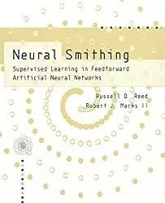

# 推荐 | 九本不容错过的深度学习和神经网络书籍

选自 aioptify

**机器之心编译**

**参与：微胖、李亚洲、蒋思源**

> *针对 30 多本深度学习和神经网络书籍，我们（AI Optify 数据团队）使用不同指标（比如，在线评价、打分、所涉主题、作者影响力、出版年份、社交媒体是否提及等）训练机器学习算法，为每本书打分、排名。读者可能会喜欢我们的推荐，因为这份榜单基于数据并且客观。排名靠前的九本书如下。*

**1\. 搭建你自己的神经网络（Make Your Own Neural Network）**

价格：45 美元

  

一步步让你了解神经网络的数学原理并用 Python 搭建自己的神经网络。神经网络是深度学习和人工智能的关键元素。然而，几乎很少有人真正了解神经网络如何运作。本书从非常简单的思想开始，让你在趣味和从容不迫中，逐渐了解神经网络的运作原理。

**2\. 神经网络设计（第二版）（Neural Network Design 2nd Edition)**

价格：28 美元

 

本书作者著有 Neural Network Toolbox for MATLAB 一书。本书清楚详细介绍了基本神经网络结构和学习规则。其中，作者条理清楚地介绍了主要的神经网络、训练方法以及如何用来解决实际问题。广泛介绍了前馈网络（包括多层和径向基网络）和循环网络的训练方法是本书的一大特点。

**3\. 用于模式识别的神经网络（计量经济学高级教程）（Neural Networks for Pattern Recognition Advanced Texts in Econometrics）**

价格：58 美元

  

本书首次从统计模式识别角度全面介绍了前馈神经网络。在引介基本概念后，作者检视了概率密度函数的建模技巧以及多层感知机以及径向基函数网络模型的特性和优点。本书也介绍了各种不同形式的误差函数、误差函数极小化主要算法，神经网络的学习和泛化以及贝叶斯技巧及其应用。

**4\. 神经网络：一个综合性基础（第二版）（Neural Networks: A Comprehensive Foundation (2nd Edition)**

价格：48 美元

面向计算机工程、电子工程以及计算机科学专业研究生的神经网络课程，全面、易读、结构合理，全面更新的教程仍然是工程学视角下、最全面的神经网络介绍，本书已全面修订。

**5\. 深度学习基础：设计下一代机器智能的算法（Fundamentals of Deep Learning: Designing Next-Generation Machine Intelligence Algorithms）**

价格：33 美元

 

随着神经网络在 21 世纪的振兴，深度学习已经成为一个极其活跃的研究领域，它正在为现代机器学习铺平道路。本书使用实例和论证说明帮助你理解这个复杂领域内的主要概念。掌握深度学习仍然是很复杂与困难的，不过如果你对机器学习有基本的理解，对 Python 编程语言比较熟悉，还能有一点微积分的数学背景，那么这本书将能很好地帮助你学习深度学习。

**6\. 深度学习：自适应计算和机器学习系列（Deep Learning (Adaptive Computation and Machine Learning series)）**

价格：69 美元

 

文中提供数学和学科概念背景知识，其涵盖了线性代数、概率论和信息论、数值计算和机器学习等相关的背景知识。它阐述了行业从业者使用的深度学习技术，包含了深度前馈网络，正则化，优化算法，卷积网络，序列建模和实用性方法等。同时它对深度学习实际应用如自然语言处理、语音识别、计算机视觉、在线推荐系统、生物信息学和视频游戏也做了一个详尽的调查分析。

**7\. 神经锻造：前馈人工神经网络中的监督学习（Neural Smithing: Supervised Learning in Feedforward Artificial Neural Networks）**

价格：63 美元

 

人工智能神经网络是非线形映射系统，它的结构简要的基于对人与动物大脑神经系统的观察。基础思路是简单单元的大规模系统以能生成许多复杂、有趣的行为的方式连接到一起。该书注重在前馈人工神经网络的一个子集，也就是多层感知器（MLP）。这是最普遍使用的神经网络，被应用于金融（预测）、制造业（流程控制）和科学（语音和图像识别）等多个领域。

**8\. 人工神经网络基础（Fundamentals of Artificial Neural Networks）**

价格：45 美元

**** 

作为 IEEE Transactions on Neural Networks 的书评编辑，Mohamad Hassoun 有机会去评估近年来出现的众多关于人工神经网络的书籍。现在，在 Fundamentals of Artificial Neural Networks 一书中，他通过清楚的分辨目前神经网络研究员使用的理论与实践的基本概念与主要方法，首次对人工神经网络范式提供了系统性的解释。这样的一本系统的、统一的书籍，尽管缺少对最近神经网络发展的描述，也依然很适合于学生与从业者。

**9\. 深度学习：从业者的实用方法（Deep Learning: A Practitioner's Approach）**

价格：28 美元

 

你想寻找一本能阐述机器学习主要进展的核心书籍吗？Deep Learning: A Practitioner's Approach 为开发者和数据科学家提供最实用的信息，包括深度学习理论、最优方法和实用案例。作者 Adam Gibson 和 Josh Patterson 以非学术方式介绍了最新的相关论文和技术，并在他们的 DL4J 库中实现核心数学方法。如果你在嵌入式，桌面和大数据/ Hadoop spaces 工作，并真正想了解深度学习，那么这就是你想要的书。

***©本文由机器之心编译，***转载请联系本公众号获得授权***。***

✄------------------------------------------------

**加入机器之心（全职记者/实习生）：hr@almosthuman.cn**

**投稿或寻求报道：editor@almosthuman.cn**

**广告&商务合作：bd@almosthuman.cn**