# 学界 | 2010-2016 年被引用次数最多的深度学习论文（附论文下载）

选自 Github

**作者：Terry T. Um **

**机器之心编译**

**参与：阿儁是个 nerd，亚洲，黄清纬，微胖**

我相信世上存在值得阅读的经典的深度学习论文，不论它们的应用领域是什么。比起推荐大家长长一大串论文，我更倾向于推荐大家一个某些深度学习领域的必读论文精选合集。

## **精选合集标准**

*   2016 : +30 引用 「+50」

*   2015 : +100 引用 「 +200」

*   2014 : +200 引用 「+400」

*   2013 : +300 引用 「 +600」

*   2012 : +400 引用 「 +800」

*   2011 : +500 引用 「 +1000」

*   2010 : +600 引用 「 +1200」

**目录**

*   调查 / 回顾

*   理论 / 未来

*   优化 / 正则化

*   网络模型

*   图像

*   图片说明

*   视频 / 人类行为

*   词嵌入

*   机器翻译 / 问答

*   语音 / 及其他

*   强化学习 / 机器人

*   无监督

*   硬件 / 软件

*   推荐论文

总共有 85 篇论文，不包括「硬件 / 软件」论文以及「推荐论文」。 

### **一、调查 / 回顾** 

**1.论文： 深度学习**

Deep learning

作者：Ian.Goodfellow et al.

**2.论文：深度学习**

Deep learning (2015)

作者：Y. LeCun, Y. Bengio 以及 G. Hinton

> *注：机器之心已经翻译过本文：**[Nature 重磅：Hinton、LeCun、Bengio 三巨头权威科普深度学习](http://mp.weixin.qq.com/s?__biz=MzA3MzI4MjgzMw==&mid=208649889&idx=1&sn=3977c811c2fcee8d5f15fc7559ed2e2f&scene=21#wechat_redirect)* **

**3\. 神经网络中的深度学习：概述**

Deep learning in neural networks: An overview

作者：J. Schmidhuber

**4\. 表征学习：回顾及新观点**

Representation learning: A review and new perspectives

作者： Y. Bengio et al.

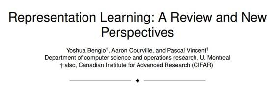
摘要：通常来说，机器学习算法的成功依赖于数据的表征，我们假设这是因为不同的表征方式会卷入并多少掩盖数据背后变化的不同解释因素。虽然专业领域的知识可以帮助设计表征方式，但是，通用的先验知识也可以，并且对 AI 的追求正在激发更强大的实现了这些先验知识的表征学习算法的设计。这篇论文回顾了无监督特征学习和深度学习领域最近成果，包括概率模型、自动编码器、流形学习和深度网络的进展。这也激发了人们去解决长期悬而未决的问题，也就是学习好的表征、计算表征（比如推理）的合适目标这个问题，也促进了表征学习，密度估计和流型学习之间的几何连接。索引词——深度学习，表征学习，特征学习，无监督学习，玻耳兹曼机「Boltzmann Machine」，自动编码器，神经网路。

**二、理论/未来**

**5\. 在神经网络中提取知识**

Distilling the knowledge in a neural network

作者：G. Hinton et al.

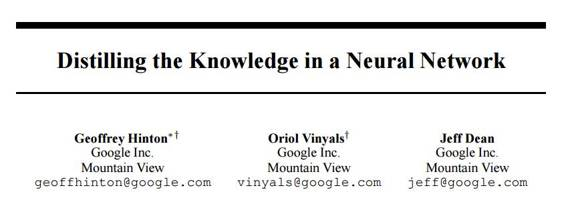
摘要：一个非常简单的能改善几乎任何机器学习算法表现的方法，就是训练许多基于相同数据集的模型，并取这些模型的预测平均值。不幸的，使用全部模型来进行预测是笨拙的，而且允许大量用户部署的计算成本太昂贵，特别是当个体模型是大的神经网络的时候。Caruana 和他的合作者已经表明，有可能将一个集合中的知识压缩到一个单独模型中，部署起来也容易得多，而且我们使用了不同压缩技巧进一步扩展了这一方法。在 MNIST 上，我们取得了一些令人吃惊的成功，而且我们展示了可以显著改善一个重度使用商业系统的声学模型，方法就是将集合中的知识概括进一个单独模型。我们也介绍了一个新型集合，由一个或更多的全模型以及许多学会区分识别细粒度类别（全模型做不到）的专家模型组成。可以对这些专家模型进行快速、并行训练。

**6\. 深度神经网络很易受骗：高信度预测无法识别的图片**

Deep neural networks are easily fooled: High confidence predictions for unrecognizable images

作者：A. Nguyen et al.

**7\. 深度神经网络特征的可迁移性如何？**

How transferable are features in deep neural networks? (2014),

作者：J. Yosinski et al.

**8\. 细节魔鬼的回归：深挖卷积网络**

Return of the Devil in the Details: Delving Deep into Convolutional Nets (2014)

作者：K. Chatfield et al.

**9\. 为什么无监督预训练对深度学习有帮助？** 

Why does unsupervised pre-training help deep learning (2010)

作者：D. Erhan et al. (Bengio)

**10\. 理解训练深度前馈神经网络的难点** 

Understanding the difficulty of training deep feedforward neural networks (2010)

作者：X. Glorot and Y. Bengio

### **三、优化/正则化** 

**11\. Batch Normalization 算法：通过减少内部协变量转化加速深度网络的训练**

Batch Normalization: Accelerating Deep Network Training by Reducing Internal Covariate Shift (2015)

作者：S. Loffe and C. Szegedy (Google)

**12\. 深度探入纠正器：在 Imagenet 分类中超过人类表现**

Delving deep into rectifiers: Surpassing human-level performance on imagenet classification (2015)

作者：K. He et al.(Microsoft)

**13\. Dropout：一个预防神经网络过拟合的简单方式**

Dropout: A simple way to prevent neural networks from overfitting (2014)

作者：N. Srivastava et al. (Hinton)

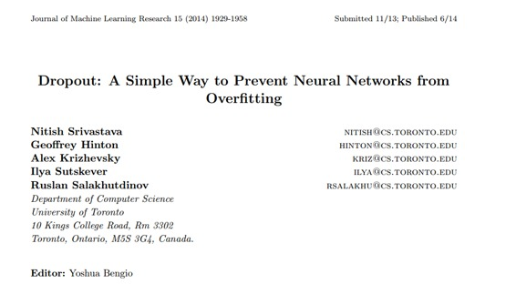
摘要：带有大量参数的深度神经网络是非常有力的机器学习系统。但是，这类网络中存在一个严重的问题，过度拟合。大型网络采用缓慢，因此，很难通过测试时集合许多不同大型神经网络的预测来解决过度拟合问题。Dropout 是一个解决办法。其中关键思想是，在训练过程中，从神经网络中随机放弃单元（以及它们的连接）。这能防止单元过于适应。在训练过程中，放弃来自指数数量的不同“变薄的”神经网络的样本。测试时，简单使用一个单独的带有较小权重的变薄网络，就很容易近似平均所有这些变瘦网络预测的效果。这显著减轻了过度拟合，也改进了其他正则化方法。我们也表明，这一方法改善了神经网络在监督学习任务（视觉、语音识别、文档分类以及计算生物学）方面的表现，在许多基准数据组上的成绩目前达到最先进水平。

**14\. Adam：一个随机优化的方法**

Adam: A method for stochastic optimization (2014)

作者：D. Kingma and J. Ba

**15\. 视觉识别中深度卷积网络的空间金字塔池化**

Spatial pyramid pooling in deep convolutional networks for visual recognition (2014)

作者：K. He et al.

**16\. 论深度学习领域初始化和动量的重要性**

On the importance of initialization and momentum in deep learning (2013)

作者：I. Sutskever et al. (Hinton)

**17\. 使用 Dropconnect 的神经网络正则化**

Regularization of neural networks using dropconnect (2013)

作者：L. Wan et al. (LeCun)

**18\. 通过预防特征检测器的互相适应改善神经网络**

Improving neural networks by preventing co-adaptation of feature detectors (2012)

作者：G. Hinton et al.

**19\. 超参数最优化的随机搜索**

Random search for hyper-parameter optimization (2012)

作者：J. Bergstra and Y. Bengio

**20\. 图像识别中的深度残差学习**

Deep residual learning for image recognition (2016)

作者：K. He et al. (Microsoft)

**21\. 用于物体精准检测和分割的基于区域的卷积网络**

Region-based convolutional networks for accurate object detection and segmentation (2016)

作者：R. Girshick et al.(Microsoft) 

**22.深入卷积网络**

Going deeper with convolutions (2015)

作者：C. Szegedy et al. (Google)

**23\. 快速 R-CNN 网络**

Fast R-CNN (2015)

作者： R. Girshick (Microsoft)

**24\. 用于语义分割的饱和卷积网络**

Fully convolutional networks for semantic segmentation (2015)

作者：J. Long et al.

**25\. 大规模图像识别的深度卷积网络**

Very deep convolutional networks for large-scale image recognition (2014)

作者：K. Simonyan and A. Zisserman

**26\. OverFeat：使用卷积网络融合识别、本地化和检测**

OverFeat: Integrated recognition, localization and detection using convolutional networks (2014)

作者：P. Sermanet et al.(LeCun)

**27\. 可视化以及理解卷积网络**

Visualizing and understanding convolutional networks (2014)

作者：M. Zeiler and R. Fergus

**28\. Maxout 网络**

Maxout networks (2013)

作者：I. Goodfellow et al. (Bengio)

**29\. Network In Network 深度网络架构**

Network in network (2013)

作者：M. Lin et al.

**30\. 使用深度卷积神经网络做 ImageNet 分类**

ImageNet classification with deep convolutional neural networks (2012)

作者：A. Krizhevsky et al. (Hinton)

**31\. 大规模分布式深度网络**

Large scale distributed deep networks (2012)

作者：J. Dean et al.

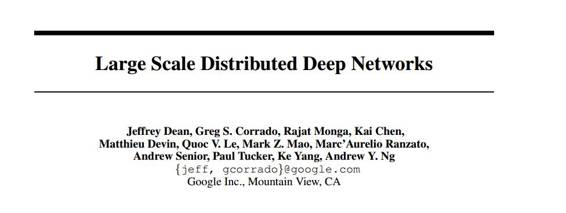

摘要：近期在无监督特征学习和深度学习上的研究表明，在大规模模型上的训练能够急剧改善性能。在此论文中，我们考虑了使用成千上万个 CPU 核训练一个带有数十亿参数的深度网络的问题。我们开发了一个名为 DistBelief 的软件框架，能够利用数千台机器的计算集群训练大规模模型。在这一框架内，我们开发了两种大规模分布训练的算法：（i）Downpour SGD，这是一个异步随机梯度下降过程，支持众多模型副本；（ii）Sandblaster，这是一个支持多样分布批处理优化程序的框架，包括一个 L-BFGS 分布式实施方案。Downpour SGC 和 Sandblaster L-BFGS 都增加了深度网络训练的规模和速度。我们已经成功的使用这一系统训练了一个比先前报告中大 30 倍的深度网络，并且在 ImageNet 挑战赛上取得了最顶尖的表现，这是一个拥有 1600 万图像和 21k 分类的视觉物体识别任务。还显示出，在商业化语音识别服务中使用同一技术能够急加速一个较小的深度网络的训练。尽管我们专注于这些方法应用于大型神经网络并报道性能，在下面的算法可应用于任何基于梯度的机器学习算法。

**32\. 深而稀疏的修正神经网络**

Deep sparse rectifier neural networks (2011)

作者：X. Glorot et al. (Bengio)

**33\. 使用卷积神经网络在自然环境下阅读文本**

Reading text in the wild with convolutional neural networks (2016)

作者：M. Jaderberg et al. (DeepMind)

**四、图像** 

**34\. 使用卷积神经网络在自然环境下阅读文本**

Reading text in the wild with convolutional neural networks (2016)

作者：M. Jaderberg et al. (DeepMind)

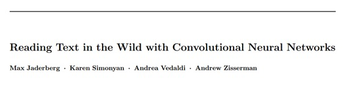摘要：在此论文中，我们提供了一个在自然场景图像和基于图像检索文本的发现——本地化和文本识别的端到端系统。这个系统基于一个用于检测的区域提议机制和用于识别的深度卷积神经网络。我们的途径使用了一个建议生成技术间的互补性结合，用于保证高查全率，还有一个用于改善精确率的快速后续过滤阶段。为了做到识别和建议排序，我们训练了非常大的卷积神经网络同时在全部提议区域完成单词识别，这不同于过去基于系统的字符分类器。这些网络仅仅在经由一个合成的文本生成引擎产生的数据上进行训练，不需要人类标记的数据。对我们途径阶段的分析显示，自始至终的性能表现都是最顶尖的。我们在一系列标准的端到端文本识别基准和基于文本的图像检索数据集上进行了严格的实验，结果显示要比之前的所有方法都有大幅度的改善。最终，我们展示了一个这一文本识别系统在现实中的应用，能够通过一个文本查询立即搜索到数千小时的新闻片段。

**35\. Imagenet 大规模视觉识别挑战赛**

Imagenet large scale visual recognition challenge (2015)

作者：O. Russakovsky et al.

**36\. 更快速的 R-CNN 网络：使用区域建议网络的实时物体检测**

Faster R-CNN: Towards Real-Time Object Detection with Region Proposal Networks (2015)

作者： S. Ren et al.

**37\. DRAW：一个用于图像生成的循环神经网络**

DRAW: A recurrent neural network for image generation (2015)

作者：K. Gregor et al.

**38\. 对精确的物体检测和语义切割更为丰富的特征分层**

Rich feature hierarchies for accurate object detection and semantic segmentation (2014)

作者： R. Girshick et al.

**39\. 使用卷积神经网络学习和迁移中层图像表征**

Learning and transferring mid-Level image representations using convolutional neural networks (2014)

作者：M. Oquab et al.

**40\. DeepFace：在面部验证任务中接近人类表现**

DeepFace: Closing the Gap to Human-Level Performance in Face Verification (2014)

作者：Y. Taigman et al. (Facebook)

**41\. Decaf：一个用于通用视觉识别的深度卷积激活特征**

Decaf: A deep convolutional activation feature for generic visual recognition (2013)

作者：J. Donahue et al.

**42\. 为场景标注学习层级特征** 

Learning Hierarchical Features for Scene Labeling (2013)

作者：C. Farabet et al. (LeCun)

**43\. 为识别学习中层特征（2010），Y.Boureau（LeCun）**

Learning mid-level features for recognition (2010)

作者： Y. Boureau (LeCun)

### **五、图片说明** 

**44\. 显示、注意以及说明：带有视觉注意模型的神经图像说明生成**

Show, attend and tell: Neural image caption generation with visual attention (2015)

作者：K. Xu et al. (Bengio)

**45\. 显示和说明：一个神经图像说明生成器**

Show and tell: A neural image caption generator (2015)

作者：O. Vinyals et al.

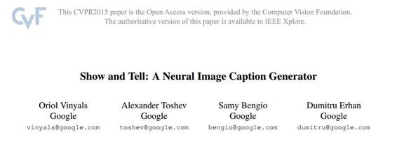

摘要：在人工智能领域，自动描述一张图像的内容是一个基础问题，它涉及到了计算机视觉和自然语言处理的结合。在此论文中，我们提出了一个基于深度循环架构的生成模型，结合了如今在计算机视觉和机器翻译的最新进展，这个模型能够用于生成图像的自然描述。训练出的模型将最大化的接近给定训练图像的的描述语句。在数个数据集上的实验都显示出了这一模型仅仅从图像描述中学习到的准确率和语言流畅程度。我们的模型相当的准确，在质量和数量上我们都进行了验证。例如，当前最前沿的方法在 Pascal 数据集上的 BLEU-1 分数（分数越高越好）是 25，我们的方法达到了 59 分，可相比于人类的表现 69 分。同样，在 Flickr30K 上的表现从 56 分，改善到了 66 分；在 SBU 上的表现从 19 改善到了 28。最终，在最新发布的 COCO 数据集上，我们得到了 27.7 的 BLEU-4 分数，这是目前最前沿的水平。

**46\. 用于视觉识别和描述的长期循环卷积网络**

Long-term recurrent convolutional networks for visual recognition and description (2015)

作者：J. Donahue et al.

**47\. 可生成图像说明的深度视觉-语义校准模型**

Deep visual-semantic alignments for generating image descriptions (2015)

作者：A. Karpathy and L. Fei-Fei

### **六、视频 / 人类行为**

**48\. 利用卷积神经网络进行大规模视频分类（2014）**

Large-scale video classification with convolutional neural networks (2014)

作者：A. Karpathy et al. (FeiFei)

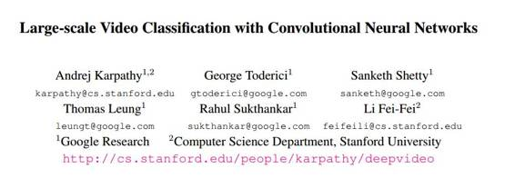

摘要：在解决图像识别问题方面，卷积神经网络（CNNs）已被证实是一类功能强大的模型。在这些研究结论的鼓舞下，我们用 487 类、100 万个 YouTube 视频，经验评估了 CNNs 在大规模视频分类任务中的表现。我们研究了多个方法将 CNN 的连通性扩展到时间域来利用本地时空信息，并且认为，一种 multiresolution 凹架构有望加速训练速度。与基于强特征的基线相比较，我们最好的时空网络表现不仅有了显著提升（ (55.3% 到 63.9%)），而且让人惊讶的是，与 单框模型相比较，表现也有了适度提升（59.3% 到 60.9%）。通过用 UCF- 101 Action Recognition 数据组重新训练顶层，我们还进一步研究了最好模型的泛化情况，结果发现与 UCF-101 基线模型相比较，其表现从 43.9%提升到了 63.3%。

**49\. DeepPose：利用深度神经网络评估人类姿势**

DeepPose: Human pose estimation via deep neural networks (2014)

作者：A. Toshev and C. Szegedy (Google)

**50\. 用于视频中动作识别的双流卷积网络**

Two-stream convolutional networks for action recognition in videos (2014)

作者：K. Simonyan et al.

**51\. 使用可穿戴传感器对人类活动识别的调查**

A survey on human activity recognition using wearable sensors (2013)

作者：O. Lara and M. Labrador

**52\. 用于人类动作识别的 3D 卷积神经网络**

3D convolutional neural networks for human action recognition (2013)

作者：S. Ji et al.

**53\. 带有改进轨迹的动作识别**

Action recognition with improved trajectories (2013)

作者：H. Wang and C. Schmid

**54\. 用独立子空间分析，学习用于动作识别的等级恒定的时空特征**

Learning hierarchical invariant spatio-temporal features for action recognition with independent subspace analysis (2011)

作者：Q. Le et al

### **七、词嵌入**

### **55\. Glove: 用于词表征的全局向量** 

### Glove: Global vectors for word representation (2014)

### 作者：J. Pennington et al. 

**56\. 句子和文档的分布式表示**

Distributed representations of sentences and documents (2014)

作者：Q. Le and T. Mikolov (Google)

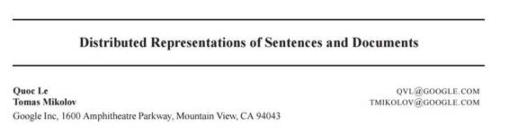

摘要：很多机器学习算法都需要将输入表示成一个固定长度的特征向量。对于文本学习来说，最常用的一种方法是用词袋模型来表示。不管词袋模型多么流行，其存在两个弱点：一是丢失了词序信息，二是忽略了词义。比如，「powerful」，「strong」和「Paris」都是同等地位的。本文，我们提出了一种称为段落向量的无监督学习算法，旨在从变长度的长文本中学习其固定长度的特征表示，比如句子，段落和文档。我们的算法通过预测文档中的词来将每一篇文档表示成一个稠密的向量。这种思路帮助我们的算法解决了词袋模型的缺点。实验结果表面段落向量算法比词袋模型和其他文本表示的模型都要出众。最后，我们在几个文本分类和情感分析任务上得到了最优结果。

**57\. 词、短语及其合成性的分布式表征**

Distributed representations of words and phrases and their compositionality (2013)

作者：T. Mikolov et al. (Google)

**58\. 有效评估词在向量空间中的表征**

Efficient estimation of word representations in vector space (2013)

作者：T. Mikolov et al. (Google)

**59\. 词表征：一个针对半监督学习的简单且通用的方法**

Word representations: a simple and general method for semi-supervised learning (2010)

作者：J. Turian (Bengio)

### **八、机器翻译 / 问答**

**60\. 面向全人工智能问答：  一套必备的玩具任务**

Towards ai-complete question answering: A set of prerequisite toy tasks (2015)

作者：J. Weston et al.

**61\. 通过共同学习对齐和翻译实现神经机器翻译**

Neural machine translation by jointly learning to align and translate (2014)

作者：D. Bahdanau et al. (Bengio)

**62\. 利用神经网络进行序列到序列的学习**

Sequence to sequence learning with neural networks (2014)

作者：I. Sutskever et al.

**63\. 用 RNN 编码——解码器学习短语表征，实现统计机器翻译**

Learning phrase representations using RNN encoder-decoder for statistical machine translation (2014)

作者：K. Cho et al.(Bengio)

**64\. 一个为句子建模的卷积神经网络**

A convolutional neural network for modelling sentences (2014)

作者：N. Kalchbrenner et al.

**65\. 用于句子分类的卷积神经网络**

Convolutional neural networks for sentence classification (2014)

作者：Y. Kim

**66\. 斯坦福 coreNLP 自然语言处理工具**

The stanford coreNLP natural language processing toolkit (2014)

作者：C. Manning et al.

**67\. 基于情感树库应用于情感组合研究的递归深度网络模型**

Recursive deep models for semantic compositionality over a sentiment treebank (2013)

作者：R. Socher et al.

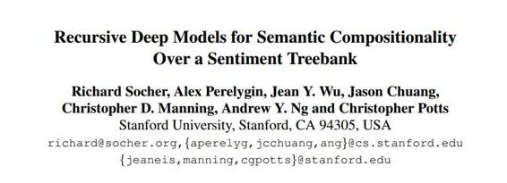
摘要：词语义空间虽然非常有用但无法准确地表达一个短语的意思。类似于情感检测的组合性任务需要更丰富的有监督训练和评价资源和更有力的组合模型。为了解决这个问题，我么提出了情感树库。库中包括含了 11855 个句子解析树中的 215154 个细粒度情感短语标签，对于情感组合提出了新的挑战。为此我们提出了递归神经张量网络模型。采用树库进行训练，本文模型在很多指标上比所有前人的模型都出众。将单句的正负情绪分类准确率从 80%提升到了 85.4%。对于预测细粒度的情感标签准确率提升到了 80.7%，相比于特征袋模型提升了 9.7 个百分点。最后，本文模型是唯一一个可以准确地捕捉否定词影响的模型，并且判断范围不管是正面短语还是负面短语都可以到多种树级别。

**68\. 几乎从头开始的自然语言处理**

Natural language processing (almost) from scratch (2011)

作者：R. Collobert et al.

**69\. 基于语言模型的循环神经网络**

Recurrent neural network based language model (2010)

作者：T. Mikolov et al.

### **九、语音/及其他**

**70\. 自动语音识别：一种深度学习的方法**

Automatic Speech Recognition - A Deep Learning Approach (Book, 2015)

作者：D. Yu and L. Deng (Microsoft)

**71\. 使用深度循环网络进行语音识别**

Speech recognition with deep recurrent neural networks (2013)

作者：A. Graves (Hinton)

**72\. 用于语音识别中声学建模的深度神经网络：四个研究小组的观点分享**

Deep neural networks for acoustic modeling in speech recognition: The shared views of four research groups (2012)

作者：G. Hinton et al.

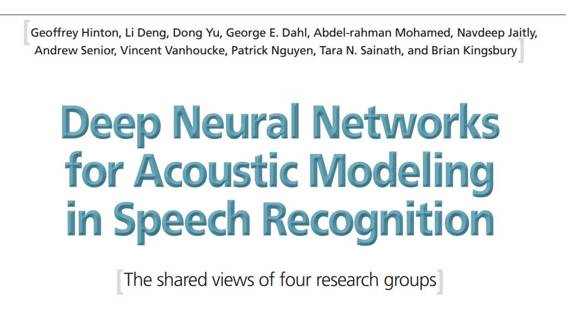
摘要：大多数当前的语音识别系统都使用隐马尔科夫模型（HMMs）来解决语音中的时间变化问题，用混合高斯模型（GMMs）来评价每一个 HMM 拟合声音输入表示帧或者小窗口帧系数的效果。存在一种替代评价方法是使用前馈神经网络来将多个帧系数作为输入，将 HMM 状态的后验概率作为输出。深度神经网络有很多隐藏层，通过新的方法进行训练，在很多语音识别任务上都比 GMM 模型更加出众，有时甚至会好非常多。本文将会做一个综述，分别对四家研究机构在最近语音识别的声学建模领域取得的成功进行介绍。

**73\. 基于上下文预训练的深度神经网络在大规模词表语音识别中的应用**

Context-dependent pre-trained deep neural networks for large-vocabulary speech recognition (2012)

作者：G. Dahl et al.

**74\. 使用深度信念网络进行声学建模**

Acoustic modeling using deep belief networks (2012)

作者：A. Mohamed et al. (Hinton)

### **十、强化学习/机器人**

**75\. 通过深度神经网络和树搜索来掌控围棋游戏**

Mastering the game of Go with deep neural networks and tree search (2016)

作者：D. Silver et al. (DeepMind)

摘要：围棋被视为人工智能挑战经典游戏中最难的一个，因为其巨大的搜索空间和对位置和移动的评价难度。本文提出了一种新方法使用“值网络”来评价位置，用“策略网络”来选择移动。这些深度神经网络是从人类专家棋局中进行有监督学习，然后在从自对弈中进行强化学习。如果不考虑前向搜索的话，当前最好的神经网路模型是蒙特卡洛树搜索，这种方法通过进行上千局的自对弈来进行仿真。我们也介绍了一种新点的搜索算法，将蒙特卡洛仿真与值网络和策略网络进行了综合。使用这种搜索算法，我们的项目 AlphaGo 有 99.8%的胜率，并且以 5：0 的比分打败了来自欧洲的人类冠军。这也是计算机第一次在真实围棋比赛中几百人类专业选手，将 10 年后的目标提前完成了。

**76\. 通过深度强化学习实现人类水平控制**

Human-level control through deep reinforcement learning (2015)

作者：V. Mnih et al. (DeepMind)

**77\. 侦测机器人抓取的深度学习**

Deep learning for detecting robotic grasps (2015)

作者：I. Lenz et al.

**78\. 用强化学习玩雅达利游戏**

Playing atari with deep reinforcement learning (2013)

作者：V. Mnih et al. (DeepMind)

### **十一、无监督**

**79\. 生成对抗网络**

Generative adversarial nets (2014)

作者：I. Goodfellow et al. (Bengio)

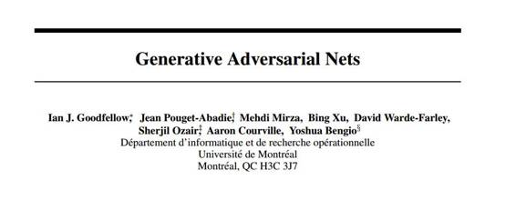
摘要：我们提出了一种通过对抗过程来评判生成模型的新框架，这里包括两个模型：一个是生成模型 G，用来学习数据分布，另一个是评判模型 D，用来计算一个样本来自于训练数据而不是 G 的概率。训练 G 模型的过程是最大化 D 模型犯错的概率。这个框架相当于一个小型的两人游戏。在任意的 G 和 D 函数空间中，存在一个唯一的解，使得 G 恢复训练数据的分布并且 D 得出的概率是 0.5。这里，G 和 D 均被定义为多层感知机，整个系统用向后传播误差的方法来进行训练。在整个训练过程和样本生成过程中都没有用到任何的马尔科夫链或者是展开近似推理网络。通过定性分析和生成样本评价的定量分析证明了本框架的潜力。

**80\. 自编码变量贝叶斯**

Auto-Encoding Variational Bayes (2013)

作者：D. Kingma and M. Welling

**81\. 用大规模无监督学习搭建高水平特征**

Building high-level features using large scale unsupervised learning (2013)

作者：Q. Le et al.

**82\. 无监督特征学习中单层网络分析**

An analysis of single-layer networks in unsupervised feature learning (2011)

作者：A. Coates et al.

**83\. 堆栈降噪解码器：在本地降噪标准的深度网络中学习有用的表征**

Stacked denoising autoencoders: Learning useful representations in a deep network with a local denoising criterion (2010)

作者：P. Vincent et al. (Bengio)

**84\. 训练受限波兹曼机的实践指南**

A practical guide to training restricted boltzmann machines (2010)

作者：G. Hinton

**十二、硬件/软件** 

**85\. TensorFlow：异构分布式系统上的大规模机器学习**

TensorFlow: Large-Scale Machine Learning on Heterogeneous Distributed Systems (2016)

作者：M. Abadi et al. (Google)

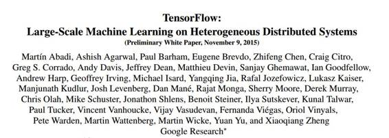

摘要：TensorFlow 是一个表达机器学习算法的接口，也是执行这些算法的实现。TensorFlow 可以在多种操作系统上运行，从移动设备（比如手机）到包含上百台机器和上千台计算硬件（比如 GPU）的大规模分布式系统。软件系统非常灵活，可以用于多种算法，包括深度神经网络的训练和推理算法，并且被广泛应用在计算机科学的多个领域和别的研究领域中，包括语音识别，计算机视觉，机器人，信息检索，自然语言处理，地理信息提取和计算药物发现等。有的是用来做研究，有的则是用来解决工程问题。本文介绍了由 Google 开发的 TensorFlow 接口和实现方法。TensorFlow 的接口和实现已经在 2015 年 11 月以 Apache 2.0 的协议开源，可以在官网 www.tensorflow.org 上找到。

**86\. Theano：一个针对快速计算数学表达公式的 Python 框架**

Theano: A Python framework for fast computation of mathematical expressions

作者：R. Al-Rfou et al. (Bengio)

**87\. MatConvNet: 针对 matlab 的卷积神经网络**

MatConvNet: Convolutional neural networks for matlab (2015)

作者：A. Vedaldi and K. Lenc

**88\. Caffe：快速特征嵌入的卷积结构** 

Caffe: Convolutional architecture for fast feature embedding (2014)

作者： Y. Jia et al.

**十三、推荐论文**

**89\. 对立学习推论**

Adversarially Learned Inference (2016)

作者：V. Dumoulin et al.

**90\. 理解卷积神经网络**

Understanding Convolutional Neural Networks (2016)

作者：J. Koushik

**91\. SqueezeNet 模型：达到 AlexNet 水平的准确率，却使用缩减 50 倍的参数以及< 1MB 的模型大小**

SqueezeNet: AlexNet-level accuracy with 50x fewer parameters and< 1MB model size (2016)

作者：F. Iandola et al.

**92\. 学习搭建问答神经网络**

Learning to Compose Neural Networks for Question Answering (2016)

作者：J. Andreas et al.

**93\. 用深度学习和大规模数据搜集，学习眼手协调的机器人抓取**

Learning Hand-Eye Coordination for Robotic Grasping with Deep Learning and Large-Scale Data Collection (2016)(Google)

作者：S. Levine et al.

**94\. 将人隔离在外：贝叶斯优化算法回顾**

Taking the human out of the loop: A review of bayesian optimization (2016)

作者：B. Shahriari et al.

**95\. Eie：压缩神经网络的高效推理引擎** 

Eie: Efficient inference engine on compressed deep neural network (2016)

作者：S. Han et al.

**96\. 循环神经网络的自适性计算时间**

Adaptive Computation Time for Recurrent Neural Networks (2016)

作者：A. Graves

**97\. 像素循环神经网络**

Pixel Recurrent Neural Networks (2016)

作者：A. van den Oord et al. (DeepMind)

**98\. LSTM：一场搜索空间的奥德赛之旅**

LSTM: A search space odyssey (2015)

作者：K. Greff et al.

**99\. 训练非常深度网络**

Training very deep networks (2015)

作者：R. Srivastava et al.

***©本文由机器之心编译，***转载请联系本公众号获得授权***。***

✄------------------------------------------------

**加入机器之心（全职记者/实习生）：hr@almosthuman.cn**

**投稿或寻求报道：editor@almosthuman.cn**

**广告&商务合作：bd@almosthuman.cn**

**点击「阅读原文」，下载全部论文↓↓**