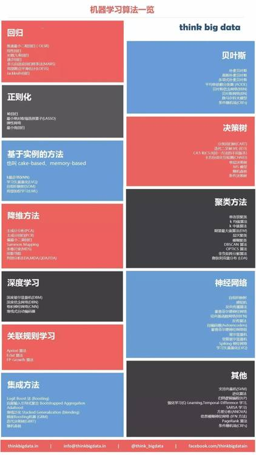
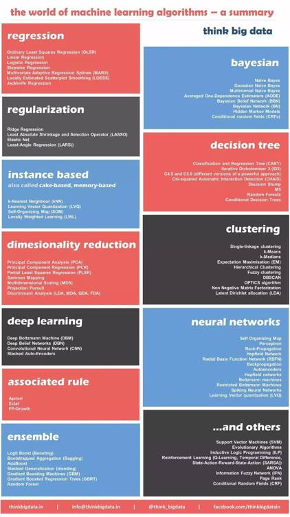

# 学界 | 数据科学家应该掌握的 12 种机器学习算法（附信息图）

选自 Dataflop

**作者：Mark van Rijmenam**

**机器之心编译**

**参与：原野、李亚洲** 

> *「Think Big Data」发布的信息图展示了 12 种实现不同应用目的的最重要的算法。*

算法已经成为我们日常生活的一个重要组成部分，它们几乎出现在商业的任何领域。调查公司 Gartner 称这种现象为「算法化商业」，算法化商业正在改变我们经营和管理公司（应有的）的方式。现在，你可以在「算法市场」上买到这些适用于各个商业领域的多种算法。算法市场为开发者提供了包括声音和视觉处理、机器学习以及计算机视觉等领域在内的超过 800 种算法，这些成熟的算法帮助开发者节省宝贵的时间与金钱。

然而，算法市场上可用的算法可能并不符合你的特定需求。毕竟，你需要不同的算法来应付不同的情况，而相同的算法在不同环境也会产生不同的结果。事实上，可用的算法类型和它的执行方式是由很多不同的变量决定的。这些变量包括数据的规模和类别、应用算法的行业、用来执行的功能等多种情况。

因此，有时购买一个现成的算法并稍作修改可能不是最佳选择。数据科学家还是应该学习最重要的算法；学习如何开发这些算法，又如何根据意图选取最合适的算法？「Think Big Data」发布的信息图展示了 12 种实现不同应用目的的最重要的算法，想必这肯定是每个数据科学家都喜闻乐见的。

*注：汉化信息图中的中文翻译参考了网络以及周志华老师《机器学习》一书中的名词翻译。为了不影响读者的阅读，中文、英文版信息图都附于文中。*

**中文版信息图：**

**** 

**原英文信息图**

***©本文由机器之心编译，***转载请联系本公众号获得授权***。***

✄------------------------------------------------

**加入机器之心（全职记者/实习生）：hr@almosthuman.cn**

**投稿或寻求报道：editor@almosthuman.cn**

**广告&商务合作：bd@almosthuman.cn**