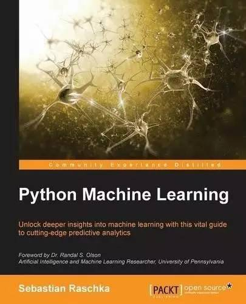
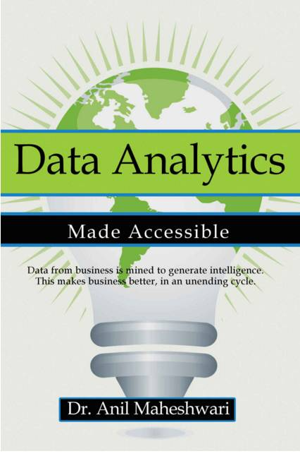
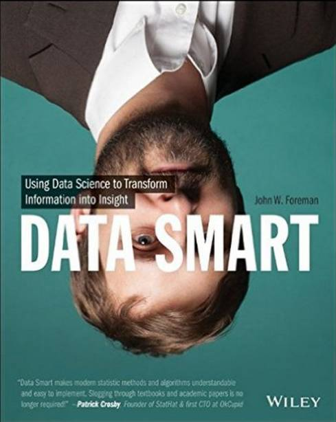
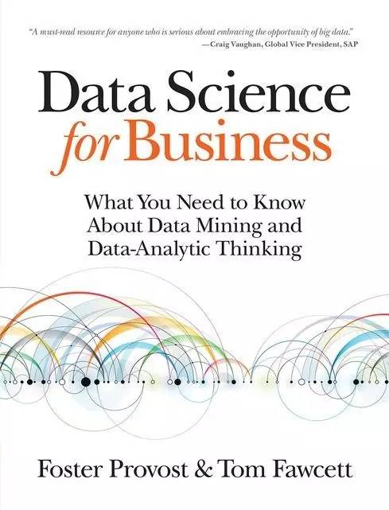
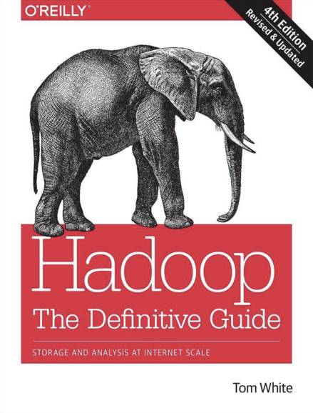
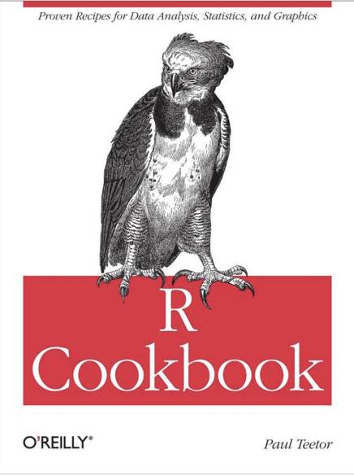
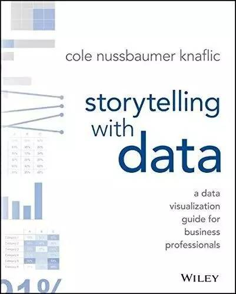
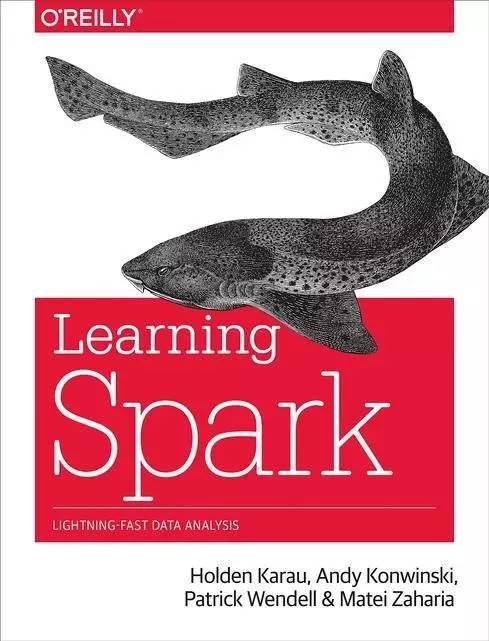
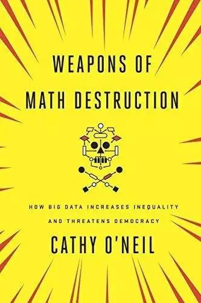
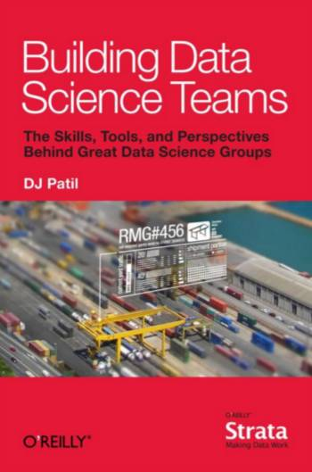

# 书单｜关于数据科学的十本好书

选自 Informationweek

**作者：Jessica Davis**

**机器之心编译**

**参与：wenhui、李亚洲** 

**1\. Python Machine Learning**

Python 是建议数据科学家应该学习的最顶尖的语言，掌握这种技能协商薪水时能得到更多。对任何数据科学家，特别是有抱负的数据科学家，或想要把 Python 作为技能掌握的开发者而言，这本书就是你的必读书目。这本书将帮助读者利用学习深度学习、数据整理、可视化数据的 Python 开源文库。它还能提供学习策略和实践，从而改善、优化机器学习系统和算法。

作者：Sebastian Raschka

价格：Kindle 版 22.39 美元，纸质版 40.47 美元

**2\. Data Analyti****cs Made Accessible**

这本书为读者提供了数据分析的整体概况，所以对于想要在此领域学习更多的人，或是对需要一本初级读物并理解相关技术如何工作的经理人来说，它都是一本好书。这本书在每章开篇提供了小案例研究，并为数据挖掘技术和平台提供了一个整体概览。这本书也为了解 R 统计分析平台提供辅导。

作者：Anil Maheshwari

价格：9.99 美元

**3\. Dat****a Smart: Using Data Science to Transform Information Into Insight**

这本书是由 MailChimp.com 首席数据科学家撰写，集中论述了如何用微软 Excel 从数据中获得洞见，所以不要期待在这本书中学到 R 语言、Hadoop 或是 Apache Spark。但是在这本书里你将学到如何掌握 Excel 从而在数据设定中得到更多信息。

作者： John W. Foreman

价格：Kindle 版 22.99 美元，纸质版 27.99 美元

**4\. Da****ta Science For Business**

本书是基于纽约大学 MBA 课程编写而成，作者也是教授这一课程的讲者之一。它介绍了数据科学的基础、并引导读者获取从数据中寻找商业价值需要的「数据分析思维（data-analytics thinking）」 。本书探讨了如何以数据挖掘技术和数据使用来获得竞争优势。

作者：Foster Provost 、 Tom Fawcett

价格：Kindle 版 21.49 美元，纸质版 37.99 美元

**5\. Hadoop: The** **Definitive Guide**

想要学习 Hadoop？那这本书就是你需要的。这是出版于 2015 年的第四版。本版专门使用了 Haddop 2 并增加了新的章节描述 YARN 和 Hadoop 相关项目，比如  Parquet、Flume、Crunch、Spark。另外，本书覆盖了 Hadoop 的基础内容，MapReduce、HDFS 和 YARN。也阐述了如何建立并维护在这三个基本成分上运行 Haddop 集群。本书讨论的其他主要技术包括 Pig、Hive、Crunch、HBase 和 ZooKeeper 等。

作者：Tom White

价格：Kindle 版 24.99 美元，纸质版 32.62 美元

**6\. R Cookbook**

这本指南提供了使用 R 语言快速进行数据分析的方法。它包含了 200 多个关于这一开源语言（统计学家们的首选）的方法。本书的书评员也是第一次接触 R，并将这本书描述为为他们节省了大量时间的具有实践意义的入门指南和参考工具。 

作者：Paul Teetor

价格：Kindle 版 24.99 美元，纸质版 32.62 美元

**7\. Storytell****ing With Data**

如果你不能用受众群体觉得有趣的方式呈现给大家，那从数据中发现的关键点还有意义吗？这种把信息放到语境当中的技能也是非常有价值的能力。这本书就在以下三点上提供了窍门：如何将受众的注意力引导到最重要的数据点，如何用恰当的可视化方法交流数据，如何用故事化的方法将信息传递给受众。

作者：Cole Nussbaumer Knaflic

价格：Kindle 版 20.79 美元，纸质版 22.44 美元

**8\. Learning Spark**

Hadoop 已然成为大数据的同义词了，然而 Spark 却是一个让大数据工程发展更快的新型的、热门技术。每一系列大数据书集都会包含一本关于 Spark 的书，而这一本则是由 Spark 的开发人员撰写的。这本书涵盖了分布式数据集、内存式缓存、交互式 shell 和像 Spark SQL 和 MLib 那样的嵌入式文库，以及连接像 HDFS、Hive、JSON 和 S3 的数据资源。

作者：Holden Karau，Andy Konwinski，Patrick Wendell 和 Matei Zaharia

价格：Kindle 版 21.49 美元，纸质版 34.26 美元

**9\. Weapons Of Math Destruction: How Big Data Increases Inequality And Threatens Democracy**

这不是一本指导用书或入门书。相反，这本书关注的是：因为每个人都由同一套规则评判，算法能否通过将人类从计算中解放出来，从而让世界更加公平。但是作者也指出，对立方才是正确的。本书由前华尔街数量分析专家撰写，将带你了解算法性质的未来对文化和经济的影响。作者就我们现有的模式展开讨论，他认为这个模式是不透明的，未校准的，无可抗衡的。甚至他们是错。而且他坚持这些模式会增强歧视。举例来说，如果一个穷学生因为他的邮政编码信息显示他风险太高（还贷能力弱），那他就无法得到贷款（译者：国外银行卡会登记邮编，所以可以通过查询邮编来得知相应的信用记录），随后他将无法得到这个能将他带离贫困的教育机会。

作者：Cathy O'Neil

价格：Kindle 版 13.99 美元，精装版 18.50 美元

**10\. Building Data Science Teams**

这是一本由美国白宫国家科学与技术政策办公室的首席数据科学家撰写的免费电子书。本书阐释了技能、观点、工具和他认为成功定位数据科学团队的流程。作者 DJ Patil 将他作为 Linkedin 数据科学团队架构师的经历带到本书当中，描述了成为数据科学家的四个重要资质和建立「数据驱动（data driven）」组织意味着什么。

作者：DJ Patil

价格：免费

***©本文由机器之心编译，***转载请联系本公众号获得授权***。***

✄------------------------------------------------

**加入机器之心（全职记者/实习生）：hr@almosthuman.cn**

**投稿或寻求报道：editor@almosthuman.cn**

**广告&商务合作：bd@almosthuman.cn**