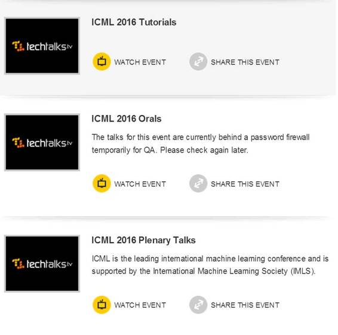
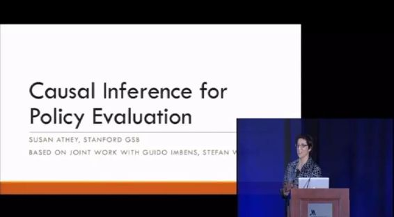
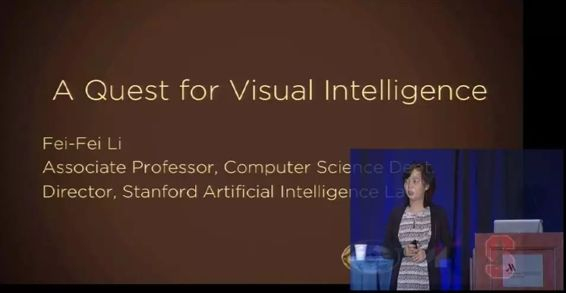
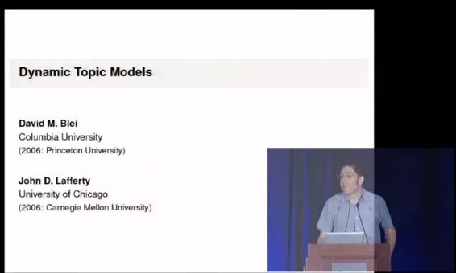
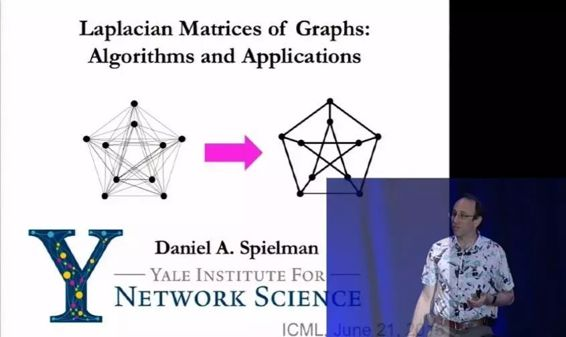
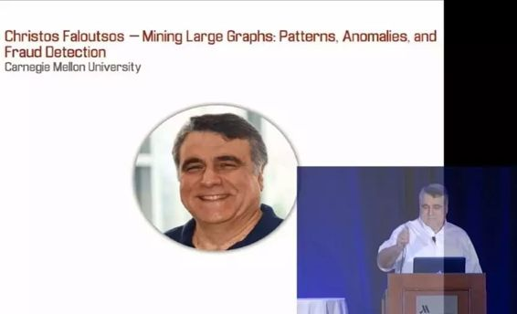
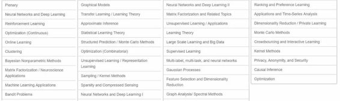

# 深度 | ICML 2016 演讲视频公开：数百个演讲视频带你读懂机器学习（附观看地址）

选自 TechTalks

**机器之心编译**

**参与：吴攀、李亚洲**

> *今年 6 月 19 到 24 日，国际机器学习大会（ICML）在纽约举办。关注机器学习、算法以及系统的 ICML 会议包含了专题报告、 接收论文演讲以及谈论更多近期研究的研讨会。今年，有近 3000 名与会者参加了这个为期五天的会议。机器之心之在大会期间对这场会议的论文（[业界 | ICML2016 Facebook 提交 3 篇论文，探索最有趣的机器学习问题](http://mp.weixin.qq.com/s?__biz=MzA3MzI4MjgzMw==&mid=2650716332&idx=2&sn=b43ed7510c39e7627f3081f7078c4365&scene=21#wechat_redirect)、[学界｜2016 ICML 微软研究者提交的十八篇论文](http://mp.weixin.qq.com/s?__biz=MzA3MzI4MjgzMw==&mid=2650716227&idx=3&sn=7bd397912dff627725b28eea7aaad2ce&scene=21#wechat_redirect)）、演讲（学[界｜ICML 2016 教学讲座全集：深度强化学习、深度残差网络、非凸优化等九大主题](http://mp.weixin.qq.com/s?__biz=MzA3MzI4MjgzMw==&mid=2650717116&idx=1&sn=c362209463d8bfe2d725b164a0ee0a2f&scene=21#wechat_redirect)）、获奖情况（[重磅｜ICML 2016 最具时间价值奖和最佳论文奖出炉，DeepMind 独揽一半奖项](http://mp.weixin.qq.com/s?__biz=MzA3MzI4MjgzMw==&mid=2650716316&idx=1&sn=e1c6d7364ca627d3f9964a8d3fc10efa&scene=21#wechat_redirect)）、大会总结（[深度｜ICML 2016 大会最具影响力的三个机器学习话题](http://mp.weixin.qq.com/s?__biz=MzA3MzI4MjgzMw==&mid=2650716652&idx=1&sn=7cd76481680bfb6d65f1d625511adb16&scene=21#wechat_redirect)）等都有过报道。**昨日，ICML 公布了会议期间拍摄的演讲视频，本文对这些演讲视频进行了简单介绍。******点击「阅读原文」可查看视频网址。***

 

*开放视频*

**ICML 2016 特邀报告（Plenary Talks）**

观看地址：http://techtalks.tv/icml/2016/plenaries/

ICML 邀请了斯坦福商学研究生院技术经济学教授 Susan Athey、斯坦福大学计算机科学系副教授李飞飞、哥伦比亚大学统计学和计算机科学教授 David M. Blei、芝加哥大学机器学习研究专家兼 Louis Block 教授 John D. Lafferty、耶鲁大学计算机科学、数学和应用数学 Henry Ford II 教授 Daniel Spielman、卡内基梅隆大学电子和计算机工程教授 Christos Faloutsos 在大会期间做了特邀报告（Plenary Talks）。下面是对这些报告的简单介绍：

*   **Susan Athey：Causal Inference for Policy Evaluation（用于策略评估的因果推理）**

演讲简介：许多不同的科学问题需要研究者评估一项策略或干预的因果关系，比如将药给病人、改变最小工资等政府政策、为用户提供广告或在一项在线服务中将一种新算法提供给用户。这项演讲将会回顾一系列最近开发的用在带有许多协变量的环境中进行因果推理的统计方法。我们思考了在观测数据中对一项策略的平均影响进行评估的方法，以及评估随机试验中异构处理效果（heterogeneous treatment effect）和个性化策略的方法。我们将展示回归树（regression tree）和随机森林（random forest）等流行方法可以如何调整和优化以产生位于置信区间内的处理效果的评估。

*   **李飞飞：A Quest for Visual Intelligence in Computers（一种对计算机视觉智能的追求）**

演讲简介：大自然和进化用了 5 亿年时间才发展出了人类这强大的视觉系统。人工智能和计算机视觉才刚发展大约 50 年。在这个演讲中，我将简要讨论在计算机视觉智能的道路上的关键思想和最近的前沿进展。我将尤其关注我的实验室在图像和视频理解最新研究成果，这些成果都用到了大数据和深度学习（又名神经网络）架构。

*   **David Blei 和 John Lafferty：Dynamic topic models（动态主题模型）**

 

演讲简介：David Blei 和 John Lafferty 的演讲同主题论文《Dynamic Topic Models 》是 ICML 2016 的最具时间价值奖（Test of Time Award）获奖论文。该论文的摘要如下：

一系列概率时间序列模型被开发出来用于分析大型文档集合中主题随时间的变化。这一方法是在表征主题的多项分布的自然参数上使用状态空间模型。开发的基于卡尔曼过滤器（Kalman filters）的变分近似法和非参数小波回归实现了对隐藏主题的近似后验推断（posterior inference）。除了给出连续语料库数量的预测模型之外，动态主题模型也提供一个进入大型文档集合的定性的窗口。这一模型的演示是通过对从 1880 至 2000 年间的 Science 杂志的 OCR（光学字符识别）档案分析完成的。

*   **Daniel Spielman：Laplacian Matrices of Graphs: Algorithms and Applications（图的拉普拉斯矩阵：算法和应用）**

 

演讲简介：拉普拉斯矩阵（Laplacian matrices）已经出现在了机器学习、计算机视觉、优化、计算科学、当然还有网络分析等领域中。我们将解释这些矩阵是什么，已经为什么会出现这么多的应用中。特别地，我们还将展示拉普拉斯系统处理器（Laplacian system solvers）可以如何被用于快速解决来自自然图问题（natural graph problem）的线性规划（ linear program）。

*   **Christos Faloutsos：Mining Large Graphs: Patterns, Anomalies, and Fraud Detection（挖掘大型图：模式、异常和欺诈检测）**

 

演讲简介：给定一个大型图（如谁打电话给谁、谁喜欢谁）哪种行为是正常的？哪种行为会让人感到惊讶？哪种可能是由于欺诈行为引起的？图可以如何随时间演变？我们将关注下面这些主题：

1.  大型静态图中的异常检测

2.  大型的随时间演变的图中的模式和异常。

对于第一个，我们给出了一个静态的和时间上的规律列表，我们展示了如何使用它们来在网络买卖环境、Facebook、类 Twitter 网络中发现可疑活动的方法。对于第二个，我们展示了如何将随时间变化的图当作张量（tensor）处理的方法，以及在这些环境中的一些发现。

**ICML 2016 Tutorials**

观看地址：http://techtalks.tv/icml/2016/tutorials/

该部分收录了 ICML 2016 Tutorials 的 9 个视频。机器之心已经在今年 7 月份的文章《[ICML 2016 教学讲座全集：深度强化学习、深度残差网络、非凸优化等九大主题](http://mp.weixin.qq.com/s?__biz=MzA3MzI4MjgzMw==&mid=2650717116&idx=1&sn=c362209463d8bfe2d725b164a0ee0a2f&scene=21#wechat_redirect)》介绍了其中包含的演讲内容（包含幻灯片下载）。

**ICML 2016 Orals**

观看地址：http://techtalks.tv/icml/2016/orals/

这里收录的数百个演讲视频分成了 39 个主题（包含了学习理论、统计学习理论、聚类、监督学习/无监督学习等许多人工智能研究领域）：

 

***©本文由机器之心编译，***转载请联系本公众号获得授权***。***

✄------------------------------------------------

**加入机器之心（全职记者/实习生）：hr@almosthuman.cn**

**投稿或寻求报道：editor@almosthuman.cn**

**广告&商务合作：bd@almosthuman.cn**

**点击阅读原文，观看演讲视频↓↓↓**