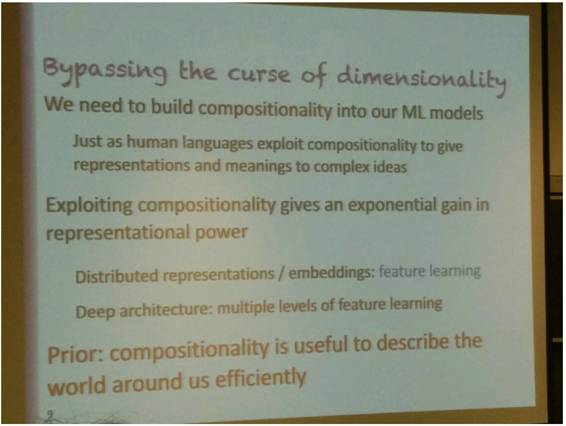

# 独家 | Yoshua Bengio 研究生科研指导演讲：解读人工智能全貌和下一个前沿

机器之心原创

**参与：Joshua Chou**

> *近期，Yoshua Bengio 在加拿大多伦多大学 Distinguished Lecture Series 面向计算机及工程方向的硕博研究生进行了一次题为「从深度学习到人工智能（From Deep Learning to AI）」的学术研究方向指导讲座，机器之心技术分析师 Joshua Chou 亲历了这个讲座，并对其中的关键内容进行了梳理和总结。*

**1\. 引言**

几经波折之后，人工智能终于要来了；它将给我们的社会带来巨大的变革，甚至可能会引发一场新的产业革命。毫无疑问，机器正变得越来越智能，而在这一次智能革命的中心，由大脑所启发的深度学习正在扮演着极其重要的角色。

 

我很高兴能够参加 Bengio 教授的演讲，并且希望能够将他传递给学生的观点再分享给更多的人。这篇文章中的一些材料来自其演讲所引用的论文，尽管我没有足够的时间仔细阅读所有这些论文，但我将尽我所能给出这些论文的概述以及它们与这个演讲的关联。

**2\. 深度学习领域的突破**

首先值得一提的是，多亏了加拿大高等研究院（CIFAR）的不懈努力，深度学习领域内的很多突破都诞生在了加拿大这片土地上。过去十年来，CIFAR 一直在给许多教授的团队提供资助，其中包括多伦多大学的 Geoffrey Hinton 教授、纽约大学 Yann LeCun 教授和这一次的演讲者、蒙特利尔大学的 Yoshua Bengio 教授。今天，深度学习科学家已经找到了训练更深度的神经网络的方法。但在此之前，科学家们还尝试过很多不成功的训练方法，而不成功的原因则是那时候人们对训练更深度的神经网络还缺乏了解。事实证明，深度（depth）问题是很重要的，深度学习也由此得名——而它本质上是之前十年在神经网络之上的研究的延续。

深度学习的每一个典型案例都涉及到分段非线性单元（piecewise non-linear unit），这一成果是在多伦多大学和蒙特利尔大学的研究成果之上不断积累得到的。这些成果表明，我们可以使用这种分段非线性变换（piecewise non-linear transformation）来训练比之前远远更深的神经网络。

过去几年里，这一重要的研究结果为我们带来了语音识别等应用（第一款产业界的语音识别应用出现在 2010-2012 年之间）。到 2012 年的时候，只要你有一台安卓手机，你就有了一个可以为你进行语音识别的神经网络（「okay Google」）！

另一个远远更大的领域是计算机视觉，它也在一两年之后实现了应用。同样，来自多伦多大学的研究突破也发挥了重要的作用，这些研究将之前的很多思想都集中了起来，并且还带来了更大的改进。这些改进不仅仅是在算法上，而且也涉及到借助硬件的进步来实现更快的计算处理。比如说，研究者发现最初为图形和视频游戏处理所设计的 GPU 碰巧非常适合用来训练神经网络；几年之后，斯坦福大学教授李飞飞启动了 ImageNet 数据集项目，该数据集带有大量有标注的数据，已经帮助许多研究者和开发者实现了很多深度学习应用。

目前来说，深度学习主要还是基于监督学习（supervised learning），并且还需要数百万有标注的图像来进行训练。实际上，我们可以看到在过去的四五年里，这些深度神经网络的准确度一直在不断提升（了解更多可参阅论文《ImageNet Classification with Deep Convolutional Neural Networks (Sutskever, Hinton, Krizhevsky)》）。

**3\. 用机器学习实现人工智能的关键要素**

要让机器学习系统接近人类水平的表现，我们通常需要一些关键的要素。

首先，你需要大量乃至巨量的数据。为什么呢？因为智能意味着正确地决策；而为了做出正确的决策，你需要知识。研究者所面临的一个核心问题就是如何好好使用知识。这个世界很复杂，如果要让机器理解世界的水平达到人类同样的程度，那么我们就将需要给机器描述大量的知识。为此，我们需要通过大量的数据来训练机器，从而使其能够以一种类似于人类能力那样微妙的方式来进行理解。

其次，为了利用数据，模型还必须要足够灵活。（许多传统的统计模型仅仅是将数据编译成不同的参数集合，这样的模型是很死板僵硬的。）

第三，为了训练机器，我们还需要大量的算力，这方面我们早就实现了。

第四，关于神经网络还有一个更加微妙的细节：一旦你训练好了一个神经网络，你就可以非常高效地使用它，而且仅需要非常少的计算。

最后，另一个重要的要素是这个世界中已有的假设，它们可以被看作是我们训练的先验知识，它们非常强大，足以应对「维度灾难（curse of dimensionality）」。维度灾难是这样一种情况：当存在大量的变量时，配置（configuration）的数量也将随之指数级增多；因此我们只能针对大多数配置寻找正确答案，而不是针对所有的配置。

在后面的章节中，我们将重点关注最后一个要素。

**4\. 学习中的维度**

主要的假设本质上都是关于组合的世界的假设，它们内建于深度网络之中——这解释了深度网络的表现如此良好的原因。我们认为知识生成来自于我们将碎片组合起来的过程，而我们推导给定的答案也是通过将碎片化的信息构建到一起。比如说，语言就有这样的性质——我们定义语言中的每一个概念都是通过组合已有的概念进行定义的。而在之前的机器学习领域，这还是无法实现的。

更确切来说，在深度网络上，我们有两种实现组合性（compositionality）的方式。其中一种可被看作是一种并行的方法，而另一种则是序列式的方法。人类可以并行地选择不同的概念来进行组合，然后以非并行的方式来描述世界。这就是分布式表征（distributed representation）的理念，这意味着每一个对象都会被许多属性（这在神经网络中被称为特征（feature））描述，而这些属性配置的数量将会随属性数量的增长而指数式地暴增。序列式的方法则必须涉及到这一事实：当我们将在并行步骤中所获得的结果组合起来时，我们每一次都要执行一个运算序列（sequence of operations）（可以将这看作是神经网络中的多层面特征学习）。

**5\. 非分布式表征（Non-distributed Representations）**

这只是 Bengio 教授在深入到分布式表征之前所给出的一个例子。

许多机器学习算法工作的方式都是获取一个输入空间（input space），然后将其分解成一个决策树（decision tree）（想一想在一些 n 维空间中分隔点的超平面）。对于该决策树中的每一个区域，我们都有一个来自构成那片区域的样本的答案（值得注意的一个重点是：可区分的区域的数量与参数的数量成正比）。很多人在很多时候会认为这是一个解决问题的好办法，但我们还能做到更好吗？

**6\. 对分布式表征的需求**

从统计学的角度来看，需要了解的一个重要问题是参数的数量（或样本的数量）与可区分的区域（这能给我们提供关于其函数复杂度的见解）之间的关系。在这里，我们需要思考一个重要的问题：我们可以泛化到我们从未见过其中任何数据的区域吗？在这种情况下，答案是否定的。我们需要看到每一个区域的数据，因为每一个区域的参数都是特定的（对于每一个区域而言，都存在一个单独的参数集，其中至少有一个参数能告诉你答案对应于哪一个区域）。

当我们使用分布式表征时，我们的做法是给每一个输入都匹配一个属性集合。然后我们定义以组合式的方式获得的输入空间的区域。比如说，让该属性参数属于一个二元集。对于每一个属性，我们都可以将其看作是能够将一个空间分隔为两个区域的超平面。其中一个区域对应的属性值为 1，另一个区域对应 0。由此，可以很容易理解当属性（超平面）的数量增长时，可区分的区域数量将随之指数式的增长。

现在的问题是我们希望学习的功能能否通过这种方式进行分解？

这里的窍门在于我们会对这个世界进行假设。幸运的是，这个世界是组合式的，因此也遵循这一假设。比如以图像作为输入为例，你可以思考一下与这张图像相关的属性向量——是关于男性/女性、杯子/不是杯子、孩子/成年人……你可以使用这些属性向量描述很大图像集，而我们无法获得这个数量的用于学习的样本。但是，如果我们将这个空间分隔成可区分的区域，我们就可以分别从这些属性中学习。总的来说，在无需涉及其它特征而导致的指数级配置增长的情况下，每一种特征都可以被学习到。

**7\. 深度的先验知识（Depth Prior）可以发挥巨大的作用**

如果你使用了一个足够深的神经网络，那么你确实可以有效地表征一些类型的功能；但是大多数功能使用深度网络也没有优势。如果你希望学习的功能落在这个非常严格的组合式类型范围内，那么你就能通过深度网络获得巨大的好处。有很多论文都说明了，除了分布式表征之外，你也可以有很多的层（layer），当我们计算区域的数量时，我们也可以看到区域的数量会随层的数量指数级地增长。

 

**8\. 并不需要凸性**

在过去，研究者真的会害怕局部极小值（local minima）的麻烦。

 

关于这一主题的一篇论文《The Loss Surfacesof Multilayer Networks (by Choromanska et al. 2015)》通过实验表明：随着问题的维度的增长，你的解决方案的损失（loss）的变化会减少。所以基本上来说，在最佳方案和最差方案之间的差距会缩小，而你所有的局部极小值都将最终变得差不多一样。所以非最优解决方案（non-optimal solution）的思想已经差不多一去不复返了，因为人们并没有真正解决这个问题，而只是将其变成了一个非问题（non-issue）。

 

这个观点本质上是来自于这样一种直觉上经验：局部极小在低维度条件下是最佳的，但鞍点（saddle point）主导了高维。你可以这样思考：任意一个所有方向都是上升的局部最优（鞍）点随维数指数级变小。

** 9\. 超越模式识别、走向人工智能的深度学习**

神经网络正在从其传统的保留地（目标识别、模式识别等）走向传统上与标准人工智能相关的领域（推理、逻辑等）。在这一运动中，Bengio 领导的研究组曾经发现了一种被称软注意（soft attention）的机制。

**10\. 深度学习的注意机制**

**** 

这个最好通过一个例子来解释。当我们在从左向右一次翻译一个词地将法语翻译成英语的时候，如果能够注意到每个词在原法语句子中的位置，那么就会给我们的翻译结果提供很大的帮助；因为在一个句子中，一个词可能会给其后面的词带来很大的影响。事实已经证明，这种注意（attention）的概念是很重要的。会出现这种情况的原因是我们使用了反向传播。我这么说是因为我们使用了涉及参数的一些损失函数的梯度，我们需要所有的计算都是可微分的（你可以将其看作是可微分的注意）。因此，除了注意特定的位置，我们还在每一个可能的位置上有一个概率（其对应于权重）。所以当我们根据梯度改变权重时，我们本质上只是将注意转移到了另一个地方（参见论文《Neural Machine Translation by Jointly Learning to Align and Translate（Bahdanau, Cho, Bengio）》了解更多。）

**11\. 深度网络的低精度训练**

为了让我们的算法对更多的硬件友好，有很多的研究者做了很多的工作。其中首要的努力方向是在训练深度网络时使用更低的精度。这个方向的研究涉及到通过低精度的训练来实现更高准确度的神经网络，这能让我们可以在更大型的数据集上训练更大型的网络。Bengio 引述的一篇论文讨论了训练的那个部分应该被削减以维持高准确度。我发现（一个通用的经验法则）：除了任何我们希望保持高精度累积计算（accumulation computations），其它所有部分（权重、梯度等）差不多都可以被削减掉（参见 Guptaet al, arXiv, Fec. 2015 了解更多细节）。

对于阅读这篇来自 Courbariaux, David, and Bengio 的 NIPS 2015 论文（探索了我们可以如何 quantize 激活（activation）的方法），这里给出一个简单的备注。一旦你运行完了加权和（weighted sum），然后你执行非线性，你就会得到一个实数。我们需要将其 quantize 到几个比特。如果我们可以做到这一点，我们就能获得巨大的增益，因为我们避免了乘法和加法！这篇论文提到这项研究仍然还在进行中，但结果仍然差强人意。

**12\. 下一个艰巨挑战：无监督学习**

**** 

目前，深度学习领域内的大部分成功都是在监督学习领域，而这个领域的学习需要多得惊人的有标签样本。但是，只要机器还是仅依赖表面的统计规律进行学习，它们就无法应对样本分布之外的数据。要实现人类水平的学习，机器就必须要能归纳出关于基本因果关系的更加精准的内在模型。这能让该机器预测未在任何数据中见过的未来情形，而这正是推理、智能和科学的关键组成部分。无监督学习应该会成为深度学习领域内的下一个焦点。

**13\. 结语**

这个演讲的关键点也是机器学习基础的关键要素。尤其是通过分布式表征对组合函数（compositional functions）的有效表征，分布式表征已经极大地提升了学习过程。

另一点是硬件友好的机器学习算法的开发。低精度训练这样的机制让我们可以在更大型的数据集上学习更大型的神经网络。

最后，深度学习的下一步是无监督学习。这个领域的潜在价值是能让我们真正用上海量的无标签数据、回答关于被观察到的变量的新问题、迁移学习（领域适应，其中机器可以在无需给定模型和领域的情况下学习）和更加结构化的输出（比如翻译）。

Bengio 的这次演讲谈到了很多有趣的主题，我希望这篇概述分享能够引起你的关注，也希望你能从中有所收获。

***©本文由机器之心原创，***转载请联系本公众号获得授权***。***

✄------------------------------------------------

**加入机器之心（全职记者/实习生）：hr@almosthuman.cn**

**投稿或寻求报道：editor@almosthuman.cn**

**广告&商务合作：bd@almosthuman.cn**