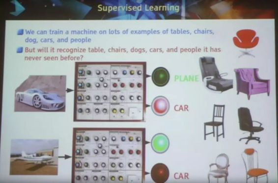
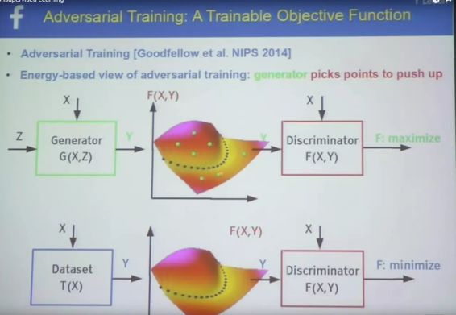

# 视频 | Yann LeCun CMU 演讲：人工智能的下一个前沿——无监督学习

选自 CMU

**机器之心编译**

**参与：李亚洲**

> *上个月 Yann LeCun 在 CMU 做了一场讲座，讲解了人工智能中的下一个发展前沿：无监督学习。几天前，CMU 官方放出了此次讲座的视频，共计 1 小时 15 分钟。机器之心对此视频内容进行了摘要概述，希望对读者了解无监督学习有所帮助。*

 

在观看视频前，小编先为大家出一道题。这张图包含了如今人工智能领域的众多大牛：Hinton、Michael Jordan、LeCun 都在内，你能发现他们吗？

**视频摘要：**

过去几年，人工智能领域的快速发展得益于深度学习和神经网络的发展，再加上大型数据集和高速 GPU 的可用性。我们如今已经有了能与人类相媲美的图像识别系统，它们将变革自动驾驶交通和医疗图像理解在内的众多领域。但目前，大部分系统都是使用监督学习，机器在人工标注的输入上进行训练。接下来几年的一项挑战是让机器从原始的、无标记数据中学习，比如视频或文本。这也就是无监督学习。如今的人工智能系统不能处理人类或动物通过观察世界而获得的「常识」。人工智能领域内的一些人将无监督学习视为通往机器拥有常识道路上的关键。在此视频中，Yann LeCun 回顾了无监督学习方法，讲解了深度学习的一些基础概念。

**PPT 目录：**

1.  神经网络简述

2.  记忆增强网络（微分计算）

3.  人工智能的障碍

4.  智能系统的架构

5.  学习预测世界的 Forward Models

6.  对抗训练

7.  视频预测

**一、神经网络简述**

神经科学激发了早期在人工智能与机器学习中的研究

监督学习

多层神经网络

通过反向传播计算梯度

卷积神经网络架构

深度卷积网络进行物体识别

深度学习=学习层级表征

视觉皮层中的层级架构

监督卷积网络

汽车中的卷积网络

[DeepMask：ConvNet Locates 和识别物体](http://mp.weixin.qq.com/s?__biz=MzA3MzI4MjgzMw==&mid=2650718597&idx=1&sn=56aa4e5deff99620fe6ed42000903849&scene=21#wechat_redirect)

**二、记忆增强网络（微分计算）**

用记忆模块增强神经网络

实体循环神经网络

**三、人工智能的障碍**

人工智能进展中的障碍

机器需要预测多少信息？

**四：智能系统的架构**

人工智能系统：学习代理+不便的目标

人工智能系统：预测+规划=推理

**五、学习预测世界的 Forward Models**

基于能量的无监督学习

建立能量函数的 7 个策略

**六：对抗训练**

在 ImageNet 128×128 像素图像上基于能量的 GAN 训练

**七：视频预测**

进行视频预测的多尺度卷积

预测式无监督学习

视频中在演讲完之后，LeCun 还与 CMU 的学生进行了长时间的互动，感兴趣的同学可以观看视频。

******©本文为机器之心编译文章，***转载请联系本公众号获得授权******。***

✄------------------------------------------------

**加入机器之心（全职记者/实习生）：hr@almosthuman.cn**

**投稿或寻求报道：editor@almosthuman.cn**

**广告&商务合作：bd@almosthuman.cn**