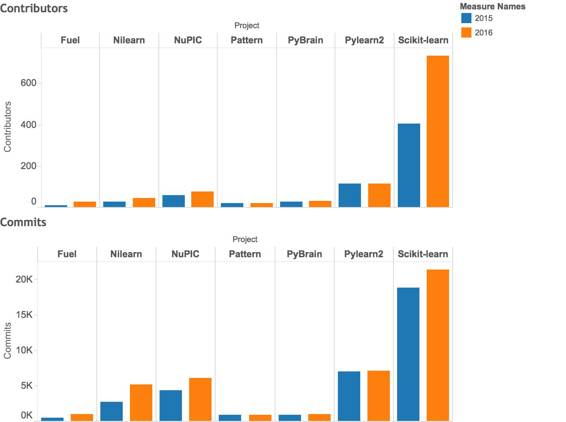

# 盘点 | 今年 GitHub 排名前 20 的 Python 机器学习开源项目

选自 KDnuggets

**作者：Prasad Pore**

**机器之心编译**

**参与：杨旋、吴攀**

> *当今时代，开源是创新和技术快速发展的核心。*本文来自 KDnuggets 的年度盘点，介绍了* 2016 年排名前 20 的 Python 机器学习开源项目，在介绍的同时也会做一些有趣的分析以及谈一谈它们的发展趋势。和去年一样，KDnuggets 介绍了 GitHub 上最新的并且排名前 20 的 Python 机器学习开源项目。令人吃惊的是，去年一些最活跃的项目已经停滞不前了，也有一些项目跌出了前 20 名（在 contribution 和 commit 方面），当然，也有 13 个新项目进入了前 20。*

*2016 年排名前 20 的 Python 机器学习开源项目*

**1.Scikit-learn** 是一种基于 NumPy、SciPy 和 matplotlib 的用于数据挖掘和数据分析的工具，其不仅使用起来简单高效，而且还是开源的，可供所有人使用，并且拥有商业可用的 BSD 许可证，在不同的环境下都能很好的被使用。

提交：21486，贡献者：736

链接：http://scikit-learn.org/

**2.TensorFlow** 最初由 Google 机器智能研究机构的 Google Brain 团队的研究人员和工程师开发。该系统旨在促进对机器学习的研究，同时也让机器学习研究原型过渡到生产系统更加高效容易。

提交：10466，贡献者：493

链接：https://www.tensorflow.org/

**3.Theano** 能让您更加高效地定义、优化和评估涉及多维数组的数学表达式。

提交：24108，贡献者：263

链接：http://deeplearning.net/software/theano/

**4.Caffe** 是一个由伯克利视觉与学习中心（BVLC）和社区贡献者开发的深度学习框架，它兼具表现力和速度，还有模块化的优点。

提交：3801，贡献者：215

链接：http://caffe.berkeleyvision.org/

**5.Gensim** 是一个免费的 Python 库，它具有诸如可扩展的统计语义等特征，它可用于分析纯文本文档的语义结构和检索语义相似的文档。

提交：2702，贡献者：145

链接：https://radimrehurek.com/gensim/

**6.Pylearn2** 是一个机器学习库。它的大部分功能都是建立在 Theano 的基础之上。这意味着你可以使用数学表达式编写 Pylearn2 插件（新模型、算法等），然后 Theano 将为你优化这些表达式让其更加稳定，并将根据你的选择把它编译适配相应的后端（CPU 或 GPU）。

提交：7100，贡献者：115

链接：http://github.com/lisa-lab/pylearn2

**7.Statsmodels** 是一个允许用户挖掘数据、估计统计模型和执行统计测试的 Python 模块。描述性统计、统计测试、绘图函数和结果统计的详细列表可用于不同类型的数据和估计器。

提交：8664，贡献者：108

链接：https://github.com/statsmodels/statsmodels/

**8.Shogun** 是一种提供大量高效且统一的机器学习（ML）方法的机器学习工具箱。它能容易地把多种数据表示，算法类和通用工具紧密地联系起来。

提交：15172，贡献者：105

链接：https://github.com/shogun-toolbox/shogun

**9.Chainer** 是一个基于 Python 并且独立的深度学习模型开源框架。Chainer 提供一种灵活、直观且高效的方法来实现整个深度学习模型，包括如循环神经网络和变分自动编码器等最先进的模型。

提交：6298，贡献者：84

链接：https://github.com/pfnet/chainer

**10.NuPIC** 是一个基于一种被称为分层式即时记忆（HTM/ Hierarchical Temporal Memory）的新皮质理论的开源项目。HTM 理论中的一部分已经在应用中被实现、测试和使用了，而其他部分仍在开发中。

提交：6088，贡献者：76

链接：http://github.com/numenta/nupic

**11.Neon** 是 Nervana (http://nervanasys.com/) 公司的一个基于 Python 的深度学习库。它提供易用性的同时也提供了最高的性能。

提交：875，贡献者：47

链接：http://neon.nervanasys.com/

**12.Nilearn** 是一个用于在 NeuroImaging 数据上快速轻松地进行统计学习的 Python 模块。它利用 scikit-learn Python 工具箱来处理如预测建模、分类、解码或连接分析等多变量统计信息。

提交：5254，贡献者：46

链接：http://github.com/nilearn/nilearn

**13.Orange3** 是一个新手和专家都可以使用的开源机器学习和数据可视化工具。在交互式数据分析工作流程中拥有大型的工具箱。

提交：6356，贡献者：40

链接：https://github.com/biolab/orange3

**14.Pymc** 是一个实现贝叶斯统计模型和拟合算法的 Python 模块，其中包括马尔可夫链和蒙特卡罗方法。其灵活性和可扩展性使其适用于大量问题。

提交：2701，贡献者：37

链接：https://github.com/pymc-devs/pymc

**15.PyBrain** 是 Python 的一个模块化机器学习库。它的目标是为机器学习任务提供灵活且易于使用但仍然强大的算法，以及各种预定义环境来对你的算法进行测试和比较。

提交：984，贡献者：31

链接：http://github.com/pybrain/pybrain

**16.Fuel** 是一个数据管道框架（data pipeline framework），它为你的机器学习模型提供所需的数据。它将被 Blocks 和 Pylearn2 神经网络库使用。

提交：1053，贡献者：29

链接：http://github.com/mila-udem/fuel

**17.PyMVPA** 是一个用于简化大型数据集的统计学习分析 Python 包。它提供了一个可扩展的框架，具有大量用于分类、回归、特征选择、数据导入和导出等算法的高级接口。

提交：9258，贡献者：26

链接：https://github.com/PyMVPA/PyMVPA

**18.Annoy**（Approximate Nearest Neighbors Oh Yeah）是一个绑定 Python 的 C ++库，用来搜索在空间中距离给定查询点较近的点。它还创建了基于大型只读文件的数据结构，这些数据结构被映射到内存中，以便许多进程可以共享相同的数据。

提交：365，贡献者：24

链接：https://github.com/spotify/annoy

**19.Deap** 是一个用于快速原型和测试思想的新颖的进化计算框架。它试图使算法更加浅显易懂，数据结构更加透明。它与并行机制（例如 multiprocessing 和 SCOOP）能完美协调。

提交：1854，贡献者：21

链接：https://github.com/deap/deap

**12.Pattern** 是 Python 编程语言的 Web 挖掘模块。它捆绑了数据挖掘（Google + Twitter +维基百科 API、网络爬虫、HTML DOM 解析器）、自然语言处理（词性标记、n-gram 搜索、情感分析、WordNet）、机器学习（向量空间模型、k-means 聚类、朴素贝叶斯+ k-NN + SVM 分类器）和网络分析（图形中心性和可视化）等工具。

提交：943，贡献者：20

链接：https://pypi.python.org/pypi/Pattern

从下面的图表中我们可以得知，与其它项目相比，PyMVPA 具有最高的贡献率。令人吃惊的是，相比于其它项目，尽管 Scikit-learn 的贡献者最多，但是它的贡献率比较低。这背后的原因可能是因为 PyMVPA 是一个新的项目，经历了早期的发展阶段，由于新的想法/功能开发，缺陷修复，重构等原因导致了许多提交。而 Scikit-learn 是一个早期的并且比较稳定的项目，所以拥有较少的改进或缺陷修复等提交。

我们对 2015 年和 2016 年的项目进行了比较，它们都是排名前 20 名的项目。我们可以看到 Pattern、PyBrain 和 Pylearn2 的贡献率没有明显的改变，也没有新的贡献者。此外，我们可以在贡献者的数量和提交的数量中看到一个显著的相关性。贡献者的增加可能会导致提交的增加，这也是我认为开源项目和社区神奇的地方；它可以导致头脑风暴，产生新想法以及创造更好的软件工具。

以上就是 KDnuggets 团队根据贡献者数量和提交数量对 2016 年排名前 20 的 Python 机器学习开源项目的分析。

开源和知识共享是令人快乐的一件事！

*原文连接：http://www.kdnuggets.com/2016/11/top-20-python-machine-learning-open-source-updated.html*

**----------------------------**

[查看 interface 第二期活动详情](http://mp.weixin.qq.com/s?__biz=MzA3MzI4MjgzMw==&mid=2650720758&idx=5&sn=3393e25835c0f96ee82396992a8ff27b&chksm=871b0d88b06c849e711c1c42750b1518b42cbb098526f1095ac2a39c9b21b7d2aaf7388fb764&scene=21#wechat_redirect)，或者点击阅读原文直接报名。

