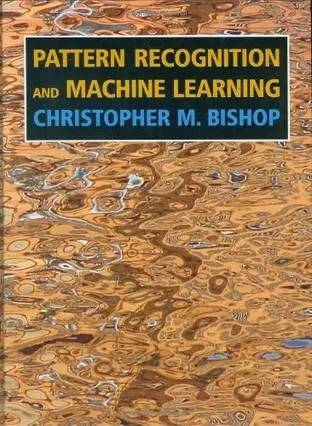
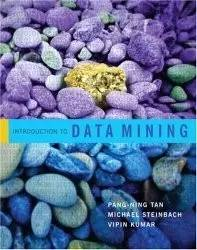

# 书单｜机器学习、数据挖掘和自然语言处理，机器学习工程师和数据科学家最应该读的 16 本书

本文选自 Aioptify

**作者：吴攀**

> *作为一位数据科学家、数据工程师或机器学习研究者，面对市面上各种各样的相关书籍一定会感觉难以取舍。一份好的书单不仅能提升你的学习和工作效率，还能为你节省进修成本。 日前，数据服务提供商 AI Optify 通过通过网络书评、书中的主题覆盖、作者的行业影响力、价格等因素对机器学习、数据挖掘和自然语言处理领域的 100 多本书进行了综合评测，并根据最终计算出的品质得分选出了其中 16 本得分最高的书（英文版价格来自亚马逊，中文版价格来自豆瓣读书）。所以这是一份数据驱动的客观书单，希望你能喜欢。*

**1.An Introduction to Statistical Learning: With Applications in R（统计学习导论 : 基于 R 应用）**

 

价格：英文版 61.36 美元，中文版 63.1 元

品质得分：10/10

这本书在亚马逊上评分非常高，其作者是来自南加利福尼亚大学、斯坦福大学和华盛顿大学的四位教授  Gareth James、Daniela Witten、Trevor Hastie 和 Rob Tibshirani；他们都有统计学背景。这本书比《The Elements of Statistical Learning（统计学习基础）》更为实用，它给出了一些使用 R 语言实现的案例。

**2.The Elements of Statistical Learning: Data Mining, Inference, and Prediction, Second Edition（统计学习基础：数据挖掘、推理和预测）**

价格：英文版 62.0 美元，中文版 45 元

品质得分：9/10

亚马逊上的高分书籍，作者是斯坦福大学的三位统计学教授。第一作者 Trevor Hastie 具有统计学和生物统计学方面的研究背景。关于这本书的一个有趣的事情是作者们以统计学的视角看待机器学习问题。这本书似乎过于关注理论了，所以一些读者可能倾向于略过它。

**3.Pattern Recognition and Machine Learning（模式识别与机器学习）**

价格：英文版 60.0 美元，无中文版

品质得分：8/10

亚马逊上的高分书籍，作者是著名作家  Christopher M. Bishop，他是微软剑桥研究院的一位杰出科学家，领导微软机器学习与感知研究组。这本书在技术上全面覆盖了各种机器学习主题，包括回归、线性分类、神经网络、核方法和图模型。

**4\. Machine Learning: A Probabilistic Perspective（机器学习：概率学的观点）**

价格：英文版 79.16 美元，无中文版

品质得分: 7/10

Machine Learning: A Probabilistic Perspective 一书提供了可以自动检测数据模式，然后使用得出的模式预测未来数据的方法。该教材基于统一的、概率学的方法对机器学习领域提供了全面的介绍。该书的作者 Kevin Murphy 是谷歌的一位研究人工智能、机器学习、计算机视觉、知识基础建设和自然语言处理的研究科学家。

**5\. Data Mining: Concepts and Techniques, Third Edition（数据挖掘：概念与技术，第三版）**

价格：英文版 50.0 美元，中文版 79.0 元

品质得分： 6/10

Data Mining: Concepts and Techniques, Third Edition 一书的作者是伊利诺伊大学香槟分校计算机科学系的 Jiawei Han（韩家炜）教授。这本书能让你了解、应用从大数据集中发现隐藏模式的理论和实践知识。这本书在亚马逊上获得了较为平均的评价。

**6\. Data Mining: Practical Machine Learning Tools and Techniques, Third Edition（数据挖掘：实用机器学习工具与技术，第 3 版）**

价格：英文版 37.5 美元，中文版 79.0 元

品质得分： 6/10

这本书在亚马逊上的评价相当不错，其作者为新西兰怀卡托大学的三位计算机科学教授。他们也是基于 Java 的数据挖掘软件 Weka 的主要贡献者。因此，这本书重在数据挖掘领域的具体实现方面，尤其是基于 Weka 软件的工作平台。

**7\. Probabilistic Graphical Models: Principles and Techniques（概率图模型：原理与技术）**

价格：英文版 91.66 美元，中文版 198 元

品质得分： 6/10

 Probabilistic Graphical Models: Principles and Techniques 这本独特的书提供了设计自动推理系统的概率图框架。这本书的作者是两位计算机科学教授：来自斯坦福大学人工智能实验室的 Daphne Koller 和来自耶路撒冷希伯来大学的 Nir Friedman。

**8\. Introduction to Information Retrieval（信息检索导论）**

价格：英文版 57.0 美元，中文版 69 元

品质得分： 6/10

Introduction to Information Retrieval 的第一作者是斯坦福计算机科学教授 Christopher Manning。这是讲解网络时代的信息检索的教科书，包括网络搜索，以及与文本分类和文本聚类的基本概念相关的领域。

**9\. Machine Learning（机器学习）**

价格：英文版 211.6 美元，中文版 35 元

品质得分： 5/10

Machine Learning 是机器学习领域一本非常著名的著作，其作者是美国卡内基·梅隆大学计算机科学教授 Tom Mitchell。Tom Mitchell 是世界上第一个机器学习系的第一任系主任。Machine Learning 一书涵盖了机器学习的一些基本领域，包括学习、决策树学习、神经网络、贝叶斯学习、强化学习等。

**10\. Speech and Language Processing, 2nd Edition（语音和语言处理，第二版）**

价格：英文版 78.65 美元，无中文版

品质得分： 5/10

Speech and Language Processing 的作者是斯坦福大学语言学和计算机科学教授 Dan Jurafsky。这是全面覆盖语言技术的第一本书——在所有层次上且包含所有现代技术。基于大型企业使用的应用统计和其它机器学习算法，这本书在语言技术这一主题上使用了实证的方法

**11\. Introduction to Data Mining（数据挖掘导论）**

价格：英文版 118.91 美元，中文版 49.0 元

品质得分： 4/10

这本书在亚马逊上获得了很好的评分，其作者是三位计算机科学教授：密歇根州立大学的 Pang-Ning Tan、明尼苏达大学的  Michael Steinbach 和 Vipin Kumar。这本书涵盖了数据挖掘的不同基本领域，如：分类、关联分析、聚类和异常检测。

**12\. Neural Networks for Pattern Recognition（用于模式识别的神经网络）**

**** 

价格：英文版 88.42 美元，无中文版

品质得分： 4/10

Neural Networks for Pattern Recognition 算是一本老书了，但其作者是微软剑桥研究院的杰出科学家 Christopher M. Bishop。

**13\. Foundations of Statistical Natural Language Processing（统计自然语言处理基础）**

价格：英文版 87.27 美元，中文版 55 元

品质得分： 4/10

Foundations of Statistical Natural Language Processing 是亚马逊上评分非常好的一本自然语言处理书籍。用统计方法处理自然语言文本近来已经占据了主导地位。这本书对统计自然语言处理（NLP）进行了全面的介绍，含所有开发 NLP 工具所需的理论和算法。

**14\. Handbook of Statistical Analysis and Data Mining Applications（统计分析和数据挖掘应用手册）**

**** 

价格：英文版 72.81 美元，无中文版

品质得分： 4/10

这本书在亚马逊的评分高于平均分，其作者是三位在数据挖掘和统计学领域有行业经验的博士。这本书是一本指导商业分析师、科学家、工程师和研究者的全面的专业参考书，其中包含不同阶段的数据分析、建模和实现。

**15\. Understanding Machine Learning: From Theory to Algorithms（理解机器学习：从理论到算法）**

**** 

价格：英文版 52.76 美元，无中文版

品质得分： 4/10

Understanding Machine Learning: From Theory to Algorithms 提供了解释机器学习基本思想的广泛理论和将这些原理转化成实际算法的数学推导。这本书的两位作者是分别来自耶路撒冷希伯来大学和滑铁卢大学的计算机科学教授。

**16\. Foundations of Machine Learning（机器学习基础）**

**** 

价格：英文版 96.56 美元，无中文版

品质得分： 3/10

 Foundations of Machine Learning 是一本研究生阶段的教科书，介绍了机器学习的基本概念和方法。这本书描述了几种重要的算法，提供了这些算法的理论基础，并阐释了这些算法应用的主要方面。其作者 Mehryar Mohri 是纽约大学库朗数学科学研究所的计算机科学教授。

***©本文由机器之心编译，***转载请联系本公众号获得授权***。***

✄------------------------------------------------

**加入机器之心（全职记者/实习生）：hr@almosthuman.cn**

**投稿或寻求报道：editor@almosthuman.cn**

**广告&商务合作：bd@almosthuman.cn**