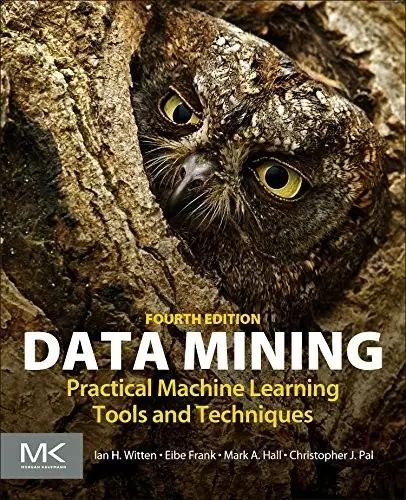

# 资源 | 任何阶段的学习者都适用的参考：机器学习领域书目全集

选自 Machine Learning Mastery

**机器之心编译**

**参与：李泽南、朱思颖**

> *来自 Swinburne 科技大学的 Jason Brownlee 博士为我们带来了最新一期的机器学习书目，内容覆盖科普、各级教材以及不同编程语言的机器学习应用。*

学习是一种理性的投资，每当花费十几个小时读完一本书，你就能领略到前人数年积累的经验。

在阅读了市面上大多数机器学习书籍后，作者列出了最新机器学习领域推荐图书，并使用了使用不同分类方式进行了整理：

按类型：教科书，热门学科等；

按主题：Python，深度学习等；

按出版商：Packt，O'Reilly 等；

……

**如何使用**

1\. 找到你最感兴趣的分类方式，找到需要的主题；

2\. 在你选择的主题中挑选；

3\. 购买图书；

4\. 从头到尾阅读；

5\. 继续找下一本。

拥有一本书和了解它的内容是完全不同的两种概念——你必须真正阅读它们。

请先问问自己：你有没有读完过一本机器学习的书？

**机器学习图书——按类型分**

**最流行机器学习科普图书**

以下图书适用于大多数读者。它们点到了机器学习和数据科学的精华之处，却没有使用枯燥的理论或应用细节。这份书单也包括了一些流行的「统计思想」科普书籍。

The Master Algorithm: How the Quest for the Ultimate Learning Machine Will Remake Our World 

地址：http://www.amazon.com/dp/0465065708?tag=inspiredalgor-20

Predictive Analytics: The Power to Predict Who Will Click, Buy, Lie, or Die 

地址：http://www.amazon.com/dp/1119145678?tag=inspiredalgor-20

The Signal and the Noise: Why So Many Predictions Fail–but Some Don't 

地址：http://www.amazon.com/dp/0143125087?tag=inspiredalgor-20

Naked Statistics: Stripping the Dread from the Data 

地址：http://www.amazon.com/dp/039334777X?tag=inspiredalgor-20

The Drunkard's Walk: How Randomness Rules Our Lives 

地址：http://www.amazon.com/dp/0307275175?tag=inspiredalgor-20

 *其中最值得推荐的一本是：《The Signal and the Noise》。*

**适用于机器学习初学者的书籍**

以下列出最适用于初学者的书籍。希望入门的读者同时也需要参考科普图书（上一条）以及行业应用图书（下一条）。

Data Science for Business: What You Need to Know about Data Mining and Data-Analytic Thinking

地址：http://www.amazon.com/dp/1449361323?tag=inspiredalgor-20

Data Smart: Using Data Science to Transform Information into Insight 

地址：http://www.amazon.com/dp/111866146X?tag=inspiredalgor-20

Data Mining: Practical Machine Learning Tools and Techniques 

地址：http://www.amazon.com/dp/0128042915?tag=inspiredalgor-20

Doing Data Science: Straight Talk from the Frontline 

地址：http://www.amazon.com/dp/1449358659?tag=inspiredalgor-20

 *在这其中最重要的一本是：《Data Mining: Practical Machine Learning Tools and Techniques》。*

**机器学习入门书籍——高级**

以下是适用于希望入门机器学习的本科学生和开发者的书籍，内容包含了机器学习的很多话题，注重如何解决问题，而不是介绍理论。

Machine Learning for Hackers: Case Studies and Algorithms to Get You Started 

地址：http://www.amazon.com/dp/B007A0BNP4?tag=inspiredalgor-20

Machine Learning in Action

地址：http://www.amazon.com/dp/1617290181?tag=inspiredalgor-20

Programming Collective Intelligence: Building Smart Web 2.0 Applications 

地址：http://www.amazon.com/dp/0596529325?tag=inspiredalgor-20

An Introduction to Statistical Learning: with Applications in R 

地址：http://www.amazon.com/dp/1461471370?tag=inspiredalgor-20

Applied Predictive Modeling 

地址：http://www.amazon.com/dp/1461468485?tag=inspiredalgor-20

 *其中最值得推荐的一本是：《An Introduction to Statistical Learning: with Applications in R》*

**机器学习教材**

以下列出了机器学习领域目前最流行的教科书。它们会在研究生课程中出现，包含方法与理论的解读。

The Elements of Statistical Learning: Data Mining, Inference, and Prediction 

地址：http://www.amazon.com/dp/0387848576?tag=inspiredalgor-20

Pattern Recognition and Machine Learning 

地址：http://www.amazon.com/dp/0387310738?tag=inspiredalgor-20

Machine Learning: A Probabilistic Perspective 

地址：http://www.amazon.com/dp/0262018020?tag=inspiredalgor-20

Learning From Data 

地址：http://www.amazon.com/dp/B00YDJC98K?tag=inspiredalgor-20

Machine Learning 

地址：http://www.amazon.com/dp/0070428077?tag=inspiredalgor-20

Machine Learning: The Art and Science of Algorithms that Make Sense of Data 

地址：http://www.amazon.com/dp/1107422221?tag=inspiredalgor-20

Foundations of Machine Learning 

地址：http://www.amazon.com/dp/026201825X?tag=inspiredalgor-20

*其中的重点是：《The Elements of Statistical Learning: Data Mining, Inference, and Prediction》*

**机器学习图书——按主题分**

有关 R 语言在机器学习中如何应用的图书。

The Elements of Statistical Learning: Data Mining, Inference, and Prediction 

地址：http://www.amazon.com/dp/0387848576?tag=inspiredalgor-20

Pattern Recognition and Machine Learning

地址：http://www.amazon.com/dp/0387310738?tag=inspiredalgor-20

Machine Learning: A Probabilistic Perspective 

地址：http://www.amazon.com/dp/0262018020?tag=inspiredalgor-20

Learning From Data 

地址：http://www.amazon.com/dp/B00YDJC98K?tag=inspiredalgor-20

Machine Learning 

地址：http://www.amazon.com/dp/0070428077?tag=inspiredalgor-20

Machine Learning: The Art and Science of Algorithms that Make Sense of Data 

地址：http://www.amazon.com/dp/1107422221?tag=inspiredalgor-20

Foundations of Machine Learning 

地址：http://www.amazon.com/dp/026201825X?tag=inspiredalgor-20

这方面的首选图书是：《The Elements of Statistical Learning: Data Mining, Inference, and Prediction》。

**Python 机器学习**

以下列出 Python 机器学习热门书籍

Python Machine Learning 

地址：http://www.amazon.com/dp/1783555130?tag=inspiredalgor-20

Data Science from Scratch: First Principles with Python 

地址：http://www.amazon.com/dp/149190142X?tag=inspiredalgor-20

Hands-On Machine Learning with Scikit-Learn and TensorFlow: Concepts, Tools, and Techniques for Building Intelligent Systems 

地址：http://www.amazon.com/dp/1491962291?tag=inspiredalgor-20

Introduction to Machine Learning with Python: A Guide for Data Scientists 

地址：http://www.amazon.com/dp/1449369413?tag=inspiredalgor-20

Vital Introduction to Machine Learning with Python: Best Practices to Improve and Optimize Machine Learning Systems and Algorithms 

地址：http://www.amazon.com/dp/B01N4FUDSE?tag=inspiredalgor-20

Machine Learning in Python: Essential Techniques for Predictive Analysis 

地址：http://www.amazon.com/dp/1118961749?tag=inspiredalgor-20

Python Data Science Handbook: Essential Tools for Working with Data 

地址：http://www.amazon.com/dp/1491912057?tag=inspiredalgor-20

Introducing Data Science: Big Data, Machine Learning, and more, using Python tools 地址：http://www.amazon.com/dp/1633430030?tag=inspiredalgor-20

Real-World Machine Learning 

地址：http://www.amazon.com/dp/1617291927?tag=inspiredalgor-20

 *最值得注意的当然是《Python 机器学习》了。*

**深度学习**

注意：深度学习的图书目前还比较稀缺，以下这份列表只能保证数量，而不是质量。

Deep Learning 

地址：http://www.amazon.com/dp/0262035618?tag=inspiredalgor-20

Deep Learning: A Practitioner's Approach 

地址：http://www.amazon.com/dp/1491914254?tag=inspiredalgor-20

Fundamentals of Deep Learning: Designing Next-Generation Machine Intelligence Algorithms 

地址：http://www.amazon.com/dp/1491925612?tag=inspiredalgor-20

Learning TensorFlow: A guide to building deep learning systems 

地址：http://www.amazon.com/dp/1491978511?tag=inspiredalgor-20

Machine Learning with TensorFlow 

地址：http://www.amazon.com/dp/1617293873?tag=inspiredalgor-20

TensorFlow Machine Learning Cookbook

地址：http://www.amazon.com/dp/1786462168?tag=inspiredalgor-20

Getting Started with TensorFlow 

地址：http://www.amazon.com/dp/1786468573?tag=inspiredalgor-20

TensorFlow for Machine Intelligence: A Hands-On Introduction to Learning Algorithms 

地址：http://www.amazon.com/dp/1939902452?tag=inspiredalgor-20

 *其中最重要的一本书当然是：Yoshua Bengio 和 Ian Goodfellow 所著的《Deep Learning》。*

**时序序列预测**

目前时序序列预测在实际应用中主要是由 R 语言的平台所主导。

Time Series Analysis: Forecasting and Control

地址：http://www.amazon.com/dp/1118675029?tag=inspiredalgor-20

Practical Time Series Forecasting with R: A Hands-On Guide

地址：http://www.amazon.com/dp/0997847913?tag=inspiredalgor-20

Introduction to Time Series and Forecasting

地址：http://www.amazon.com/dp/3319298526?tag=inspiredalgor-20

Forecasting：principles and practice

地址：http://www.amazon.com/dp/0987507109?tag=inspiredalgor-20

*   最优质的入门介绍书籍是 Forecasting：principles and practice。

*   时序序列最优质的教科书是 Time Series Analysis: Forecasting and Control。

**机器学习图书——按照出版商分类**

目前活跃在机器学习领域的出版商主要有： O'Reilly, Manning 和 Packt。它们出版了数量可观的相关图书，但质量良莠不齐，从精心设计和编纂的到搜集科技博客内容整合到一起的都有。

**O'Reilly 的机器学习书籍**

O'Reilly 的「data」标签下有一百本书，其中大部分都是与机器学习相关的，以下是一些最畅销的书籍。

Programming Collective Intelligence: Building Smart Web 2.0 Applications

地址：http://www.amazon.com/dp/0596529325?tag=inspiredalgor-20

Introduction to Machine Learning with Python: A Guide for Data Scientists

地址：http://www.amazon.com/dp/1449369413?tag=inspiredalgor-20

Deep Learning: A Practitioner's Approach

地址：http://www.amazon.com/dp/1491914254?tag=inspiredalgor-20

Fundamentals of Deep Learning: Designing Next-Generation Machine Intelligence Algorithms

地址：http://www.amazon.com/dp/1491925612?tag=inspiredalgor-20

Data Science from Scratch: First Principles with Python

地址：http://www.amazon.com/dp/149190142X?tag=inspiredalgor-20

Python Data Science Handbook: Essential Tools for Working with Data

地址：http://www.amazon.com/dp/1491912057?tag=inspiredalgor-20

 

*Programming Collective Intelligence: Building Smart Web 2.0 Applications 这本书代表了机器学习火热的开始而且已经流行了很长一段时间。*

**相关链接**

O'Reilly 的数据门户

地址：https://www.oreilly.com/topics/data

O'Reilly 的数据产品

地址：http://shop.oreilly.com/category/browse-subjects/data.do 

机器学习初学者工具包：依据数据模式的自动化分析

地址：http://shop.oreilly.com/category/get/machine-learning-kit.do

**曼宁机器学习书籍**

曼宁的书总是很实用且质量很高，但他们没有类似 O'Reilly 和 Packt 列出的机器学习 100 本书籍的清单。

Machine Learning Action 

地址：http://www.amazon.com/dp/1617290181?tag=inspiredalgor-20

Real-World Machine Learning

地址：http://www.amazon.com/dp/1617291927?tag=inspiredalgor-20

Introducing Data Science：Big Data, Machine Learning, and more, using Python tools

地址：http://www.amazon.com/dp/1633430030?tag=inspiredalgor-20

Practical Data Science with R

地址：http://www.amazon.com/dp/1617291560?tag=inspiredalgor-20

相关链接

曼宁数据科学书籍

地址：https://www.manning.com/catalog#section-68

曼宁机器学习书籍

地址：https://www.manning.com/catalog#section-73

Packt 的机器学习书籍

似乎 Packt 上有所有的数据科学和机器学习的书籍。Packt 有一个大范围的书籍库，库里的书是机器学习方面比较深奥的书籍。同时也有一些当下很流行的机器学习主题的书如 R 语言和 Python。

下面是一些比较流行的书籍。

Machine Learning with R

地址 ：http://www.amazon.com/dp/1784393908?tag=inspiredalgor-20

Python Machine Learning

地址：http://www.amazon.com/dp/1783555130?tag=inspiredalgor-20

Practical Machine Learning

地址：http://www.amazon.com/dp/178439968X?tag=inspiredalgor-20

Machine Learning in Java

地址：http://www.amazon.com/dp/1784396583?tag=inspiredalgor-20

Mastering .NET Machine Learning

地址：http://www.amazon.com/dp/1785888404?tag=inspiredalgor-20

**其他资源**

以下资源是我用来完成本书目所参考的资料，同时也可能是对大家有用的机器学习的额外书单。

亚马逊机器学习最畅销书

链接：http://amzn.to/2iXxccZ

很棒的机器学习书籍

链接：https://github.com/josephmisiti/awesome-machine-learning/blob/master/books.md

我是怎样学习机器学习的？Quora 上的回答百科

链接：https://www.quora.com/How-do-I-learn-machine-learning-1

Reddit 的机器学习常见问题与回答

链接：https://www.reddit.com/r/MachineLearning/wiki/index

以上就是目前最为完整的机器学习书目，你读过其中的哪几本？欢迎与大家分享自己的看法。

*原文链接：http://machinelearningmastery.com/machine-learning-books/*

***©本文由机器之心编译，***转载请联系本公众号获得授权***。***

✄------------------------------------------------

**加入机器之心（全职记者/实习生）：hr@almosthuman.cn**

**投稿或寻求报道：editor@almosthuman.cn**

**广告&商务合作：bd@almosthuman.cn**