# 重磅 | Yoshua Bengio 深度学习暑期班学习总结，35 个授课视频全部开放（附观看地址）

选自 Linkedin、VedioLectures

**作者： Hamid Palangi**

**机器之心编译**

**参与：Quantum、黄清纬、吴攀**

> *本文是加拿大英属哥伦比亚大学候选博士 Hamid Palangi 对 Aaron Courville 和 Yoshua Bengio 组织的本年度的深度学习暑期学校（Deep Learning Summer School 2016）的学习内容的总结，机器之心在本月初的时候已经对该课程所学的内容进行了一番梳理（可参阅：《[Yoshua Bengio 组织深度学习暑期班，你想见的一流学者和热门课程都来了（附 17 个课程 PPT）](http://mp.weixin.qq.com/s?__biz=MzA3MzI4MjgzMw==&mid=2650718072&idx=1&sn=93f90c233077280da3097f397da6260b&scene=21#wechat_redirect)》）。**此外，此次暑期学校的教学视频网上已经公开，分为 Invited Talks 和 Contributed Talks 两部分，点击「阅读原文」可查看学习视频网址**。*

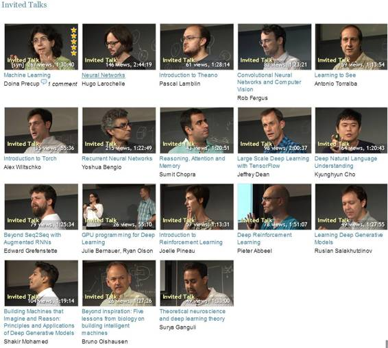
*Invited Talks*

*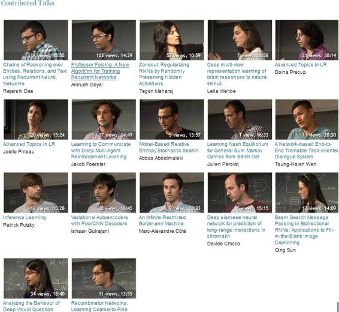
*Contributed Talks**

**课程学习总结**

两周前我参加了 Yoshua Bengio 和 Aaron Courville 在蒙特利尔组织的深度学习夏季学校（deep learning summer school）。下面是对我所学内容的总结。本文从基本的概念开始，继而会深入到更高级的主题。

**1.正则化的本质**

机器学习／深度学习中用到的两个有名的正则化（regularization）是 L2 （维持 L2 在束缚权重上的标准，产生非稀疏的权重集，即不相关特性的权重很小但不为零） 和 L1 （产生稀疏权重集，计算成本比 L2 高）。它们有助于调整假设的复杂性，举例来说，如果假设的方差很高（过拟合），它们就能帮助缓解这个问题。从贝叶斯（Bayesian）的视角来看，L2 正则化等同于一个权重的圆形高斯先验（circular Gaussian prior）。 L1 正则化同等于一个双倍指数型先验（double exponential prior）。注意正则化只能用于权重，而不能用于偏置。其它有助于更高质量生成的正则化技术有 dropout [Hinton et al, JMLR 2014] ，或为监督训练的初始化使用非监督训练，比如说，用受限玻尔兹曼机（RBM）初始化自动编码器的权重，这在论文［Hinton & Salakhutdinov, Science 2006］中有相关解释。通常在实际中，使用一个带有正则化（如：注入噪声）的大模型比使用没有正则化的小型全参数模型（fully parametric model）效果更好。

**2\. 我们为什么需要多个神经元？**

单个神经元只能解决一个可以线性分割的问题，比如与（ AND）运算。它无法解决不可以线性地分割的问题，比如异或（XOR）运算。不过如果我们能更好的表示输入数据，它也能进行异或运算。举个例子，可以对输入数据进行非线性转换，如果输入是 x1 和 x2，用单一神经元也可以解出 XOR( y1, y2)，只要我们让 y1 = AND(NOT(x1),x2) 并且 y2 = AND(x1,NOT(x2))。

**3.应该为神经元选择什么样的非线性？**

选择非线性的经验规则总是以 ReLU （整流线性单元）开头的。它能减少反向传播的计算复杂程度，通常还会引起神经元的稀疏激活（sparse activations）。ReLU 中 0 上的不可微分点并不是一个问题（次梯度（sub-gradient）能解决这个问题）。问题是：在不同层中用不同的非线性是不是个好主意呢？到现在还没有成功过。除非如果我们想把一些结构放在输出中，比如注意机制（attention mechanism）。

**4.训练一个神经元网络的实用小建议**

*   初始化：为了打破对称性（symmetry），我们可以使用随机初始化，例如 [Glorot & Bengio, 2010]

*   超参数选择：（a）：用网格搜索：即试验超参数的所有可能配置。这种方法计算成本很高。（b）用随机搜索 [Bergstra & Bengio, 2012]，即在每个超参数值上列举一种分布，然后从中取样。（c）:贝叶斯优化 [Snoek, et al, NIPS 2012]，得到超参数所需要的猜测数量更少。

*   提前终止（Early stopping）：因为零成本，所以尽量经常用。

*   验证集选择：这个非常重要。验证集应该要足够大，这样模型才不会在验证集上过拟合。这种类型的过拟合也取决于我们在一个验证集上运行了多少次验证测试。

*   归一化（Normalization）：对于真正有价值的数据，归一化能加速训练。

*   学习率：从一个高学习率开始，然后使其衰减或者使用有自适应学习率的方法，比如 Adagrad, RMSprop 或 Adam。

*   梯度检查：非常有助于反向传播算法实现的调试。我们只需简单地把梯度和一个与之接近的优先差异相比即可。问题是：那个接近梯度的有限差异能取代反向传播吗？不能，因为它在数字上更不稳定。

*   永远要确保模型在一个小数据集上过拟合。

*   如果训练困难该怎么办呢？首先，确保反向传播的运行没有漏洞，并且学习率也不会太高。然后，如果它是欠拟合（ underfitting），就使用更好的优化方法、更大的模型等等。而如果它过拟合，就使用更好的正则化，比如，非监督初始化、dropout 等方法。

*   批归一化（Batch Normalization）[Loffe & Szegedy, JMLR 2015］：非常有用的技术，更高层的归一化能进一步提升性能。可以分四步进行：（a）：在应用非线性之前在每个隐藏层上进行归一化。（b）：在训练中，为每个 minibatch 计算出均值和标准差。（c）：在反向传播中，我们应该考虑前向通过过程中的归一化。也就是说，反向传播过程中应该进行一个换算和移位运算（shift operation）。换算和移位参数也应该被学习，因为考虑到隐藏层的衍生物也将取决于它们。（d）：在测试时间，全局均值和标准差也被使用了，这里说的不是为每个 minibatch 计算出的那些。

**5\. 深度有多重要？**

Rob Fergus 很好地解释了这一点。我们可以通过检查有 8 个层的 Krizhevsky 卷积神经网络（CNN）的不同部分来研究深度的重要性，该网络是在 ImageNet 上训练的。Krizhevsky 的 CNN [Krizhevsky et al, NIPS 2012]  的架构和在不同层上使用 SVM 的结果在下面的图片里［Rob Fergus 的演示中的图片］：

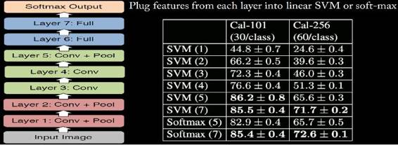 

另一个重要的观察是，如果我们移除了 3，4 层（卷积层）和 6，7 层（全连接层），表现就会下降到 33.5%。

很值得注意的是仅通过加入更多层并不总能提升表现。比如说，仅使用 CIFAR-10 的 20 层和 56 层的结果在下面的图片里［图片来自 He et al, CVPR 2016］：

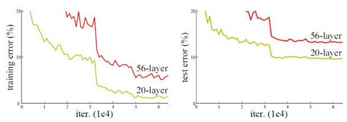

同样的现象也在 ImageNet 上观察到了，这意味着学习更好的模型并不总是等同于增加更多层。注意上面的问题并不会引起上面的训练错误曲线里很明显的过拟合。一个原因也许是网络更深，当反向传播中的错误信号到达更低层时并没有那么重要。为了解决这个问题，残差网络（ residual network）被提出［He et al, CVPR 2016］，这种网络只是简单的在 CNN 架构上添加了 skip connection。一个例子在下图中［图片来自 He et al, CVPR 2016］：

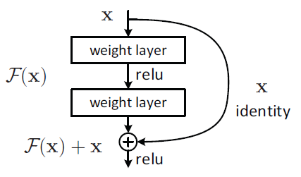

注意，skip connection 是在非线性激活函数之前使用的。

**6.哪一个更重要？在底层设计一个更好的特征提取器，还是在顶层设计一个更好的分类器？**

使用一个强大的特征提取器（如一个 CNN 或针对视觉任务的深度残差网络）比在顶部设计分类器重要的多。

**7.从图像数据库到大数据的演化**

下面的图片总结了从 1970 年至今的图像数据库［ 图片来自 Antonio Torralba 的演示］：

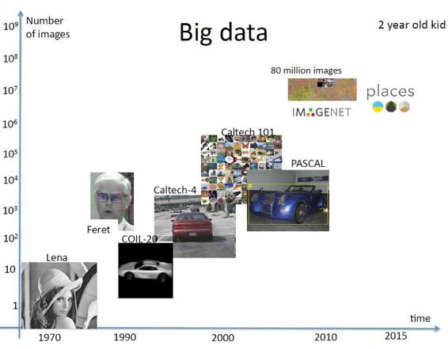 

**8\. 卷积生成式对抗网络**

假设我们想找到一个能生成与数据集中样本相似数据的生成模型（generative model）。比如说，我们想要构建一个能生成类似于 MNIST 或 CIFAR 数据集中的图片的生成模型。一般来说，这是一个非常困难的任务，因为最大化可能性或其他任务相关方法中涉及到太多棘手的概率计算了。完成这个任务有一个简练的理念就是生成对抗网络（GAN）， 这是由 [Goodfellow et al, NIPS 2014] 提出。在 GAN 中，两个模型被同时训练——一个生成模型 (G)和一个鉴别模型（D）。G 生成了一个图像，而 D 则是一个二元分类器，它把给定图像分类为数据集（真实数据）的样本或 G（认为生成的数据）生成的样本。G 的训练是为了能最大化 D 犯错误的可能性（最小－最大二玩家游戏）。结果是，训练结束后，G 能估测出数据的分布。G 为 MNIST 和 CIFAR-10 生成的某些样本图片在下图中（图片来自于 [Goodfellow et al, NIPS 2014]）：

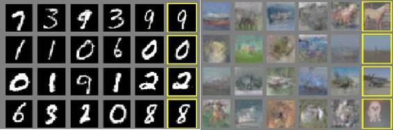

在 [Radford et al, ICLR 2016] 中提出了一种卷积神经网络的形式，它在对抗训练上比其它方法更稳定。GAN 的其他相关参考有 《Adversarial examples in the physical world(http://arxiv.org/abs/1607.02533)》、《Improved techniques for training GANs(http://arxiv.org/abs/1606.03498)》，《Virtual adversarial training for semi-supervised text classification (http://arxiv.org/abs/1605.07725)》。它们甚至还被用来生成新的 Pokemon GO 物种呢！

**9\. 用哪个深度学习工具包呢？**

并没有什么是万能的！这取决于目标任务和应用。下图是一个来自 Alex Wiltschko 展示中的对比图：

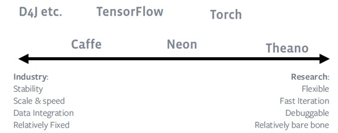 

这里还有一个很好的 Caffe、CNTK、TensorFlow、Theano 和 Torch 的对比图，更多信息详见 Kenneth Tran 的这篇文章：https://github.com/zer0n/deepframeworks

**10.循环神经网络搜索的新进展有哪些？**

循环神经网络（主要是 LSTM 和 GRU ）最近取得了很大的成功，主要用于序列到向量（如：句子嵌入 [Palangi et al, 2015]）、序列到序列（seq2seq）（如：机器翻译）[Sutskever et al, 2014], [Bahdanau et al, 2014]）、以及向量到序列（如：图片加字幕[Vinyals et al, 2014]）的转换。由于消失/爆炸梯度问题，vanilla RNN 还不能很成功实现长期依赖性（long term dependency）。不过，在无限时间训练（这是不切实际的）的限度内，vanilla RNN 最终能学到长期依赖性。下图列出了最近有关 RNN 的成果，它在 Yoshua Bengio 关于 RNN 的演讲中吸引了我的注意：

*   假设我们想用 LSTM 训练一个神经语言模型（neural language model ）。我们的基本任务是根据之前的词语预测下一个词语，为此我们要用成本函数（cost function）把复杂度最小化。在训练过程中，我们给模型送入所有「真实的」前面的词，然后用它们预测后面的词。但在推理过程中，我们把所有「预测出的」前词送入模型并用它们预测出下一个词。为了解决这种训练和推理的不协调性， [Bengio et al, 2015]提出了一种方法：在训练时使用来自模型之前生成的词语一种弱监督。这带来了性能的大幅提升。

*   [Wu et al, 2016]提出了用 RNN 进行的乘法集成（Multiplicative integration）。这种方法的主要思想是用 RNN 的 Hadamard 积（product）代替和（summation）。这种简单的修正会在很大程度上改进性能，这在前面提到的文献中有所证明。

*   如何理解和测量一个给定 RNN 模型的架构复杂性？ 在 [Zhang et al, 2016]中，提出了三种测量：(c.1)：循环深度(recurrent depth )（被序列长度分开的最长路径的长度），(c.2): 前馈深度（feedforward depth）（从输入到最近输出路最长路径的长度）和 (c.3): 跳跃系数（skip coefficient ）（被序列长度分开的最短路径的长度）。

*   像素  RNN（Pixel RNN） （ICML 2016 最佳论文奖）［ Oord et al, 2016］：这项工作提出了一种对自然图像的概率分布建模的方法。主要思想是把输入图片的概率分布分解到条件概率的乘积中。为了做到这点，他们提出了一个 Diagonal BiLSTM 单元，它能有效地抓住图像（见此论文的 Fig. 2）中整个可用的环境（现有像素点之上的所有像素点）。这个架构也使用了残差跳跃连接（residual skip connection）。它在对数概率方面的性能表现达到了目前的最高水准。下图是这个在 ImageNet 上训练的模型所生成的自然图像数量：［图片来自 Oord et al, 2016］

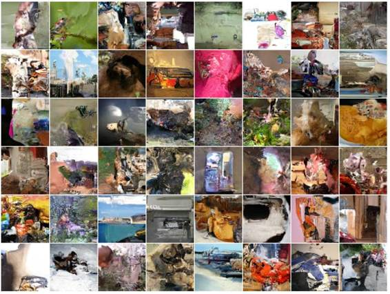 

**11\. 所有问题都能映射成 y=f(x)吗?**

不能！单一 y=f(x) 不能做到的任务例子有：（a）：完形填空式的问答，任务是阅读并理解一段文本文件（比如书之类的）然后回答相关问题。（b）：给出一段文本，任务是添补空白的地方。（c）：聊天机器人。

Sumit Chopra 在演说中很好地解释了这个问题，这种模型需要：(a)：记住外部环境上下文。（b）：给定一个输入，模型需要知道在上下文的什么地方寻找。（c）：在上下文中寻找什么。（d）：如何用外部上下文推理。（e）：这个模型应该也能应付一个变化的下上文环境。

因此，引入一个抓住外部上下文的记忆概念是很重要的。一项提议是使用 RNN 的隐藏态作为记忆。比如，在上下文中（书、文本文件等）运行一个 RNN 并得到它的表征，然后将这个表征映射到需要回答的问题。这种方法有两个问题： (a): 它不能进行扩展。(b) 一个 RNN 的隐藏态既是记忆也是记忆控制器的思路并不合适。我们应该把二者分开。

一个记忆网络（memory network）  [Weston et al, 2015] 的主要思想就是分离记忆控制器和记忆本身。也就是说，它把一个大的记忆和一个能读写这个记忆的学习成分结合到了一起。

记忆网络在问答（QA）任务中比 LSTM 的表现更好，但二者在语言建模任务中的表现差别不大。一个原因可能是对于语言建模任务我们不需要太长期的相关性，相比于问答和对话相关任务。现有记忆网络的一个缺点是没有记忆压缩。如果记忆空间满了，它们就只能再循环。

**12\. Jeff Dean 展示的用 TensorFlow 进行大规模深度学习**

一般地，在一个机器学习系统中令人满意的重要特征有（来自 Jeff Dean 的展示）：（a）：对很多机器学习算法的表达缓解。（b）：可伸缩性：能快速运行实验。（c）：可移植性：这样我们就能在多个平台上运行试验了。（d）：可重复生成性：有助于分享和再次生成搜索。（e）：产物可读性：从搜索到真实产物。

TensorFlow (TF) 是在仔细考虑到以上特征的情况下设计的。TF 其他值得注意的地方有： (a): TF 的核心是 C++，因此日常维护花费很低。（b）：TF 系统自动决定 CPU 或 GPU 上应该运行哪个运算。这通常会有助于大幅提升实验时间。（c）：谷歌第一代规模化的深度学习系统，即 DistBelief [Dean et al, NIPS 2012] ，在搜索上没有 TF 那么灵活。DistBelief 有分开的参数服务器，即参数服务器的分离代码 v.s. 系统的其余部分，导致了不一致性，和其他复杂的系统。（d）：TF 会话接口是允许「扩展」的，这可以被用来在计算图上加标注，在运行完全计算图（computation graph）之外的「运行」也可以被用来运行计算图的任意一个子图（subgraph）。（e）：问题：TF 如何让分布式训练变的容易呢？它用了模型并行化（在不同机器间分隔模型）和数据并行化。在 TF 中，对单一的设备模型代码进行最小的改变就表达出两种类型的并行化是很容易的事情。（f）： TF 能照顾到设备/图的配置。也就是说，给定一个计算图和一组设备， TF 允许用户决定哪个设备执行哪个节点。

**13 .统计型语言建模的历史？**

统计型语言建模（Statistical language modelling）的核心思想就是找到一个句子出现的可能性有多大。我们一般把语料库中句子的对数概率（ log probabilities）最大化。然而在 90 年并不是每个人都知道这点（Brown et al, 1990 论文中的观点）：

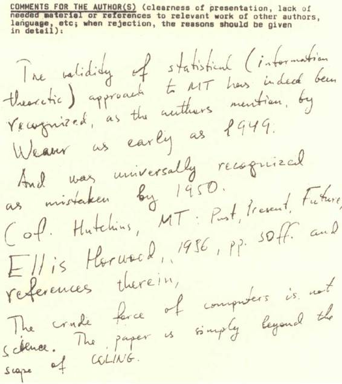 

他写道「对 MT（机器翻译）的统计方法的有效性确实已被认识到了…….最早是在 1949 年。然后在 1950 年被普遍认为是错误的...... 计算机原始的驱动力并不是科学。」

**14\. 非参化语言建模（如 n-gram）的问题是什么？**

n-gram 语言建模，基本上就是从一个大语料库（即记数的）中收集 n-gram 的统计资料。这种方法的问题有：(a): 错误条件独立假定：因为在一个 n-gram 语言模型中，我们假设每个单词只在之前的 n-1 个词上是有条件的。（b）：数据稀疏：意味着如果某些词语的同现从未在训练集上被观察到，它的概率就会被置零，从而导致整个句子（的概率）都为零。这个问题一般的解决办法就是平滑化和回退。（c）：缺乏域之间的泛化。

举例来说，一个 n-gram 语言模型也许会在句子「The dogs chasing the cat bark」上失败。tri-gram 可能性 P (bark | the, cat)非常低（模型没有在一个自然语言语料库中观察到这种句式，因为猫不会发出狗叫声（bark）而且复数动词「bark」出现在了单数名次「cat」之后），但整个句子是有意义的。

**15.有参的和自然语言建模**

自然语言模型的基本思想是创造出一个连续的空间词语表达，并用于语言建模。比如说，在[Bengio et al 2003]中，一个顶部带有 softmax 层的前馈神经元网络（ feedforward neural network ）被用于语言建模，如下图所示（图片来自 Kyunghyun Cho 的展示）：

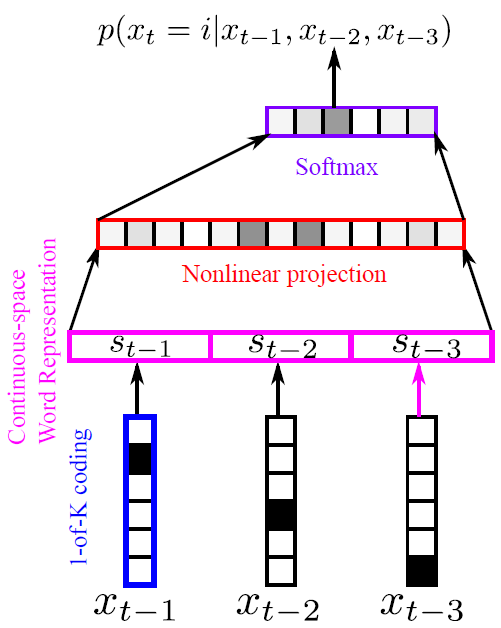 

自然语言建模有一个更好的选择，RNN (LSTM, GRU, …) 或者记忆网络，这在复杂度方面能把性能提升到现有最高水准。具体例子可参见 Jozefowicz et al 在 2016 年的论文「Exploring the Limits of Language Modelling" by Jozefowicz et al, 2016」。下图表示了一个非折叠 vanilla RNN 语言模型的简单示例，模型能读取输入数据、更新隐藏状态的表征并预测出下一个词是什么（图片来自 Kyunghyun Cho 的展示）

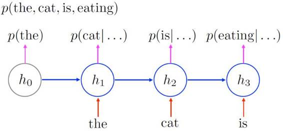

**16.字符级别的神经机器翻译**

机器翻译的任务是在给定源语言句子的基础上，生成目标语言的句子。在神经元机器翻译（NMT）中，一个 RNN (LSTM, GRU, 等) 被用来把源句子编译到一个向量中，再用另一个 RNN 把这个来自编译器的向量解码成一个目标语言的词语序列（序列到序列学习）。见下图（图片来自  Kyunghyun Cho 的展示）：

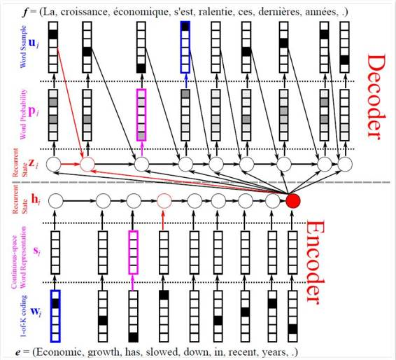 

以上的模型可以改进，如果我们用一个基于注意力的解码器［Bahdanau et al, ICLR 2015］。计算出一个注意力权重集，然后使用解码器中译码器的注释向量的加权和。这种方法允许译码器自动关注源句子中与每个目标词的预测相关的部分。这在下面的图片中有所显示（图片来自 Kyunghyun Cho 的展示）：

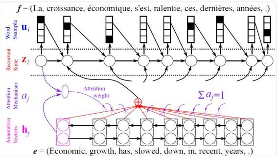 

以上模型的主要问题是它们用词语作为语言的基本单元。比如，「run」、「runs」、「ran」和「running」 都来自同一个词位 「run」。但上面的模型却给它们分配了四个独立的向量。把一个句子分割成词语并不总是那么容易。问题在于，我们能用字符级别的 NMT 解决这个问题吗？在 [Chung et al, 2016]中证明了，字符级别的 NMT 工作起来效果出乎意料的好。同样值得注意的是，一个 RNN 会自动把一个字幕序列进行隐式分割。例子可参见下面的示范（图片来自 Kyunghyun Cho 的展示）：

 

**17.为何选择生成模型？**

 Shakir Mohamed 在演说中很好的解释了这点，我们需要生成（Generative models ）模型，这样就能从关联输入移动到输出之外，进行半监督分类（ semi-supervised classification）、数据操作（ semi-supervised classification）、填空（filling in the blank）、图像修复（ inpainting）、去噪（ denoising）、one-shot  生成 [Rezende et al, ICML 2016]、和其它更多的应用。下图展示了生成式模型的进展（注意到纵轴应该是负对数概率）［图片来自  Shakir Mohamed 的展示 ］：

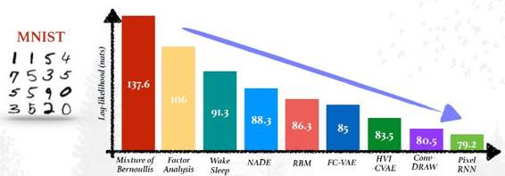 

**18.生成式模型有哪些不同类型？**

（a）：全观察模型（Fully Observed Models）：模型在不引入任何新的非观察局部变量的情况下直接观察数据。这类模型能够直接编译观察点之间的关系。对于定向型图模型，很容易就能扩展成大模型，而且因为对数概率能被直接计算（不需要近似计算），参数学习也很容易。对于非定向型模型，参数学习就困难，因为我们需要计算归一化常数。全观察模型中的生成会很慢。下图展示了不同的全观察生成模型［图片来自 Shakir Mohamed 的展示］：

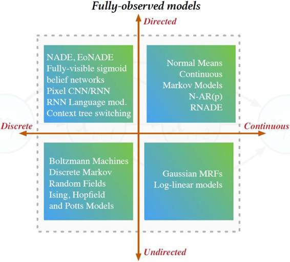 

（b）：变换模型（ Transformation Models）：模型使用一个参数化的函数对一个非观察噪音源进行变换。很容易做到(1):从这些模型中取样 (2):在不知道最终分布的情况下仅算期望值。它们可用于大型分类器和卷积神经元网络。然而，用这些模型维持可逆性并扩展到一般数据类型就很难了。下图显示了不同的变换生成模型［图片来自 Shakir Mohamed 的展示］：

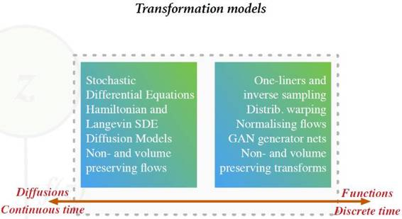 

（c）：隐变量模型（ Latent Variable Models）：这些模型中引入了一个代表隐藏因素的非观察局部随机变量。从这些模型中取样并加入层级和深度是很容易的。也可以使用边缘化概率进行打分和模型选择。然而，决定与一个输入相联系的隐变量却很难。下图显示了不同的隐变量生成模型［图片来自 Shakir Mohamed 的展示］：

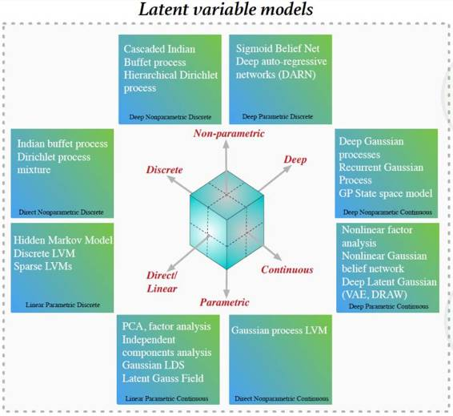 

***©本文由机器之心编译，***转载请联系本公众号获得授权***。***

✄------------------------------------------------

**加入机器之心（全职记者/实习生）：hr@almosthuman.cn**

**投稿或寻求报道：editor@almosthuman.cn**

**广告&商务合作：bd@almosthuman.cn**

**点击阅读原文，观看授课视频↓↓↓**