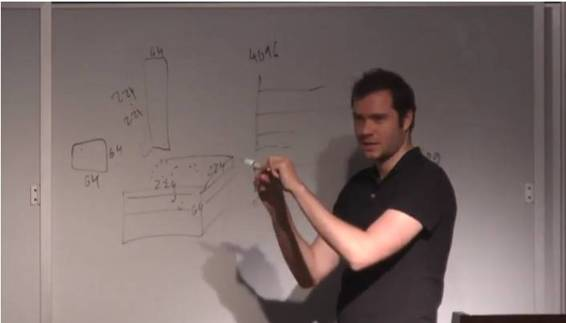

# 干货 | Andrej Karpathy CS294 课程总结：可视化和理解深度神经网络

机器之心原创

**机器之心**

**I. 介绍**

 这篇文章中，我们将回顾一些目前用来可视化理解深度神经网络的方法。我不会深入探讨这些材料中的细节，而是阐述一些个人观点以及我在学习这些材料时的个人体会。所有原始材料来自 Andrej Karpathy 在伯克利大学的客座讲座，CS294 课程。该讲座的演讲视频可点击文末「阅读原文」查看。

 

**II. 凸优化（Convex Optimization）vs. 非凸神经网络（Non-Convex Neural Networks）**

凸优化是一个数学上非常严谨的问题，人们对此也一直颇有研究。它的优美之处在于能够推导出易实现的、达到全局最优的下降算法。而非凸优化问题，却很难证明其最优性。也因此，我们会担心针对这些问题提出的优化算法会停滞在局部最小值。然而，这并不是说我们不能证明非凸问题最优解。我已经碰到过一些技术，这些技术使用了区间分析（interval analysis）方法，只要函数在某些阶上（some odrder)Lipschitz 连续，并且它的解（局部最小值）并不会产生组合性爆炸。

神经网络本质上是一个非凸问题。因此，对其最优性的形式证明寥寥无几。在过去，担心差在局部最小值是真的，特别是神经网络刚刚开始发展的阶段（上世纪 80 年代）。其中一篇关于探讨这个话题的论文： 多层网络的损失面（The Loss Surfaces of Multilayer Networks by Choromanska etal. 2015），实证表明，随着问题维数增加（可视为隐藏层更多了），你的最终解的损失方差会下降。因此，基本上，最优解和最差解之间的间隔在不断锐减，你的所有的局部最小值会变得相同。因此，非凸优化解决方案不过是走开了，人们并没有真正的解决这个问题，它仅仅是变得不重要了。

 

**III. 层图表达以及 t-SNE 可视化 **

（编者注： t-SNE 是 t-distributed stochastic neighbor embedding 的缩写，即 t 分布随机邻域嵌入算法）

卷积神经网络，简单来说，就是一个多层巨无霸三明治。一种用来视化理解这些网络的方法就是从网络中取出一个单独神经元，观察让这个神经元兴奋的是什么。本质上，我们经验使用这些激活反应来可视化神经元响应的对象。

 

*图注：可视化激活神经网络的事物*

另一个技术是可视化网络权重。这需要训练自己的神经网络然后显示它学习到的 Gabor 过滤器。不过这种办法只对卷积神经网络首层有效，因为针对输入的图片所得出的权重在第一层后又会再做卷积操作。当你不断深入网络，我们就不太能解释 这些滤波器的结果了，因为每一层的权重都是在前一层输出结果上进行了卷积操作。

 

*图注：可视化网络权重*

在此，Andrej 给出了一个关于使用 ConvNetJS 来实现可视化技术的链接（https://cs.stanford.edu/people/karpathy/convnetjs/），该项技术能把网络逐层分解，你可以利用这个来观察网络在输出最终分类结果前每一层的梯度、激活函数、 权重等。此外，Andrej 还推荐了一下 TensorFlow Playground：http://playground.tensorflow.org/，以及 Jason Yosinski 的博客：http://yosinski.com/deepvis

**IV. 不仅仅是单个神经元的可视化**

有一种观察卷积神经网络的方法是看其全局表达，即卷积神经网络对任何一张图片，其顶层的输出结果。我们将一张图片传入卷积神经网络网络去处理。这个网络的每一层将对该图片进行重新的表达，而对于每一层，我们可以学习到原始的图片是如何被整合到这一层中的。因此，为了可视化这一过程，我们希望能将这些表达整合到 2 维空间。这时候，就需要用到一种超炫的技术，叫做 t-SNE 可视化技术（Van der Maaten, Hinton**）。**这种技术将高维的点嵌入到低维空间，而局部的成对距离被保留了（在低维空间相邻的点在高维空间也依然相邻）。

 

*图注：t-SNE 可视化，了解更多可查阅 http://cs.stanford.edu/people/karpathy/cnnembed/*

*图注：用强化学习玩 Atari 游戏的可视化*

**V. 遮盖实验**

这种用于可视化网络究竟学到了什么的技术是把网络视作黑盒，修改它的输入然后观察输出。假设我们有一张被这个网络能准确地分类成博美犬的图片，现在，我们要做的是将这个图片的某一块「屏蔽（block）」（将这个地方的像素值设置为 0 或 255，或者颜色设置为黑或白即可）。这样，这个网络的输出是对这张被屏蔽的图片的输出。我们可以发现，当我们屏蔽的部位越是重要，比如脸部，那么这个网络做出正确分类可能性就越低。

一个有趣的发现是，比如，我们有一张照片，其正中部位有一只阿富汗猎犬，旁边是一位男子，网络能正确的将其标记为阿富汗猎犬。但是，如果将男人的脸用像素为 0 的方块遮盖，网络认为是阿富汗猎犬的概率激增。发生这种现象的原因在于，每一张图片只被分配了一个正确的标签，当我们遮盖一些可能会引起网络会做出其他决定的部位，那么，得出这个正确的标签的概率就大大提高了。这也是一种完整性检查，这样网络可以一种通过调整图片可能所属类别标签的概率大小来做出合理判断。

**VI. 去卷积方法（Deconvolution Approaches）**

通常，我们尝试去计算出关于网络权重的损失函数梯度，这样当我们每做一次更新操作，我们就能优化权重。现在，让我们思考一个问题：给出一张图片，怎样才能得出网络中任何一个随机神经元的梯度？有一种可行的方案是：

 

1）将图片输入网络，对于网络深处的某一个神经元，我们将其命名为神经元 a。

2）将它的梯度设置为 1，同层的所有其他神经元的梯度设置为 0。

3）一路将梯度反向传播回图片，得到一张略古怪的噪声图片。

尽管这张梯度图片很难解释，但至少可以告诉你，如果把这张图片和原始图片叠加，将会提高神经元 a 的激活函数值。而反向传播过程只会改变修正线性单元 ReLU 层。这里的直觉就是：沿着梯度（反向）传递到 ReLU 层的某一个神经元，那么说明这个神经元被激活了。否则，传递就会停止。

另一种替代方法是不使用简单的反向传播，而是使用所谓的导向反向传播（guided backpropagation）。

 

这种技术并不仅能够识别一个修正线性单元 ReLU 是否被激活，而且可以识别所有值为负的梯度。本质上，除了能把所有不被激活的修正线性单元 ReLU 关闭，所有反向传播时遇到的负信号还能被设置到阈值 0。最终，我们只需要反向传递梯度为正的值即可。这样的话，反向传播最后获得的图片就会更加清晰，因为我们去除了所有负梯度对我们所选的神经元造成的影响，只保留了正面的影响（详见： Striving for Simplicity: The all Convolutional Net, Springenberg, Dosovitskiy, et al., 2015 for more information）。

 

*图注：使用 guided backpropagation 后噪声明显减少*

**VII. 对图像进行最优化**

**i. 类别可视化**

**** 

接下来讲授的技巧涉及在图像上进行最优化操作。考虑如下问题：我们能否找到一个图像，它能够最大化某些类别的分数？为达到该目的，我们希望保持神经网络架构不变，而使用不同损失函数以在图像上进行最优化。这个方法包括如下步骤：

 

(1) 向神经网络中传入一个随机的图像；

(2) 设定梯度分数向量为 [0,0,…,1,0,...0]（将感兴趣的那一类设为 1，不感兴趣的则为 0），接着对对象进行反向传播；

 

(3) 进行一个小规模「图像更新」；

(4) 将更新的图像进行正向传播；

(5) 重复 (2) 以设定其他的梯度分数向量。我们基于一个随机噪声的图像开始，并对目标类（也就使用了上述的梯度分数向量进行逆传播的那一类）进行梯度上升操作，我们会生成一个图像，它能改进神经网络对目标类的激活状态。从数学上来说，令 I 代表一个图像，y 代表一个目标类，Sy(I) 则是神经网络赋给图像 I 在 y 类上的分数。我们希望解决如下的最优化问题：

也就是说，我们希望找到一个图像 I∗，它能够最大化神经网络赋给 y 类的分数。在如上的等式中，R 是一个正则化项。正则化项改进了输出图像的可视化程度（参见 Simonyan 等人，Deep Inside Convolutional Networks: Visualising Image Classification Models and Saliency Maps，ICLR Workshop 2014）。这个内容在去年完成，它论述了类的分数问题。但是，该技巧可以被应用到神经网络中的所有节点上。我们从某个随机图像开始正向传播，直到到达了我们想要研究以及可视化的层为止。对该层中的任一神经节点，重复该步骤（即设定其他梯度分数为 0、目标对象梯度值为 1、在图像上反向传播），以检查哪种图像会最大程度地激活神经网络中的神经节点。注意，这些技巧中都有正则化项，以避免对抗的图像。不同的正则化方案侧重图像的不同方面，以判断我们认为的「正常的」图像。所以，它们会对这些试验的结果有很大影响。

**ii. 特征反演（Feature Inversion）**

另一个可以探讨的问题是：给定一个卷积神经网络的「编码」（特征代表，可以理解为是神经网络中某一层的输出值），能否根据其重构原来图像？如下的技巧就试图实现这一功能。它分为三步：

(1) 向网络中传入一些输入图像；

(2) 忽略输入图像；

(3) 在某些层对输入进行反向传播，直到在网络中找到这样的层，能够生成与输入图像相同的「编码」（在这一层学到的特征表示）的图像。

从数学上看，令 I 代表一个输入图像，φl(I) 为卷积神经网络 φ 中的激活层 l。我们希望解决如下优化问题：

 

也就是说，我们希望找到一个图像 I∗，它与图像 I 在神经网络 φ 中的 l 层有相似的特征表示。其中 ||.||2 是代表 L2 范数，R 是正则项（可能是隐式的）。

概括来说，我在这里的想法是，要储存一个图像，只需存储图像的「编码」就行了。我们可以根据上述方法使用这些「编码」来重构图像（尽管有损失）（参见 Yosinski 等人，"Understanding Neural Networks Through DeepVisualization"，ICML 2015 Deep Learning Workshop）。

总的来说，这项技术允许我们看到，图像是如何通过一组特定「编码」（特征代表）在神经网络上被恢复的。

**VIII. 卷积网络中的对抗图像**

对抗图像，是对原有图像加入很小的扰动而构成的图像；这些扰动由数据集的数据构成，被特意设定为最坏情况。由此，神经网络会错误地给这个新形成的图像很高的概率。在实践中，我们可以取任一被正确标记的传入神经网络的图像，并基于其它对抗图像对其添加扰动值。

我们无意探讨过深的数学细节，但这种情况发生的原因是因为神经网络常有很高的维度，因此，它有着内在的线性本质。直觉上说，我们考虑如下的线性例子：令 x 为一输入图像，w 为该模型的权重值，则获得输出的运算就是 x 和 w 之间的内积，即 wTx。如果我们以 η 来轻微地对输入进行扰动，我们则得到 x¯ = x + η。那么，输出就便成了 x¯ = wT x + wTη。这种对抗扰动导致激活值增长了 wTη。进而，我们可以在某些关于 η 的限制条件下（通常是正则化约束）最大化该项以引起模型中的问题。但是，随着问题维度的不断增加，我们可以在满足正则化条件的情况下，对 η 向量施加很多小的扰动。这些细微的变化加在一起，最终会对输出造成很大的变化。

另一种考察不同模型间对抗图像的方法，是将他们视为对抗扰动在模型权重向量下高度对齐的结果。这是因为如上解释中所说的内容：这些小的改变迫使该线性模型专注某一个信号，该信号和模型的权重值最相近；即便其它 (从正确图像中得来的) 信号有更大的振幅也是如此。

**IX. Deep Dream 实验**

 

*图注：Deep Dream GitHub：https://github.com/google/deepdream*

Deep Dream 实验背后的机理实际上是很简单的。基本上我们只要修改一下图像，以增强网络中选定的某层的激活情况。具体地，我们需要：

(1) 从神经网络中选择某一层；

(2) 向其中传入某些输入图像，以确定给定层的特征；

(3) 设定那一层的的梯度值为激活值自身；

(4) 对该图像进行反向传播。

**X. 神经风格实验**

考虑如下的情景：我们有两个图像，一个为内容图像 Ic, 一个为风格图像 Is，我们想生成第三个图像，使之能够具有 Ic 的内容及 Is 的风格。也就是说，我们要做的是从 Ic 中解析出内容，从 Is 中解析出风格。

为了解析出内容，我们将 Ic 传入我们的神经网络并储存每一层的激活值。但解析风格的过程却有所不同。我们将 Is 传入神经网络，并计算每一层激活值的 Garmian 矩阵（G=VTV）。从代数的观点来看，Garmian 矩阵 G 仅仅是 V 的列内积值。例如，CONV1 层由 244×244×64 个激活值构成，我们则计算得一 64×64 的 Gram 矩阵，它是由每个区域内配对激活值的协方差求和而成。从图像的角度来说，我们是将一层由三维（244×244×64）矩阵构成的激活值转换到一个二维矩阵（（244×244）×64），并对其取外积以得到该 64×64 的矩阵。对矩阵中的每个项 gi,j，我们都是将输出通道 i 及 j 在那一层上的激活值乘在一起。如果通道 i 及 j 的神经元交结在一起，那么它们会加在一起，我们也会得到一个更大的 gi,j。所以 Gram 矩阵 G 含有在对整个空间位置平均后哪些神经元交结在一起的数据。我们对神经网络中的每一层都计算一个 Gram 矩阵。

 

最终，我们有了这些信息之后，就能够对整个图像进行最优化以得到： Ic 的内容及 Is 的风格（详见 Leon A. Gatys 等人，《A Neural Algorithm of Artistic Style》，2015）。

 最后，Andrej 还推荐了一个快速神经风格迁移项目，可以实时通过网络摄像头实现风格迁移：https://github.com/jcjohnson/fast-neural-style，参见机器之心文章《[开源 | 怎么让你的照片带上艺术大师风格？李飞飞团队开源快速神经网络风格迁移代码](http://mp.weixin.qq.com/s?__biz=MzA3MzI4MjgzMw==&mid=2650719733&idx=3&sn=950a7adb4e93bca22e4ef975877482a9&chksm=871b018bb06c889ddc87bccaa0f35de5ca5a35c156cf1164d134d5010065d68dd06ba6e7cdfa&scene=21#wechat_redirect)》。

**XI. 结语**

在这篇回顾中，我们回顾了一些能够用于理解及可视化神经网络的技术。这些技术是从各种资源中搜集来的，其呈现的顺序与重要性无关。

我们探讨了如何可视化那些能最大化激活神经元的区块，检查了其权重值及其对激活值的影响（第三节）；我们亦讨论了使用如 t-SNE 这样的技术来可视化全局表达（第四节）；在所讨论的遮盖实验中，我们修改了输入并观察了输出改变情况（第五节）；然后，我们谈到了几种去卷积方法（第六节），接着对图像进行最优化（第七节）以最大化一个类、神经元之间的激活率（firing rates）或是匹配一个特定的编码。此外，我们还基于简化的线性解释，讨论了卷积网络中的对抗输入。最后，我们涉及到了一些关于最优化图像的一些应用（在最后关于 Deep Dream、神经风格的两节中）。这些技术表明，神经网络中的「层」或特性并非仅仅是随机模式，有着能够直觉被理解的特性。我们能够使用这些可视化技巧来发现模型的中的问题，以获得更好的结果。

最后，我们想提及一个也许更具价值的观点：如今神经网络给出的解决方案，在神经网络不断增长的情况下的被证明是经验最优的——也就是说，在所谓「好」与「差」的答案之间的鸿沟消失了。所以，困在一个局部最优点，也许不再是一个问题。

******©本文为机器之心原创，***转载请联系本公众号获得授权******。***

✄------------------------------------------------

**加入机器之心（全职记者/实习生）：hr@almosthuman.cn**

**投稿或寻求报道：editor@almosthuman.cn**

**广告&商务合作：bd@almosthuman.cn**