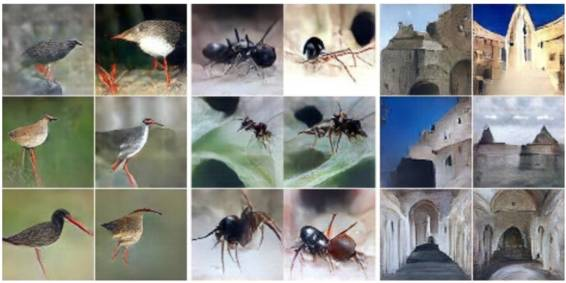
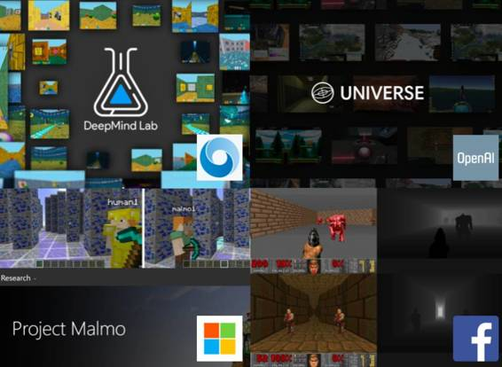
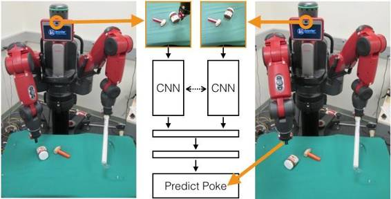
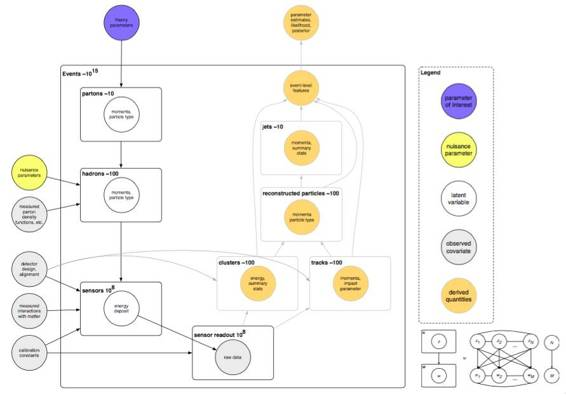
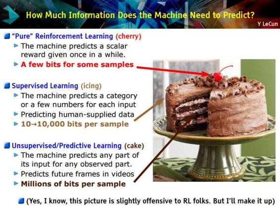
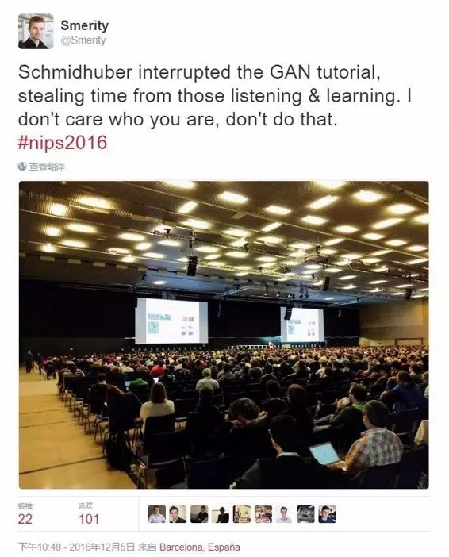

# 深度｜NIPS 2016 最全盘点：主题详解、前沿论文及下载资源（附会场趣闻）

机器之心编辑

**参与：微胖、杜夏德、吴攀、李亚洲**

> *当地时间 12 月 5 日到 10 日，机器学习和计算神经科学的国际顶级会议第 30 届神经信息处理系统大会（NIPS 2016）在西班牙巴塞罗那举行。在这次会议上，人工智能和机器学习领域的研究者为我们呈现了这一领域的研究前沿，其中包括：学习去学习（learning-to -learn）、生成对抗网络（GAN）、用于三维导航的强化学习、RNN 等等；与此同时，一些资深研究者也带来了一些极具看点和启发价值的演讲和教程，其中包括：《[吴恩达 NIPS 2016 演讲现场直击:如何使用深度学习开发人工智能应用?](http://mp.weixin.qq.com/s?__biz=MzA3MzI4MjgzMw==&mid=2650721081&idx=1&sn=d557968703d4af879b5cf6461069dacd&chksm=871b0f47b06c865185865fcd5ef92af7726e84ae9e689b7ced9986a08c9fe3113df296a8469a&scene=21#wechat_redirect)》、《[GAN 之父 NIPS 2016 演讲现场直击：全方位解读生成对抗网络的原理及未来](http://mp.weixin.qq.com/s?__biz=MzA3MzI4MjgzMw==&mid=2650721284&idx=1&sn=427e7f45c8253ab22a3960978409f5d1&chksm=871b087ab06c816c424ad03810be3e1b3aa9d6e99a5f325047796f110d178a07736f667d1a10&scene=21#wechat_redirect)》和《[Bengio 和 LeCun 在 NIPS 2016 上的演讲](http://mp.weixin.qq.com/s?__biz=MzA3MzI4MjgzMw==&mid=2650721325&idx=4&sn=d570f04d737d09c1b1cebd962755af3f&chksm=871b0853b06c8145985f8c2c5ac7445118f18ce35532c0389b0e5ec24a7a1c4b841fe81280de&scene=21#wechat_redirect)》等等。现在，NIPS 2016 已经顺利闭幕，与会的各路研究者开始在网上分享他们的参会经历和体验，以及总结相关的研究进展。机器之心在此对网络上多篇 NIPS 相关的总结文章进行了综合梳理。*

**NIPS 2016 主题概览**

**首先，开放性**。两年前，亚马逊开始公开他们的研究，现在他们是这场大会的主要参与者。今年，根据 NIPS 与会者的一系列推文，苹果人工智能研究主管、卡内基梅隆大学教授 Russ Salakhutdinov 在会议上表示，「苹果的人工智能研究团队将公开发表他们的研究成果并更多地参与到广阔的学术圈中去。」

**其次，模拟**。Yann LeCun 在开幕 Keynote 演讲中提到，「模拟是减轻强化学习的高样本复杂性的好策略。」同时，从科学方法论上看，对于反事实的场景，模拟的环境是数据集的模拟，因此它们可以使用共同的指标，允许重复性实验和创新民主化。

模拟器不是什么新东西，过去人们对它也曾有过热情和悲观的浪潮，也有很多陷阱，基本上可以归结为过度训练模拟器（包括微观上得到一个不好的模型和宏观上将科学注意力集中在不相关的问题上。）

有两点需要注意。第一个是 Jason Williams 建议的，相对的性能结论可以接受，但是，绝对的性能结论值得怀疑。第二点是 Antoine Bordes 主张使用一个可实现的模拟问题的集合（也就是对于多种问题，哪一种完美的性能是可能实现的，哪一种能表现出明显不同的能力，目前还不知道什么方法可以解决所有问题。）

毫无疑问，模拟器正在激增。比如 GVGAI，CommAI-env，Project Malmo 以及会议期间公布的 OpenAI Universe 以及 DeepMind Lab。除了理模拟器外，以下几个主题今年也讨论的也比较多。

**生成对抗网络。**今年，来自其他会议（比如 ICLR）的 GAN 研究热席卷了本次大会。这与模拟有关，尽管更多的是面向减轻样本复杂性而非科学方法论主题。人们正在弄清楚 GAN 能实现如此好的优化能力的奇怪原因，这些原因应该能在近期内帮助深度学习获得一些有趣的改进（不止于许多漂亮照片）。对于 NLU 任务来说，这有点不幸，因为目前从 GAN 生成文本的成熟性并不如声音、图像的生成.

**可解释模型**。在产业领域，有关能够自己进行解释的模型的想法很流行，不过，我还是第一次看到可解释性得到 NIPS 的很大关注。即将到来的欧盟管制显然加剧了人们对这个主题的兴趣。不过还有其他原因：比如，如果表征更加可以解释的话，那么，表征学习近期取得的进展就能让科学查询更加容易。

**NIPS 2016 研究主题详解**

这部分的要点总结来自 Insight Data Science 程序开发主任兼研究科学家 Ross Fadely 的系列文章。机器之心进行了适当的删减和整理。

**第一天亮点：生成对抗网络**

大会第一天主要是参会研究者们带来的一系列研究主题上的最近进展 tutorial。其中这三个是比较引人关注的：

首先是来自哥伦比亚大学的统计与计算机科学教授 David Blei 深入介绍了变分推理（Variational Inference）研究的最近的多项进展。最有影响的还是重新参数化（reparameterization）的技巧，该技巧可以通过随机变量实现反向传播，同时也推动了变自编码器上最新进展。吴恩达带来的则是偏向应用的指导，他介绍了自己在业界打造学习系统的最佳实践经历。

另一个演讲是法国国家信息与自动化研究所的 Francis Bach 带来的（非）凸优化上的最新进展，其中如 SAGA（https://arxiv.org/abs/1407.0202）这样的算法轻松打败了 BFGS（Broyden–Fletcher–Goldfarb–Shanno algorithm）。一旦有了通用的库，这种算法可以在数据科学和应用机器学习领域发挥巨大的作用。

明星级的 Tutorial 当属 Ian Goodfellow 的 GAN（生成对抗网络）。Yann LeCun 大会开幕主题演讲上将 GAN 评价为「近 20 年来（该领域）最令人兴奋的思想。」Goodfellow 清晰地描绘了 GAN 的概念及其目前的进展，还有一些小技巧和提示以及当前的研究前沿。他提到的更多的是使用 GAN 训练的最新进展。最后，Goodfellow 以 Plug & Play Generative Networks（即插即用生成网络）的最新进展惊艳全场，该技术首次产生了逼真的计算机生成图像（如下图）：

 

*从 Plug & Play Generative Networks（Nguyen et al. 2016）上面的图像分别是赤足鹬鸟、蚂蚁和修道院，看上去比最近的其他几张生成图都要真实 *

第一天还有一个大亮点：共 170 多个展位的海报展示。Yoshua Bengio、 Diederik Kingma 和 David Blei 也站在人群中给大家讲解他们的展示。这些展示的质量也非常高，以下是其中的亮点： 

*   Exponential Family Embeddings：一种多类型数据的全新强大的嵌入（embedding）技术，带来了用户使用嵌入技术评估数据的可能性。

*   Unsupervised Learning for Physical Interaction through Video Prediction：利用机器人的推动动作的数据来规划可能的未来。传统的代理（agent）学习算法严重依赖于监督，而这种类型的方法或许是机器人和类似领域未来的新方法。

*   Improving Variational Inference with Inverse Autoregressive Flow ：结合了变分推断的最新进展和自动回归网络（autoregressive network）的一些想法，得出更好的编码模型。

**第二天亮点：平台之战和强化学习**

[DeepMind 宣布开源其强化学习平台 DeepMind Lab](http://mp.weixin.qq.com/s?__biz=MzA3MzI4MjgzMw==&mid=2650721081&idx=2&sn=fb1b2ba31d256c08e3c93e813deabc73&chksm=871b0f47b06c86510e447bd4c366d1d5c78bbffe3b92903eff2e8f5a6b2df67f5c440dc822e9&scene=21#wechat_redirect)，旨在提供一种打造丰富模拟环境的手段方法，用于人工智能研究。最受欢迎的通用平台，恐怕要数 OpenAI 的 Gym。几个礼拜前 OpenAI 也公布了 Universe 平台, 旨在提供比 Gym 更灵活、具有扩展性的平台。

在会议的第二天，我们仍然可以看到强化学习和深度学习正在继续进步，这些机器学习技术也已经在更加广泛的应用中得到了使用，这里给出几篇比较亮眼的论文：

*   最佳论文 [Value Iteration Network](http://mp.weixin.qq.com/s?__biz=MzA3MzI4MjgzMw==&mid=2650721198&idx=1&sn=accdd701751ab9678285f3cdf073304f&chksm=871b0fd0b06c86c6fa49bbae856898920e26c4456bc02be42a947d23fe2b593110e911bf54da&scene=21#wechat_redirect) 令人印象深刻：该论文的主要创新在于其模型包含了一个可微分的「规划模块（planning module），这让网络可以做出规划并更好地泛化到其它从未见过的领域。

*   两篇推进 RNN 的研究： Sequential Neural Models with Stochastic Layers 以及 Phased LSTMs。前者将 状态空间模型（State Space Model）的想法和 RNN 结合起来，充分利用了两个领域的最好的东西。后者将「time gate」添加到了 LSTM 中，这显著改善了针对长序列数据的优化和表现。

*   一个来自亚马逊的团队的论文讨论了针对大型库存的贝叶斯间断需求预测（论文：Bayesian Intermittent Demand Forecasting for Large Inventories）。

*   K-means 是许多数据科学应用的核心算法。不过，找到好的聚类中心（cluster centers）常常要依赖良好的初始化。Olivier Bachem 在论文《Fast and Provably Good Seedings for k-Means》中表明，他们可以获得良好的 centroid seeds，速度比当前最佳的算法（k-Means++）快几个数量级。更妙的是，他们还有代码，「pip install kmc2」= g2g。

另外，第二天的 poster session 展示了 170 多篇论文，这里选出了 3 篇比较有意思的：

*   Attend, Infer, Repeat: Fast Scene Understanding with Generative Models 提出了一种极具启发性的理解图像中场景的方法。使用贝叶斯和变分推理（Bayesian and Variational Inference），该论文的作者构建了一个可以无需任何监督就能理解图像中的数字、地址和物体类型的模型。这引起了较大的关注，因为他们的模型可以在训练样本之外的分布上进行推理/推导。当然，该模型确实需要一些特别的需求，但它们也提供了新的有趣的研究探索路径。

*   DeepMath—Deep Sequence Models for Premise Selection 提出的深度学习方法可以持续不断突破新的领域。一个来自 Google Research 的研究团队（包括 François Chollet and Geoffrey Irving）展示了世界上第一个使用深度学习进行自动理论证明（automated theorem proving）的案例。这项成果有助于加速系统的正确性证明，并可替代对该领域的专家所设计的特征的需求（其与自然语言有类似但也不同的结构）。它们可以自动选择与推理过程中的当前状态相关的操作运算，这个过程可以被扩展到其它领域，是一个非常激动人心的研究方向。

*   我们喜欢稳步前进。词嵌入帮助改变了许多自然语言处理任务，去年《Word Movers Distance》提供一种使用它们的嵌入在不同文档进行摘要的方法。对监督任务（比如，文本分类）而言，这可以更进一步。《Supervised Word Mover’s Distance》提出了可以执行仿射变换（affine transformation）和重新调整权重（re-weightings）的方法来提供分类，实现了有效的当前最佳的表现。

**第三天亮点：机器人、汽车**

第三天出现的一个主题是将深度学习融入应用中，特别是机器人和汽车。

一个出色的研究来自 Pulkit Agrawal 和他的团队论文 Learning to Poke by Poking: Experiential Learning of Intuitive Physics。他们使用了几百个小时数据（让机器人通过戳的动作来移动物体获得的）搭建了一个系统，机器人可以四处移动物体即使它从未见过这些物体。系统使用了 CNNs 来观察世界，有两个理解相关物理世界的模型。前向模型（forward model），用来预测一个动作/戳的结果，以及一个能够获取当前状况并将之映射到行动中的逆模型（inverse model）。通过一系列令人信服的视频，很明显，机器人已经学会如何相当普遍地四处移动物体。

另外，来自奔驰的机器学习工程师 Michael Beaumier 的同事展示了他们最新的目标识别系统。他们一直在研发一种可以识路面小型物体的系统，而这份成功就是该研究的关键创新之处。将场景分割（在 ImageNet 上训练 CNN）和一些来自立体图像的几何信息结合起来，他们搭建了一个贝叶斯模型来识别 100 米之处大小为 5 厘米的物体。这项有助于让自动驾驶汽车更加可能和安全。

**第四天到第六天亮点：似然推理、Dessert 类比（Dessert analogies）**

过去两年，NIPS 有关注将机器学习和概率推论用于粒子物理学的研讨会，今年继续了这一主题。Kyle Cranmer 做了主旨演讲，讨论了许多机器学习进步改善粒子实验分析的领域，包括前馈神经网络、卷积网络以及生成对抗神经网络。

 

*CERN 实验中描述的 ATLAS 实验的图解模型。每一个阶段都包括显著知识、分析和/或推理来让实验获得成功。Kyle Cranmer 在这份主旨演讲中讨论了如何处理模型的各种不同部分。*

演讲重点关注这样一个问题：当你想要推理模型参数时，但是不能评估似然函数时，你该做什么。当你有了针对数据的生成模型时，你可以用似然推理方法（比如《Approximate Bayesian Computation》），你可以评估一个模型的似然性，而无需一个明确的似然函数。

这些技巧和想法是许多无监督和生成模型的技术，目前也是一个极为活跃的研究领域。在其主旨演讲和接下来的讨论中，Cranmer 显然正在萌生这样一种想法：这些似然技巧不再是近似的。我们很兴奋，因为这些想法已经对自编码和对抗模型产生了巨大影响。

与前三天一样，最后三天的日程安排大致相同，但依然是满满的干货。下面是大会第 4-6 天的演讲和研讨会精彩总结： 

来自康奈尔大学计算机系的副教授 Killan Weinberger 探讨了深度极深的卷积网络。其团队论文 Deep Networks with Stochastic Depth 展示了训练过程中的所以抽样深度，是比微软团队 ResNet 大赛获奖研究的更好版本。在讨论中，他展示了他们能在 CIFAR-10 上训练一个 1202 层深的网络，并且获得了比 ResNet 更好的模型。最后他提到了 Densely Connected Convolutional Networks，该网络可实现一层与其下面所有层直接连接，达到了 目前的最佳表现。

有一个趋势是张量方法及其应用中的最新进展。周六的张量学习 workshop 上，讨论了卷积网络的深度效率：网络设计中和分析中分层张量分解的使用。这个讨论证明了一个卷积网络和分级张量分解之间的一个等价，让我们对网络配置的空间、深度网络的表现力以及增加层数带来的益处有了更多的理论上的理解。此外还有一个成果是将当前很多技术形式化，并明确了未来的研究方向 

另一个趋势，大会上出现了一些对话更加直接，探讨实际建议的 workshop。比如 Soumith Chintala 讨论了《How to train a GAN》和 John Schulman 的《The Nuts and Bolts of Deep Reinforcement Learning Research》展示了分享研究细节对于加速研究过程的重要性。这些东西无法呈现在最终的论文中，所以这样的分享非常好。

我们仍然还有一些疑问：

*   2016 年，记忆网络取得了巨大进步，却为什么没有变得更加流行？

*   会议上女性研究者的数量从原来的 13% 增长到了 15%，NIPS 和其它会议的多样性该怎样才能达到合理的水平？

*   几乎所有的强化学习研究都围着游戏转。什么时候能走出玩游戏？

*   人工智能技术的日益商业化会如何影响研究？开放的趋势会持续下去吗？

**其它值得关注的论文**

这里所总结的一些值得关注的论文是来自微软云与信息服务实验室首席研究软件开发工程师 Paul Mineiro 的个人意见，在介绍这些论文之前，他也建议多看一些其他人所总结的推荐论文。他写道：

> *看单个人的总结就够了吗？我可不这么想。对于这次会议上都有那些好论文，我觉得我们需要众包让大家一起推荐。我只是一个人，只有两只脚和两只眼睛；加上所有的论文都会首先出现在 arXiv 上，就算我读过我可能也没注意到那是投递给这个会议的。这让这个推荐列表有些怪异，但聊胜于无。*

如果你觉得有什么论文也值得推荐却没有出现在这个列表中，请及时与我们分享！

*   通过对抗训练生成文本（Generating Text via Adversarial Training）、用于带有 Gumbel-softmax 分布的离散元素的序列的 GAN（GANS for Sequences of Discrete Elements with the Gumbel-softmax Distribution）、对话模型的对抗式评估（Adversarial Evaluation of Dialogue Models）。短评：我对模拟和评估对话系统的技术很感兴趣。

*   构建像人一样学习和思考的机器（Building Machines That Learn and Think Like People）。短评：这个主题演讲非常好，所以我想要深入了解一下论文。这个演讲探索了人类利用大量先验知识的方式，以及我们可以如何将其整合进我们的系统中；其中一些特定的观察结果为我们带来了一些可以执行的研究方向。（这似乎和对话有关，因为这个研究可能能够解释类似「the blorf flazzed the peezul」这样的无意义陈述的伪可理解性（pseudo-intelligibility）。

*   跨许多个数量级学习价值（Learning values across many orders of magnitude）。短评：粗略看这可能是关于优化（optimization）的，但在反事实的背景（counterfactual setups）中，这个问题是很普遍的。我可是很喜欢把规模不变性用作一个有用的先验知识（scale invariance as a useful prior）。

*   用于神经结构预测的回报增强最大似然（Reward Augmented Maximum Likelihood for Neural Structured Prediction）短评：这可以被看作是另一种使用世界的模型来转移强化学习的样本复杂性的方法。（比如：如果编辑距离（edit distance）只是该回报的初始模型呢？

*   安全高效的离策略强化学习（Safe and Efficient Off-Policy Reinforcement Learning）。短评：这是一个重要的设置。这种特别的调整让人联想到了之前这一领域提出的估计器（estimator，参阅论文《Learning from Logged Implicit Exploration Data》）；但尽管如此，这还是很有意思。

下面这篇论文不是来自 NIPS 2016，但 Mineiro 表示：「我在一次喝咖啡的休息时间发现了它，真的非常赞！」：理解深度学习需要重新思考泛化（Understanding deep learning requires rethinking generalization）。

短评：当像素被重新排列或甚至完全随机时，卷积神经网络也可以理解标准的图像训练集。当然，在这种情况下泛化能力很差，但是这表明：和「局部像素统计组合（local pixel statistics composition）」架构相比，它们并没有人们认为的那样灵活。所以为什么它们的效果那么好呢？

**NIPS 2016 趣闻**

**LeCun 的蛋糕**

Yann LeCun 以题为《预测学习（Predictive Learning）》的演讲开启了主会议。这是一个高水平的演讲，他认为我们都应该真正多思考一下无监督学习。为了明确他的意思，他又拿出了自己蛋糕的比喻。他展示了一张蛋糕图片，把监督学习和强化学习分别比作是蛋糕的糖霜和樱桃，而无监督学习则就是蛋糕本身。

在这个演讲之后，LeCun 的蛋糕火了！并且开始出现在这一周的其它 NIPS 幻灯片中。

LeCun 的主要观点是：许多我们通常关心的问题都回避了人工智能最需要的重要部分（即蛋糕本身）——（LeCun 认为）无监督学习。在支持这一观点的论据中，最常见的是「大多数数据都没有标签」（所以为了使用这些数据，我们需要无监督学习）和「人类基本上就是靠无监督学习的」。所以如果我们想要实现人工智能的进一步发展，我们真的需要长期努力地思考所谓的「无监督」的意义。LeCun 提出了一个看待无监督学习的新角度，他称之为「预测学习（predictive learning）」。对此他的描述是：

> *从任何可用的信息中预测过去、现在和未来的规律的任何部分。*

这听起来似乎有点定义不明。不过他还给出了几个预测学习的案例，比如说根据图像的一半预测另一半、以及 GAN 上面的所有工作。不过无监督学习要比监督学习难得多，LeCun 的蛋糕能够火出成效吸引更多人加入吗？让我们拭目以待。

**Jürgen Schmidhuber 起波澜**

 LSTM 发明人、深度学习元老 Jürgen Schmidhuber 一直是一个颇有争议的人（参阅《[深度 | LSTM 之父 Jürgen Schmidhuber 为何名声不显？](http://mp.weixin.qq.com/s?__biz=MzA3MzI4MjgzMw==&mid=2650720788&idx=2&sn=f71291991911e6949e0302da05ea00c4&chksm=871b0e6ab06c877c7abeb6763763ef870d4419c53fb23830fa611be7432e2a3539943b7aad5f&scene=21#wechat_redirect)》），在这次会议上，他又做出了一些有争议的事。

在 Ian Goodfellow 的演讲《Generative Adversarial Networks》进行的过程中，Schmidhuber 走向麦克风打断了他。很显然，有些人对这样的行为感到不爽，MetaMind 资深研究科学家 Stephen Merity 就发了一条推文批评这样的行为：

*内容：Schmidhuber 打断了 GAN tutorial，这是在盗窃听众和学习者的时间。我不管你是谁，都不能做这种事。*

**NIPS 2016 资源**

在主会议网站上，我们可以看到大量的视频资源，这里就不再一一列出了。

地址：https://nips.cc/Conferences/2016/Schedule 

下面列出的一些是在网站上没有列出的或无法获取的幻灯片，主要是在 Twitter 上发现的：

*   Peter Abbeel, “Tutorial: Deep Reinforcement Learning through Policy Optimization” - http://people.eecs.berkeley.edu/~pabbeel/nips-tutorial-policy-optimization-Schulman-Abbeel.pdf

*   Yoshua Bengio, “Towards a Biologically Plausible Model of Deep Learning” - http://www.iro.umontreal.ca/~bengioy/talks/Brains+Bits-NIPS2016Workshop.pptx.pdf

*   Mathieu Blondel, “Higher-order Factorization Machines” - http://www.mblondel.org/talks/mblondel-stair-2016-09.pdf

*   Kyle Cramer (keynote), “Machine Learning & Likelihood Free Inference in Particle Physics” - https://figshare.com/articles/NIPS_2016_Keynote_Machine_Learning_Likelihood_Free_Inference_in_Particle_Physics/4291565

*   Xavier Giro, “Hierarchical Object Detection with Deep Reinforcement Learning” - http://www.slideshare.net/xavigiro/hierarchical-object-detection-with-deep-reinforcement-learning

*   Ian Goodfellow, “Adversarial Approaches to Bayesian Learning and Bayesian Approaches to Adversarial Robustness” - http://www.iangoodfellow.com/slides/2016-12-10-bayes.pdf

*   Ian Goodfellow, “Tutorial: Introduction to Generative Adversarial Networks” - http://www.iangoodfellow.com/slides/2016-12-9-gans.pdf

*   Neil Lawrence, “Personalized Health: Challenges in Data Science” - http://inverseprobability.com/talks/lawrence-ml4hc16b/personalized-health-challenges-in-data-science.html

*   Yann LeCun, “Energy-Based GANs & other Adversarial things” - https://drive.google.com/file/d/0BxKBnD5y2M8NbzBUbXRwUDBZOVU/view

*   Yann LeCun (keynote), “Predictive Learning” - https://drive.google.com/file/d/0BxKBnD5y2M8NREZod0tVdW5FLTQ/view

*   Valerio Maggio, “Deep Learning for Rain and Lightning Nowcasting” - https://speakerdeck.com/valeriomaggio/deep-learning-for-rain-and-lightning-nowcasting-at-nips2016

*   Sara Magliacane, “Joint causal inference on observational and experimental data” - http://www.slideshare.net/SaraMagliacane/talk-joint-causal-inference-on-observational-and-experimental-data-nips-2016-what-if-workshop-poster

*   Andrew Ng, “Nuts and Bolts of Building Applications using Deep Learning” - https://www.dropbox.com/s/dyjdq1prjbs8pmc/NIPS2016%20-%20Pages%202-6%20(1).pdf

*   John Schulman, “The Nuts and Bolts of Deep RL Research” - http://rll.berkeley.edu/deeprlcourse/docs/nuts-and-bolts.pdf

*   Dustin Tran, “Tutorial: Variational Inference: Foundations and Modern Methods” - http://www.cs.columbia.edu/~blei/talks/2016_NIPS_VI_tutorial.pdf

*   Jenn Wortman Vaughan, “Crowdsourcing: Beyond Label Generation” - http://www.jennwv.com/projects/crowdtutorial/crowdslides.pdf

*   Reza Zedah, “FusionNet: 3D Object Classification Using Multiple Data Representations” - http://matroid.com/papers/fusionnet_slides.pdf

最后，下面整理了机器之心发过的 NIPS 2016 相关文章：

*   [独家 | 吴恩达 NIPS 2016 演讲现场直击：如何使用深度学习开发人工智能应用？](http://mp.weixin.qq.com/s?__biz=MzA3MzI4MjgzMw==&mid=2650721081&idx=1&sn=d557968703d4af879b5cf6461069dacd&chksm=871b0f47b06c865185865fcd5ef92af7726e84ae9e689b7ced9986a08c9fe3113df296a8469a&scene=21#wechat_redirect)

*   [独家 | 机器之心对话 NIPS 2016 最佳论文作者：如何打造新型强化学习观？](http://mp.weixin.qq.com/s?__biz=MzA3MzI4MjgzMw==&mid=2650721198&idx=1&sn=accdd701751ab9678285f3cdf073304f&chksm=871b0fd0b06c86c6fa49bbae856898920e26c4456bc02be42a947d23fe2b593110e911bf54da&scene=21#wechat_redirect)

*   [独家 | GAN 之父 NIPS 2016 演讲现场直击：全方位解读生成对抗网络的原理及未来](http://mp.weixin.qq.com/s?__biz=MzA3MzI4MjgzMw==&mid=2650721284&idx=1&sn=427e7f45c8253ab22a3960978409f5d1&chksm=871b087ab06c816c424ad03810be3e1b3aa9d6e99a5f325047796f110d178a07736f667d1a10&scene=21#wechat_redirect)

*   [资源 | Bengio 和 LeCun 在 NIPS 2016 上的演讲](http://mp.weixin.qq.com/s?__biz=MzA3MzI4MjgzMw==&mid=2650721325&idx=4&sn=d570f04d737d09c1b1cebd962755af3f&chksm=871b0853b06c8145985f8c2c5ac7445118f18ce35532c0389b0e5ec24a7a1c4b841fe81280de&scene=21#wechat_redirect)

*   [学界 | NIPS 2016 公布 571 篇接收论文](http://mp.weixin.qq.com/s?__biz=MzA3MzI4MjgzMw==&mid=2650718527&idx=2&sn=8d054db2eca7a0b25190a6cc050fc1d7&scene=21#wechat_redirect)

*   [学界 | NIPS 2016 论文 SpotlightVideo 精选，三分钟了解一项最新研究进展](http://mp.weixin.qq.com/s?__biz=MzA3MzI4MjgzMw==&mid=2650721033&idx=2&sn=d0d143e72cf4a637a617be356008b323&chksm=871b0f77b06c86615ed6a59ede1bee6cbff68b6ec08fb9b300e347d9c34b931aabdc3d0fee4e&scene=21#wechat_redirect)

*   [学界 | NIPS 2016 现场：谷歌发布 28 篇机器学习论文](http://mp.weixin.qq.com/s?__biz=MzA3MzI4MjgzMw==&mid=2650721081&idx=3&sn=111d844d50c98582695d04fa2b252c89&chksm=871b0f47b06c86514ac934c44fe4df92f5d4209f209b94b4c89d1f138492dbaf7e47479803a3&scene=21#wechat_redirect)

*   [学界 | DeepMind NIPS 2016 论文盘点（Part1）：强化学习正大步向前](http://mp.weixin.qq.com/s?__biz=MzA3MzI4MjgzMw==&mid=2650720969&idx=2&sn=d1fae404486906125e01b5def7e26d94&chksm=871b0eb7b06c87a1d3e7d0b29e8c8f9e4c86f4949d04b0485df1b45823555a6c88a25ccf4dc4&scene=21#wechat_redirect)

*   [学界 | DeepMind NIPS 2016 论文盘点（Part2）：无监督学习的新进展](http://mp.weixin.qq.com/s?__biz=MzA3MzI4MjgzMw==&mid=2650721102&idx=2&sn=cbc44a149457d31ed9a8bbe825f09378&chksm=871b0f30b06c8626bb94cbd7a08fd4a5c8bec747082f49280fbd27e9c87c965de983a279796c&scene=21#wechat_redirect)

*   [业界 | NIPS 2016 现场：LeCun 联同英伟达，推深度学习教学工具包](http://mp.weixin.qq.com/s?__biz=MzA3MzI4MjgzMw==&mid=2650721081&idx=4&sn=af93b221818ff9f564b372de5fc1958f&chksm=871b0f47b06c8651744e4b2819322f4026b248f4474f619c7248f604dafe8490405d70d3d1f3&scene=21#wechat_redirect)

*   [业界 | 波士顿动力最新机器人亮相 NIPS 2016，但还未用到机器学习](http://mp.weixin.qq.com/s?__biz=MzA3MzI4MjgzMw==&mid=2650721198&idx=4&sn=b2f6412538b2458116cd40f53bcdc23b&chksm=871b0fd0b06c86c6866c3e682aa9a15187154a67ae4b7df3d319cc2233fb5761c53da45abed1&scene=21#wechat_redirect)

## **参考资料**

*   *http://beamandrew.github.io/deeplearning/2016/12/12/nips-2016.html*

*   *http://www.machinedlearnings.com/2016/12/nips-2016-reflections.html*

*   *https://medium.com/search?q=nips%202016*

******©本文为机器之心整理文章，***转载请联系本公众号获得授权******。***

✄------------------------------------------------

**加入机器之心（全职记者/实习生）：hr@almosthuman.cn**

**投稿或寻求报道：editor@almosthuman.cn**

**广告&商务合作：bd@almosthuman.cn**