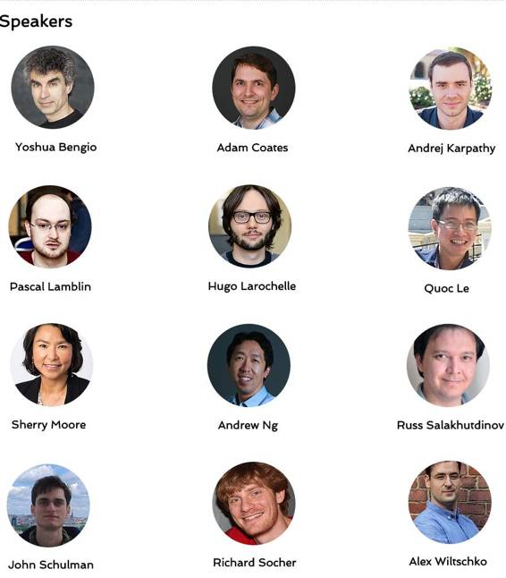

# 聚焦 | 这个周末，享受 Yoshua Bengio、吴恩达、Andrej Karpathy 等人的深度学习直播讲座

选自 Standford

**机器之心编译**

**参与：吴攀、李亚洲**

> *这个周六、周日（当地时间），斯坦福（Standford CEMEX auditorium）将举办为期两天的讲座，探讨近期深度学习领域内取得的新进展。Yoshua Bengio、吴恩达、Open AI 的 [Andrej Karpathy](http://mp.weixin.qq.com/s?__biz=MzA3MzI4MjgzMw==&mid=2650719010&idx=1&sn=aaa7cc47f27129bbced25e6d090e2c1d&scene=21#wechat_redirect) 等 12 人将进行专题讲演，届时斯坦福将在 YouTube 上对此次讲座进行直播。此次讲座无疑与 Bengio 8 月份组织深度学习暑期班（[重磅 | Yoshua Bengio 深度学习暑期班学习总结，35 个授课视频全部开放（附观看地址）](http://mp.weixin.qq.com/s?__biz=MzA3MzI4MjgzMw==&mid=2650718578&idx=1&sn=ff7d748b149e7952c9fa3b53cefd5afc&scene=21#wechat_redirect)）一样是一个很好的学习机会。在此篇文章中，机器之心对 12 位大牛即将讲演的主题进行了介绍，读者可以针对自己感兴趣的深度学习研究领域在这个周末享受这些讲座。YouTube 直播地址如下。*

*   **周六 YouTube 直播地址：https://www.youtube.com/watch?v=eyovmAtoUx0**

*   **周日 YouTube 直播地址：https://www.youtube.com/watch?v=9dXiAecyJrY**

**周六**

*   **Hugo Larochelle：介绍前馈神经网络（Introduction to Feedforward Neural Networks）**

9:00-10:00

简介：我将讲解前馈神经网络的一些基础概念。开始时，我将简单回顾下前馈网络的基础多层架构，以及自动微分和随机梯度下降（SGD）的反向传播。然后，我将讨论下最近普遍被用于深度神经网络训练的一些思路，比如 SGD 的变体、batch normalization 和 无监督预训练。

*   **Andrej Karpathy：计算机视觉中的深度学习（Deep Learning for Computer Vision）**

10:15-11:45

简介：我将讲解进行图像理解的卷积神经网络（ConvNet）的设计，ImageNet 大规模视觉识别挑战赛上顶级模型的历史，以及该领域最近的一些开发模式。我也将会谈及关于视觉识别任务环境中的卷积神经网络架构，比如物体检测、分割、视频处理。

*   **Richard Socher：自然语言处理中的深度学习（Deep Learning for NLP）**

12:45-2:15

简介：我将讲解深度学习用于自然语言处理时的基础知识：词向量、循环神经网络、受语言学影响的任务和模型。最后，我将讲解一下将这些模型像乐高一样放到一起，产生被称为动态记忆网络的强大深度架构。

*   **Sherry Moore：TensorFlow Tutorial**

2:45-3:45

*   **Ruslan Salakhutdinov：深度无监督学习的基础（Foundations of Deep Unsupervised Learning）**

4:00-5:30

简介：建立能够从高维数据提取有用信息的智能系统一直是很多人工智能任务的核心，包括视觉物体识别、信息检索、语音感知和语言理解。在此教程中，我将讨论许多流行的无监督学习的数学基础，包括稀疏编码、自动编码器、受限玻尔兹曼机（RBM）、深度玻尔兹曼机和变分自编码器。我将进一步证明在视觉物体识别、信息检索和自然语言处理应用中，这些模型能够从高维数据中提取有用的层级表征。最后，如果时间允许，我将简要讨论下能对图像生成自然语言描述的模型，以及使用注意力机制从描述中生成图像的模型。

*   **吴恩达：Visionary Lecture**

6:00-7:00

**周日**

*   **John Schulman：策略梯度和 Q-学习：上升到力量、对抗和统一（Policy Gradients and Q-Learning: Rise to Power, Rivalry, and Reunification）**

9:00-10:30

简介：我将首先概述一下深度强化学习中目前最好的研究成果，其中包括最近的在视频游戏（如 Atari）、棋盘游戏（如 AlphaGo）和模拟机器人上的应用。然后我会给出这些成果背后的两种核心方法的教学介绍：策略梯度 和 Q-学习。最后，我将给出一个新的分析以说明这两种方法有多么类似。本演讲的主题将不仅是问「什么有效？」，而且还有「它在什么情况下有效？」以及「它为什么有效？」；另外还要找到这些问题的可用于调节具体的实现和设计更好的算法的答案。

*   **Patrice Lamblin：Theano 教学（Theano Tutorial）**

10:45-11:45

简介：Theano 是一个 Python 库，允许在 CPU 或 GPU 上高效地定义、优化和评估涉及多维数组的数学表达式。自 Theano 诞生以来，它就一直在深度学习社区最受欢迎的框架之一，而且还有许多用于深度学习的框架也是基于它而构建的，其中包括 Lasagne、Keras、Blocks 等等。这个教程将首先关注 Theano 背后的概念以及如何构建和评估简单的表达，然后我会介绍如何定义和训练更为复杂的模型。

*   **Adam Coates：用于语音的深度学习（Deep Learning for Speech）**

12:45-2:15

简介：传统的语音识别系统具有大量模块，其中每一个都需要单独的艰难的工程开发。现在深度学习已能创造能执行大多数传统引擎的「端到端」的任务的神经网络，这能极大地简化新型语音系统的开发，并开启了实现人类水平的表现的大门。在本教程中，我们将概览一遍类似百度的「Deep Speech」模型的端到端系统的开发步骤。我们将会将这些片段组合起来成为一个最先进的语音系统的「比例模型」——现在已经在驱动生产型的语音引擎的神经网络的小型版本。

*   **Alex Wiltschko：Torch 教学（Torch Tutorial）**

2:45-3:45

简介：Torch 是 Lua 语言环境中一个用于科学计算的开放平台，其关注的重点是机器学习，尤其是深度学习。Torch 为 GPU 计算提供了一流的支持，而且是以一种清晰的、交互式的和必需的风格，这是 Torch 和其它阵列库之间的显著不同点。尽管 Torch 从广泛的行业支持中获益匪浅，但却是社区所有的和社区开发的生态系统。包括 Torch NN、TensorFlow 和 Theano 在内的所有神经网络库都依靠自动微分（AD：automatic differentiation）来管理复杂函数组件的梯度计算。我将介绍一些自动微分的广义背景，这是基于梯度的优化的基础概念，还将展示 Twitter 通过 torch-autograd 对自动微分的灵活实现。

*   **Quoc Le：用于自然语言处理和语音的序列到序列学习（Sequence to Sequence Learning for NLP and Speech）**

4:00-5:30

简介：我将首先提出序列到序列（seq2seq）学习和注意模型（attention model）的基础，以及它们在机器翻译和语音识别上的应用。然后我将讨论带有指针（pointer）和函数（function）的注意。最后我会描述强化学习可以在 seq2seq 和注意模型中发挥怎样的作用。

*   **Yoshua Bengio：深度学习的基础和挑战（Foundations and Challenges of Deep Learning）**

6:00-7:00

简介：为什么深度学习的效果这么好？未来还面临着什么挑战？这个演讲将首次探讨深度学习成功的关键因素。首先，根据 no-free lunch 定理，我们将讨论深度网络获取抽象的分布式表征的表达力。其次，我们将讨论我们的实际优化神经网络的参数的惊人能力——尽管存在非凸性（non-convexity）。然后我们将思考一些未来的难题，包括核心的表征问题——理解变化的基本解释因素，尤其是对于无监督学习，为什么这对于将强化学习带向下一阶段来说是非常重要的，以及仍然存在挑战性的优化问题，比如长期依赖的学习，理解深度网络的优化全局，以及为什么生物大脑的学习方式的秘密仍然值得从深度学习的角度来破解。

******©本文由机器之心编译，***转载请联系本公众号获得授权******。***

✄------------------------------------------------

**加入机器之心（全职记者/实习生）：hr@almosthuman.cn**

**投稿或寻求报道：editor@almosthuman.cn**

**广告&商务合作：bd@almosthuman.cn**

