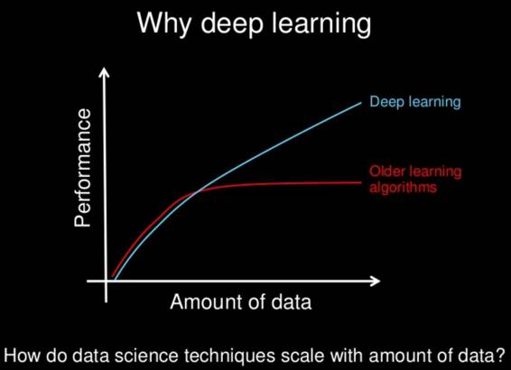
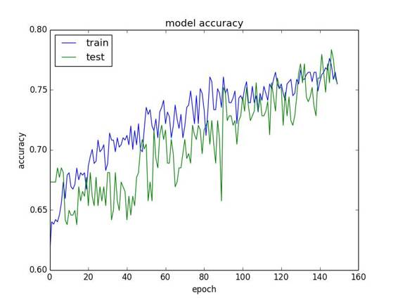

# 深度 | 提升深度学习模型的表现，你需要这 20 个技巧（附论文）

选自 machielearningmastery

**机器之心编译**

**作者：Jason Brownlee **

**参与：杜夏德、陈晨、吴攀、Terrence、李亚洲**

> *本文原文的作者 Jason Brownlee 是一位职业软件开发者，没有博士学位的他通过「从应用中学习」的方法自学了机器学习，他表示对帮助职业开发者应用机器学习来解决复杂问题很有热情，也为机器学习社区贡献了很多实用的建议和指南，本文所讲解的是「能帮助你对抗过拟合以及实现更好的泛化」的 20 个技巧和技术。*

你可以怎样让你的深度学习模型实现更好的表现？

这是一个我常被问到的问题：「我该怎么提升准确度？」或者「如果我的神经网络表现很糟糕我该怎么办？」……

我常常给出的回答是：「我也不完全知道，但我有很多想法。」

然后我开始列出所有我可以想到的可能能够带来效果改进的想法。我将这些想法汇集到了这篇博客中，这些想法不仅能在机器学习上为你提供帮助，而且实际上也适用于任何机器学习算法。

**提升算法的表现的想法**

这份列表并不是完整的，但是却是一个很好的开始。

我的目标是给你大量可以尝试的想法，希望其中会有一两个是你从来没有想到过的。毕竟，你总是需要好的想法来获得进步。

我将这份列表分成了 4 个子主题：

**1\. 通过数据提升性能表现**

**2\. 通过算法提升性能表现**

**3\. 通过算法微调提升性能表现**

**4\. 通过整合提升性能表现**

列表越往后，其所能带来的增益就越小。比如说，关于你的问题的新型框架或更多的数据所带来的效果总是会比微调你表现最好的算法所带来的效果更好。尽管并不总是如此，但一般而言确实是这样。

其中一些想法是特定于人工神经网络的，但还有许多是很通用的，你可以借鉴它们从而在使用其它技术来提升你的性能表现上获得灵感。

下面就让我们正式开始吧！

**1\. 通过数据提升性能表现**

修改你的训练数据和问题定义可以给你带来巨大的好处，也可能能带来最大的好处。

下面是一些我们将会涵盖的内容的一个短列表：

1\. 获取更多数据

2\. 创造更多数据

3\. 重新调整数据的规模

4\. 转换数据

5\. 特征选择

**1）获取更多数据**

你能获取更多训练数据吗？

基本上，你的训练数据的质量就限制了你的模型的质量。你需要为你的问题寻找最好的数据，而且是很多很多数据。

深度学习和其它现代非线性机器学习技术都是数据越多越好，深度学习尤其是这样。这也是深度学习如此激动人心的主要原因之一。

让我们看一下下面的图：

*为什么选择深度学习？来自吴恩达的幻灯片*

更多的数据并不总是有用，但它可以有用。如果要我选择，我肯定会希望获得更多的数据。

相关推荐：

*   算法上的数据集（https://www.edge.org/response-detail/26587）

**2）创造更多数据**

深度学习算法得到的数据越多，通常就表现得越好。如果你无法合理地得到更多数据，你可以创造更多数据。

*   如果你的数据是数字的向量，就在已有的向量上进行随机的修改来创造数据。

*   如果你的数据是图像，就在已有的图像上进行随机的修改。

*   如果你的数据是文本，就在已有的文本上进行随机的修改……

这个过程常被称为数据增强（data augmentation）或数据生成（data generation）。

你可以使用生成模型，也可以使用某些简单的技巧。

比如，对于照片图像数据，你可以通过随机移位和旋转已有的图像来获得新图像。这能够提升模型对于数据中这种变换的归纳能力——如果它们也预计会出现新数据中。这也和增加噪声有关，我们过去叫做添加抖动（adding jitter）。这可被用作是抑制过拟合训练数据集的正则化方法。

相关推荐：

*   使用 Keras 进行深度学习的图像增强（http://machinelearningmastery.com/image-augmentation-deep-learning-keras/）

*   什么是抖动？（使用噪声进行训练）（ftp://ftp.sas.com/pub/neural/FAQ3.html#A_jitter）

**3）重新调整数据的规模**

这是个快速的方法。

将传统的拇指规则应用于神经网络：将你的数据的规模重新调整到你的激活函数的范围内。

如果你使用的是 S 型激活函数，那么就将你的数据调整到值位于 0 到 1 之间。如果你使用的是双曲正切（tanh），就将你的值调整到 -1 到 1 之间。这适用于输入（x）和输出（y）。比如说，如果你在输出层有一个 S 型函数来预测二元值，你可以将你的 y 值规范为二元的。如果你使用的是 softmax，你仍然可以从规范化 y 值中获益。

这仍然是一个好的拇指规则，但我会更进一步。

我建议你按以下形式创造你的训练数据集的不同版本：

*   规范成 0 到 1；

*   重新调整到 -1 到 1；

*   标准化。

然后在每一个数据集上评估你的模型的表现。选择其中一个，然后再双倍下注。如果你修改了你的激活函数，再重复这个小实验。

网络中大数值的积累并不是好事。此外，还有一些让你的网络中的数值变小的方法，例如规范化激活和权重，但我们会在后面谈论这些技术。

相关推荐：

*   我应该标准化输入变量（列向量）吗？（ftp://ftp.sas.com/pub/neural/FAQ2.html#A_std）

*   如何在 Python 环境中利用 Scikit-Learn 包来为机器学习准备数据？（http://machinelearningmastery.com/prepare-data-machine-learning-python-scikit-learn/）

**4）转换你的数据**

这和上述建议的规模重调相关，但是需要更多的工作。

你必须真正了解你的数据，并将其可视化，然后寻找出那些离群的数据。

估计每个列的单变量分布。

*   列是否看起来像是一个倾斜的高斯分布，考虑用 Box-Cox 变换来调整倾斜的情况

*   列是否看起来像是一个指数分布，考虑用对数变换

*   列是否看起来像是拥有一些特征，但正在被一些明显的东西冲击，试着利用平方或者平方根

*   能否用某些方式让特征更具体或者离散来更好地强调这些特征

根据你的直觉，去尝试一些新的东西。

*   能否利用主成分分析一类的投影方法预处理数据？

*   能否将多个属性聚合成为一个单一变量？

*   能否用一个新的布尔标志揭示问题的一些有趣的地方？

*   能否用其他方式探索时间结构或者其他结构？

神经网络可以进行特征学习。它们能做到这点。

但如果你能更好地将问题的结构展示给神经网络用于学习，它们能更好地解决问题。

抽查大量的不同转换形式的数据或者某些特定属性，看看什么可行什么不可行。

相关推荐：

*   如何定义你的机器学习问题（http://machinelearningmastery.com/how-to-define-your-machine-learning-problem/）

*   挖掘特征工程。如何设计特征以及如何合理利用它们（http://machinelearningmastery.com/discover-feature-engineering-how-to-engineer-features-and-how-to-get-good-at-it/）

*   如何用 Python 和 Scikit-learn 结合的方式为机器学习准备数据（http://machinelearningmastery.com/prepare-data-machine-learning-python-scikit-learn/）

**5）特征选取**

神经网络一般都对无关联的数据是稳健的。

它们将使用一个接近于零的权重并边缘化那些非预测属性的贡献。

不过，这是运用在那些无需做出好的预测的数据上的数据、权重和训练周期。能否从你的数据中删除某些属性？有很多特征选择方法和特征重要性的方法可以给你一些关于特征的想法，从而能更好的利用它们。尝试一部分。尝试全部。这样做是为了获得想法。。同样，如果你有时间，我会建议利用相同的网络来评估一些不同选择视角下的问题，看看它们的表现如何。

*   也许你可以用更少的特征做得一样好，甚至有更好表现。是的，更快！

*   也许所有的特征选择方法可以引导出相同特定子集的特征。是的，对无用的功能达成共识！

*   也许选定的子集给你提供了一些想法或者更多的你可以执行的特征工程。是的，更多的想法！

相关推荐：

*   特征选择简介（http://machinelearningmastery.com/an-introduction-to-feature-selection/）

*   Python 环境中机器学习的特征选择（http://machinelearningmastery.com/feature-selection-machine-learning-python/）

**6）重构你的问题**

退一步再看你的问题。

你所收集的观察是唯一能构建你问题的方式吗？

也许还有其他更好的地方。也许其他的问题框架可以更好地展示问题的某些结构从而能更好地进行学习？

我真的很喜欢这项练习，因为这迫使你打开你的内心。这很难，尤其是当你现阶段已经投资了你的自负、时间和金钱。

即使你只是列出了 3 到 5 个备用的框架并让它们打了折扣，至少你正在你选择的方式中建立你的信心。

*   也许你可以在某个允许时间步骤的窗口或方法中整合时间元素

*   也许你的分类问题可以变成一个回归问题，或者相反

*   也许你的二元输出可以变成一个 softmax 输出

*   也许你可以对一个子问题建模

这是一个想清问题的好方法，这也是一个在你想要利用工具之前的可行框架，因为你在解决方案上的投资会更少。

不管怎样，如果你卡住了，这个简单的方式还可以让你思若泉涌。

此外，你不必丢弃任何你之前的工作，看看之后的整合吧。

相关推荐：

*   如何定义你的机器学习问题（http://machinelearningmastery.com/how-to-define-your-machine-learning-problem/）

**2\. 通过算法提升表现表现**

机器学习就是关于算法的。

所有的理论和数字都描述了运用不同的方式从数据中学习一个决策过程（如果我们将自己限制在一个可预测模型中）。你已经选择利用深度学习来处理问题。这是你可以选择的最好方式吗？

在本节中，在继续深入研究你为何选择深度学习方法的某些细节之前，我们讨论一些关于算法选择的小的想法。

*   Spot-Check Algorithms. 抽查算法

*   Steal From Literature. 从文献中获取

*   Resampling Methods. 重采样方法

让我们开始吧。

**1）抽样算法**

振作起来，你在事前可以不知道哪种算法能最好地执行你的问题。如果你知道，你可能不会需要机器学习。你收集的什么证据能证明你所选择的方法是一个好的选择？让我们来解决这个难题。

当表现在所有的问题中处于平均值时，没有一种单独的算法可以比其他任何的都运行地更好。所有的算法都是平等的。这是从没有免费的午餐定理中总结归纳的。也许你的算法并不是解决你的问题的最好的方式。现在，我们不是要解决所有可能的问题，但是在所有算法中最新最热的那个不一定是你处理某个特定训练集最好的方法。我的建议是收集证据。想象可能会有更好的算法并给它们一个处理你问题的公平的机会。抽查一系列顶级的算法，看看哪些表现不错，哪些表现不好。

*   评估某些线性方法，比如逻辑回归和线性判别分析

*   评估一些树的方法，比如分类回归树、随机森林和 Gradient Boosting

*   评估一些实例方法，比如支持向量机和 K 最近邻

*   评估其他的一些神经网络算法，比如 LVQ、MLP、CNN、LSTM、混合结构等等

重点关注表现最佳的，并通过进一步的调整或者数据准备提高表现。对你选择的深度学习方法进行结果排名，它们如何比较？也许你可以放下深度学习模型，并使用一些更快更简化的方式去训练，这甚至可以很容易理解。

相关推荐：

*   一种用于机器学习的数据驱动方法（http://machinelearningmastery.com/a-data-driven-approach-to-machine-learning/）

*   为什么你应该在你的机器学习问题上进行算法抽查（http://machinelearningmastery.com/why-you-should-be-spot-checking-algorithms-on-your-machine-learning-problems/）

*   在 Python 环境中使用 Scikit-learn 抽查分类机器学习算法（http://machinelearningmastery.com/spot-check-classification-machine-learning-algorithms-python-scikit-learn/）

**2）从文献中获取算法**

一种获取好算法的捷径是从文献中获取。还有谁跟你处理过一样的问题，他们用了什么方法？查看论文、书籍、博客、问答网站、教程和一切谷歌丢给你的东西。写下所有的想法，并按照你自己的方式处理它们。这不是研究的复制，这是关于一些你没有想到过的但可能能够提升你的思路的新想法。发表出来的研究是高度优化过的。有很多聪明的人写下了很多有趣的事情。在这些广袤的资源中挖掘你需要的金矿吧。

相关推荐：

*   如何研究一个机器学习算法（http://machinelearningmastery.com/how-to-research-a-machine-learning-algorithm/）

*   谷歌学术搜索（http://scholar.google.com/）

**3）重采样方法**

你必须知道你的模型有多好。你对你的模型的性能估计可靠吗？深度学习算法的训练很慢。这通常意味着我们不能使用黄金标准方法来估计模型的性能，比如 k-fold 交叉验证。

*   也许你正在使用一个简单的训练集／测试集分割，这是很常见的。如果是这样，你需要确保这个分割能够代表这个问题。单变量统计和可视化将会是一个良好的开端。

*   也许你可以利用硬件来提高评估结果。比如，如果你有一个集群或者 Amazon Web Services 的账户，我们可以并行训练 n 个模型然后再取领军和标准差去得到一个更稳健的估计。

*   也许你可以使用一个验证 hold out 集来在它正在训练时获得一个验证模型性能的想法（对过早终止有用，见后文）。

*   也许你能撤回一个你只在模型选择演算后使用的完全无效的验证集。

走另一条路，也许可以使数据集更小，使用更强的重采样方法。

*   也许你可以在一个只在某一样本中训练的模型和在整个样本中训练的模型之间看到很强的相关性。也许你可以进行模型选择并利用小数据集微调，然后将最终的技术扩展到完整的数据集上。

*   也许你可以任意约束数据集，然后取样，并将其用于所有的模型开发

你必须对你模型的性能估计有充足的信心。

相关推荐：

*   评估 Keras 中深度学习模型的性能

*   评估利用重采样方法的 Python 中机器学习算法的性能

**3\. 通过算法调优改进性能**

这才是肥肉所在。

你总能够从抽查中找出一两个不错的算法。得到表现最好的算法可能要花费一定的时间。下面是一些调优神经网络算法从而得到更好的表现的方法：

*   诊断

*   权重初始化

*   学习率

*   激活函数

*   网络拓扑

*   Batches 和 Epochs

*   正则化

*   优化与损失

*   早停

你可能需要对给定网络的配置训练许多次（3-10 次或更多），从而对该配置的表现作出很好的评估。在这个小节中你学到的微调技可应用于所有方面。

*   推荐一篇很好的讲解超参数优化的文章：http://machinelearningmastery.com/grid-search-hyperparameters-deep-learning-models-python-keras/

**1) 诊断**

如果你知道架构的表现为什么没有改进，那你就能更好的改进其表现了。比如，是因为模型过拟合或者欠拟合？要切记这个问题。网络总是会在拟合上出问题，只是程度不同而已。一个快速了解你的模型的学习行为的方式是在每个 epoch 在训练和验证数据集上对模型进行评估，并标绘结果。

*模型在训练和验证数据集上的准确率*

*   如果训练比验证集的结果更好，你可能过拟合了，可以使用正则化技术进行调整

*   如果两个结果都很低，你可能欠拟合了，可以通过增加网络的容量并进行更多、更长的训练进行调整

*   如果有一个训练高于验证结果的拐点，你可以使用早停（Early Stopping）

经常标绘这样的图，并研究使用不同的技术改进模型的表现。这些图可能是你所能创造的最有价值的诊断方法。另外一个有帮助的诊断方法是学习网络正确和错误的观察值。

在一些问题上，下面这些建议可以尝试一下：

*   在难以训练的样本上，你可能需要更多的或增强的样本。

*   在容易建模的训练数据集上，你可能需要移除大量样本。

*   可能你需要使用专门的模型，专注于输入空间不同的明确区域。

相关推荐：

*   在 Keras 中显示深度学习模型训练历史（http://machinelearningmastery.com/display-deep-learning-model-training-history-in-keras/）

*   深度学习算法的过拟合和欠拟合（http://machinelearningmastery.com/overfitting-and-underfitting-with-machine-learning-algorithms/）

**2）权重初始化**

过去的经验法则是：使用小型随机数值进行初始化。

在实践中，这个法则仍然很好，但对你的网络而言它是最好的吗？

不同的激活函数也所启发，但我在实践中不记得看到过有什么不同。

修定好你的网络并尝试不同的初始化方案。记住，权重是你一直想要找到的模型的实际参数。有许多套权重能给出好的表现，但你需要的是更好的表现。

*   尝试所有的初始化方法，看有没一个是最好的。

*   尝试用自编码器（autoencoder）这样的无监督方法进行预学习。

*   为了解决你的问题，尝试使用已有的方法重复训练新的输入和输出层（迁移学习）

记住，改变权重初始化方法会影响到激活函数，甚至是优化函数。

相关推荐：

*   深度网络的初始化：http://deepdish.io/2015/02/24/network-initialization/

**3）学习率**

调整学习率总会有所收获。下面是一些可以探索的方法：

*   用超大或超小的学习率进行试验

*   从文献中找到常用的学习率值，看你能将网络改进到什么地步

*   尝试随着 epoch 降低学习率。

*   尝试经过一定量的 epoch 训练后，就按一定概率降低学习率

*   尝试增加一个动量项，然后同时对学习率和动量进行网格搜索

越大的网络需要越多的训练，反之亦然。如果你增加更多的神经元或更多的层，请增加你的学习率。学习率与训练 epoch 的数量、batch 的大小、优化方法是紧密相关的。

相关推荐：

*   在 Python 中对深度学习模式使用学习率方案：http://machinelearningmastery.com/using-learning-rate-schedules-deep-learning-models-python-keras/

*   反向传播应该使用什么样的学习率？：ftp://ftp.sas.com/pub/neural/FAQ2.html#A_learn_rate 

**4）激活函数**

你或许应该使用 rectifier 激活函数。

它们用起来更好。

在那之前，在输出层上，一开始是 sigmoid 和 tanh 函数，然后是一个 softmax 函数、线性函数或者 sigmoid 函数。我不推荐做更多的尝试，除非你知道你在做什么。

尝试这三个函数并且调整你的数据以满足这些函数的边界。

很明显，你想选择适合输出的形式的传递函数（transfer function），但是要考虑利用不同的表征。

例如，从二元分类（binary classification）的 sigmoid 函数切换到解决回归问题的线性函数，然后后处理（post-process）你的输出。

这或许也需要将损失函数换成某些更加适合的东西。下面是关于数据转换的更多的想法。

相关推荐：

*   为什么要使用激活函数：ftp://ftp.sas.com/pub/neural/FAQ2.html#A_act

**5）网络拓扑**

改变你的网络结构会有回报。

你需要多少层和多少个神经元？

没人只知道，所以别问。

你必须为你的问题开发出好配置。试验。

*   尝试一个隐藏层包含很多个神经元（宽）

*   尝试每层只有少量神经元的深度网络（深）

*   尝试将以上结合起来

*   从最新的论文中找出与你类似的架构并尝试它们

*   尝试拓扑模式（扇出然后扇入）和书与论文中的好的经验规则（见下面链接）

后面的网络需要更多的训练，在 epochs 和学习率上都需要。做相应的调整。

相关推荐：

下面的链接可以给你很多尝试的想法，对我很有用。

*   我应该用多少个隐藏层？：ftp://ftp.sas.com/pub/neural/FAQ3.html#A_hl

*   我应该用多少个隐藏单元？：ftp://ftp.sas.com/pub/neural/FAQ3.html#A_hu

**6）Batches 和 Epochs**

Batch 的大小限定了梯度以及多久更新权重。一个 epoch 是分批（batch-by-batch）暴露给网络的整个训练数据。你试验过不同的 batch 大小和 epochs 量吗？

上面我已经谈过学习率、网络大小和 epochs 之间的关系了。带有大 epoch 的小 batch 和大量的训练 epoch 在现在的深度学习部署中很常见。以下这些方法可能不符合你的问题：

*   尝试将 batch 大小与训练数据的大小对等，这依赖于内存（batch learning）

*   尝试大小为 1 的 batch（在线学习）

*   尝试不同 mini-batch 大小（8、16、32...）的网格搜索

*   尝试分别训练一些 epoch 以及大量的 epoch

考虑下接近无限量的 epoch，并设立抽查点捕捉最好的表现模型。一些网络架构要比其他架构对 batch 的大小更敏感。我认为多层感知机对 batch 大小比较稳健，LSTM 和 CNN 比较敏感，但这只是传闻。

相关推荐：

*   What are batch, incremental, on-line, off-line, deterministic, stochastic, adaptive, instantaneous, pattern, constructive, and sequential learning?：ftp://ftp.sas.com/pub/neural/FAQ2.html#A_styles

*   直观上，mini-batch 的大小如何影响（随机）梯度下降的性能？：https://www.quora.com/Intuitively-how-does-mini-batch-size-affect-the-performance-of-stochastic-gradient-descent

**7）正则化**

正则化是遏制过拟合训练数据的很好的方法。最新的热门正则化技术是 dropout，你试过吗？Dropout 在训练期间随机跳过神经元，并强迫层内其他算法重拾这些神经元。简单而有效，开始 dropout 吧！

网格搜索不同的 dropout 百分比。

在输入层、隐藏层和输出中试验 dropout。

关于 dropout 的想法还有一些扩展，可以像 drop connect（http://cs.nyu.edu/~wanli/dropc/）那样尝试它们。

你也可以考虑其他更传统的神经网络正则化技术，比如：

*   权重衰减以惩罚最大的权重

*   激活约束，以惩罚最大激活

在可被惩罚的不同方面和可以应用的不同类型的惩罚（L1，L2，L1 和 L2 同时使用）上进行试验。

相关推荐：

*   Keras 的深度学习模型中的 dropout 正则化：http://machinelearningmastery.com/dropout-regularization-deep-learning-models-keras/

*   什么是权重衰减：ftp://ftp.sas.com/pub/neural/FAQ3.html#A_decay

**8）优化和损失**

曾经的方法是随机梯度下降，但现在有很多可以优化的方式。你有试过不同的优化程序吗？随机梯度下降是默认的。首先用不同的学习率、动量和学习率计划充分利用它。许多更高级的优化方法会提供更多的参数，更多的复杂性以及更快的收敛性。这是好是坏，取决于你的问题。

为了最大化给定的方法，你真的需要深入到每一个参数，然后根据你的问题网格搜索不同的值。这困难，且耗费时间。但也可能有回报。

我发现新的/流行的方法可以收敛得更快并且能对于一个给定的网络拓扑结构的能力给出一个很快的想法，例如：

*   ADAM（论文请点击「阅读原文」下载）

*   RMSprop

你还可以探索其他的优化算法，比如更传统的（Levenberg-Marquardt）和不太传统的（遗传算法）。其他的方法可以为随机梯度下降法提供很好的起点和优化的方式。要优化的损失函数和你将要解决的问题是密切相关的。不过，你会有一些回旋的余地（用于回归的 MSE 和 MAE 度量，等等），你也可能会通过换算你问题的损失函数得到一个小的凸点。这也可能与输入数据的规模和正在使用的激活函数的规模紧密相关。

相关推荐：

*   梯度下降优化算法概述：http://sebastianruder.com/optimizing-gradient-descent/

*   什么是共轭梯度，Levenberg-Marquardt 等？ftp://ftp.sas.com/pub/neural/FAQ2.html#A_numanal

*   深度学习的优化算法，点击「阅读原文」下载

**9）早停**

一旦性能开始下降，你可以终止学习。这可以节省大量的时间，甚至可能让你使用更复杂的重采样方法来评估模型的性能。早停是一种遏制训练数据过拟合的正则化手段，要求你在每一个 epoch 中监控训练模型的表现并验证数据集。一旦验证数据集的表现开始下降，训练就可以停止。如果这一条件得到满足（测量精度损失），你还可以设置检查点来保存模型，并允许模型继续学习。检查点可以让你在没有停止的情况下早停，给你几个模型在运行结束时进行选择。

相关推荐：

*   如何在 Keras 的深度学习模型中设置检查点：http://machinelearningmastery.com/check-point-deep-learning-models-keras/

*   什么是早停？：ftp://ftp.sas.com/pub/neural/FAQ3.html#A_stop

**4\. 用模型组合（Ensemble）来提升表现**

你可以将多个模型的预测相结合。算法调试后，这是需要改进的下一个大区域。事实上，你可以从多个足够好的模型的预测结合中获取好的表现，而不是多个高度调整（脆弱）的模型。我们会看看你可能要考虑的模型组合的三大领域：

*   Combine Models. 模型结合

*   Combine Views. 视角结合

*   Stacking. 堆

**1）模型结合**

不要选择一个模型，把它们结合起来。如果你有多个不同的深度学习模型，每个模型都在这个问题上的表现良好，那么通过取均值来结合它们的预测。模型越不相同，效果越佳。例如，你可以使用完全不同的网络拓扑结构或者不同的技术。如果每个模型都很灵巧，但方式不同，那么集成预测将更为强劲。或者，你可以用相反的位置进行试验。每次训练网络的时候，你要用不同的权重对这个网络进行初始化，该网络会收敛成一组不同的最终权重。将此过程重复多次，生成许多的网络，然后结合这些网络的预测。

它们的预测将是高度相关的，但它可能会在这些模式上给你一个更难预测的小凸点（bump）。

相关推荐：

*   在 Python 中用 scikit-learn 组合机器学习算法：http://machinelearningmastery.com/ensemble-machine-learning-algorithms-python-scikit-learn/

*   如何提高机器学习算法的结果：http://machinelearningmastery.com/how-to-improve-machine-learning-results/

**2）视角结合**

正如上文所述，但是以你的问题的一个不同视角或框架来训练每个网络。再一遍，目标是得到熟练的的模型，但是用不同的方式（比如不相关的预测）。你可以依靠非常不同的缩放（scaling）和上文中提到的转换技巧。用于训练不同模型的问题的转换和框架越多，就越有可能改善你的结果。运用预测的简单平均将是一个良好的开端。

**3）层叠**

你还可以了解如何最好地结合多种模型的预测。这就是所谓的层叠泛化，简称层叠（是 stacking）。通常情况下，你可以利用像正则回归这样学习如何为不同模型的预测加权的简单线性方法来取得更好均值结果。基准结果使用多个子模型的预测的平均，但是会用学到的模型权重提升表现。

相关推荐：

*   层叠泛化（层叠）：http://machine-learning.martinsewell.com/ensembles/stacking/

**附加资源**

有很多很好的资源，但很少能将所有的想法都联系在一起。我将列出一些资源和相关的发布信息，如果你想深入了解，你会发现这很有趣。

相关推荐：

*   神经网络常见问题解答：ftp://ftp.sas.com/pub/neural/FAQ.html

*   如何在 Python 中使用 Keras 网格搜索深度学习模型的超参数：http://machinelearningmastery.com/grid-search-hyperparameters-deep-learning-models-python-keras/

*   必须知道的深度神经网络提示/技巧：http://lamda.nju.edu.cn/weixs/project/CNNTricks/CNNTricks.html

*   如何增加深度神经网络验证的准确性：http://stackoverflow.com/questions/37020754/how-to-increase-validation-accuracy-with-deep-neural-net

******©本文由机器之心编译，***转载请联系本公众号获得授权******。***

✄------------------------------------------------

**加入机器之心（全职记者/实习生）：hr@almosthuman.cn**

**投稿或寻求报道：editor@almosthuman.cn**

**广告&商务合作：bd@almosthuman.cn**

