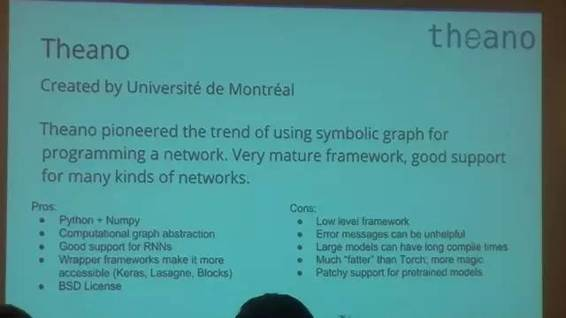
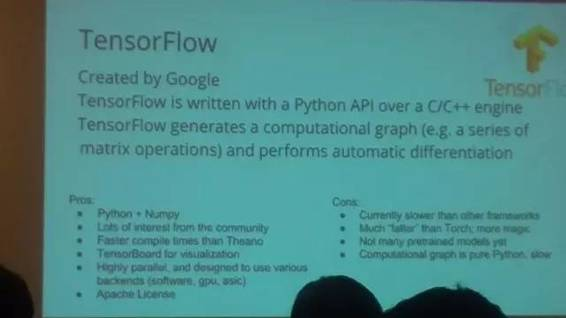
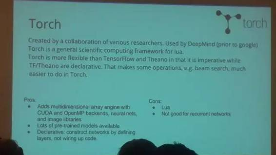
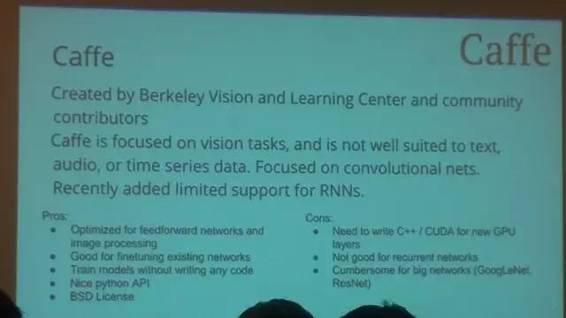

# 业界 | 五大主流深度学习框架比较分析：MXNET 是最好选择

选自 RevolutionAnalytics

**机器之心编译**

**作者：Anusua Trivedi**

**参与：YanChen、黄清纬、李亚洲**

> *近日，微软数据科学家 Anusua Trivedi 发表系列文章讲解深度学习，这是此系列的第一篇，对主流深度学习框架进行了比较分析。*

**背景和途径**

本博客系列基于我即将在新加坡 Hadoop+Strata 世界峰会上发表的关于深度学习模型复用性的演讲。该系列分几个部分来描述我的经验，并深入讨论我选择使用深度学习模型背后的原因。

深度学习是一个新兴的研究领域，它在很多领域中都有其应用空间。我尝试展示迁移学习和微调策略是如何使得同一个卷积神经网络模型在不同的不相关领域获得复用性。该模型在多种不同领域中的应用，使得使用该微调模型拥有更大的价值。

在本博客中，我描述并比较了常用的开源深度学习构架。我深入讨论了每个构架各自的优缺点，以及为什么我选择在我的工作中使用 Theano。

**符号构架**

符号计算构架（如 CNTK，MXNET，TensorFlow，Theano）被定义为一个向量运算符的符号图，例如矩阵的加法/乘法或卷积。一个层仅是这些运算符的组合。构造块（运算符）良好的粒度允许用户在不需要在低级语言（如在 Caffe 中）中实现的情况下，开发新的复杂层类型。

在我的工作中，我使用了不同的符号计算框架。然而，我发现由于每个框架的设计和目前的实现方法不同，它们都有各自的优缺点，没有一个框架能完美地满足所有的需要。针对我的需要，我选择使用 Theano。

我们比较了下列符号计算框架：

**Theano**

 

*   软件：Theano

*   开发者：Université de Montréal

*   软件证书：BSD 证书

*   是否开源：是

*   平台：跨平台

*   编写语言：Python

*   接口：Python

*   是否支持 CUDA：是

*   自动微分：是

*   是否有预训练模型：通过  Lasagne 的 model zoo

*   循环网络：是

*   卷积网络：是

*   随机储存器/动态贝叶斯网络：是

**TensorFlow**

*   软件：TensorFlow

*   开发者：Google Brain Team

*   软件证书：Apache 2.0

*   是否开源：是

*   平台：Linux，Mac OS X

*   编写语言：C++，Python

*   接口：Python，C/C++

*   是否支持 CUDA：是

*   自动微分：是

*   是否有预训练模型：否

*   循环网络：是

*   卷积网络：是

*   随机储存器/动态贝叶斯网络：是

**MXNET**

*   软件：MXNET

*   开发者：分布式（深度）机器学习社区

*   软件证书：Apache 2.0

*   是否开源：是

*   平台：Ubuntu, OS X, Windows, AWS, Android, iOS, JavaScript

*   编写语言：C++, Python, Julia, Matlab, R, Scala

*   接口：C++, Python, Julia, Matlab, JavaScript, R, Scala

*   是否支持 CUDA：是

*   自动微分：是

*   是否有预训练模型：是

*   循环网络：是

*   卷积网络：是

*   随机储存器/动态贝叶斯网络：是

**优缺点**

**非符号构架优点：**

**
** 

*   像 torch，caffe 这样的非符号（命令式）神经网络构架的计算部分的设计非常相似。

*   根据可表达性，设计良好的命令构架也能揭露类图接口（例如 torch/nngraph）。

**非符号架构缺点：**

*   命令构架主要的缺点实际上在于人工优化。例如，就地操作必须要人工实现。

*   大多命令构架设计得不够好，比不上符号构架的可表达性。

**符号构架优点：**

*   符号构架可能可以从依赖图中自动推导优化。

*   一个符号构架可以利用更多内存复用机会，这点 MXNET 做得很好。

*   符号构架能自动计算最佳进度表。详情请参照 TensorFlow 白皮书：http://download.tensorflow.org/paper/whitepaper2015.pdf

**符号构架缺点：**

*   现存可用开源符号构架的表现仍逊色于命令构架。

**符号构架缺点：**

*   现存可用开源符号构架的表现仍逊色于命令构架。

**增加新运算符**

在这些构架中，增加一个表现理想的运算符并不容易。

|  Theano / MXNET |  TensorFlow |
| 在内联 C 支持的 Python 下，可以增加运算符。 | 在 C++ 中推进，在 Python 中符号梯度。 |

**代码复用性**

训练深度网络非常耗时。所以，Caffe 发布了一些预训练模型/权重（model zoo），它们能作为初始权重被用于特殊领域或自定义图像的迁移学习或微调深度网络。

*   TheanoLasagne：是构建在顶尖 Theano 上的高级构架。在 Lasagne 中使用 Caffe 预训练模型权重非常容

*   TensorFlow：不支持预训练模型。

*   MXNET：有一个 caffe 转换工具，能够转换基于 caffe 的预训练模型权重，使其可以适应 MXNET。

**低级 Tensor 操作符**

理想而高效的低级运算符实现能充当新模型的原料，节省了写新运算符的工作量。

| Theano | TensorFlow | MXNET |
| 许多基础运算符 | 相当好 | 非常少 |

**控制流运算符**

控制流运算符增加符号引擎的表达性和通用性。

| Theano | TensorFlow | MXNET |
| 支持 | 试验阶段 | 不支持 |

**高级支持**

*   Theano：纯净的符号计算构架。高级构架，加以改造，可以适用于各种所需的使用方式。成功案例包括 Keras、Lasagne、blocks。

*   TensorFlow：设计良好，不仅考虑到了神经网络的训练，同时避免彻底成为神经网络构架，是非常出色的成果。图像、队列、图像增加器等能成为更高级包装的有用构造块。

*   MXNET：除了符号部分，MXNET 也支持图像分类——从数据加载到构建模型，该模型有可以开始训练的方法。

**性能**

**单 GPU 下的基准测试**

我使用单 GPU （NVIDIA Quadro K1200 GPU）在 MNIST 数据集上对 LeNet 模型进行了基准测试。

| Theano | TensorFlow | MXNET |
| 好 | 不太好 | 极佳 |

**内存**

显存有限可能是大型模型的常见问题。

| Theano | TensorFlow | MXNET |
| 好 | 不太好 | 极佳 |

**单 GPU 速度**

Theano 花了很长的时间编译图像，特别是模型复杂的时候。TensorFlow 有点慢。

| Theano / MXNET | TensorFlow |
| 比得上 CuDNNv4 | 慢一倍 |

**并行/分布式支持**

| Theano | TensorFlow | MXNET |
| 试验多 GPU | 多 GPU | 分布式 |

**总结**

Theano（高级的 Lasagne 和 Keras）是深度学习模型的极佳选择。很容易用 Lasagne/Keras 实现新网络或者编辑现存网络。我更喜欢用 python 语言，并且因为 Lasagne/Keras 有非常成熟的 python 接口而更喜欢使用它们。然而，它们不支持 R。我已经尝试在 Lasagne/Keras 中使用迁移学习和微调，编辑一个现存网络并自定义特定域的自定义数据是非常容易的。

不同构架之间的比较显示了 MXNET 是最好的选择（更好的表现/记忆）。此外，它对 R 的支持很出色。事实上，它是唯一支持所有 R 函数的构架。在 MXNET 中，迁移学习和微调网络是可能实现的，但是不太容易（和 Lasagne/Keras 相比）。这使得编辑现存训练好的网络更困难，因此使用特定域的自定义数据也有点难。

***©本文由机器之心编译，***转载请联系本公众号获得授权***。***

✄------------------------------------------------

**加入机器之心（全职记者/实习生）：hr@almosthuman.cn**

**投稿或寻求报道：editor@almosthuman.cn**

**广告&商务合作：bd@almosthuman.cn**