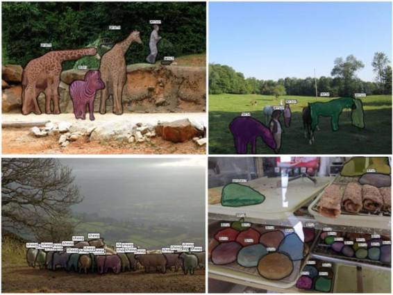
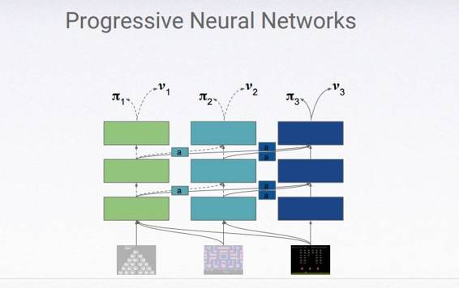

# 业界 | 2016 伦敦深度学习峰会观感：人工智能面临的三大难题

选自 The Verge

**作者：James Vincent**

**机器之心编译**

**参与：李泽南、吴攀**

在 9 月份伦敦举行的深度学习会议上，保持谦卑这个主题在演讲者的发言中不约而同地出现。

尽管像谷歌这样的公司还在自信地表示我们已生活在「人工智能时代」，语音和图形识别领域的突破不断出现，这些前沿的 AI 研究看来大有希望，但仍前路漫漫。那些像电影中一样的数字语音助手并不代表我们已经创造了真正的人工智能。研究人员仍面临着各种问题：缺乏足够的数据来训练深度学习系统；无法制造同时处理多项任务的人工智能；不知道如何让这些系统运转起来。在 2016 年，机器学习领域已经出现了高效的工具，但这些工具内部机制难以解释，训练成本高昂，甚至对于它们的创造者而言也是一个谜。以下列出了机器学习领域目前面临的最大挑战：

**先收集数据，然后获得人工智能**

我们都知道，人工智能需要获取数据进行训练以感知世界，但往往忽略到底需要多少数据。「仅仅获取人类用于理解和识别所需的信息量是不够的，这些系统需要数百乃至数千倍这样的信息以供训练，」Sheffield 大学的教授，亚马逊人工智能团队成员 Neil Lawrence 说道，「纵观应用级深度学习的成功案例，你会发现他们都获得了海量数据。」在语音和图像识别领域，这种现象尤为明显。像谷歌和 Facebook 这样的大型公司可以随心所欲地截取大量数据「例如你在安卓手机上用于语音搜索的音频」，这种优势让他们可以创造更有效的新工具。

Lawrence 认为：「数据就像工业革命时代的煤一样举足轻重。」他以 Thomas Newcomen 作为比喻，这位发明家在 1712 年发明了蒸汽机的原型—用煤作燃料，比众所周知的詹姆斯瓦特早 60 年。Newcomen 的发明并不完美，相比瓦特的机器，前者低效而昂贵。人工智能或许也处在这样一个时代，人们还只能努力从矿藏中不断挖掘矿石作为燃料，抵消机器本身的缺陷。

 

*Facebook 的开源图像识别工具*

全世界有很多 Newcomen 一样的发明者正为他们的机器学习模型而努力，他们也许富有创造力，但没有大数据的帮助，他们的梦想或许难以实现。像谷歌，Facebook 和微软这样的大公司是今天的数据煤矿。他们的海量数据可以让他们应对仍然低效的机器学习系统，同时改进它们。规模较小的创新企业或许拥有好的想法，但没有数据的帮助，一切都难以成真。

「在令用户反感的情况下强制获取数据是不道德的行为。」

谈到如何获取数据，这个行业面临着更加尖锐的矛盾。在医疗领域，假如需要训练一个使用 X 光照片识别肿瘤的人工智能，数据肯定难以获取。正如 Lawrence 所说的，棘手的问题是「在令用户反感的情况下强制获取数据是不道德的行为。」（这也是阻碍谷歌和英国国民医疗服务机构之间合作的最大原因）。Lawrence 认为，最终的解决之道，在于提高深度学习系统的效率，让机器使用更少的数据满足训练要求。就像三个世纪前瓦特所做的一样，这可能需要另外一个 60 年。

**只有昆虫需要特化--人工智能必须能够同时应付多任务处理**

深度学习面临的另一个重要问题：事实上，目前的系统几乎都是一根筋。「当它们被训练后，这些而机器可以高效地执行类似识别图片中的猫、玩雅达利视频游戏这样的任务，」谷歌深度学习科学家 Raia Hadsell 说道，「然而能够同时分辨图像，玩『太空入侵』同时听音乐的神经网络，甚至理论方向都还未问世。」

这个问题比你想象的还要严重，当谷歌 DeepMind 在去年 2 月宣布他们的系统可以玩 49 款雅达利游戏的时候，这的确是一个了不起的成就。但每当他们的系统通关一个游戏后，研究人员都需要重新训练神经网络，好让它能够应付另一个。正如 Hadsell 指出的，还没有人工智能可以同时学会多款不同游戏的玩法，对于机器而言，不同游戏的玩法会互相干扰。你可以让神经网络依次学习，但你会发现它会忘记在这之前的那款游戏的玩法。「想让人工智能真正获得智慧，我们需要让它能够学习多种任务的处理。」Hadsell 说道，「然而我们甚至无法让机器学会不同游戏。」

要解决这个问题，我们可能会需要一种先进神经网络，它可以整合一些不同的深度学习系统，作为接收者，为它们传递信息。在六月公开发表的一篇论文中，Hadsell 和他的团队展示了他们的先进神经网络如何适应并学习玩「Pong」，一种细节复杂的游戏「在其中一关，屏幕颜色会反转；在另一关，摇杆的反应力度会改变」，他们的先进神经网络比其他同类能够更快地学会这款游戏并顺利通关。

 

这是一种很有前途的方法，而且在最近的一些实验中它甚至被应用到了机器臂上——将它们的学习过程从好几周加速到了仅仅一天。但是，仍还存在一些显著的限制，正如 Hadsell 指出的那样：渐进的神经网络不能简单地不断向它们的记忆中加入新任务。如果你不断将系统集中到一起，或早或晚你都将会得到一个「太大以致于难以处理」的模型，她说。而那就是将不同的任务按本质上相似的方式进行管理的时候——创造出一个人类水平的智能，它能够写诗、解微分方程和设计一款完成不同的椅子。

**只有你能展示你的工作方式的时候才是真正的智能**

另一个重大的挑战是理解人工智能是如何得出它们的结论的。神经网络通常对观察者来说是难以理解的。尽管我们知道它们是如何创建的和输入它们的信息，但它们得出特定决策的原因却通常是无法解释的。

弗吉尼亚理工学院给出了这个问题的一个很好的展示。研究者创造了针对神经网络的「眼部追踪系统」，它可以在一开始就记录计算机正在检测哪些像素。这些研究者向他们的神经网络展示了一张卧室的照片，然后问该人工智能：「什么遮住了窗户？」他们发现这个人工智能根本不会去看窗户，而是在看地板。然后，如果它发现了一张床，它就会给出答案：「是窗帘遮住了窗户。」这正好是正确的，但这只是因为该网络接受训练的数据很有限而已。根据它曾经看过的照片，这个神经网络总结得出：如果是在卧室，那么窗户上就会有窗帘。所以当它看到一张床时，它就停止检查了——在它眼里，它已经看到了窗帘。这在逻辑上说得过去，但也很可笑。还有很多卧室没有窗帘！

眼部追踪是了解网络内部部分工作方式的一种方法，而另一种方法则是从项目一开始就在深度学习系统构建更多的一致性（coherence）。实现此目标的一种方法是重新使用一种老旧的已经不再流行的机器学习方法——符号人工智能（symbolic AI），或者叫做良好的老式人工智能（GOFAI：Good Old-Fashioned Artificial Intelligence），帝国理工大学的认知机器人学教授 Murray Shanahan（他也是电影《机械姬》的科学顾问）如是说。这种方法基于一个假设：心智活动可以简化成基本的逻辑，其中世界是由复杂的符号词典定义的。通过结合这些符号——其代表了行为、事件、物体等等——你就能合成思维。（如果按这种方式创造人工智能听起来是一件很怪异的、不可能完成的任务，那想象一下在运行于磁带上的计算机上实现它。）

Shanahan 的提议是我们将 GOFAI 的符号描述和深度学习结合起来。这将为系统提供一个理解世界的起点，而不只是向其馈送数据然后等着它们发现其中的模式。他说，这可能不仅能解决人工智能的透明性问题，而且还能解决 Hadsell 提出的迁移学习问题。「可以说 Breakout 和 Pong 是非常相似的，因为它们都有拍子和球，但人类水平的认知是在更加惊人的尺度上得出这种类型的联系的，」Shanahan 说，「就好像原子结构和太阳系结构之间的联系一样。」

Shanahan 及其帝国理工大学的团队正在研究这种新方法（他们将其称为深度符号强化学习（deep symbolic reinforcement learning）），并且已经发表了一些小实验。这种方法仍处于起步阶段，它能否扩展到更大的系统和不同类型的数据上还有待观察。但是，它很可能会得到更大的发展。毕竟，深度学习本身也曾是人工智能中一个无人问津的领域，直到近年来有了廉价的数据和充裕的处理能力之后深度学习才迎来爆发。也许是时候从人工智能的过去再次引爆一种方法了，以便将人工智能的能力应用到新的环境中。

******©本文由机器之心经授权编译，机器之心系今日头条签约作者，本文首发于头条号，***转载请联系本公众号获得授权******。***

✄------------------------------------------------

**加入机器之心（全职记者/实习生）：hr@almosthuman.cn**

**投稿或寻求报道：editor@almosthuman.cn**

**广告&商务合作：bd@almosthuman.cn**