# 二零一六机器学习与自然语言处理学术全景图：卡耐基梅隆大学排名第一

选自 marekrei

**作者：Marek Rei**

**机器之心编译**

随着 2016 年结束，剑桥大学高级研究员 Marek Rei 对人工智能行业的 11 个主要会议和期刊进行了分析，它们包括 ACL、EACL、NAACL、EMNLP、COLING、CL、TACL、CoNLL、Sem / StarSem、NIPS 和 ICML。本次分析对目前在机器学习与自然语言处理领域的各类组织与院校的科研情况进行了对比。分析显示，在论文数量上，卡耐基梅隆大学（CMU）高居第一位。

以下各图所用到的信息均来自网络，每份文件的机构组织信息都是由论文的 pdf 文件中获取的，并不保证完全准确。

在你看完这份分析，得出自己的结论之前，请注意一个前提：论文的质量远比数量重要，而论文质量并不在本次分析的范围内。我们的分析来源于这样一个动机：我们希望展示深度学习和机器学习领域在过去的一年里发生了什么，大公司和院校正在做什么，希望它能够为你提供一些帮助。

首先是 2016 年最活跃的 25 个机构：

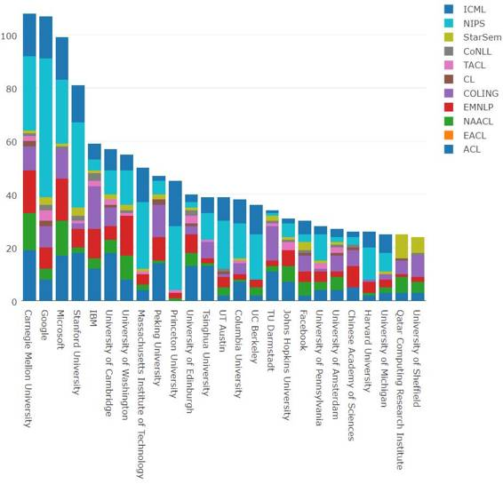 

卡耐基梅隆大学仅以一篇论文优势击败谷歌。2016 年，微软和斯坦福也发表 80 多篇论文。IBM、剑桥、华盛顿大学和 MIT 都抵达了 50 篇的界线。谷歌、斯坦福、MIT 以及普林斯顿大学明显关注的是机器学习领域，论文发表几乎都集中在了 NIPS 和 ICML 上。实际上，谷歌论文几乎占了 NIPS 所有论文的 10%。不过，IBM、北大、爱丁堡大学以及达姆施塔特工业大学（TU Darmstadt）显然关注的是自然语言处理应用。

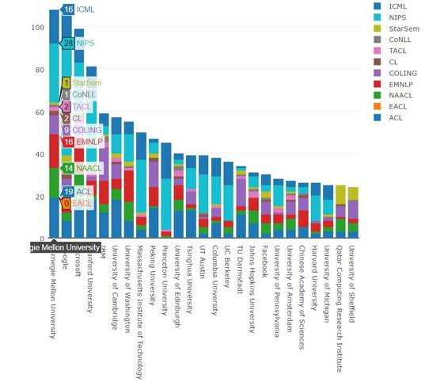 

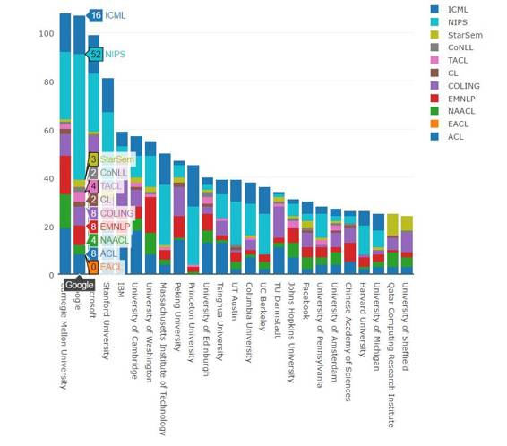

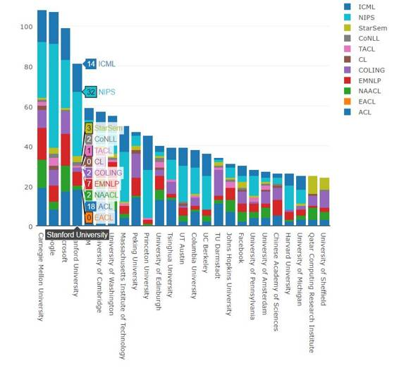

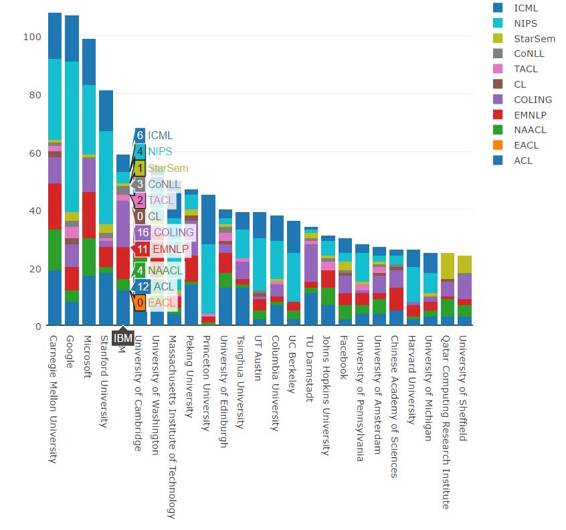

接下来，看看作者个人情况。

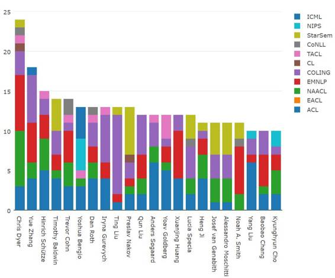 

Chris Dyer 继续他惊人的论文发表势头，2016 年共发表了 24 篇论文！我很好奇为什么 Chris 不发 NIPS 或 ICML，但他确实在每一个 NLP 会议都有一篇论文（除了 2016 没有开的 EACL）。紧跟之后的是 Yue Zhang (18)、Hinrich Schütze (15)、Timothy Baldwin (14) 和 Trevor Cohn (14)。来自哈尔滨工业大学的 Ting Liu 在 COLING 上就发了 10 篇论文。Anders Søgaard 和 Yang Liu 在 ACL 上都有 6 篇论文。

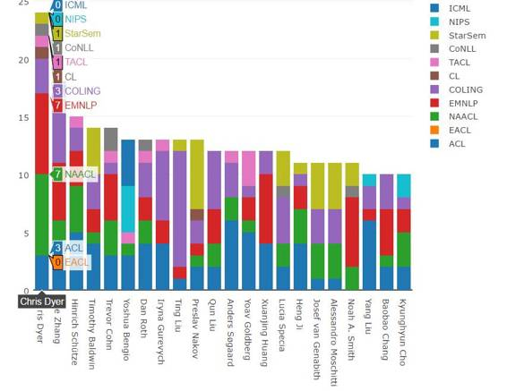

下面是 2016 年最高产的第一作者：

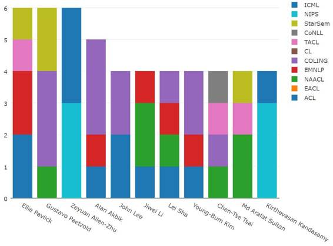

三位研究者发表了六篇第一作者论文，他们是 Ellie Pavlick（宾夕法尼亚大学）、Gustavo Paetzold（谢菲尔德大学）和 Zeyuan Allen-Zhu（普林斯顿大学高级研究所）。Alan Akbik（IBM）发表了 5 篇第一作者论文，还有七位研究者发表了四篇第一作者论文。

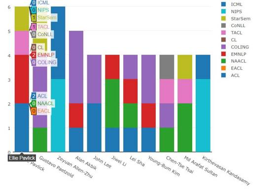  

另外有 42 人发表了三篇第一作者论文，231 人发布了两篇第一作者论文。

接下来看看在时间序列上的排布，首先，在不同会议上发表的论文总数：

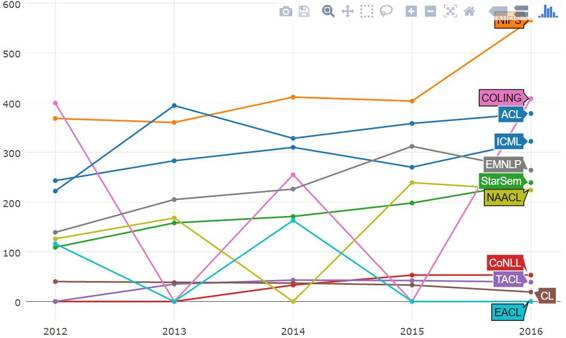 

NIPS 一直以来每年都有一场规模很大的会议，今年看起来更是不得了。另外，COLING 今年的表现超过了预期，甚至超过了 ACL。这是自 2012 年 NAACL 和 COLING 合并以来的第一次。

下面是每个组织机构的历年来的论文数量：

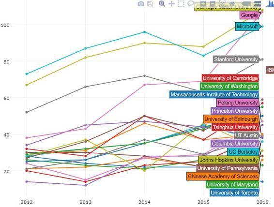 

在 2015 年超过微软之后，CMU 继续领跑。但是谷歌也大步跨越，几乎快追上来了。斯坦福的表现也很抢眼，后面跟着 IBM 和剑桥大学。

最后，让我们来看看个人作者：

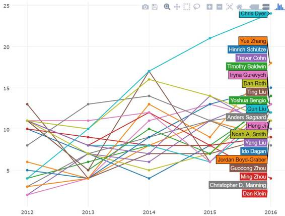

在图上可以看到，Chris Dyer 有一条非常明显的上升曲线。其他过去五年来一直保持增长的作者：Preslav Nakov、Alessandro Moschitti、Yoshua Bengio 和 Anders Søgaard。

最后，我也决定做一张关于主题建模（topic modeling）的论文的图。首先，我提取了所有论文的纯文本，将其表征化和小写化，并移除了 stopword。接着，我使用 LDA 对其进行了处理以发现 10 个隐主题（latent topic）。然后我使用 t-SNE 可视化了最靠前的作者，并基于它们的隐主题相似度将其做成了一张二维图。最后，我手动为每一个聚类标注了一个词（根据 LDA 找到的排名最高的术语）。下面是前 50 位作者的可视化图：

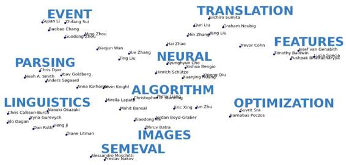 

我也为组织机构做了一张同样的图，但不打算用简单的单词做标记，因为重点大学会在不同的子领域发表研究。你可以自行分析这些内容：

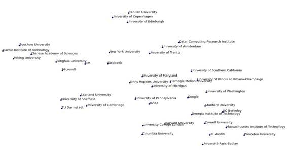

*原网址：**http://www.marekrei.com/blog/nlp-and-ml-publications-looking-back-at-2016/*

***©本文由机器之心编译，***转载请联系本公众号获得授权***。***

✄------------------------------------------------

**加入机器之心（全职记者/实习生）：hr@almosthuman.cn**

**投稿或寻求报道：editor@almosthuman.cn**

**广告&商务合作：bd@almosthuman.cn**