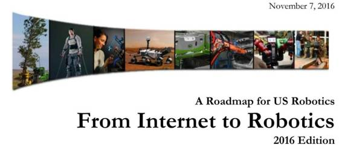

# 业界 | 2016 年美国机器人路线图出炉，最新机器人产业盘点

选自 Recode

**机器之心编译**

**参与：李泽南**

近日，美国的 150 多位学界和产业界的专家共同完成了一份《美国机器人路线图》报告，用来帮助国会搞清楚如何分配基金、鼓励创新、保证人类安全，最重要的是如何保证美国的全球领导地位。

美国机器人路线图首份报告发布于 2009 年，当时启发了奥巴马政府在 2011 年启动《国家机器人计划》。今年的版本更为详尽，包含了更详细的技术建议，全部内容大约有 100 多页。机器之心对此报告的执行摘要进行了编译，对机器人发展感兴趣的读者可点击阅读原文下载完整版报告。

**执行摘要**

**** 

导语

机器人行业已经经历了 50 年历程，我们使用机器人去完成那些肮脏、无趣或危险的工作已经有半个世纪之久。在这段时间里，工业形势获得了很大改变，机器人从辅助机械发展到自动驾驶汽车，环境监测和太空探测器。信息技术的力量已经渗透进了所有行业。机器人的应用是一个新的产业革命，如今我们不仅拥有平板电脑，手机，计算机，而且拥有各种机器系统，它们可以帮助我们完成家务，工作，进行休闲活动。

说到过去的机器人，我们总会想到巨大的机械辅助系统。随着计算机硬件的不断发展，现代的用户界面和传感器已经允许新的机器人去做以前无法想象的事了。技术的融合催生了产业革命，机器人技术开始进入人们的日常生活。

九年以前，亚特兰大的机器人科学和系统会议（RSS）启动了制定综合路线图的过程。在计算社区联盟（CCC）的帮助下，来自工业界和学界的 120 人团队开始制定路线图。这份路线图于 2009 年 5 月提交给国会和政府机构。催生了国家机器人计划（NRI）的创建，它是 NSF，NASA，USDA 和 NIH 共同努力的结果。NRI 于 2011 年启动，最近的刚刚度过成立的第五年。在 2013 年，NSF 和 CCC 的制定了路线图的修订版。

在过去几年中，我们在制造业，医疗应用、无人驾驶汽车和无人机上的机器人技术，以及监视系统，通信系统，显示器和基础计算等核心技术方面取得了巨大的进步。所有这些促成了本次路线图的更新。在 NSF 的支持下，8 月 22 和 23 日在俄勒冈州波特兰举行了两次研讨会，9 月 21 至 22 日，另一次研讨会在亚特兰大举行。来自学术界和研究机构的 50 位专家们审查了 2013 年路线图，并评估了近期发展情况，为路线图的更新进行了探讨。

本文件概述了目前社会在发展中的机遇，亟待解决的问题，同时介绍了美国政府为保持机器人产业领先地位所做的努力。美国将继续支持创新研究，并会把最新技术规范在法律框架下，以确保这些技术被合理地应用。

**主要发现**

在过去五六年中，美国制造业出现了 60 万个新增岗位。而在同一时期，我们发现工业机器人在工业中应用的比例也有了很大的提高。过去三年中的每个季度，机器人的销售量都在创造新的记录，美国从未有过如此数量的机器人。

最主要的新增长点在于与人协作的协作机器人。协作系统的新标准（ISO 10218 and ISO/TS 15066）提供了一个框架，为如何设计这些用于不同任务的系统提供了帮助。

随着技术的发展，传感器和处理器变得更加高效，机器人工业出现了产业革命，产品变得更加灵活，易于操作。但是，机器人的设计应用和部署仍然相对简单。目前业界仍然缺乏使用现代设计，部署更多传感器，更加灵活的机器人系统，以供未经训练的人使用。人机交互系统仍需要进一步发展。机器人操作系统中的主要限制在于缺乏灵活的抓握机构，这导致目前的机器人还不能在日常生活中广泛应用。我们需要对材料，集成传感器和计划/控制方法进行新的研究，以使机器人能够达到接近人类幼儿的灵活性。

机器人的应用并不仅限于制造业，物流行业也在新技术的发展中受益。电子商务每年的增长率超过 40%，Amazon Express，Uber Food 等新服务层出不穷，这些商务模式都是新技术出现的产物。最近我们看到 UPS 正在试验用无人车辆进行最后一英里包裹配送。为了实现每天上百万件物品的配送，人们需要稳健灵活的机械臂，同时也需要自动平台能够在仓库中以每小时 30 英里的速度穿行。这些应用要求研究者对多机器人协调系统投入研发力量，构建先进的的计算机视觉识别和建模系统。其他的专业服务，如办公室和商店的清理系统正在缓慢地发展，商店货架的摆放对于机器人来说是一项十分复杂的任务。基础导航系统已经出现，但这方面的主要挑战是构建长期无需人类监视的自动系统。大多数此类专业系统仍然没有良好的用户界面，不能被非专业人士掌握。

在家用市场中，销售最多的产品是吸尘和地板清洁机器人。最近我们看到了家庭伴侣机器人的出现。这其中包含递送物品的机器人，和辅助教育儿童的机器人。伴侣机器人的风潮即将出现，几乎所有此类系统都只能完成有限的一些任务。如果我们想要让儿童接受真正的教育，让老人在家中能够独立生活，伴侣机器人仍需要在情景意识，稳定性和服务种类方面有更大突破。

新一代的自动驾驶系统已经应用于汽车，飞机，水下和空间探测器中。人类驾驶员每 1 亿英里出现一次致命事故，而自动驾驶汽车距离这样的安全记录还相去甚远。对于航空系统而言，民用空域的重新规划是重要问题，但无人机确实为运输，环境监测等工作创造了新方式。在太空探索领域，主要的挑战是从遥远的行星上获取样品，并把它们带回地球。这些任务要求机器系统能被人类操作者灵活掌控。

工业 4.0 和工业互联网中出现的新标准将帮助我们获得便宜普及的通信机制，应用更多分布式计算和智能系统的新架构。物联网将会塑造更加智能化的体验环境，新的机器人系统会在用户体验方面有很大提高。设计这种复杂的系统，保证它稳定，可扩展和高交互性非常重要，我们已经看到新的方法和系统设计进入应用范围，机器人的宏观概念和基本行为都会得到改观。

我们看到了将新系统引入日常生活和工作中的趋势，与此同时，员工培训也在变得越来越重要。新的劳动力培训需要在所有层面上展开，从初高中教育到技校，最后到各类学院。这些训练不能仅仅停留在学校里，也不能仅仅覆盖年轻人，它需要深入社会的每一个角落。它是新技术造福人类的前提。

最后我们还要考虑将新技术纳入美国现有的法律框架中，以保证这些技术不会存在风险，让机器人在日常生活中能够真正成为我们的伙伴。

**路线图文档**

该路线图包含的章节针对机器人技术的不同使用案例，包括制造业转型、下一代消费者和专业服务、医疗保健、公共安全、地质探索等等。这些领域的每一个都在独立的章节中进行了详细的分析。随后的一章节对整个领域做了一个整体研究路线图。有些章节关注劳动力开发，法律道德问题的探讨，使用这些技术的经济环境。最后一章节讨论了用主要共享基础设施来帮助机器人研究。

******©本文为机器之心编译文章，***转载请联系本公众号或作者获得授权******。***

✄------------------------------------------------

**加入机器之心（全职记者/实习生）：hr@almosthuman.cn**

**投稿或寻求报道：editor@almosthuman.cn**

**广告&商务合作：bd@almosthuman.cn**