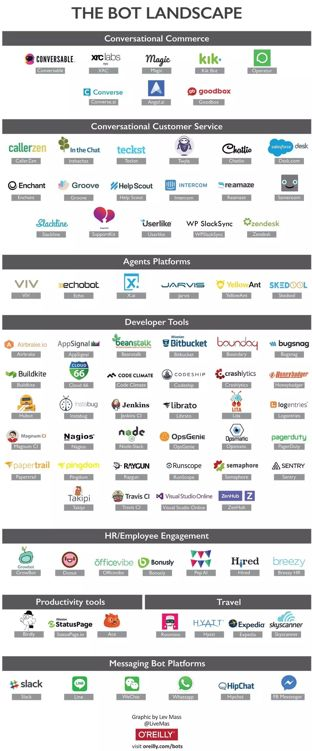

# 业界 | 一张图看懂全球 Bot 布局

选自 O'Reilly

**机器之心编译**

**参与：朱思颖、蒋思源**

Bots 是人类行为代理软件的开发领域中一个正蓬勃发展的分支。通过这样的软件设计来完成在线下单、晚餐预订、客服解答以及工作场景辅助等功能。

在此之前，大部分 Bots 都只是单一规则控制下的功能实现（比如仅有天气显示的功能）。时至今日，随着服务器端性能的大幅提升以及人工智能和机器学习处理能力的不断加强，Bots 开始为消费者提供具有实用价值的服务。在最近 Facebook F8 年度大会发布了相关动态之后，Bots 仅被动提供有限辅助的局面得到大为改观，并且 Bots 开始为主流科技公司所热捧。

今年可以说是 Bots 的元年，很多公司开始将目光投向容易无聊的、重复乏味的以及纯体力消耗的工作。试想一下，你不再需要拨打航空公司的订票电话而只需把你的出行愿望发给航空公司（甚至航空公司提前预测你的出行并主动提供订票服务），就可以完成机票预订工作。这样的服务可以完全交给 Bots，而且越来越多类似的服务在不久都将会交给 Bots。目前几乎所有的投资公司都在 Bots 能够作为的领域施展拳脚。

**Bots 的演变**

Bots 的设计灵感可以追溯到阿兰·图灵在 20 世纪 50 年代对计算机和智能做的早期研究。图灵提出个想法，也就是现在众所周知的的图灵测试，它是完全凭借人与计算机文字交流的。图灵提出如果人类接收者不能分清楚人还是计算机，那么计算机就应该能被标榜为智能。

第一波 bots 就基于被编程为软件的规则，这是用在简单自动化和重复性作业方面的。然而，bots 只是发展到流水线一样支持些任务，如解释常见问答、行程安排和完成命令等。最初的时候，这些任务要求以人回答的各种基于规则的逻辑问题作为输入。但是发展到人工智能和利用深度学习阶段，bots 现在是已经能够完成更复杂的任务并使用大数据集飞速写入它们自己的命令来回答甚至是更复杂的问题。

**面向消费者的 Bots**

现如今，绝大多数 Bots 的聚焦点就是在即时通信应用。用户花在这些应用上的时间最近已经超过了花在社交网络的时间，并且超过 25 亿人在他们的手机上至少有一个即时通信软件。

这种与智能计算机交互的新型媒介已经有了一个专门术语「聊天机器人（chatbot）」。Slack 和 Facebook 等公司正基于如今即时通讯媒介对于交流和生产力更为高效的前提下，创建个完全新型的生态系统。

对于 Bot 的应用市场是十分巨大并且将已经使用聊天的用户池（pool of users）并行为一个与朋友家人联系的渠道。那为什么不在日常生活中使用它完成任务呢？当有个渠道能接触超过十亿人，开发者就得开始注意了。

**Bots 的未来发展趋势**

大部分聊天机器人的商业模式还处于新兴发展的阶段，但是在亚洲微信已经是一个拥有数亿用户的商业体系。微信里有很多第三方应用的接口，你不需要离开就可以在微信里完成交易。虽然目前大部分通信类应用的商业模式尚未成型，仍可以看到一些很有意思的商业模式在发展，比如出售童书和童装。这些商家在通信应用中构建品牌影响力来吸引潜在顾客。在现代商业环境下，我们时刻处于选择的悖论的包围之中（编者注：《选择的悖论》作者 Barry Schwartz 认为过多的选择自由并不一定会带来更高品质的生活。他认为拥有过多的选择自由反而会产生更多的困窘。），Bots 或许可以很好地洞察我们的潜在购买需求甚至参与到我们的购买决策中来。

亚马逊已经在 Bot 上发力并推出了 Echo，提供了一个与真实环境无缝衔接的购买模式。其真实目的，则是更好的帮助顾客在 Amazon 上完成交易。直接通过语音下单，Echo 会自动通过价格筛选产品。虽然有时商品价格会稍微高一点，但拥有如此方便的购物体验，大部分顾客还是原意买单的。参与语音购买的顾客越多，Echo 的语音购买服务品质也会越好。

试想一下，通过聊天机器人的代理操作可以节省你最宝贵的资源：时间。

时间就是金钱，人们将原意为省去生活中无聊工作所花的时间买单。由此看来，面向顾客的新型服务方式的前景还很广阔，而且为顾客节约时间只是 Bots 可以发挥作用的方面之一。

未来的 Bots 将不仅仅是一个独立 Bots 或在平台上建立 Bots。问题是：什么是 Bots 的转折点？当苹果推出 App Store 时，它将应用程序推入了主流，我们现在就无法想象智能手机如果没有应用程序会怎么样。主宰 Bots 的分配机制是怎么样现在还仍需拭目以待，这是一个实实在在价值数十亿美元的问题。

打造我们的 Bots 未来的第一步是理解今日的发展格局。下面是 O'Reilly 制作的一张可视化图：

 

******©本文为机器之心编译文章，***转载请联系本公众号获得授权******。***

✄------------------------------------------------

**加入机器之心（全职记者/实习生）：hr@almosthuman.cn**

**投稿或寻求报道：editor@almosthuman.cn**

**广告&商务合作：bd@almosthuman.cn**