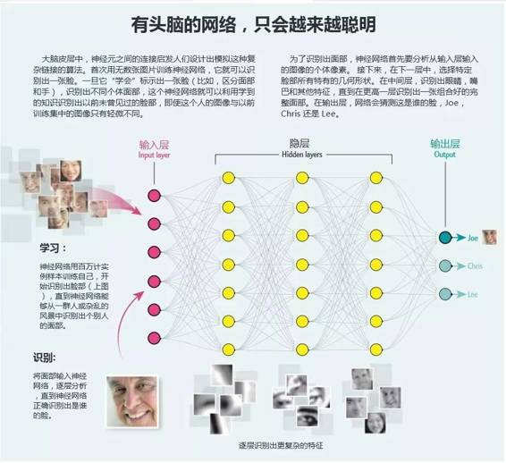

# 深度 | Yoshua Bengio 专栏文章：深度学习崛起带来人工智能的春天

选自 Scientific American

**作者：Yoshua Bengio**

**机器之心编译**

**参与：陈刚、刘宗尧、吴攀、李超平、孙睿、微胖**

> *人工智能曾经让人们失望了几十年，最终，它追赶上了自己的早期承诺，这要感谢强大的深度学习技术。*

20 世纪 50 年代，计算机开始在象棋领域战胜人类，证明数学定理，让人类狂喜不已。60 年代，人们越来越希望，不久以后，科学家就能用硬件和软件复制人类大脑，「人工智能」可以完成任何任务，其表现不逊于人类。1967 年，今年年初逝世的麻省理工学院教授 Marvin Minsky（MIT 人工智能实验室的联合创始人，人工智能先驱）宣称，十年之内，人们可以解决人工智能这个难题。

当然，结果表明，当时就持有那份乐观主义，有些过早。被设计用来协助外科医生更好诊断病人的软件，以及模拟人类大脑、用来识别图片内容的网络，都辜负了人工智能发展初期的那份狂热。早些年，人工智能算法并不成熟，所需数据也比当时可以提供的数据还要多。计算机处理过程也很慢，以至于无法驱动计算机完成接近人类思维复杂性的大规模运算。

到了 21 世纪中期，打造媲美人类智能水平的机器之梦，几乎从科学界消失了。当时，甚至「人工智能（AI）」这一表达，都不再是严肃科学领域的用语。20 世纪 70 年代到 21 世纪中期，这段希望破灭时期，被科学家和作家们形容为一连串的「人工智能之冬」。

十年能发生多大的变化啊。2005 年初，人工智能的前景发生了引人注目的改变。当时，深度学习，这种灵感源自脑科学、打造智能机器的方法，开始取得成功。近些年来，深度学习已经成为推动人工智能研究向前的奇特（singular）力量。现在，一些主要的信息技术公司也正投入数十亿美元，发展深度学习技术。

深度学习，是指模拟神经网络，自己逐渐「学会」识别图像，理解语音甚至做出决策。这一技术依赖的是所谓的人工神经网络——目前人工智能研究的核心部分。人工神经网络，并不是精确模拟真实的神经元运作方式。而是以一般数学原理为基础，这些数学原理能够帮助网络从实例中学习，识别出图片中的物体或人，翻译世界主要语言。

深度学习技术，已经变革了人工智能研究，重拾对计算机视觉、语音识别、自然语言处理以及机器人学的雄心。2012 年，首次展示了第一款用于理解语音的人工智能产品——你可能对 Google Now 比较熟悉。紧接着，又出现了可以识别图片内容的应用，这一功能已经被吸收到谷歌相册的搜索引擎中。

任何一个对繁冗的自动手机菜单感到沮丧的人都能体会，一款更好的智能手机私人助理会让操作变得多么便利。有些人记得几年前，在识别图片中的物体方面，人工智能的表现有多糟糕——当时的软件可能会把无生命的物品识别成动物——在这些人看来，计算机视觉上的进步，难以置信：在一定条件下，现在的计算机可以识别出猫、势头或者脸部以及人。现在，人工智能软件实际上已经成为数百万智能手机用户的生活的一部分。就我个人而言，已经很少手动键入信息，而是直接对手机说出命令，有时候它甚至能给我反馈。

这些进步已经突然为技术的进一步商业化打开了大门，而且兴奋度也有增无减。公司的人才争夺战也十分激烈，深度学习领域的博士极度供不应求。许多该领域的大学教授——据某些统计，是大部分教授——都从学术界跳槽到了产业中，公司为他们配备了齐全的研究设备，还有丰厚的薪资。

解决深度学习的难题，已经带来让人吃惊的成功。神经网络击败顶尖围棋选手李世石的消息，登上了新闻头条。相关应用已经延伸到其他人类专长的领域——而且这还是不是游戏的全部。一项新研发的深度学习算法，旨在根据磁共振成像诊断心脏衰竭，就像心脏病专家那样。

**智能、知识和学习**

人工智能，为什么会在之前的几十年中遇到了很多阻碍？原因是，我们对世界的绝大部分认知，都并不会通过书面语言清清楚楚地、像一系列任务一样描述出来——而这恰恰是编写计算机程序所必需的步骤。这就是为什么我们还无法直接让计算机完成很多人类可以轻而易举完成的事情——不论是理解演讲、图像、语言还是驾驶汽车。而类似的尝试——在详尽数据库中组织事实集，为计算机注入智能（organizing sets of facts in elaborate databases to imbue computers with a facsimile of intelligence）——也都不太成功。

那正好是深度学习的用武之地。它是更广泛的人工智能领域（亦即机器学习）的一部分。它的基础是用来训练智能计算系统的基本原则，目标是让机器实现自学。这些基本原则之一与人类或机器所认为的「好」相关。对动物而言，进化论原则决定了它们应该做出优化生存、繁衍机会的决定。对人类社会来说，一个好的决定可能包括一些能够带来某种幸福表现的社会活动。而对于机器来说，比如无人驾驶汽车，决策的质量取决于自助车辆模仿人类司机行为的程度。

在特定语境中，是否能将作一个好决定所需要的知识翻译成计算机代码，并不一定显而易见。例如，一只老鼠了解它所在的环境，也本能知道往哪里嗅，如何移动它的腿，寻找食物或者配偶，躲避捕食者。没有程序员能详细描述这套行动指令的每一步，进而生成这些行为。但是，这些知识的确被编码进了这些啮齿类动物的大脑中。

在创建出可以训练自己的计算机之前，计算机科学家需要回答人类如何获取知识等基本问题。有些知识是天生的，但大多数是从经验中习得的。我们的知识本来就无法转化为计算机执行的一系列清晰步骤，但是，可以时常从样本和实践中习得。上世纪五十年代依赖，研究人员已经在寻找并试着重新定义一些基本原则，这些基本原则允许动物或人——甚至机器——通过经验获取知识。机器学习旨在建立起学习步骤，也就是所谓的学习算法，它能让一台机器从给定的样本中学习。

机器学习科学，在很大程度上是实验性的，因为不存在通用学习算法——没有能够让计算机学好每项给定任务的算法。任何知识获取的算法，都需要根据针对手头情况的数据和学习任务加以测试，是否能够识别日落，或者将英语翻译成乌尔都语。我们无法证明，在任何给定情况下，这个算法都始终、全面优于任何其他算法。

对于这个原则，人工智能研究人员已经有了正式的数学描述——「没有免费午餐」定理——定理证实，不存在能够解决每一个真实世界学习情境（learning situation）的算法。然而，人类行为显然与这一定理相悖。我们的大脑看起来具有相当的学习能力，能够让我们精通大量祖先无法掌握的技能（因为演化）：下棋、架桥或者做人工智能研究。

这些能力表明，人类智能充分利用了关于世界的一般假设，这种假设可以被用作打造一种通用智能机器的灵感之源。正是出于这一原因，人工神经网络的开发者们已经将大脑作为设计智能系统的粗略模型。

大脑的主要计算单位是神经元细胞。每个神经元通过微小的细胞间隙（(轴突之间的突触间隙）向其他神经元发出信号。一个神经元倾向发出一个可以跨越间隙的信号的特性——以及那个信号的幅度——被称为一个突触强度（synaptic strength）。神经元一边「学习」，它的突触强度也在一边变大，因此，当受到电子脉冲刺激时，更容易向沿路相邻神经元发出信息。

脑科学对使用软件或硬件打造虚拟神经元的人工神经网络的兴起，产生了影响。人工智能子领域中的早期研究人员，以联结主义（connectionism）著称，认为这是理所当然的：通过逐渐改变神经元之间的链接以便神经活动模式可以捕捉到输入内容（比如一张图像或者一段对话），神经网络就能学会完成复杂任务。当这些网络接收到更加复杂的实例时，通过改变连接神经元之间的突触强度，学习过程就能继续下去，并最终更加准确地表征出内容，比如，日落的图像。

**日落的教训**

当前一代神经网络是联结主义开创性工作的延伸。这种神经网络能逐渐改变每一个突触连接的数值，这些数值代表了连接的强度，即一个神经元有多大可能性能将一个信号传递给另一个神经元。深度学习网络所使用的算法，在每次观察到新图像时都会轻微改变这些值。每个这些值都会逐渐接近能让该神经网络更好预测图像内容的值。

为了达到最好效果，当前的学习算法需要人类的密切参与。这些算法中大部分都使用监督式学习，其中每一个样本都有人类制作的关于其学习内容的标签——比如，一张日落的照片会和「日落」的标题相关联。在这个例子中，监督式学习算法的目标是拍摄一张照片作为输入，然后得出图像中关键对象名称的输出。这个输入到输出的数学转换过程被称为函数（function）。得出这一函数的那些数值——比如突触强度——对应着一个解决该学习任务的方案。

通过死记硬背的学习方式得到正确答案会很容易，但却没什么用。我们希望教会该算法理解「日落」是什么，然后，让其可以识别任何日落图像，甚至是那些其从未在训练中遇到过的图像。这种辨别任何日落景象的能力——换句话说，超越特定样本的概括性学习的能力——是所有机器学习算法的主要目标。事实上，任何网络训练质量的评估方式，都是使用其之前从未见过的样本对其进行测试。对新样本进行正确归纳有很大的难度，因为对应于任何分类（如日落）的可能变化的集合都几乎是无限的。

为了从众多被观察样本中进行成功归纳，用在深度学习网络中的学习算法所需的不仅仅是样本本身，还依赖于关于数据的假设以及对于一个特定问题可能的解决方案的假设。一个构建于软件中的典型假设可能会假定：如果特定函数的数据输入是相似的，那么，输出也不应该出现彻底的改变——改变一张猫图像上的几个像素不应该将被识别的动物变成狗。

一种整合了对图像的假设的神经网络被称为卷积神经网络（convolutional neural network），它已经变成了助力人工智能复兴的关键技术。深度学习所采用的卷积神经网络，有许多层按某种方式组织起来的神经元，这样可以降低输出对变化图像中的主要对象的敏感度，比如，当其位置轻微移动时——一个训练良好的网络可能能从不同照片中的不同角度识别一张脸。卷积网络的设计灵感来自多层结构的视觉皮层——我们大脑中接收眼睛输入的部分。卷积神经网络中许多层的虚拟神经元是让网络「（具有）深度」的原因，也因此能让其更好地理解周围的世界。

**走向深度**

在实际应用层面上，十年前出现的一些特定创新让深度学习成为可能，那时，人们对人工智能和神经网络的兴趣已经降到了数十年来的最低点。一个由政府和私人捐助者资助的加拿大组织加拿大高等研究院（CIFAR）通过赞助一个由多伦多大学的 Georey Hinton 领导的项目重新点燃了人们的兴趣。该项目成员还包括纽约大学的 Yann LeCun、斯坦福大学的吴恩达、加州大学伯克利分校的 Bruno Olshausen、我和其他一些人。那时候，人们对这一领域的消极态度使发表论文、甚至说服研究生从事这方面的研究都很困难，但我们几个人强烈地认为向前迈进是很重要的。

那时候，人们对神经网络持怀疑态度的部分原因是人们相信训练它们是毫无希望的，因为，在优化它们的行为方式上存在着许多挑战。优化（optimization）是数学的一个分支，其作用是尝试寻找实现某个数学目标的参数配置。在神经网络中，这些参数被称为突触权重（synaptic weight），代表了一个信号被从一个神经元发送至另一个神经元的强度。

其目的是得出错误量最小的预测。当参数和目标之间的关系足够简单时——当目标是参数的一个的凸函数时，更为精确——参数可以逐步得到调整。然后，持续调整直到得到能产出尽可能好的选择的参数值；这个最好的选择被称为全局极小值（global minimum）——其对应于网络做出的最低可能的平均预测误差。

然而，在一般情况下，训练神经网络并非那么简单——并且需要所谓的非凸优化（nonconvex optimization）。这种类型的优化带来了更大的挑战——而且许多研究者相信这个障碍是不可逾越的。学习算法会受限于所谓的局部极小值（local minimum），在这种情况中，它不能通过稍微调整参数来减少预测误差。

直到去年，神经网络因为局部极小值而难以训练的迷思才被解决。在我们的研究中，我们发现当一个神经网络足够大时，局部极小值问题会大大减少。大部分局部极小值实际上都对应于在某个水平上学到的知识——该水平与全局极小值的最优值基本上是匹配的。

尽管理论上，优化的理论难题可以得到解决，但是，构建超过两层或三层的大型网络通常以失败告终。2005 年年初，CIFAR 支持下的努力取得突破，成功克服了这些障碍。2006 年，我们使用一种层上叠层的技术成功训练了更深度的神经网络。

后来，在 2011 年，我们发现了一种更好的方法以用于训练更深度的网络——有更多虚拟神经元层的方法——通过修改每个这些处理单元所进行的计算，让它们更像是生物神经元实际上所进行的计算。我们也发现，在训练中将随机噪声注入神经元之间传递的信号（类似于大脑中的情况）能让它们更好地学习正确地识别图像或声音。

有两个关键技术帮助实现了深度学习技术的成功。一是最初为视频游戏设计的图形处理单元让计算速度直接提升了 10 倍，这样，我们就可以在一个合理时间内训练更大网络。另一个助力深度学习增长的因素是可以接触到大型有标签数据集，让学习算法可以识别正确的答案——比如，当识别猫只是其中一个元素的图片时，就可以识别正确答案 ——「猫」。

深度学习近来成功的另一个原因在于其学习执行计算序列的能力——这些计算序列一步一步对图像、声音或其它数据进行构建或分析。网络的深度即是这些步骤的数量。人工智能擅长的许多视觉或听觉识别任务都需要很多层的深度网络。事实上，在最近的理论和实验研究中，我们实际上已经证明，在没有足够深度网络的情况下，这些数学运算中的一部分无法得以有效执行。

深度神经网络中的每一层都会转换其输入并生成一个被发送到下一层的输出。该网络的更深度层代表了更为抽象的概念[见上述框图]，这也更远离最初的原始感官输入。实验表明，网络中更深度层中的人工神经元往往对应于更抽象的语义概念：比如一个视觉物体，如一张桌子。对桌子图像的识别可能会从更深层上神经元的处理中涌现，即使「桌子」的概念并不位于网络接受过训练的分类标签中。而且桌子概念本身可能只是创建更抽象概念的一个中间步骤，这个更抽象的概念位于可能被网络分类为「办公室场景」的这类更为深度的层级上。

**超越模式识别**

直至最近，人工神经网络的突出表现大部分在于完成这些任务上，比如识别静态图像的模式。但是，另一类神经网络也正在变得有名——特别是在处理随着时间展开的事件方面。递归神经网络（Recurrent neural networks）已经向人们证实了其有能力正确完成一序列计算（ a sequence of computations），典型地如语音、视频以及其他数据。序列数据（Sequential data）由单元组成——无论是一个音素或一个完整单词——一个单元按顺序跟在另一个单元后。递归神经网络处理输入的方式类似大脑运作方式。当处理感官输入时，在神经元之间传递的信号也会经常发生变化。在发出一系列指令让身体动起来以完成某个特定任务之前，这种内部神经状态的改变方式取决于当前的脑部输入（这些输入来自周围环境）。

递归网络可以预测句子中的下一个单词，还可将其用于一次性生成新的单词序列。他们也可以完成更复杂的任务：在「读」完一句话中所有单词后，网络可以猜测整个句子意思。然后，一个独立的递归网络会使用第一个神经网络的语义分析成果，将这个句子翻译成另一种语言。

上世纪九十年代末和 21 世纪初，递归神经网络研究趋于平静。我的理论工作表明，在学会检索久远信息时，它们遇到了困难——处理这一序列中的最早元素。试想当你读到一本书最后一页时，试着逐字逐句背诵这本书的第一句。但是，一些进展已经减少了一些难题，方法是让这类网络学会储存信息以便让信息持续更长的时间。神经网络可以使用计算机的临时内存来处理多个、分散的信息碎片，比如包含在一个文档中不同句子里的思想。

经历漫长寒冬后，深度神经网络的强势复出并不仅仅是技术上的胜利。它也给科学社会学上了一课。它尤其强调了这样一种必要性：挑战技术现状，鼓励多样化研究组合（a diverse research portfolio ），它会支持那些暂受冷遇的研究领域。

**机器之心 Interface 智能机器系列活动 #1 自然语言处理中的认知计算 ↓↓↓**

**** 

**点击阅读原文报名第一期 自然语言处理**

✄------------------------------------------------

**加入机器之心（全职记者/实习生）：hr@almosthuman.cn**

**投稿或寻求报道：editor@almosthuman.cn**

**广告&商务合作：bd@almosthuman.cn**