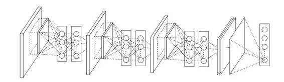

# 重磅 | 神经网络架构演进史：全面回顾从 LeNet5 到 ENet 十余种架构（附论文）

选自 Github

**作者：Eugenio Culurciello**

**机器之心编译**

**参与：孙雨辰、李亚洲、吴攀**

> *深度神经网络与深度学习是非常强大的流行算法。许多运用它们的成功典范依赖于对神经网络架构的精心设计。作者在这篇文章中重新回顾一下最近几年的深度学习背景下神经网络设计的历史。*

**LeNet5**

LeNet5 诞生于 1994 年，是最早的卷积神经网络之一，并且推动了深度学习领域的发展。自从 1988 年开始，在许多次成功的迭代后，这项由 Yann LeCun 完成的开拓性成果被命名为 LeNet5（参见：Gradient-Based Learning Applied to Document Recognition）。

 

LeNet5 的架构基于这样的观点：（尤其是）图像的特征分布在整张图像上，以及带有可学习参数的卷积是一种用少量参数在多个位置上提取相似特征的有效方式。在那时候，没有 GPU 帮助训练，甚至 CPU 的速度也很慢。因此，能够保存参数以及计算过程是一个关键进展。这和将每个像素用作一个大型多层神经网络的单独输入相反。LeNet5 阐述了那些像素不应该被使用在第一层，因为图像具有很强的空间相关性，而使用图像中独立的像素作为不同的输入特征则利用不到这些相关性。

LeNet5 特征能够总结为如下几点：

*   卷积神经网络使用 3 个层作为一个序列：卷积、池化、非线性 → 这可能是自从这篇 paper 起图像深度学习的关键特征！

*   使用卷积提取空间特征

*   使用映射到空间均值下采样（subsample）

*   双曲正切（tanh）或 S 型（sigmoid）形式的非线性

*   多层神经网络（MLP）作为最后的分类器

*   层与层之间的稀疏连接矩阵避免大的计算成本

总体来看，这个网络是最近大量架构的起点，并且也给这个领域的许多带来了灵感。

**间隔**

从 1998 年到 2010 年神经网络处于孵化阶段。大多数人没有意识到它们不断增长的力量，与此同时其他研究者则进展缓慢。由于手机相机以及便宜的数字相机的出现，越来越多的数据可被利用。并且计算能力也在成长，CPU 变得更快，GPU 变成了多种用途的计算工具。这些趋势使得神经网络有所进展，虽然速度很慢。数据和计算能力使得神经网络能完成的任务越来越有趣。之后一切变得清晰起来......

**Dan Ciresan Net**

2010 年的时候，Dan Claudiu Ciresan 和 Jurgen Schmidhuber 发布了最早的 GPU 神经网络的一个实现。这个实现是在一块 NVIDIA GTX 280 图形处理器上运行 9 层的神经网络，包含前向与反向传播。

**AlexNet**

2012 年，Alex Krizhevsky 发表了 Alexet（参见：ImageNet Classification with Deep Convolutional Neural Networks），它是 LeNet 的一种更深更宽的版本，并以显著优势赢得了困难的 ImageNet 竞赛。

 

AlexNet 将 LeNet 的思想扩展到了更大的能学习到远远更复杂的对象与对象层次的神经网络上。这项工作的贡献有：

*   使用修正的线性单元（ReLU）作为非线性

*   在训练的时候使用 Dropout 技术有选择地忽视单个神经元，以避免模型过拟合

*   覆盖进行最大池化，避免平均池化的平均化效果

*   使用 GPU NVIDIA GTX 580 减少训练时间

在那时，GPU 相比 CPU 可以提供更多数量的核，训练时间可以提升 10 倍，这又反过来允许使用更大的数据集和更大的图像。

AlexNet 的成功掀起了一场小革命。卷积神经网络现在是深度学习的骨干，它已经变成了「现在能解决有用任务的大型神经网络」的代名词。

**Overfeat**

2013 年的 12 月，纽约大学的 Yann LeCun 实验室提出了 AlexNet 的衍生——Overfeat（参见：OverFeat: Integrated Recognition, Localization and Detection using Convolutional Networks）。这篇文章也提出了学习边界框（learning bounding box），并导致之后出现了很多研究这同一主题的论文。我相信学习分割对象比学习人工边界框更好。

**VGG**

来自牛津大学的 VGG 网络（参见：Very Deep Convolutional Networks for Large-Scale Image Recognition）是第一个在各个卷积层使用更小的 3×3 过滤器（filter），并把它们组合作为一个卷积序列进行处理的网络。

这看来和 LeNet 的原理相反，其中是大的卷积被用来获取一张图像中相似特征。和 AlexNet 的 9×9 或 11×11 过滤器不同，过滤器开始变得更小，离 LeNet 竭力所要避免的臭名昭著的 1×1 卷积异常接近——至少在该网络的第一层是这样。但是 VGG 巨大的进展是通过依次采用多个 3×3 卷积，能够模仿出更大的感受野（receptive field）的效果，例如 5×5 与 7×7。这些思想也被用在了最近更多的网络架构中，如 Inception 与 ResNet。

 

VGG 网络使用多个 3×3 卷积层去表征复杂特征。注意 VGG-E 的第 3、4、5 块（block）：256×256 和 512×512 个 3×3 过滤器被依次使用多次以提取更多复杂特征以及这些特征的组合。其效果就等于是一个带有 3 个卷积层的大型的 512×512 大分类器。这显然意味着有大量的参数与学习能力。但是这些网络训练很困难，必须划分到较小的网络，并逐层累加。这是因为缺少强大的方式对模型进行正则化，或者或多或少约束大量由于大量参数增长的搜索空间。

VGG 在许多层中都使用大特征尺寸，因为推断（inference）在运行时是相当耗费时间的。正如 Inception 的瓶颈（bottleneck）那样，减少特征的数量将节省一些计算成本。

**网络中的网络（Network-in-network）**

网络中的网络（NiN，参见论文：Network In Network）的思路简单又伟大：使用 1×1 卷积为卷积层的特征提供更组合性的能力。

NiN 架构在各个卷积之后使用空间 MLP 层，以便更好地在其他层之前组合特征。同样，你可以认为 1×1 卷积与 LeNet 最初的原理相悖，但事实上它们可以以一种更好的方式组合卷积特征，而这是不可能通过简单堆叠更多的卷积特征做到的。这和使用原始像素作为下一层输入是有区别的。其中 1×1 卷积常常被用于在卷积之后的特征映射上对特征进行空间组合，所以它们实际上可以使用非常少的参数，并在这些特征的所有像素上共享！

MLP 的能力能通过将卷积特征组合进更复杂的组（group）来极大地增加单个卷积特征的有效性。这个想法之后被用到一些最近的架构中，例如 ResNet、Inception 及其衍生技术。

NiN 也使用了平均池化层作为最后分类器的一部分，这是另一种将会变得常见的实践。这是通过在分类之前对网络对多个输入图像的响应进行平均完成的。

**GoogLeNet 与 Inception**

来自谷歌的 Christian Szegedy 开始追求减少深度神经网络的计算开销，并设计出 GoogLeNet——第一个 Inception 架构（参见：Going Deeper with Convolutions）。

那是在 2014 年秋季，深度学习模型正在变得在图像与视频帧的分类中非常有用。大多数怀疑者已经不再怀疑深度学习与神经网络这一次是真的回来了，而且将一直发展下去。鉴于这些技术的用处，谷歌这样的互联网巨头非常有兴趣在他们的服务器上高效且大规模庞大地部署这些架构。

Christian 考虑了很多关于在深度神经网络达到最高水平的性能（例如在 ImageNet 上）的同时减少其计算开销的方式。或者在能够保证同样的计算开销的前提下对性能有所改进。

他和他的团队提出了 Inception 模块：

 

初看之下这不过基本上是 1×1、3×3、5×5 卷积过滤器的并行组合。但是 Inception 的伟大思路是用 1×1 的卷积块（NiN）在昂贵的并行模块之前减少特征的数量。这一般被称为「瓶颈（bottleneck）」。这部分内容将在下面的「瓶颈层（bottleneck layer）」部分来解释。

GoogLeNet 使用没有 inception 模块的主干作为初始层，之后是与 NiN 相似的一个平均池化层加 softmax 分类器。这个分类器比 AlexNet 与 VGG 的分类器的运算数量少得多。这也促成一项非常有效的网络设计，参见论文：An Analysis of Deep Neural Network Models for Practical Applications。

**瓶颈层（Bottleneck layer）**

受到 NiN 的启发，Inception 的瓶颈层减少了每一层的特征的数量，并由此减少了运算的数量；所以可以保持较低的推理时间。在将数据通入昂贵的卷积模块之前，特征的数量会减少 4 倍。在计算成本上这是很大的节约，也是该架构的成功之处。

让我们具体验证一下。现在你有 256 个特征输入，256 个特征输出，假定 Inception 层只能执行 3×3 的卷积，也就是总共要完成 256×256×3×3 的卷积（将近 589,000 次乘积累加（MAC）运算）。这可能超出了我们的计算预算，比如说，在谷歌服务器上要以 0.5 毫秒运行该层。作为替代，我们决定减少需要进行卷积运算的特征的数量，也就是 64（即 256/4）个。在这种情况下，我们首先进行 256 -> 64 1×1 的卷积，然后在所有 Inception 的分支上进行 64 次卷积，接而再使用一个来自 64 -> 256 的特征的 1×1 卷积，现在运算如下：

*   256×64 × 1×1 = 16,000s

*   64×64 × 3×3 = 36,000s

*   64×256 × 1×1 = 16,000s

相比于之前的 60 万，现在共有 7 万的计算量，几乎少了近 10 倍。

而且，尽管我们做了更好的运算，我们在此层也没有损失其通用性（generality）。事实证明瓶颈层在 ImageNet 这样的数据集上已经表现出了顶尖水平，而且它也被用于接下来介绍的 ResNet 这样的架构中。

它之所以成功是因为输入特征是相关联的，因此可通过将它们与 1×1 卷积适当结合来减少冗余。然后，在小数量的特征进行卷积之后，它们能在下一层被再次扩展成有意义的结合。

**Inception V3（还有 V2）**

Christian 和他的团队都是非常高产的研究人员。2015 年 2 月，Batch-normalized Inception 被引入作为 Inception V2（参见论文：Batch Normalization: Accelerating Deep Network Training by Reducing Internal Covariate Shift）。Batch-normalization 在一层的输出上计算所有特征映射的均值和标准差，并且使用这些值规范化它们的响应。这相当于数据「增白（whitening）」，因此使得所有神经图（neural maps）在同样范围有响应，而且是零均值。在下一层不需要从输入数据中学习 offset 时，这有助于训练，还能重点关注如何最好的结合这些特征。

2015 年 12 月，该团队发布 Inception 模块和类似架构的一个新版本（参见论文：Rethinking the Inception Architecture for Computer Vision）。该论文更好地解释了原始的 GoogLeNet 架构，在设计选择上给出了更多的细节。原始思路如下：

*   通过谨慎建筑网络，平衡深度与宽度，从而最大化进入网络的信息流。在每次池化之前，增加特征映射。

*   当深度增加时，网络层的深度或者特征的数量也系统性的增加。

*   使用每一层深度增加在下一层之前增加特征的结合。

*   只使用 3×3 的卷积，可能的情况下给定的 5×5 和 7×7 过滤器能分成多个 3×3。看下图

   

*   因此新的 Inception 成为了：

 

*   也可以通过将卷积平整进更多复杂的模块中而分拆过滤器：

 

*   在进行 inception 计算的同时，Inception 模块也能通过提供池化降低数据的大小。这基本类似于在运行一个卷积的时候并行一个简单的池化层：

Inception 也使用一个池化层和 softmax 作为最后的分类器。

**ResNet**

2015 年 12 月又出现了新的变革，这和 Inception V3 出现的时间一样。ResNet 有着简单的思路：供给两个连续卷积层的输出，并分流（bypassing）输入进入下一层（参见论文：Deep Residual Learning for Image Recognition）。

这和之前的一些旧思路类似。但 ResNet 中，它们分流两个层并被应用于更大的规模。在 2 层后分流是一个关键直觉，因为分流一个层并未给出更多的改进。通过 2 层可能认为是一个小型分类器，或者一个 Network-In-Network。

这是第一次网络层数超过一百，甚至还能训练出 1000 层的网络。

有大量网络层的 ResNet 开始使用类似于 Inception 瓶颈层的网络层：

这种层通过首先是由带有更小输出（通常是输入的 1/4）的 1×1 卷积较少特征的数量，然后使用一个 3×3 的层，再使用 1×1 的层处理更大量的特征。类似于 Inception 模块，这样做能保证计算量低，同时提供丰富的特征结合。

ResNet 在输入上使用相对简单的初始层：一个带有两个池的 7×7 卷基层。可以把这个与更复杂、更少直觉性的 Inception V3、V4 做下对比。

ResNet 也使用一个池化层加上 softmax 作为最后的分类器。

关于 ResNet 的其他洞见每天都有发生：

*   ResNet 可被认为既是平行模块又是连续模块，把输入输出（inout）视为在许多模块中并行，同时每个模块的输出又是连续连接的。

*   ResNet 也可被视为并行模块或连续模块的多种组合（参见论文：Residual Networks are Exponential Ensembles of Relatively Shallow Networks）。

*   已经发现 ResNet 通常在 20-30 层的网络块上以并行的方式运行。而不是连续流过整个网络长度。

*   当 ResNet 像 RNN 一样把输出反馈给输入时，该网络可被视为更好的生物上可信的皮质模型（参见论文：Bridging the Gaps Between Residual Learning, Recurrent Neural Networks and Visual Cortex）。

**Inception V4**

这是 Christian 与其团队的另一个 Inception 版本，该模块类似于 Inception V3：

 

Inception V4 也结合了 Inception 模块和 ResNet 模块：

 

我认为该架构不太简洁，但也满满都是较少透明度的启发法（heuristics）。很难理解里面的选择，对作者们而言也难以解释。

考虑到网络的简洁性，可被轻易的理解并修正，那 ResNet 可能就更好了。

**SqueezeNet **

SqueezeNet（参见论文：SqueezeNet: AlexNet-level accuracy with 50x fewer parameters and <0.5MB model size）是最近才公布的，该架构是对 ResNet 与 Inception 里面概念的重新处理。一个更好的架构设计网络型号要小，而且参数还不需要复杂的压缩算法。

**ENet**

我们的团队计划结合近期公开的架构的所有特征，做出一个非常高效、低重的网络，使用较少的参数和计算就能达到顶尖结果。该网络架构被称为 ENet，由 Adam Paszke 设计。我们已经使用它进行过单像素标记和场景解析。

详细了解 ENet 可参见论文 ENet: A Deep Neural Network Architecture for Real-Time Semantic Segmentation。ENet 是一个编码加解码的网络。编码器是一个常规的 CNN 设计进行分类。解码器是一个增采样（upsampling）网络，将分类反向传播给原始图像进行分割。这只使用了神经网络，没有其他算法进行图像分割。

ENet 被设计为在开始时尽可能使用最小数量的资源。正是如此它有着如此小的脚本，编码器和解码器网络共占有 0.7 MB，16 fp 精度。即使这么小的型号，ENet 在分割的准确度上也类似于或者高于其他神经网络解决方案。

**模块分析**

对 CNN 模块的分析，该论文（Systematic evaluation of CNN advances on the ImageNet）已经做过了，里面的发现是非常有帮助的：

*   使用没有 batchnorm 的 ELU 非线性或者有 batchnorm 的 ReLU。

*   使用一个学习到的 RGB 的彩色空间转换。

*   使用线性学习率衰退策略。

*   使用平均和最大池化层的和。

*   使用大约 128 到 256 的 mini-batch 大小。如果这对你的 GPU 而言太大，将学习率按比例降到这个大小就行。

*   使用完全连接层作为卷积，并为做最后预测平均所有预测。

*   当研究增加训练集大小的时候，检测有一个 plateau 是否没有达到

*   数据的整洁要比数据大小更重要。

*   如果你不能增加输入图像的大小，在随后的层上减少步幅（stride），这样做有同样的效果。

*   如果你的网络有复杂和高度优化的架构，像是 GoogLeNet，那修改一定要谨慎。

**其他值得关注的架构**

FractalNet（参见论文：FractalNet: Ultra-Deep Neural Networks without Residuals）使用递归架构，它在 ImageNet 上没有进行测试。该架构是 ResNet 的衍生或者更通用的 ResNet。

**未来**

我们相信制作神经网络架构是深度学习领域发展的头等大事。我们团队高度推荐仔细阅读并理解文中提到的论文。

但有人可能会想为什么我们要投入如此多的时间制作架构？为什么不是用数据告诉我们使用什么？如何结合模块？这些问题很好，但仍在研究中，有一篇论文可以参考：Neural networks with differentiable structure。

要注意到，我们在本文中谈到的大部分架构都是关于计算机视觉的。类似神经网络架构在其他领域内也有开发，学习其他所有任务中的架构变革也是非常有趣的。

如果你对神经网络架构和计算性能的比较有兴趣，可参见论文：An Analysis of Deep Neural Network Models for Practical Applications。

***©本文由机器之心编译，***转载请联系本公众号获得授权***。***

✄------------------------------------------------

**加入机器之心（全职记者/实习生）：hr@almosthuman.cn**

**投稿或寻求报道：editor@almosthuman.cn**

**广告&商务合作：bd@almosthuman.cn**

**点击「阅读原文」，下载文中提到的论文↓↓↓**