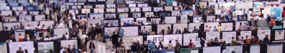

# 深度 | 李飞飞高徒 Andrej Karpathy：计算机科学博士的生存指南（附博士论文）

选自 Github.io

**机器之心编译**

**作者：Andrej Karpathy**

**参与：孙睿、吴攀、李亚洲、杜夏德**

> *近日，Open AI 人工智能研究科学家 Andrej Karpathy 完成在斯坦福的博士学位，其博士论文和他在博客上写的读博指导建议都获得了极大关注。机器之心编译了 Andrej Karpathy 就读斯坦福计算机科学博士学位的建议，希望对大家有所帮助。在文后机器之心也对他的博士论文进行了摘要翻译，读者们可点击阅读原文下载。*

如今，我即将完成自己的 PhD 学位，我想要写一篇文章回顾自己的经历，希望这对你们有一些帮助。不像本科指导，博士指导要更加难写，因为一个人如何完成自己的博士生涯相比本科有更多的变化。因此，很多事情可能是有争议的，我熟悉的一些部分（计算机科学/机器学习/计算机视觉研究）会具体写一下。

**预热**

**** 

首先，你想要获得博士学位吗？在年轻的时候我就很幸运的明知我真的想要一个 PhD。不幸的是，我并没有经过深思熟虑：首先，我是真的喜欢学校和学习，我想尽可能多学一些东西。其次，我真的想成为游戏《半条命》里面的 Gordon Freeman 博士这样的人（从 MIT 获得理论物理博士学位）。我喜欢这个游戏。但在做人生决策时你更加敏感又会怎样？还会想要读 PhD 吗？（这里作者引用了自己在 Quora 上的回答，当时他在大公司的 offer 与读博之间做出的抉择。）我假设你正在考虑是否加入一个中型公司（大部分人都是如此），你可以问自己该公司是否有如下吸引力：

**自由**。读博在你想要追求和学习的主题上能提供很大的自由度。你在被别人管着。当然，读博也会有导师加以约束，但很大程度上要比其他更自由。

**所有权**。你做出的研究成果将会是你自己的，上面附属自己的名字。相反，在大公司内，「blend in」会很常见。常有的一个感觉是成为了「齿轮上的一个齿」。

**排他性**。很少有人单独成功做到顶级的博士项目。你将是加入一个由数百杰出个人组成的团队，相比于公司可能是数千人组成的团队。

**地位**。不管是不是这样，向前进并最终获得博士学位在文化上是值得崇敬的，也是一项了不起的成就。你也将成为一个博士，这很棒。

**个人自由**。博士生是自己的老板。今天想睡觉？可以。今天想溜号休假？可以。所有的一切就是最后的博士成果，没人逼你要朝九晚五。当然，一些导师在这方面有很大的灵活性，一些公司也会灵活一些，但个人自由确实是初级声明。

**最大化未来的选择**。加入博士项目并不是关闭了一些出路或减少了未来职业/生活方式的选择。你可以选择走一条路（PhD→其他），但并不只是一条路可走（其他→PhD→学术/研究）。此外（尽管应用机器学习专业相当特殊），博士毕业生甚至博士退学生更可能被雇佣，很多公司也愿意将你安排到更有趣的位置或给你更好的起始薪资。更广泛的说，最大化选择是你未来可以遵循的一个很具启发性的方法。

**最大化你的转变**。你还年轻，没必要这么着急进公司。一旦你从博士毕业接下来有 50 年的时间花费到公司。在你的人生经历中，选择有更多的转变。

**个人成长**。PhD 是一段快速成长（学到很多）和个人自我发现（成为掌握自我心理状态的大师）的浓重经历。PhD 项目（特别是如果你能成功进入一个好的项目）也能频繁的为你提供机会，交往一些格外阳光的朋友。

**专业性**。PhD 可能是你人生中唯一的机会真的深入一个主题，并在某些事情上成为世界上处于领导地位的专家。在没有分心与约束的压力下，探索人类知识的边缘。这是一件非常美好的事，如果你不同意这一点，这可能就是一个你不适合读 PhD 的信号。

**放弃**。我也想说一下可能存在的消极面和失败模式。PhD 是一段非常特殊的经历，有大量的人会放弃。你将不可避免的发现自己做起来特别难（特别是该交论文之前）。你需要适应这些痛苦，并有足够的心理耐力和决心处理这些压力。有的时候你可能会过的不知道今天是周几，吃厨房的剩菜剩饭。在一个美妙的、阳光明媚的下午，翻动 Facebook 照片你发现朋友们拿着比自己多 5 到 10 倍的薪水享受着异国旅行，你要一个人坐在实验室精疲力尽。有时你会需要 3 个月的时间远离自己的研究，才能调整好健康的心态。在朋友们做着 TechCrunch 文章里面提到的创业时，或者在朋友们将产品推销给百万人时，你却挣扎着意识到几个月的研究花费到了一篇只有几个引用的论文上。你会经历自我认知的危机，怀疑生活中的抉择，想知道花费自己人生中最宝贵的时间正在做什么。最后，你应该相当确信，自己在追求科学研究与发现的路上，能够在无序的环境中成长、繁盛。如果你不确信，你会容易因是被而消极。在你决定读博之前，理想上你可以先在一个夏季研究项目上作为本科生尝试一下做研究。事实上，在 PhD 招聘期间，研究经验如此被看重的主要原因不是研究本身，而是博士生更知道自己正在做什么。

最后，我想到有人说如果你想进入学术圈就读 PhD。基于上面提到的，我认为 PhD 有强大的固有价值，PhD 本身就是一个目的（end），而不只是达到某个目的（比如，学术圈的工作）方式。

**进入一个博士项目**：推荐、推荐、推荐。好，你决定努力争取一个项目，现在就是如何进入一个好的 PhD 项目？第一等级的逼近方式相当简单，目前最重要的就是强有力的推荐信。理想场景是一个知名教授这样为你写推荐信，「xx 是曾与我一起工作过的学而生中的前 5 名，她积极主动，有自己的想法，并付诸实践。」最差的推荐信就是，「xx 上了我的课，做的不错。」来自夏季研究项目的你自己的学术著作是一个强有力的加分，但并不如你有强有力的推荐信。特别提醒：分数并不强相关，但你一般不太想分数太低吧。本科时这在我身上并不明显，因为我花费大量精力取得好成绩。只有可能就直接与研究有关（或者最低限度就是与个人项目有关），尽可能的多，也尽可能的早，如果可能也要得到多人指导（你需要 3 个以上的推荐信！）最后一点，突然的纠缠未来可能成为你导师的人不会提供任何帮助。他们总是非常的忙，如果你想在回忆上或者通过邮件强势的接近他们，想要给他们深刻的印象，这可能反而会激怒他们。

**选择学校**。一旦你进入一些 PhD 项目，然后如何选择学校？很简单，斯坦福啊！开玩笑啦。严肃的说，梦想中的大学是首选（不是因为它看起来对你的履历/简历好，而是因为它的反馈环路。顶级学校也吸引其他顶尖人才，你可以跟其中的很多人相识、一起工作。）。第二就是有一些想要一起工作的导师。我说「一些」导师是很认真的，如果首选因各种原因无法达成，比如因理想教授离职、搬走或自然死亡而脱离了掌控，多一些导师选择对你而言很重要，也是一种安全保障。第三，选择一个好的物理环境，我认为新生不够注重这一点：你将花费生命中最好的 5 年时间生活在校园之中。相信我，这是相当长的时间，而且生命中不只有研究。

**导师**

**** 

**导师关系**。导师是极其重要的人，会对你的博士生涯产生重要影响。理解这个关系的本质是很重要的：导师与学生之间是一种共生关系；你有自己的目标，想在博士阶段出些成果，但是导师也有他们的目标、约束，他们也要考虑自己的职业发展。因此，理解导师的激励机制是很有好处的，包括任职期间如何工作，这个职位的评估标准，他们如何获取经费，他们可能牵扯进了什么样的系内政治，他们如何拿奖，学术界通常是怎么运作的，还有尤其是他们如何获得认可和同事的尊重。这有助于避免或减轻与导师之间的摩擦并允许你进行适当的规划。我也不想让这种关系听上去更像是一种交易。导师与学生之间的关系不应该只是事业发展，而往往是一种持续的、可预测的关系。

**re-tenure 与 post-tenure**。每位导师都不同，所以理解 tenure-track 的变化和他们对你博士生涯的影响也是很有帮助的。送上一条经验法则（记住也有很多例外），无论你的导师是处于 pre-tenure 还是 post-tenure，紧跟他的职业轨迹非常重要。通常情况下，年轻一些的教员常常比较多，级别也更低，但是他们也会对你的科研任务施加更强烈的建议，和你一起工作，抛出具体的想法，甚至会帮你检查代码（这是好事）。跟着这样的导师，更实际一些，课业也会更紧，因为他们需要发表很多质量不错的论文来获得 tenure，他们有动力推动你一样努力工作。相比之下，级别更高的教员或许有更大的实验室，除研究之外会有其他方面的优势（比如，委员会，讨论会，游学），这意味着，他们在学校里只能处在更高级别的职位，无论是在他们的研究领域，还是在监督学生上。讽刺的是，这就是「你在这个方程中漏掉了一个术语」和「你在这个领域还要多读些资料，和这个或那个人聊聊，这样或那样兜售你的成果」之间的区别。在后一种情况中，低水平的建议仍然来自于实验室里高年级博士研究生或者博士后。

**除了 tenure 之外的其他变化**。还有很多需要注意的变化。一些导师比较随意，另一些对待师生关系则比较专业谨慎。有些人会试图影响你的工作细节，有些则会放开手让你自己去做。一些会专注研究特定的几个模型及其在不同任务上的应用，而另一些则专注于任务不在意建模方法。从管理上看，有些导师能一周（或天！）见上几次，有些几个月都见不到人。一些导师会快速回复邮件，而另一些一周都不会回（甚至更长，哈哈）。一些导师会要求你给他一个时间表（比如，你最好能长时间工作或者周末工作）而另一些不会。一些导师慷慨地支持他们的学生，给学生配设备，还有一些认为有台笔记本或旧台式电脑就可以了。一些导师会资助你去参加会议，即使你没有投论文，有些则不会。一些导师是企业家类型的或者偏向应用，一些则更倾向于理论工作。一些会允许你暑期实习，另一些则认为实习会分心。

**选导师**。所以导师该怎么选呢？首先要和他们单独面谈。师生关系有时可以比喻成婚姻，要确保你们合得来。当然，首先你得确定你能和他聊天和他相处，不过相对于前述的 Tenure，要明白导师仍旧是教授，尤其是否能与你在你感兴趣的问题上产生智力共鸣。这比他们采取哪种管理方法更加重要。

**收集资料**。你也应该收集一下心仪导师的资料。和他们的学生聊聊。如果你想得到有用的消息，这件事在正式场合下一定不能做，只能在轻松的场合（比如聚会）下问问未来的学长学姐。很多情况下，学生一般不会直接说导师不好，但是如果你问他具体的问题，他通常会真实的回答你，比如，你可以问「你们多久见一次面？」，或者「他现在有什么职务」。另一个策略是看看他之前带出来的学生最后都怎么样了（你可以在网站上找到），这样你就大概知道自己以后的去处了。

**给导师留下印象**。导师学生互选过程有时可以比喻成婚姻，你选他们，他们也选你。他们认为理想的学生是有兴趣有激情的，自律能力强，不需要手把手教，主动性强，一周内不仅能完成导师布置的任务还能自己有所拓展；用意外的方法改进结果。

**要考虑整个实验室**。另一个重点是要意识到你会一周见导师一次，但是同门每天都能在实验室里见到，他们会成为你最亲密的朋友。在大多数情况下，你最后会与一些高年级博士生或博士后合作，他们的角色会非常类似你的导师。尤其是博士后，他们可能是未来的教授，他们也渴望和你一起工作，这样能积累带学生的经验。因此，你要确定整个团队中能有合得来的人，你尊重的人，还有你能亲密地做研究项目的人。

**研究主题**

 

*人类一小部分知识的 t-SNE 可视化。每一个圈圈都是一篇 arxiv 论文，大小代表参考文献的数量。*

所以，如果你进入博士阶段，并找到一名导师。如何开展下去呢？

**外围的锻炼**。首先注意博士阶段的性质，一个博士学位读下来有苦有乐，因为你会不断接触到元问题（meta problem）。你不只是在解决问题——这仅仅是你要做的分内事。你的大部分时间要花在外围上，找出什么问题是值得解决的，什么问题已经成熟到可以解决。你要持续想象自己在解决假设问题，问自己处在什么位置，这个问题能打开什么，或者是否有人关心你研究的问题。如果你像我一样，就会有点疯狂，因为你在花大量的时间在做你甚至无法确定是否正确，也不知道能不能解决的事情。

**研究品味**。当你选择研究问题时，你会听到学术界讨一个神秘的概念「品味（taste）」。它一个实实在在的东西。当你向导师提出一个潜在的问题时，你可能会看到他们扭曲的脸，瞪大的眼睛，注意力飘忽的表情，或者当他们思考未知领域亟待探索时，你能感受到他眼神里的兴奋。在你抛出问题的瞬间发生很多事情：评价问题的重要性、难度、吸引力，它的历史语境（可能也会考虑是否能得到补助）。换句话说，你的导师是外围问题大师，在判断问题上品味很高。在博士阶段，你也会慢慢获得这方面的悟性。

我想过去我这方面的品味不太好，从我早期的博士笔记中就能看出来。当时令我兴奋的很多问题现在回想起来在构思上都不够精巧，难以下手，相关性也不强。经过实践和学习后，我的品味才得到提升。

我来试着总结一下关于怎样培养品味的思考，以及怎么让问题有趣地研究下去。

**一个丰饶的领域**。首先，要意识到在你的博士阶段你会深入某个领域，你的论文很有可能进入研究链的顶端，自成体系（成为你的 thesis）。因此，选择一个问题时，你应该多往前思考几步。预测事情怎样进展不太可能，但是你能感知到你还有多大的研究空间。

**配合导师的研究兴趣和研究长处。**你会想要直接进入导师研究兴趣的领域。一些导师或许会只允许你进入边缘地带，但是这样你就不能全部利用他们的知识，他们就不太可能想帮助你的项目或促进你的工作。例如，（这是我以前的想法）每位导师在研究上都有一个通用的幻灯片模板，如果你的研究成果够前沿，能被添加到那个幻灯片模板中，你就会发现导师对你的研究投入更多了，给你的帮助也多了。此外，他们还能帮助推广和公开你的成果。

**要有点雄心****：在努力这件事上要做到收放自如**。人的心理都有个奇怪的 bug： 10 倍的重要或影响的问题在直观感觉解决起来就需要 10 倍的努力。这是个错觉——我的经验是 10 倍重要的问题，至多需要 2 到 3 倍的努力就行了。事实上，在一些情况下，一个 10 倍困难的问题解决起来可能更容易。为什么？因为你会有 10 倍的动力走出自己的黑箱，看到方法真正的局限性。从首要原理（first principles）开始思考，改变全部策略，继而创新。如果你渴望做出 10% 的改进并且很努力，你就会成功。但是如果你渴望做出 100% 的改进，你仍然很有可能成功，但会以一种非常不同的方式。

**雄心但也要能解决**。在这一点上，需要指出的重要一点是有很多重要的问题无法做成大项目。我推荐阅读 Richard Hamming 写的一条博客：你与你的研究（You and Your Research），这里面探讨了这个问题：

> *如果你研究的问题不重要，你也就很有可能无法做出重要的成果。这是十分明显的。伟大的科学家会深思熟虑他们领域内的许多重要的问题，而且他们会密切关注、仔细琢磨如何攻克它们。让我警告你，「重要的问题」必须小心谨慎。当我在贝尔实验室的时候，物理学的三大突出问题在一定意义上都没有得到过研究。这里所说的「重要」是指肯定能得到诺贝尔奖和任何数量你想要的资金。我们不研究 1）时间旅行，2）物质传输，3）反重力。它们并不是不重要，而是因为我们无力解决。决定一个问题是否重要并不是因为结果，而是你可以合理地解决。这才是使一个问题重要的原因。*

**做到 X 的人**。最后，PhD 的目标不只是成为某个领域内的深度专家，而且还要在这个领域打上你的烙印。要引导它，塑造它。理想的情况是：当你的 PhD 阶段结束时，你已经在一个重要领域赢得了自己的一席之地，最好是一个可以容易和快速地描述的领域。你想听到人们说「她就是那个做到 X 的人」这样的话。如果你能填补一项空白，你就是成功的。

**有价值的技能**。认识在到读博期间你将成为所选择的领域内的一名专家（撇开兴趣不谈，5 年×每年 260 个工作日×每天 8 个小时是 10,400 小时。如果你相信 Gladwell，PhD 正是需要大量的时间才能成为专家。）所以，想一下 5 年后你成为了这个领域的世界级专家（不论你的研究的学术影响，1 万小时将保证这一点。）拥有这些技能是不是很振奋？或者对你未来的职业足够有价值？

**负面例子**。也有一些难题或者论文类型你理想上想要避免。例如，有时你听到学习界讨论「增量工作（incremental work）」（这简直是学术界最糟糕的形容）。增量工作是指一篇论文通过使其更复杂并在一些基准上得到 2% 的额外增分，从而增强了一些已有的事情。这些论文的可笑之处在于有很高的机会会被接收（评审员没有拒绝这些论文的理由；有时它们也被称为 cockroach paper），所以你有这样的一系列论文被接受，你可以感觉自己非常高产，但事实上这些论文不会有很高的引用，你也不会在该领域有很高的影响力。类似的，寻找研究工程不能只理想的考虑「有这样一个下一步逻辑步骤还没有人做，让我来做」，或者「这应该是一个非常简单的 poster。」

**案例学习****：我的主题**。为了更详细的讨论这个话题，我打算使用自己如何展开 PhD 作为例子。首先，有趣的事实：我的整个主题都基于 PhD 期间一年半的研究。也就是，它花费了我相当长的时间在元问题空间（metaproblem space）不断摇摆，然后才找出了一个我感觉令我振奋的问题（其他两年我大部分是做 3D，比如 Kinect Fusion、3D 网、点云特征（point cloud features）、还有视频方面的工作）。然后在我读博第三年，在某个周六的下午两点，我来到了 Richard Socher 的办公室。我们闲聊时我意识到他在图像和语音上研究的一些问题事实上非常的有趣（当然，图像和语言交叉的这个领域在 Richard 之前就有了。）我难以看完所有需要查看的论文，但该领域看起来相当有前途：该领域相当的富饶（大量未解决的难题，在对图像进行基础描述尚有大量的可能性。）我认为这相当的酷，也很重要，也很简单去解释，看起来它处于成为可能的边缘（深度学习也只是刚开始有效），数据集也刚开始变得可用（Flickr8K 也刚出现）。这刚好满足李飞飞的兴趣，即使我没有成功，我至少得到了大量的时间，优化了我可能用于其他领域的有趣的深度网络。当所有事在我脑海中出现的时候，我强烈感觉到一股海啸。我把这个主题在第二天投给了导师李飞飞，感觉松了一口气。她热情澎湃地通过了，给予我鼓励。而且在接下来的工作中指导我，（例如，在我满足于排名的时候，飞飞坚持让我做图像语句生成。）后续的发展让我很高兴。简言之，我游荡了近两年才发现要深入的领域。给予数个启发方法，一旦我发现我要做什么，我就深入地去做。

**阻力**。我还想提一下你的导师绝不可能是一贯正确的。我已经见过或听说过很多实例了，现在回想起来，导师应该为错误负责。如果你在读博士时觉得导师错了，有时候你应该鼓起勇气忽略导师的看法。学术界普遍赞赏独立思考，但你特定导师的回应可能会随着环境发生变化。我就知道一些赌一把最后得到了很好结果的例子，而我个人也经历过一些效果并不好的例子。比如说，在我第一年的时候，我坚决不同意吴恩达给我的一些建议。我最后开始研究一个他并不非常感兴趣的问题，但让人惊讶的是，事实证明他是非常正确的，而我则浪费了几个月时间。吃一堑长一智嘛 :)

**不要耍滑头**。最后，我要让你认为 PhD 不只是一连串的论文。你不是一个论文写手。你是科研界的意愿，你的目标是推动该领域向前发展。论文是其中一种常见的做法，我建议你不要把目光放在已有的学术领域内。首先为自己想想，做一些其他人没有做但应该做的事，远离别人在你之前已经做出的成果。在我的整个 PhD 阶段我一直在尝试这么做。这个博客就是一个例子——这让我可以谈论一些通常不会发在论文里面的东西。ImageNet 人类推理实验就是一个例子——我强烈地认为，在 ILSVRC 上知道人类大致的准确度对该领域来说是非常重要的，所以我花了几周时间对其进行了评估。学术搜索工具（如 arxiv-sanity）也是一个例子——一直以来我都为论文文献搜索的低效性感到沮丧，所以我发布并维护了这个站点以便对他人有所帮助。两次参加 CS231n 教学也是一个例子——我在上面花了大量的精力，超过了一个应该做研究的博士生的合理程度，但我认为如果人们不能有效地学习这个主题和进入这一领域，这一领域的发展就会受到拖累。我的很多博士阶段的工作都很有可能会牺牲一些标准的学术指标（如 H 指数或在顶级会议上发表的数量），但我还是做了那些事情，我还会同样地再做那些事，在这里我也鼓励其他人也这么做。这可能言过其实了一点，除却思想观念上的一些东西，根据过去我与朋友和同事一些讨论，我知道这个观点是存在争议的，而且很多人也并不认同。

**写论文**

**** 

在学术界，能写好论文是一项关键的生存技能（就像是生火技能对穴居人一样）。特别地，很重要的一点是要意识到论文是一种特别的事物：它们看起来有一定的形式、以一定的方式流动、有一定的结构、语言以及其他学者所期望的统计数据。对我来说，查看我博士早期阶段的论文真是一种痛苦的历练，因为它们实在太糟糕了。在这方面有很多东西需要了解。

**查阅论文**。如果你正在学习写更好的论文，阅读许多好论文并提取出其中的模式似乎是一个明智的选择。但事实证明这并不是最好的策略；这就好像是对于一个二元分类问题只接受正面的样本一样。你真正需要的是查阅大量糟糕的论文，其中一种方法是评阅论文。大部分好的会议的论文接收率大约为 25%，所以你查阅的大部分论文都很差，这让你可以构建一个强大的二元分类器。你可以阅读一篇糟糕的论文，看它的描述有多么不清楚，或者它如何没有定义自己的变量、摘要介绍有多模糊、或者它如何过快地深入到了细节之中——你可以学习让你的论文不落入同样的陷阱。另一个相关的有价值的经验是参加（或组织）读书俱乐部——你将看到经验丰富的研究者批评论文，并且了解自己的论文将会被其他人怎样分析。

**格式正确**。我清楚地记得有一次和飞飞参加一次审阅会议。我在前面的几个小时里只评阅了 4 篇论文，而她拿起这些论文，每篇只翻了 10 秒钟就说其中一篇很好，其它都很糟糕。确实如此，我也接受了这一篇并拒绝了其它三篇，但这项花费我几个小时做成的事她只用几十秒就完成了。飞飞是将论文的格式作为强大的启发线索的。随着你变成越来越资深的研究者，你的论文将有一种特定风格的外观。一页引言/介绍。一页带有合适密度引用文献（不过于稀疏也不过于密集）的相关成果介绍。一张设计良好的 pull figure（在第一页或第二页）和系统图（在第三页）——不要用 MS Paint 制作。描写技术的章节在某个地方有些数学符号、带有大量数字的结果表（其中一些是粗体）、一个额外的聪明的分析实验、而且论文正好有 8 页（页数限制）且一行不少。你将不得不学习如何为你的论文赋予相同的格式，因为许多研究者在评价你的成果时都将其作为认知的捷径。

**确定核心贡献**。在你开始写任何东西之前，首先很重要的是要确定你的论文对该领域的一个单一的核心贡献。我会特别强调其中的单个词。一篇论文不是你运行的一些实验的随机集合的报告。论文的目的是给出一个之前并不存在或并不明显的单个事物。你必须认为这个事物是重要的，它之前从未被完成过，然后你通过实验的方式在有对照组的环境中证明它的优点。整篇论文都应该围绕这一核心贡献精准地展开。尤其是不要有任何额外的无价值的扩展，也不要裹带任何其它东西。举一个具体的例子，在我早期的一篇关于视频分类的论文（Large-scale Video Classification with Convolutional Neural Networks）中我就犯了这个错误，我尝试一次打包两个贡献：1）一个用于视频卷积网络的架构布局集合，2）一个不相关的带有很小改进的多分辨率架构。我把它加上去是因为我觉得一是也许有人会对此感兴趣然后跟进后续研究，二是因为我觉得论文的贡献越多越好：两个贡献好于一个贡献。不幸的是，这是一个非常彻底的错误。第二个贡献是微不足道的/可疑的，它稀释了这篇论文，分散了注意力，而且也没人关心。在我 CVPR 2014 的一篇论文（Deep Visual-Semantic Alignments for Generating Image Descriptions）中我又犯了类似的错误，我在该论文给出了两个没有关联的模型：一个排序模型和一个生成模型。我可以举出一些好的论据来证明我应该分开发两篇论文；只些一个贡献的原因更多是历史上的，而非理智上的。

**结构**。一旦你确定了你的核心贡献，就有了一个写论文的默认配方。上层结构默认的是引言/介绍、相关工作、模型、实验、结论。当我写我的引言时，我发现可以以相关评论的形式写下一些条理分明的顶层叙述，然后再填写下面的文本，这会很有帮助。我喜欢围绕单个明确的点来组织我的段落，并且这个观点在第一段就会给出，并用该段的剩下部分来支撑这个观点。这样的结构可以让读者轻松地快速略览。然后我们需要一个好的思维流程，可以按以下线索进行：1）X（如果不明显，还要加上对 X 的定义）是一个重要的问题；2）核心的挑战是什么，2）X 上之前的成果已经用 Y 解决的问题，而这一次的问题是 Z；3）在这项工作中，我们做了 W(?)；4）这有以下有吸引力的特性，我们的实现表明了什么。你可以稍微调整这个结构，但这些核心的点需要得到明确。再重申一下：论文需要围绕你的确切贡献精准地进行组织。比如说，当你罗列挑战的时候，你需要确切列出那些你将在后面解决的问题，而不要牵扯到你做的与之无关的事情上（你可以在后面的结论中多做一点推测）。不只是在引言中，保持论文整体的合理结构也是很重要的。比如说，当你解释你的模型时，每一节应该：1）解释清楚在这一节做了什么，2）解释核心挑战，3）解释基本方法或之前其他人做了哪些工作，4）解释你的动机和你所做的工作，5）描述它。

**打破结构**。你也应该灵活应对这些格式，扩展你的论文，为之增加一点香料。比如说 Razavian et al. 的这篇论文（CNN Features off-the-shelf: an Astounding Baseline for Recognition）惊人地将引言做成了一位学生和教授的对话形式。这做得很聪明，我很喜欢。另一个例子，Alyosha Efros 的很多论文都带着一种俏皮的语气，为有趣论文的书写给出了绝佳的案例。比如说他与 Antonio Torralba 合著的这篇论文《Unbiased look at dataset bias》。另一种我见过的效果不错论文是问答式的章节，可能用在附录中。

**常见的错误**：洗衣清单（laundry list）。洗衣清单是应该避免的一种非常常见的错误，它看起来像这样：「这里有一个问题。现在为了解决这个问题，我们首先做 X，然后我们做 Y，再做 Z，之后再是 Y，就得到了我们的结果。」你应该竭力避免这种结构。每一个点都应该得到证明、给出动机和解释。为什么你要做 X 或 Y？有没有替代选择？其他人做了什么？可以说这样的论文很常见（如果可能的话我倒愿意给出例子）。你的论文不是一份报告，不是你做过的事情的枚举，也不是你的按时间排列的笔记和实验的某种格式化的翻译。论文是对于一个问题、你的方法和其背景的高度处理过的和高度聚焦的讨论。它应该能教给你的同事一些东西，它必须要能证明你的步骤，而不只是描述你做了什么。

**语言**。随着时间的推移，你会积累一个写论文时的好词词典和坏词词典。具体可以机器学习或计算机视觉论文为例：在你的论文中永远不要出现「study」和「investigate」（这是无聊的、被动的、糟糕的词）；而你应该使用「develop」或甚至「propose」这样的词。你不要提出一个「system」或甚至更糟的「pipeline」；相反，你开发了一个「model」。你不是在学习「features」，你是在学习「representations」。而且上帝保佑，你千万不要使用「combine」、「modify」或「expand」。这些多余的、粗陋的术语肯定会让你的论文被拒 :)

**提前两周的内部截至时间**。并没有许多实验室这样做，但幸运的是飞飞对这个提前两周的内部截至时间限制很是坚定，在这个时间，你必须提交至少 5 页带有所有最终实验的草稿（即使不是最终的数字）；这份草稿会进入一个与外部完全一样的内部评审过程（具有相同的评审表等等）我发现这种做法非常有用，因为这会迫使你思考整篇论文的布局，从而总是能让你彰显出一些你必须为这篇论文的思路而运行的关键实验，并让论据思路条理清晰、连贯和有说服力。

关于这一主题的另一个好资源是 Jennifer Widom 写的《Tips for Writing Technical Papers》（https://cs.stanford.edu/people/widom/paper-writing.html）。

**写代码**

 

当然，你仍旧会花很多时间在实现你的想法上，也就是说，你还会编写很多代码。因为这并不是学术上独有的工作，所以我不会在此详谈，但还是有几点我想提一下。

**公开你的代码。**虽然你可能会感到惊讶，但是你确实可以不发表论文也不公开代码。同时，你有很多动机将自己的代码藏起来：写代码会花费许多时间（研究项目的代码看起来像是意大利面，因为它的迭代非常快，所以你需要经常进行清理）；同时，光是想到别人可能会对你的代码评头论足，就已经足够吓人了，维护代码以及回答别人（永远会有）的问题是非常痛苦的，你甚至会担心别人可能会发现代码中的错误，从而减弱了研究的可信度。然而，这正是你应该发表代码的原因之一：为了避免尴尬的情况发生，你会不断采用更好的编码习惯（而这最终会帮你节省时间！）；你会被迫使学习更好的工程实践；你会被迫使对自己的代码更加严格要求（例如，编写单元测试以最小化错误出现的可能性），这一切都将让你的研究受到更多关注（并由此带来更多的引用次数），并且很自然地，你的研究也将对之后的研究更加有用。当你真的准备发表代码的时候，我建议你好好利用 docker containers（https://www.docker.com/）；它会减少人们发邮件来问你要附件（和它们的各种版本），从而减轻你的烦恼。

**为将来的你着想**。为了你自己的便捷，务必将自己的所有代码妥善记录，我保证几个月之后你会回来看你的代码（例如，为即将发表的论文再做几个实验），那时，你会一头雾水。我已经养成了为（自己的）每一个版本编写非常详尽的 readme.txt 文件的习惯，以便未来的自己能够明白代码的原理和使用方法等等。

**做演讲**

**** 

现在，你的论文成功发表了！你需要就这篇论文向许多观众进行几分钟的演讲——它应该是什么样的？

**演讲的目的**。首先，一个常有的误解是，演讲的目的是向听众介绍你在论文中做了什么。这是错误的，这一目的最多也只能排在第二或第三位。你的演讲应应该：1）使听众对你研究的问题产生浓厚兴趣（如果大家对问题本身没兴趣，他们也不会在乎你的解决方法的！）2）教些东西给听众（理想的情况是在让大家体验你的思考 / 解决方案的时候，不要害怕在别人的相关工作上花时间）以及 3）有趣（否则很多人会开始刷 Facebook）。理想情况下，在演讲结束之后。你的听众中应该有人在想这几件事情：「哇，我要换个研究方向」，「我一定要看看这篇论文」，以及「作者本人对整个领域的理解非常出众。」

**一些可以做的事情**：有些特征会让演讲更上一层楼，例如，要：有许多图片。人们喜欢图片。录像和动画应该更少一些，因为它们容易让人分心。要让演讲内容高度可执行——将一些人们在听到之后可以马上动手去做的东西。要：如果可能的话给一个 demo，它会让你的演讲更容易被记住。要发展一个你的研究涉及到更广泛的领域。要讲成一个故事（人们喜欢故事）。要引用，引用，引用——很多应用！加入引用不会占用你的幻灯片多大的空间，而你的同行们会因此感到高兴，并且认为你是一个十分谦虚的人，因为你意识到自己的贡献是建立在他人的许多成果之上的。你甚至可以引用在同一个会议发表的文章，并为之做简短的推荐。要进行练习！先自己练习，然后向同事 / 朋友展示。这常常会帮你发现许多叙述和流程中的重要问题。

**不要加很多文字**。不要让文字挤满你的幻灯片。你应该少用甚至不用重点标识——演讲者们有时会使用重点标识来提醒自己要讲些什么，但是幻灯片不是给你自己看的，而是给观众看的。重点标识应该出现在你的演讲笔记中。于此类似地，尽可能地避免使用复杂的图表——你的听众是有固定带宽的，并且我保证那些在你看来十分熟悉且「简单」的图表，对于那些第一次看到的人来说，就不是这么好理解了。

**注意，结果表**：不要使用信息十分密集的表格来展示你的方法有多么优秀。既然你已经写了篇论文出来了，我相信你的结果至少是可靠的。我一致认为这一部分是非常无聊和无用的，除非数字能够表明一些（与证明你的论文无关的）十分有趣的东西，或者数字所表明的差距确实非常巨大。如果你真的要展示结果或图表，请循序渐进地将它们展示出来，而不是把所有东西扔到页面上，然后在一页幻灯片上花上三分钟。

**陷阱****：无聊与困惑之间的微小距离**。如果你听众中的许多人都抱着一种学习的心态而来，要设计出一个好的演讲不是那么容易的。一个常见的失败案例是（作为一个听众），在演讲的前半段无聊至死，然后在后半段困惑不已，最后啥都没学到。经常出现这一情形的演讲的特点是，摘要非常概括性（过于概括了），然后紧接着技术（过于技术的）详解。尝试在你的演讲中规避这一倾向。

**陷阱：超时**。许多演讲者会在开始的部分花费过多的时间（一般来讲这也会使得演讲变得无聊），然后火急火燎地了解最后的几张幻灯片，而那些往往是最有趣的结果、分析或 demo。不要做这样的演讲者。

**陷阱：形式化的演讲**。我可能是个特例，但是我一直都喜欢挑战传统的、规避形式化的演讲。例如，我鄙视在幻灯片中加入演讲大纲的行为。因为这使得整个演讲变得无聊，就像在说：「这部电影讲述的是一个有魔力的戒指，在第一章我们会看到一个霍比特人得到这个戒指，第二章我们会看到他去了 Mordor，第三章里他将戒指扔到了 Mount Doom 并将之毁坏了。我将从第一章开始讲起」——拜托别这样！我只在非常长的演讲中才使用大纲页面，以便于听众在走神之后重新恢复记忆（30 分钟后他们往往会走几次神），但是这应该尽量少用。

**观察并学习**。最终，成为一个优秀演讲者的最好方法是（写论文也是这样），留意观察优秀的（和不怎么优秀的）演讲者的行为，然后在你的大脑里构建一个二元分类器。不要仅仅做演讲的听众；你要对它们进行分析、分解、然后从中学习。除此之外，留意现场反应。有时，当演讲者展示出一个复杂的数字表格时，你会注意到，许多观众立马低头看起了手机。为可能导致这一场景的行为构建一个内部分类器，并在你自己的演讲中避免这些行为。

**参加会议**

**** 

对于会议：

**参加。**参加会议是很重要的，特别是你所在的领域的最顶尖的 1-2 场会议。如果你的导师缺乏资金，不愿意为你的路费买单（例如，当你还没有论文的时候），那么你应当愿意自己买单。这是很重要的，因为你需要成为学术圈的一员，并能够见到更多同僚，以及了解研究话题的八卦。科学界可能有一些极少数的单打独斗的人，但是真相是，做研究很大程度上是一个高度社交性的事业——你是站在许多人的肩膀上的，且还有许多人和你一起努力，并且这些人也是你的论文的阅读者。此外，我很遗憾这么说，但是每一个领域都有一些没有出现在论文里、但是在整个圈子里广为流传的知识，包括接下来的重要话题有什么，哪些论文是最有趣的，论文的内线消息是什么，他们之前是如何发展的，哪些方法管用了（不是在论文里，而是在实际中），等等等等。成为圈子里的一员，并且了解这个集体中的共识，是很有价值的（并且很有趣！）——首先从中学习，然后最好能够影响这个圈子。

**讲座**：根据演讲者进行选择，我使用的一个会议技巧是，在选择讲座的时候要看演讲嘉宾，而不是讲座主题（这是一项技能，慢慢地你会发现有价值的人），并且，根据我的经验，我发现亲耳听这些人演讲会大有裨益，尽管话题甚至和你的研究领域没有直接联系。

**真正有价值的信息可能在走廊上**。现在，创新的速度（尤其在机器学习领域）已经比会议的间隔时间要短了，所以你在会议看到的大部分论文实际上都算是旧新闻了。因此，会议更多地是一项社交活动。与其参加一个讲座，我建议你把去走廊转转作为一项主要活动。你还可以去海报宣传去逛逛，说不定会发现一些错过的有趣论文和想法。

> *据说一个博士生有三个阶段。在第一个阶段，一篇相关论文的引用你大部分都没看过；在第二个阶段，你能认出这些论文；在第三个阶段，你已经与所有论文的第一作者喝过一圈了。*

**最后的一些想法**

尽管我现在找不到出处了，但是我曾听到 YC 的 Sam Altman 说，建立一个创业公司没有捷径可走。你不能指望通过玩弄体制，或者通过伪装来获得长久的胜利。我想在学术领域也是一样的。最终，你的目的是用优秀的研究推动这一领域的进步，如果你试图针对某些指标动手脚，从长远来看你无法成功。在学术界尤其如此，因为学术界令人惊讶地小，并且高度关联，所以，任何你试图在学术履历上用点阴招（例如，常常自己引用自己、将同一想法稍作修改后重复发表、重复提交被退回的论文而没有丝毫修改、为了自己的便利而抛弃一些基本原则，等等）最终将让你尝尽苦果，而你也不会成功。

所以，总而言之就一句话：好好工作、适当交流，人们会注意到你，好事也会发生。祝博士之旅愉快！

*   **论文：连接图像与自然语言（CONNECTING IMAGES AND NATURAL LANGUAGE）**

**** *导师审核*

摘要**：**人工智能领域的一个长期目标是开发能够感知和理解我们周围丰富的视觉世界，并能使用自然语言与我们进行关于其的交流的代理。由于近些年来计算基础设施、数据收集和算法的发展，人们在这一目标的实现上已经取得了显著的进步。这些进步在视觉识别上尤为迅速——现在计算机已能以可与人类媲美的表现对图像进行分类，甚至在一些情况下超越人类，比如识别狗的品种。但是，尽管有许多激动人心的进展，但大部分视觉识别方面的进步仍然是在给一张图像分配一个或多个离散的标签（如，人、船、键盘等等）方面。

在这篇学位论文中，我们开发了让我们可以将视觉数据领域和自然语言话语领域连接起来的模型和技术，从而让我们可以实现两个领域中元素的互译。具体来说，首先我们引入了一个可以同时将图像和句子嵌入到一个共有的多模态嵌入空间（multi-modal embedding space）中的模型。然后这个空间让我们可以识别描绘了一个任意句子描述的图像，而且反过来我们还可以找出描述任意图像的句子。其次，我们还开发了一个图像描述模型（image captioning model），该模型可以根据输入其的图像直接生成一个句子描述——该描述并不局限于人工编写的有限选择集合。最后，我们描述了一个可以定位和描述图像中所有显著部分的模型。我们的研究表明这个模型还可以反向使用：以任意描述（如：白色网球鞋）作为输入，然后有效地在一个大型的图像集合中定位其所描述的概念。我们认为这些模型、它们内部所使用的技术以及它们可以带来的交互是实现人工智能之路上的一块垫脚石，而且图像和自然语言之间的连接也能带来许多实用的益处和马上就有价值的应用。

从建模的角度来看，我们的贡献不在于设计和展现了能以复杂的处理流程处理图像和句子的明确算法，而在于卷积和循环神经网络架构的混合设计，这种设计可以在一个单个网络中将视觉数据和自然语言话语连接起来。因此，图像、句子和关联它们的多模态嵌入结构的计算处理会在优化损失函数的过程中自动涌现，该优化考虑网络在图像及其描述的训练数据集上的参数。这种方法享有许多神经网络的优点，其中包括简单的均质计算的使用，这让其易于在硬件上实现并行；以及强大的性能——由于端到端训练（end-to-end training）可以将这个问题表示成单个优化问题，其中该模型的所有组件都具有一个相同的最终目标。我们的研究表明我们的模型在需要图像和自然语言的联合处理的任务中推进了当前最佳的表现，而且我们可以一种能促进对该网络的预测的可解读视觉检查的方式来设计这一架构。

******©本文由机器之心编译，***转载请联系本公众号获得授权******。***

✄------------------------------------------------

**加入机器之心（全职记者/实习生）：hr@almosthuman.cn**

**投稿或寻求报道：editor@almosthuman.cn**

**广告&商务合作：bd@almosthuman.cn**

**点击「阅读原文」，下载论文↓↓↓**