# 资源 | 贝叶斯神经网络简史

选自 NIPS2016

**机器之心编译**

**参与：杜夏德、曹瑞**

> *在刚刚过去的 NIPS 2016 会议上，剑桥大学信息工程学教授 Zoubin Ghahramani 为我们讲述了贝叶斯神经网络的发展历程。本文从研究背景和问题应用切入，介绍了贝叶斯神经网络的起源、黄金时期以及后来的复兴，并介绍了每个发展阶段的几篇关键研究，是一份简明扼要的学习资料，能够帮你快速深入理解贝叶斯神经网络。*

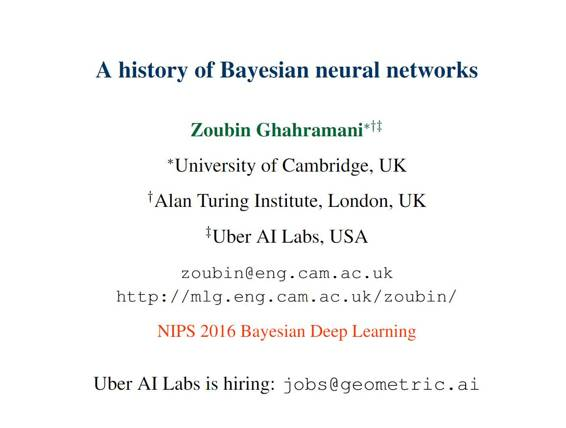

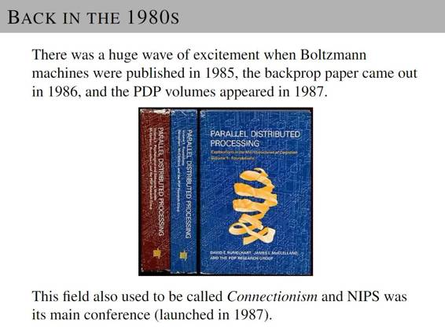

P4：上世纪八十年代的研究背景

*   《玻尔兹曼机》于 1985 年出版，1986 年反向传播网络论文发表，接着 1987 年 PDP 大量出现。这一领域过去也被称为连接机制，NIPS 是该领域的主要学术会议。

P5-P7：神经网络与深度学习简介

*   神经网络与深度学习系统在很多基准任务的表现优异，但是它也有以下缺陷：

*   需要大量数据（常常是数百万样本）

*   训练与部署的计算量大（云 GPU 资源）

*   不确定性表征得不太好

*   常常被对抗样本欺骗

*   对于优化很挑剔：非凸+架构选择，学习程序（procedure），初始化等等，还需要专家知识（expert knowledge）和实验 

*   过程黑箱，无法解释，缺少透明性，很难信任其结果。

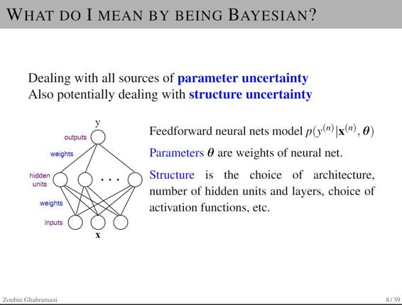

P8 -12：贝叶斯在这里有什么帮助

*   处理参数不确定性的所有来源 

*   具备处理结构不确定性的能力 

*   贝叶斯定理告诉我们要从数据（可衡量的量）当中做一些关于假设（不确定的量）的推理。

*   学习和预测都可以看作是推理的形式。

*   校正模型与预测不确定性：让系统知道它们何时不知道。

*   自动模型复杂性控制与结构学习（(Bayesian Occam's Razor)）

*   要清楚的一点是「贝叶斯」属于算法范畴，不是模型类。任何定义好的模型都可以用贝叶斯方法.

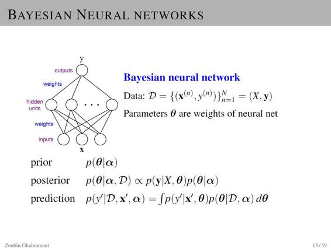

P13：贝叶斯神经网络

P14-16：贝叶斯神经网络的早期历史

贝叶斯神经网络的早期历史可以从以下几篇论文中了解：

*   John Denker, Daniel Schwartz, Ben Wittner, Sara Solla, RichardHoward, Lawrence Jackel, and John Hopfield. Large automaticlearning, rule extraction, and generalization. Complex Systems,1(5):877-922, 1987.

*   Nafitali Tishby，Esther Levin，and Sara A Solla. Consistent inference of probabilities in layered networks: Prediction and generalization. In IJCNN,1989. 

*   ......

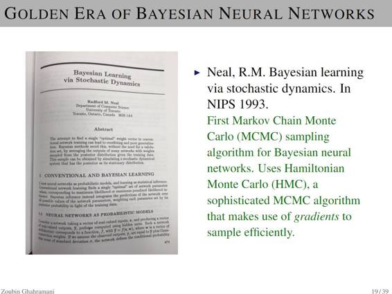

P17- 20 贝叶斯神经网络的黄金时期 

*   David JC Mackay 发表在神经计算（Neural Computation）上的一篇文章：A Pratical Bayesian Framework For Backpropagation Networks 揭开了这一时期的序幕。

*   Neal, R.M. 1995 年在多伦多大学的博士论文：Bayesian learning for neural networks. 这篇论文也奠定了贝叶斯神经网络 (BNN) 和高斯过程（Gaussian processes）以及自动相关决策机制（automatic relevance determination ,ARD）之间的关系。

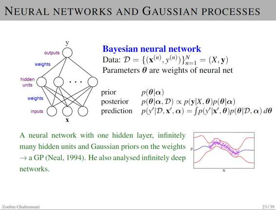 

P21-24 高斯过程与贝叶斯神经网络 

*   高斯过程可被用于回归、分类、排名等。

*   将郎格文动力学（Langevin dynamics，一种 MCMC 的形式）与随机梯度下降（SGD）结合起来得到一个基于 minibatch SGD 的高度可扩展的近似 MCMC 算法。

*   这样一来，贝叶斯推断就能像运行嘈杂的 SGD 那样简单。

*   一个带有一层隐藏层和无数隐藏单元的神经网络和权重高斯先验 

*   MacKay 和 Neal 的贡献将特征与架构选择与高斯过程联系起来 

P25- 28 贝叶斯神经网络中的变分学习（variational learning） 

*   Hinton 的一篇论文推导出一个贝叶斯网络权重的对角高斯变分近似，但是用最小描述长度信息理论语言进行描述。

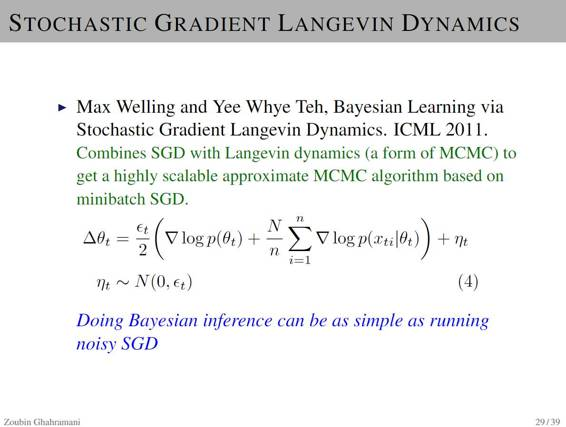

P29 随机梯度朗格文动力学（Langevin Dynamics）

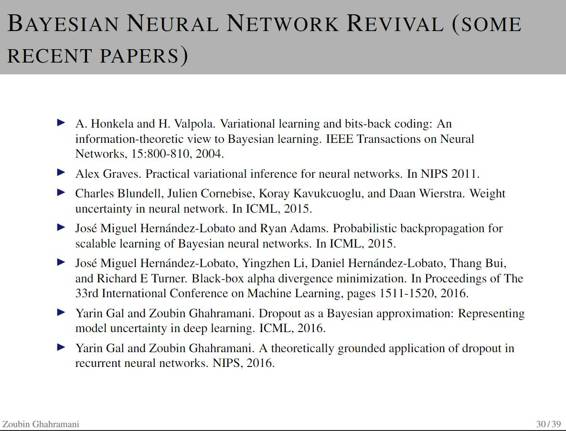

P30：贝叶斯神经网络的复兴

P31-32 概率方法什么时候变得非常重要？

*   学习的很多方面都非常依赖于不确定性的细致表征

P33 结论

概率模型为建立能从数据中学习的系统提供了通用框架

贝叶斯神经网络有很长的历史并且正在经历着复兴的浪潮 

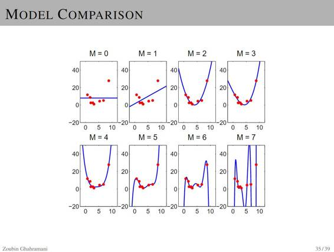
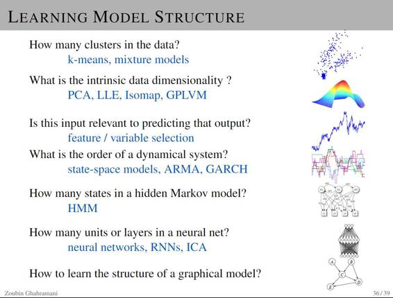 

P35-36 模型比较及学习模型结构 

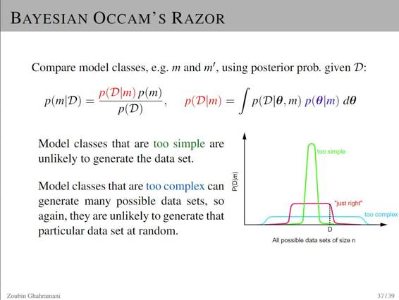 

P37-39 贝叶斯奥卡姆剃刀（Bayesian Occam's Razor）

*   模型类别太过简单就可能无法生成数据集。

*   模型类别较复杂可以生成很多可能的数据集，所以它们也不太可能随机生成某个特定的数据集。

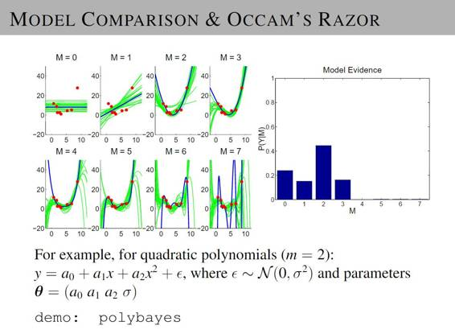

P40 模型比较和奥卡姆剃刀 

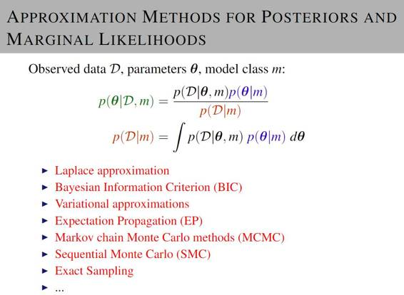

P41-42 边缘似然 (marginal likelihood) 和后验（posteriors）的近似方法（Approximation Methods） 

*   拉普拉斯近似（Laplace Approximation）

*   贝叶斯信息准则（Bayesian Information Criterion，BIC）

*   变分近似（Variational approximations）

*   期望传播 (Expectation Propagation，EP)

*   马尔科夫蒙特卡洛方法（Markov chain Monte Carlo methods，MCMC）

*   序列蒙特卡洛方法（Sequential Monte Carlo，SMC）

*   精确抽样（Exact Sampling）

*   ……

**点击阅读原文即可阅读完整 PPT**

***©本文由机器之心编译，***转载请联系本公众号获得授权***。***

✄------------------------------------------------

**加入机器之心（全职记者/实习生）：hr@almosthuman.cn**

**投稿或寻求报道：editor@almosthuman.cn**

**广告&商务合作：bd@almosthuman.cn**