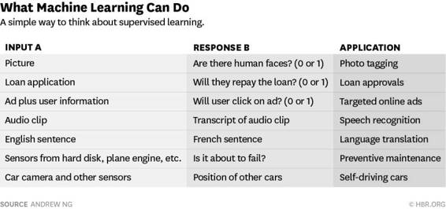

# 深度 | 百度首席科学家吴恩达刊文：人工智能的能力和不足

选自哈佛商业评论

**作者：吴恩达**

**机器之心编译**

**参与：蒋思源、吴攀**

> *今天，哈佛商业评论（HBR）网站发布了百度首席科学家吴恩达所写的一篇评论文章《What Artificial Intelligence Can and Can't Do Right Now》，介绍了目前在大数据支持下的人工智能对行业的颠覆性影响以及其尚待进步的不足之处。*

有很多高管问我人工智能到底能做什么？他们很想知道人工智能会怎样颠覆他们的产业以及他们可以怎样使用它来改变自己的公司。但是近来，有很多媒体都描绘了一幅不切实际的人工智能蓝图（也许人工智能不久就会接管世界）。人工智能现在已经转变了网页搜索、广告、电子商务、金融、物流、媒体等的运行方式。作为谷歌大脑团队的创办人、前斯坦福人工智能实验室主任、并且现在是百度 1200 多人的人工智能团队负责人，我很有幸培养了许多引领世界的人工智能团队，创造了许多服务上亿人的人工智能产品。我已经看到了人工智能的影响，我要说的是「人工智能将转变很多产业，但人工智能不是万能魔法。为了理解人工智能对你们的业务的转变，让我们抛弃那些大肆宣传的言论，看看人工智能究竟在今天能做些什么。」

令人惊讶的是，尽管人工智能已经有很大范围的影响了，但它在产业内的应用方式还极其有限。几乎所有人工智能最近的进步都是通过一种类型——即输入数据（A）然后快速生成简单的回应（B），比如：

 

能够输入 A 和输出 B 就将改变许多产业。这种构建由 A 到 B 的软件在技术术语上被称为监督学习（supervised learning）。A→B 这种系统距离科学幻想预示着的存在情感的机器人还差得很远，人类智能也远远比 A→B 系统高级得多。这些 A→B 系统已经在急速地发展，现在最有效的技术就是深度学习或者说是深度神经网络——它们都是在很宽泛的程度上是受大脑启发的。不过这些系统离科幻的系统还差得远。许多研究者也在探索其它形式的人工智能，其中一些的能力已经在一些特定环境下得到了证明；也许还存在实现更高级智能的突破口，但现在我们目前还没有实现这个目标的清晰路径。

现如今监督学习框架有一个致命弱点：它需要巨量的数据。人们需要给这个系统很多 A 和 B 的样本。比如说开发一个图片标注器需要成千上万的图片（A）及其可以说明图中是否有人存在的标签（B）。而开发一个语音识别系统也需要成千上万小时的输入语音（A）以及有语音转录文本（B）。

所以 A→B 系统能做些什么呢？关于其颠覆性影响，这里有一个经验法则：如果一个典型的人进行一项思考任务所需的时间少于 1 秒，那么也许我们现在或不远的将来就能用人工智能自动化这项任务了。

现在人们已经做了很多有价值的研究——检查监控视频以发现可疑行为、在汽车有可能撞到行人时紧急制动、查找并删除网上辱骂性的发帖——这些任务 1 秒之内就能完成。这些任务的自动化已经很成熟了。然而，这些都仅适合大环境或大业务流程，搞清楚其与你的业务中的其它部分的联系也是很重要的。

人工智能的运行需要小心翼翼地寻找 A 和 B，并为人工智能弄清楚 A→B 的关系提供必要的数据。寻找 A 和 B 就已经创造性地革命了许多产业，而它还有望带来更多革新。

在明白了人工智能能做什么和不能做什么之后，高管们就要将其和他们的策略相结合起来。这就需要理解价值是怎么创造出来的以及什么是难以复制的。人工智能社区是非常开放的，大部分研究者会发表并分享他们的观点甚至开源代码。在这个开源的世界，稀缺的资源是：

*   数据。在领导过的人工智能团队中，很多团队最多一两年就能复制其他团队的代码，但是要获得其他团队的数据是极其困难的。所以数据相比软件对大多数业务是更好建立的屏障。

*   人才。简单地下载和应用开源软件是没什么用的，你需要根据实际的业务场景和数据定制人工智能。这也就是现在出现了对那些能胜任这项工作的稀缺人才的争夺战的原因。

有很多分析都是从对人类的好处与坏处来描述人工智能的潜力。例如我们看到有人工智能能够进行对话来减少人类的孤独；我们也看到有的人工智能牵涉到了种族歧视问题。短期来看，人工智能对个人的最大负面影响是：随着我们能够使用人工智能自动化的工作远远超过了以前，人工智能可能会造成我们的失业。作为人工智能领域的领导者，我们义不容辞的事情是确保我们正在建立一个每一个个体都能自由发展的世界。这个进程中，明白人工智能能做什么以及怎样将其加入到你们的企业策略中只是一个开始，而不是结束。

******©本文为机器之心编译文章，***转载请联系本公众号或作者获得授权******。***

✄------------------------------------------------

**加入机器之心（全职记者/实习生）：hr@almosthuman.cn**

**投稿或寻求报道：editor@almosthuman.cn**

**广告&商务合作：bd@almosthuman.cn**