# 重磅 | 高盛百页人工智能生态报告：美国仍是主导力量，中国正高速成长（附下载）

选自高盛

**机器之心编译**

> *不久之前，高盛推出了一份讲解人工智能生态的重磅报告（共 99 页）。报告从最基本的人工智能概念开始，主要内容包括人工智能所能变革的行业、人工智能生态、使用案例、背后的主要驱动者（谷歌、亚马逊、英伟达、百度等）等，并附有高盛调查得到的 150 多家人工智能与机器学习公司列表。机器之心编译了报告的主要部分，点击阅读原文可查看完整报告。*

人工智能（AI）是信息时代的尖端技术。在最新的「创新简介」（Profiles in Innovation）系列文章中，我们将对机器学习和深度学习的进展进行研究考察。

在和更强大的计算资源以及不断扩增的数据结合以后，一些非相关行业的公司也能够接触到人工智能了。AI-as-a-service 的发展有可能开辟一块新的市场并打破云计算的市场。我们相信，在接下来几年，一个公司利用人工智能技术的能力将成为体现公司竞争力的一个属性，同时这种能力也将带来生产率的复苏。

**目录**

*   概要

*   什么是人工智能？（略）

*   价值创造的主要驱动力（略）

*   加强未来的生产率（略）

*   人工智能和生产率悖论：采访 Jan Hatzius（略）

*   生态系统：云服务，开源在未来的 AI 投资周期中的关键受益人

*   使用案例（略）

*   农业（略）

*   金融（略）

*   医疗（略）

*   零售（略）

*   能源（略）

*   驱动者

*   附录（业内公司列表）

*   披露附录

**概要**

人工智能是信息时代的尖端技术。从人类建立起需要指导控制才能运行的计算机，到计算机拥有可以自己去学习的能力，这一飞跃对各行各业都产生了巨大的影响。虽然此时此刻可能是下一个 AI 冬季（图 8）到来之前的「给予承诺又让人失望」的周期，但这些投资和新技术至少会给我们带来有形的机器学习生产力的经济利益。

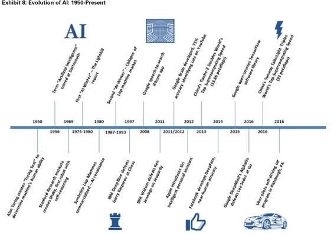 

与此同时，人工智能、机器人和无人驾驶汽车已经成为了流行文化甚至是政治话语的前沿。而且我们在过去一年的研究使我们相信这不是一个错误的开始，而是一个拐点。正如我们将在本报告中探讨的那样，这个变化的原因有显而易见的（更快更强的计算资源和爆炸式增长的数据库），也有细致入微（深度学习，专有硬件和开源的崛起）的。

这个 AI 拐点（AI inflection）中更令人兴奋的一个方面是「现实世界」的使用案例比比皆是。虽然深度学习使计算机视觉和自然语言处理等技术有了显著的提高，比如苹果公司的 Siri，亚马逊的 Alexa 和 Google 的图像识别，但是 AI 不仅仅是「科技技术」（tech for tech），也就是大数据集与足够强大的技术相结合的情况下，价值正在被慢慢创建，竞争优势也变得越来越明显。

例如，在医疗保健中，图像识别技术可以提高癌症诊断的准确性。在农业中，农民和种子生产商可以利用深度学习技术来提高作物产量。在制药业中，深度学习可以用于改善药物的研发。在能源方面，勘探效率正在提高，设备可用性正在不断增强。在金融服务方面，通过开辟新的数据集，实现更快的分析，从而降低成本，提高回报。AI 现在还处于发现其可被利用场景的早期阶段，这些必要的技术会通过基于云的服务实现大众化、平等化，我们相信随之而来的创新浪潮将在每个行业中创造新的赢家和输家。

AI 的广泛应用让我们得出了一个结论：它是一种可以变革全球经济的技术，是提高生产力并结束美国生产率停滞增长的驱动力。结合 GS 首席经济学家 Jan Hatzius 的研究，我们明确了资本深化目前的停滞及其对美国生产率的相关影响。我们相信，AI 技术将会驱动生产力的提高，就像 20 世纪 90 年代那样，驱动企业投资更多的资本和劳动密集型项目，加快发展的脚步，提高盈利能力以及提高股票的估值。

**启示**

虽然我们看到了人工智能可以及时地影响到每个公司、行业和一部分经济，但对投资者而言，我们认为这其中有四个影响最为显著。

生产率。AI 和机器学习具有激发生产率增长周期的潜力，这会有利于经济的增长，提升企业的盈利能力，资本回报率和资产估值。根据 GS 首席经济学家 Jan Hatzius 所说：「大体上而言，AI 看起来似乎比上一次创新浪潮更有可能在统计数据中捕捉到更有价值的东西，人工智能可以降低成本，减少对高附加值生产类型的劳动投入。举个例子，这些在商业部门成本节约上的创新可能比在 iPhone 中增加应用程序的可用性和多用性更利于统计学家去捕获有价值的东西。考虑人工智能对商业部门的成本结构的广泛影响，我有理由相信它会被统计学家接受，并且会出现在整体生产力数据中。」

尖端技术。AI 和机器学习在速度上的价值有利于构建一种在建设数据中心和网络服务时让硬件更便宜的趋势。我们认为这可能推动硬件，软件和服务支出的市场份额的大幅度改变。例如，在「标准」数据中心计算资源上运行的 AWS 工作负载的成本低至 $ 0.0065 /小时，而在使用 AI 优化过的 GPU 上运行的成本为 0.900 美元一小时。

竞争优势。我们看到了 AI 和机器学习具有重新调整每个行业的竞争秩序的潜力。未能投资和利用这些技术的管理团队在和受益于战略智能的企业竞争时，有很大可能会被淘汰掉，因为这些技术可以让企业的生产力提高，并为它们创造资本效益。在第 41 页开始的短文中，我们将研究这些竞争优势是如何在医疗保健、能源、零售、金融和农业等领域发展起来的。

创办新公司。我们发现了 150 多家在过去十年中创建的人工智能和机器学习公司（附录 69-75）。虽然我们相信人工智能的大部分价值都掌握在具有资源、数据和投资能力的大公司手中，但我们也期望风险投资家、企业家和技术专家可以继续推动新公司的创立，从而促进实质性的创新和价值创造，即使最后创业公司会被收购。当然我们也不能忽视人工智能巨头（人工智能领域的谷歌或 Facebook）的出现。

在接下来的篇幅中，我们将深入探讨 AI 的技术，历史，机器学习的生态系统以及这些技术在行业和领头公司中的应用。

**什么是人工智能？**

人工智能是做出能够以人类智能的方式学习并解决问题的智能机器和计算机程序的理工科。传统而言，该领域包括自然语言处理与翻译、视觉感知与模式识别，以及决策制定。但该领域以及应用的复杂度都在急剧扩展。

在此报告中，我们的大部分分析集中在机器学习（人工智能的一个分支）与深度学习（机器学习的分支）上。我们强调两点：

1.  简言之，机器学习是从样本和经验（即数据集）中进行学习的算法，而不是依靠硬编码和预先定义的规则。换言之，也就是开发者不再告诉程序如何区分苹果和橘子，而是向算法输入数据（训练），然后自己学习如何区分苹果和橘子。

2.  深度学习的重大发展是人工智能拐点背后的主要驱动。深度学习是机器学习的一个子集。在大部分传统的机器学习方法中，特征（即有预测性的输入或属性）由人来设计。特征工程是一大瓶颈，需要大量的专业知识。在无监督学习中，重要特征并非由人预定义，而是由算法学习并创造。

为了更加明了，我们不注重真人工智能、强人工智能或通用人工智能这样的概念，它们意味着复制人类智能，也经常出现在流行文化中。虽然已经有了一些有潜力的突破，比如谷歌 DeepMind 的 AlphaGo 系统，我们还是更注重立即有实在经济的人工智能发展。

**为何人工智能发展加速？**

深度学习能力的极大发展是如今人工智能拐点背后的催化剂之一。深度学习的底层技术框架——神经网络，已经存在了数十年，但过去 5 到 10 年的 3 种东西改变了深度学习：

**1\. 数据。**随着全球设备、机器和系统的连接，大量的无结构数据被创造出来。神经网络有了更多的数据，就变得更为有效，也就是说随着数据量增加，机器学习能够解决的问题也增加。手机、IoT 、低成本数据存储和处理（云）技术的成熟使得可用数据集的大小、结构都有了极大增长。例如，特斯拉收集了 780mn 英里的驾驶数据，而且通过他们的互连汽车，每 10 小时就能增加 100 万英里的数据。此外，Jasper 有一个平台，能让多家汽车制造商和电信公司进行机器间的交流，这家公司于今年 2 月份被 Cisco 收购。Verizon 在 8 月份做了类似的投资，宣布收购 Fleetmatics，Fleetmatics 做的是将汽车上的远程传感器通过无线网络连接到云软件。未来，5G 网络的上线将会加速数据生成与传输的速率。据 IDC 的 Digital Universe Report 显示，年度数据生成预期到 2020 年达到 44zettabytes，表明我们正在见证应用这些技术的使用案例。

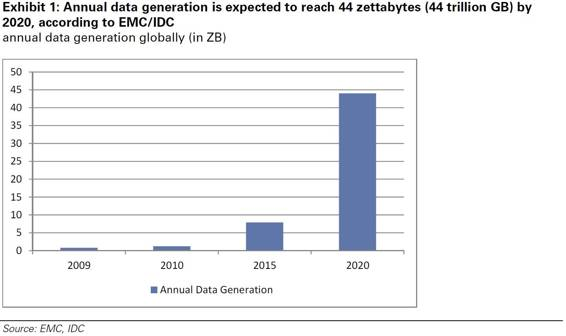

*图 1：年度数据生成预期到 2020 年达到 44zettabytes*

**2\. 更快的硬件**。GPU 的再次使用、低成本计算能力的普遍化，特别是通过云服务，以及建立新的神经网络模型，已经极大的增加了神经网络产生结果的速度与准确率。GPU 和并行架构要比传统的基于数据中心架构的 CPU 能更快的训练机器学习系统。通过使用图像芯片，网络能更快的迭代，能在短期内进行更准确的训练。同时，特制硅的发展，比如微软和百度使用的 FPGA，能够用训练出的深度学习系统做更快的推断。另外，从 1993 年开始超级计算机的原计算能力有了极大发展（图 2）。在 2016 年，单张英伟达游戏显卡就有了类似于 2002 年之前最强大的超级计算机拥有的计算能力。

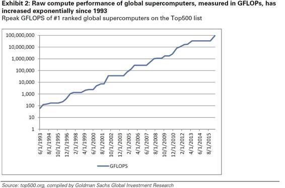

*图 2：全球超级计算机的原计算性能，以 GFLOPs 测试*

成本也有了极大的降低。英伟达 GPU（GTX 1080）有 9 TFLOPS 的性能，只要 700 美元，意味着每 GFLOPS 只要 8 美分。在 1961 年，串够 IBM 1620s 每提供 1 GFLOPS 需要的钱超过 9 万亿。

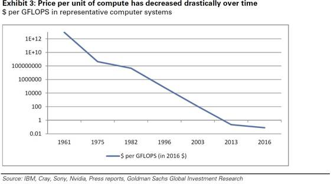 

*图 3：每单位计算的价格有了极大下降*

**3\. 更好、更普遍可用的算法**。更好的输入（计算和数据）使得更多的研发是面向算法，从而支持深度学习的使用。例如伯克利的 Caffe、谷歌的 TensorFlow 和 Torch 这样的开源框架。比如，刚开源一周年的 TensorFlow，成为了 GitHub 上有最多 forked repositories 的框架。虽然不是所有的人工智能发生于普遍可用的开源框架中，但开源确实在加速发展，而且也有更多先进的工具正在开源。

**方向**

虽然本报告的重点是人工智能的发展方向以及公司如何把握这个方向，但是了解人工智能对我们生活的影响程度也是很重要的。

**在线搜索**。就在一年多以前，谷歌透露，它们已经开始将大量的搜索工作移植到了 RankBrain（一个人工智能系统），使其和链接（links）以及内容（content）成为了谷歌搜索算法的三个最重要的标志。

**推荐引擎**。Netflix，亚马逊 和 Pandora 都在使用人工智能来确定推荐什么样的电影和歌曲，突出哪些产品。5 月，亚马逊开源了它们的深度可扩展稀疏传感网络引擎（the Deep Scalable Sparse Tensor Network Engine（DSSTNE），简称「Destiny」），它被用于产品推荐，同时可以被扩展以实现超越语言和语言理解以及异议识别的目的。

**人脸识别**。Google（FaceNet）和 Facebook（DeepFace）都投入了大量的技术来确定您的照片中的人脸和真实的人脸是不是几乎完全吻合。1 月，苹果采取了进一步措施，购买了 Emotient（一个致力于通过读取人的面部表情来确定其情绪状态的 AI 创业公司）显然，这些技术远远不止于对照片进行标记。

虽然个人助理应用产品有无数的用户，比如苹果的 Siri，信用贷，保险风险评估，甚至天气预测。在接下来的篇幅中，我们探讨企业该如何使用这些技术来加速增长，降低成本和控制风险。从这些技术及其使用这些技术的应用的发展速度来看，它们充其量不过可以为公司和投资者提供一些方向，以保持他们的竞争力。

**加强未来的生产率**

美国的劳动生产率在 90 年代中期的快速增长和过去十年的缓慢增长和之后，近年来已经停止增长了。我们认为，就像 20 世纪 90 年代互联网技术被广泛采用那样，消费类机器学习和人工智能的扩散有可能大幅度地改变全球产业的生产范式。

在整个行业中，我们发现在自动化的促使下，劳动时间减少了约 0.5％-1.5％，同时，由于 AI / ML 技术带来的效率增益，到 2025 年，这些技术将对生产力增长产生高达 51-1154 个基点（bps）的影响。虽然我们期望 AI / ML 可以随着时间同时提高生产率的分母和分子，不过我们认为最重要的是，早期的影响将是低工资任务的自动化，即以更少的劳动时间推动类似的产出增长水平。我们的基本案例 AI / ML 驱动提高了 97 个基点，这意味着 2025 年的增长生产率中的 1.61％ 将由 IT 贡献，比 1995 - 2004 年高出 11 个基点（图 9,10）。

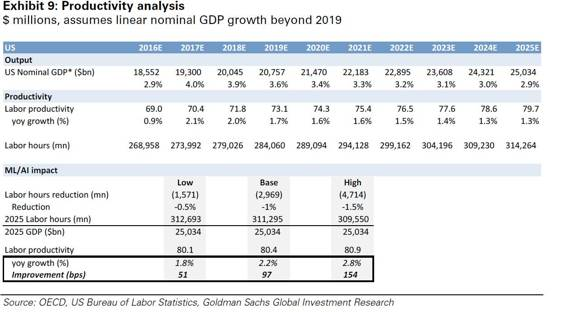 

*图 9：生产力分析；单位百万美元，假设 2019 年之后 GDP 线性增长*

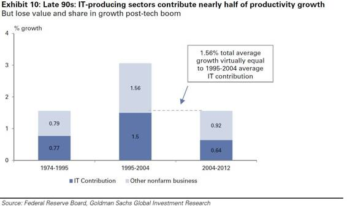

**生态系统：云服务，开源在未来的 AI 投资周期中的关键受益人**

我们相信，在未来的几年中，一个公司利用人工智能技术的能力将成为体现公司在所有主要行业竞争力的一个属性。虽然战略会因公司规模和行业而有所不同，但如果管理团队不会把重心放在领导人工智能和在此基础上的利益上，那么未来产品创新、劳动效率和资本杠杆都会存在落后的风险。因此，我们认为公司需要投资这些新技术以保持竞争力，同时这将导致对人工智能所以依赖的人才、服务和硬件的空前的需求。

作为比较，20 世纪 90 年代技术驱动的生产力繁荣推动了相应的激增。增加对技术的资本支出导致了新的企业和业务的增加来捕获这些资本支出。在不可避免的行业整合发生之前，成立软件、硬件和网络公司开始发生转变。下图 13 突出了软件行业内的这种模式。在 1995 - 1999 年期间，在通货膨胀调整后，市值在 20 亿美元到 50 亿美元之间的公共软件公司的数量几乎增加了两倍，在 2000 年代中期才得到巩固。

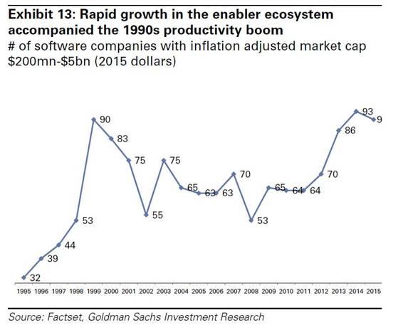 

*图 13：伴随 20 世纪 90 年代生产力激增的驱动者生态系统（enabler ecosystem）*

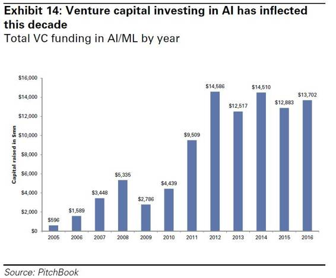 

*图 14：这十年来，投资人工智能的风险资本出现了暴增*

我们看到了由 AI 驱动的生产率具有产生下一个相似的繁荣周期的潜力，可以通过利用这些潜力，把软件、硬件、数据和服务提供商作为商业投资来创造价值。如上图 14 所反映的那样，与 AI 相关的初创企业的风险投资在这十年中急剧增加。AI 企业投资的繁荣现象的巨大潜力也开始推动整合。尤其是云平台对 AI 相关人才进行了大量投入，自 2014 年以来，谷歌、亚马逊、微软和 Salesforce 共进行了 17 项与 AI 相关的收购（下图）。

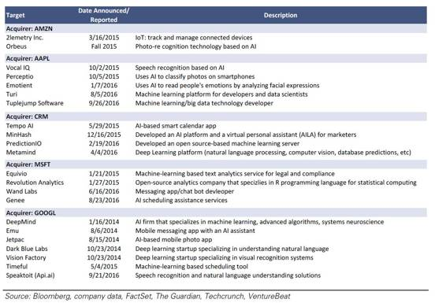

在上下文中对 AI 和 ML 技术的发展和历史技术周期的比较中，我们看到了前者的一些益处。与过去 50 年的其他主要技术的周期一样，计算（和摩尔定律）一直是进步的抑制剂和推动者。例如，在系统架构方面，我们目睹了从大型机系统转变为客户端-服务器模型的整个过程，并且近年来已经开始被云/移动模式所取代。这种进化的驱动因素是计算能力、存储容量和带宽的改进。每个转换都伴随着应用开发的转变，包括各种新编程语言的出现和演变（见图表 15）和各种可能的应用程序各种的类型。如上下文中所提及的一样，AI 这个概念已经存在几十年了，其中神经网络的概念出现在 20 世纪 60 年代，虽然直到最近几年，计算能力才开始让神经网络能在实际环境中使用。我们相信我们正处于 AI 平台的早期阶段，就如同 20 世纪 50 年代大型机才开始商业化到 21 世纪的智能手机和云的商业化。随着平台曲线的变化（我们认为它正在发生），应用程序、工具和服务驱动者（enabler）会爆炸式增长，我们将在下面更详细地讨论。

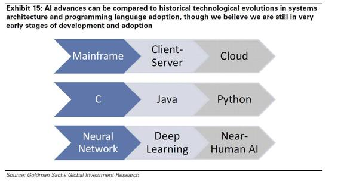

*图 15：人工智能的发展可以与历史上的系统架构和编程语言的采用的技术革命相比，尽管我们认为我们目前仍然处在人工智能发展和应用的早期阶段*

**stack 的演变过程以及和 AI 之间的对应关系**

蓝色 =专有供应商，橙色 =开源，绿色 =云服务（注意：一些供应商，如 IBM 和 Microsoft 都是专有服务和云服务）

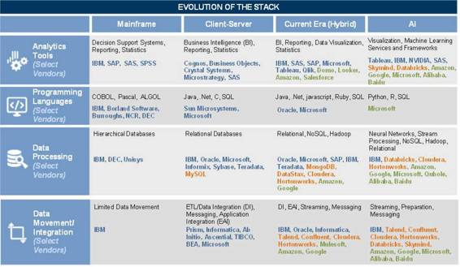 

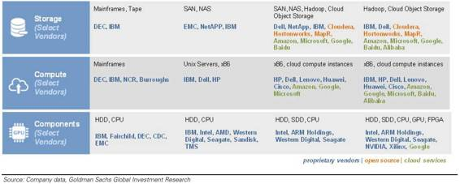 

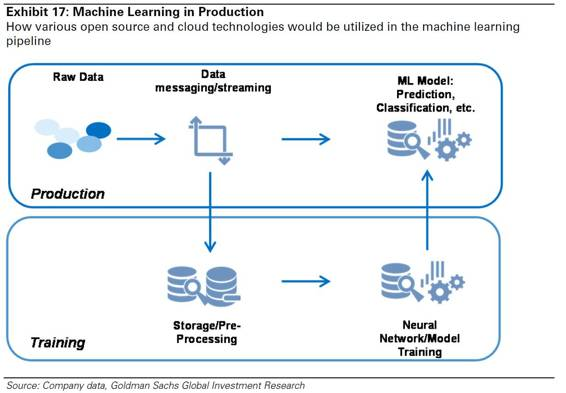 

*图 17：生产中的机器学习：如何在机器学习管道中利用各种开源和云技术*

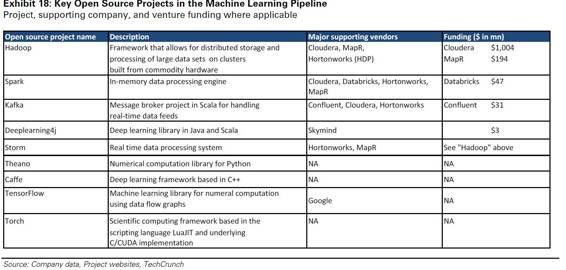 

*图 18：机器学习管道中的关键开源项目。可用的项目\支持公司和风险投资*

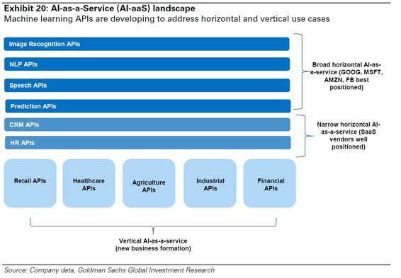 

*图表 20：人工智能即服务（AI-as-a-Service（AI-aaS））概览：机器学习 API 正在被开发以解决水平和垂直使用案例*

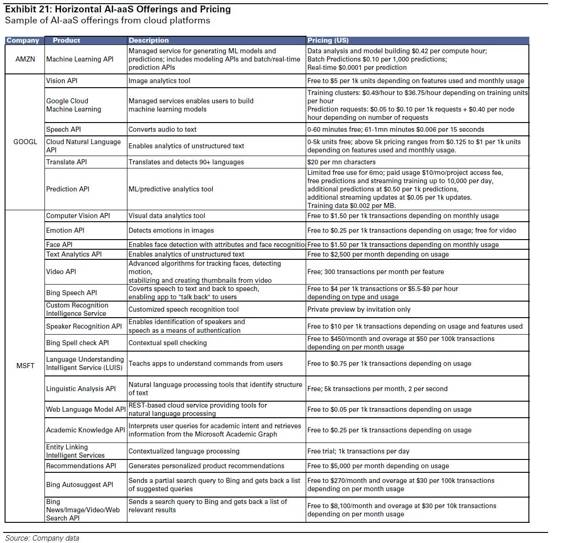 

*图表 21：水平 AI-aaS 产品和定价：来自云平台的 AI-aaS 产品示例*

**中国人工智能现状**

 iResearch 预测，2020 年，中国人工智能市场将从 2015 年的 12 亿人民币增长至 91 亿人民币。2015 年，约 14 亿资本（年增长率 76%）流入了中国的人工智能市场。

在政府政策方面，中国的国家发展改革委员会（发改委）和其他相关政府机构于 2016 年 5 月 18 日发布了《「互联网+」人工智能三年行动实施方案》。《方案》指出了人工智能领域发展的六大保障措施，包括资金支持、标准体系、知识产权保护、人才培养、国际合作和组织实施。《方案》提出，到 2018 年，中国的人工智能基础资源与创新平台、产业体系、创新服务体系、标准化体系应基本建立。发改委期望中国人工智能产业整体与国际同步，系统级别（system-level）的人工智能技术和应用要位于市场领先位置。

中国已经做出一些重大举措，而且根据提及「深度学习」和「深度神经网络」的被引用期刊论文数量，2014 年，中国已经超越美国（Exhibit 23）。中国拥有世界领先的语音和视觉识别技术，其人工智能研究能力也令人印象深刻（Exhibit 24）。百度于 2015 年 11 月发布的 Deep Speech 2 已经能够达到 97% 的正确率，并被《麻省科技评论》评为 2016 年十大突破科技之一。另外，早在 2014 年香港中文大学开发的 DeepID 系统就在 LFW 数据库中达到了 99.15% 的面目识别正确率。

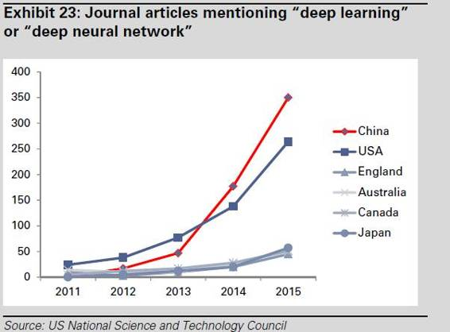 

*Exhibit 23：提到「深度学习」或者「深度神经网络」的期刊文章*

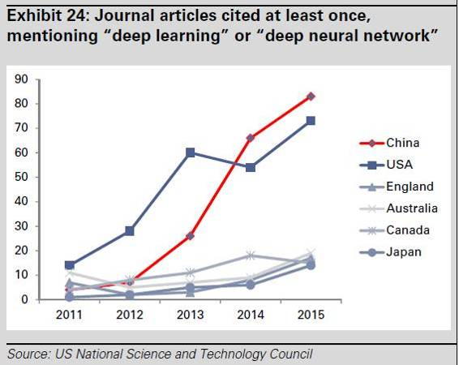 

*Exhibit 24：至少被引用一次的、并提到「深度学习」或者「深度神经网络」的期刊文章*

中国的互联网巨头百度、阿里巴巴和腾讯（BAT）正在领导中国的人工智能市场，同时数以百计的初创公司也正渗透到这一产业中，并在各种人工智能细分市场及应用领域建立服务模型。目前，中国的人工智能领域包括：

1.  基本服务，如数据资源和计算平台；

2.  硬件产品，如工业机器人和服务机器人；

3.  智能服务，如智能客户服务和商业智能；以及

4.  技术能力，如视觉识别和机器学习。

根据 iResearch，目前，语音和视觉识别技术分别占中国人工智能市场的 60% 和 12.5%。在中国，所有和人工智能相关的公司中，71% 专注于开发应用。其余的公司专注算法，其中，55% 的公司研究计算机视觉，13% 研究自然语言处理，9% 致力于基础机器学习。

我们认为，人工智能前沿的重要参与者可能会继续来自美国和中国。

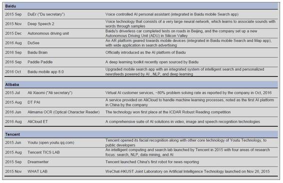 

**百度：**

*   2015 年 9 月，百度「度秘」：声控人工智能个人助理（整合进百度移动搜索应用）

*   2015 年 11 月，百度 DeepSpeech 2：包含一个大型神经网络的语音技术，通过样本学会将声音与语词联系起来

*   2015 年 12 月，百度无人车：百度无人车在北京道路上完成测试，并在硅谷设立自动驾驶部门（ADU）

*   2016 年 8 月，百度「DuSee」：为移动设备打造的 AR 平台（整合进百度搜索和地图移动应用），在搜索广告方面有着广泛应用

*   2016 年 9 月，百度大脑：官方介绍，百度的人工智能平台

*   2016 年 9 月，Paddle Paddle：百度近期开源的深度学习工具包

*   2016 年 10 月，百度移动应用 8.0：新升级的移动搜索应用，内含一个整合了智能搜索和个性化新闻推荐的系统，其背后采用了人工智能、自然语言处理和深度学习技术

**阿里巴巴：**

*   2015 年 7 月，阿里小蜜「阿里小秘书」：虚拟人工智能客服，据公司 2016 年 10 月报告，问题解决率已达到 80%

*   2015 年 8 月，DT PAI：基于阿里云的服务，用来处理机器学习过程，被该公司称为是中国的第一个人工智能平台

*   2016 年 6 月，阿里妈妈光学字符识别：该技术获得文档分析与识别国际会议（ICDAR）Robust Reading 比赛第一名

*   2016 年 8 月，阿里云 ET：一套综合的人工智能解决方案套件，包括视频、图像和语音识别技术

腾讯：

*   2015 年 6 月，优图：腾讯为开发者开放了其面部识别技术，以及优图科技的其他核心技术

*   2015 年 8 月，腾讯 TICS 实验室：2015 年腾讯设立的智能计算和搜索实验室，专注于四个方面：搜索、自然语言处理、数据挖掘和人工智能

*   2015 年 9 月，Dreamwriter：腾讯上线中国第一个新闻报道机器人

*   2015 年 11 月，WHAT 实验室：微信-香港科技大学人工智能联合实验室，于 2015 年 11 月 26 日成立

**人工智能生态：关键参与者**

**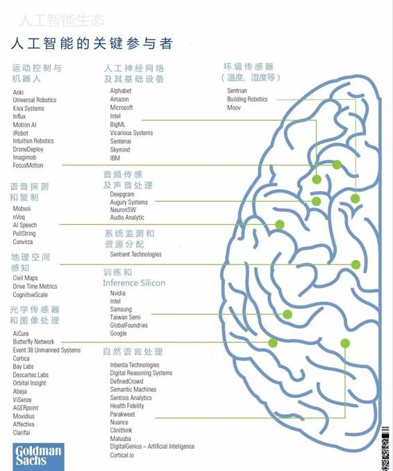** 

**人工智能生态：使用案例与潜在机会**

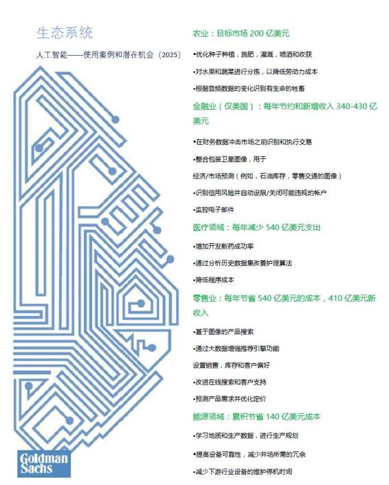

**创新人工智能的驱动者：谷歌、亚马逊**

**谷歌在做些什么？**

谷歌的搜索算法在过去二十年里进展迅速。从 1998 年的 PageRank 到 2015 年的 RankBrain，基于链接的网络排名已经进化成人工智能驱动下的查询匹配系统，后者能够不断适应那些独特的搜索（占谷歌所有搜索的 15%）。在云技术方面，公司五月份公布了针对平台的定制化硬件加速器方面取得的进展，一种定制化的 ASIC，亦即 TPU，这一进展对 2015 年开源的机器学习软件库 TensorFlow 进行了补充。过去三年中，在与人工智能相关的收购战中，公司也当仁不让。被收购的公司中，最知名的当属 DeepMind，它提升了 Alphabet 的神经网络功能并已经将其应用于各种人工智能驱动的项目中。

*   **为何重要？**

在搜索中使用算法，谷歌可谓先行者。将自然语言处理应用到配备用户搜索意图和可欲结果方面，公司一直处于领先地位，这也不断加强了公司在该领域的竞争优势。在进一步推进人工智能领域的融合。在促进人工智能一体化（AI integration）方面，公司的开源应用 TensorFlow 已经为其他云平台以及研究社区利用公司资源提供了先例。同时，谷歌正通过自身优势，比如 TPU，充分利用开源世界为公司提供竞争优势，尽管其机器学习库是开源的。因为 DeepMind, 公司提升了端到端的强化能力；2015 年末击败职业围棋选手的 AlphaGo。将人工智能带到更为广泛的研究社区，同时也通过软硬件方面的自身优势进行创新，谷歌是最好例子。

**亚马逊在做什么？**

亚马逊正在公司内部和云端使用机器学习技术。2015 年 4 月，公司发布 Amazon ML，这款机器学习服务能够为对云数据的使用提供机器学习功能（无需之前的客户经验）。公司紧随谷歌的开源步伐，今年 5 月开源了 DSSTNE，一个针对推荐深度学习模型的的库。通过改善搜索、定制化产品推荐以及语音识别、增加有质量的产品评价，公司内部也在使用机器学习改善端到端的用户体验。

*   **为什么重要？**

借助 AWS，亚马逊成为全球最大的云服务商，可能也是最成熟的人工智能平台。借助 Amazon ML，公司成为作为服务的人工智能（AI-as-a-service）生态系统的领先者，将复杂的推理能力带到之前几乎没有机器学习经验的公司办公室当中。无需基于定制的复杂应用，AWS 用户就能使用机器学习训练模型，评估以及优化潜力。亚马逊推荐引擎使用了机器学习，在匹配用户意图以及可欲结果方面，具有竞争优势，也为公司创造了商机。公司正更加高效地利用收集到的数据合理化用户购物体验，也让电子商务体验更具互动性。随着 DSSTNE 的开源，亚马逊也与其他科技巨头一起，推动科技社区的人工智能进步。

**苹果在做什么？**

去年，苹果已经成为最活跃的人工智能公司收购商，比如 Vocal IQ, Perceptio, Emotient, Turi, 以及 Tuplejump。几乎同时收购了 Vocal IQ 和 Perceptio，公司请来了 Johnathan Cohen，当时还是英伟达 CUDA 库以及 GPU 加速软件项目的负责人。近期，据报道，公司请来 Ruslan Salakhutdinov 担任人工智能研究总监，这也标志着公司人工智能战略的转型。在此之前，公司最初人工智能成果之一是 Siri , 第一款嵌入移动技术的虚拟助手，2014 年，其语音识别技术被移入神经网络系统。

*   **为什么重要？**

直到去年，苹果已经取得相对专有的机器学习成就；2015 年 10 月，Bloomberg Businessweek 报道，在大众消费方面，苹果研究人员还没发过一篇与人工智能有关的论文。不过，这一策略转型多少与新的、与人工智能相关的雇佣与收购有关，科技记者 Steven Levy 在 Backchannel 的一篇报道强调公司已经在人工智能领域活跃一段时间了。特别是，公司收购 Turi 突出了公司要按规模推进非结构数据和推论，以及开放给更为广泛的人工智能研究社区。这次收购，配以基于收购公司技术的较小应用，反映出苹果致力于用这些新技术创新公司产品。

**微软在做什么？**

CEO Satya Nadella 表示，微软正在大众化人工智能（democratizing AI）。公司的人工智能和研究团队（总人数大约 5 千多），关注改变人类体验和与机器的互动。微软已经积极地将新的、融合人工智能的功能嵌入公司核心服务中，并在对话计算（比如 Cortana）、自然语言处理（SwfitKey）等方面取得进展。公司正进一步打造基于 GPU 和 FPGA 的云（Azure），在公司所谓的更高水平的人工智能服务，比如语音识别、图片识别以及自然语言处理当中，为机器学习提供动力和速度。

*   **为什么重要？**

两个单词：人工智能大众化（democratizing AI）。由于这个行业中的公司将研究计划甚至库开放给人工智能研究社区，微软发明了这一表述，用来解释许多领先的人工智能创新者的举动。去年，微软在人工智能领域颇为活跃，正式发布了产品以及研究计划，并宣布了一个新的人工智能和研究小组（2016 年 9 月下旬）。微软的 FPGA 表现突出了人工智能可以为普通商业或个人带来什么；不到十分之一秒，它就翻译完了整个维基百科（30 亿个单词和 500 万条条款）。而且伴随着虚拟助理 Cortana, Siri, Alexa 以及其他助理之间的竞争，进一步将人工智能研发融入广泛使用的产品中去，通过产品进步吸引客户似乎是必须的。

**Facebook 在做什么？**

Facebook 人工智能研究部门（FAIR，2013 年）的策略是在更广泛的研究社区背景下研发技术。这个团队以推进无监督表征学习（比如，观察世界、而不是借助人类算法干预，借助对抗网络进行学习）的进步而为众人所知。应用机器学习部门（AML）在 FAIR 之后成立，聚焦将研究应用到公司产品中，时间限制为月或季度（而不是年）。公司正将机器学习功能应用到各种垂直领域中，比如面部识别，机器翻译以及深度文本（DeepText）语言或文本学习。

*   **为什么重要？**

公司已经发布了多个无监督学习方面的研究成果，随着机器学习超越从「正确答案」中学习，开始聚焦独立的模式识别，无监督学习已经成为一个重要的焦点领域。无监督学习有望去除更多的、与大数据有关的人类成分，公司在 Yann Lecun 的带领下，正引领该领域的研究。今年五月，公司发布的 FBLearner FLow 合理化了端到端 UI（从研究到工作流程、实验管理以及视觉化和比较输出）。公司的人工智能项目和工作流程应用不限于 AML 成员，公司各部门领域都可以使用借鉴。这样一来，公司就可以利用研究部门之外所取得的人工智能进步。

**Salesforce 在做什么？**

在 2014 年和 2015 年，Salesforce 开始解释自己的 Apex 开发平台如何可被用在 Salesforce1 云上完成机器学习任务。从此，该公司开始在人工智能上投入更多的资源，收购了多家人工智能公司，包括 Minhash、PredictionIO 和 MetaMind。在 9 月份，Salesforce 推出了 Einstein——一个面向多平台的基于人工智能的云计划。该计划专注于将人工智能融入销售云、市场云、服务云、社区云、IoT 云和 app 云。

*   **为什么重要？**

Salesforce Einstein 有潜力促进商业使用数据的方式。在销售云中，该公司希望让各个组织通过预测销售线索得分、洞见机会以及自动捕捉活动来优化销售机遇。市场和服务云将提供预测参与度得分，来分析消费者使用情况。还能提供预测客户，从而帮助定位市场，并基于趋势和用户历史通过自动案例分类更快解决消费者服务事件。Salesforce 用微妙的使用案例将机器学习带到云中，强调它对公司核心竞争力的影响。

**英伟达在做什么？**

英伟达已经从之前电子游戏 GPU 生产商转型为机器学习应用硬件厂商。2015 年年底，公司表示，较之使用传统 CPU，使用了 GPU 神经网络的训练速度提升了 10 到 20 倍。尽管英特尔重金投入的 FPGA（作为 GPU 的替代产品）加入硬件市场角逐，但是，GPU 的机器学习应用能实现更加密集的训练。相对而言，FPGA 可以提供更快、计算密集程度更低的推理和任务；这说明市场会根据实际应用案例区分对待。过去五年，到 2016 年 6 月为止，英伟达所占 GPU 市场份额已经从二分之一上升到近四分之三。

*   **为什么重要？**

在人工智能创新公司和学术机构中，GPU 加速的深度学习一直是许多项目的前沿。英伟达所占据的市场份额意味着，随着人工智能越来越成为未来几年中大型商务的中心议题，公司可以从中获益。使用公司产品的一个例子，俄罗斯的 NTechLab，使用 GPU 加速的深度学习框架来训练面部识别模型，识别密集集会中的个人，并在 AWS 中利用这些 GPU 进行推理。

作为一种选择，许多大学也使用英伟达 Tesla 加速器来模拟可能的抗体突变，这种变异可能会击败进化中的伊波拉病毒，将来研究会进一步关注流感病毒。

**英特尔在做什么？**

英特尔的战略比较独特，其使用的案例多种多样。2016 年年中，公司发布了第二代 Xeon Phi 产品系列，以其高性能计算（HPC）能力著称，它可以让人工智能扩展到更加大型的服务器网络和云端。在硬件不断进步的同时，公司也下重金投资 FPGA，这主要归功于其推理速度和灵活的可编程性。英特尔令人瞩目的收购包括 Nervana（深度学习），以及 Altera——该公司将 FPGA 的创新带入了英特尔。

*   **为什么重要？**

英特尔关注 FPGA 创新补足了英伟达对 GPU 的关注。当处理大型数据库（微软等许多大公司用来测试大数据分析的边界），FPGA 能够提供更加快速的推理速度。在物联网的应用环境中，公司也宣布了一个计划，旨在将学习技术融入可穿戴微芯片中（显然是通过 Xeon Quark）。物联网和人工智能的衔接有助于为公司和个人日常使用案例的数据搜集机制提供机器学习解决方案。

**Uber 在做什么？**

Uber 正在使用机器学习优化 UberX ETA 以及接送地点的准确性。为了实现这一点，需要数百万之前搭乘记录的数据点来探测常规交通模式，从而可以相应调整 ETA/接送地点。今年 9 月，Uber 展开了一个自动驾驶试点项目，地点位于匹兹堡，由来自 CMU 的研究人员（受雇于 Uber）负责该项目，很多大型汽车制造商业参与了进来。该公司还和沃尔沃达成了一项合作（金额 300 万美元），研发协作也为这个试点项目提供了机遇。不过，公司并不止步于小轿车。公司收购了一家自动卡车创业公司 Otto，今年十月在科罗拉多，公司试点快递了 5 万瓶啤酒。

*   **为什么重要？**

Uber 的机器学习负责人 Danny Lange 在接受 GeekWire 的采访中提及，他们的团队正在将这种技术无缝供给公司的其他团队，这些团队无需具备机器学习背景就可以使用 APIs。这也能让公司不同部门能高效利用机器学习基础架构，例如，UberX、UberPool、UberEats 以及自动驾驶工具都使用到了公司的人工智能技术。

**IBM 在做什么？**

IBM 在全球有 3000 多名研究人员。过去十年，IBM 在认知计算上超过有 1400 项专利，下一代云上有 1200 项，在硅/纳米科学上有 7200 项专利。IBM Watson 利用自然语言处理机器学习技术识别模式，并提供在非结构数据上的洞见，据该公司表示这代表如今所有数据的 80%。其他 Watson 产品包括 Virtual Agent，一个响应分析的自动消费者服务体验；Explorer，这是一个分析并连接大量不同数据集的工具。

*   **为什么重要？**

IBM 一直是该领域的先驱，有着极大的成就，包括上世纪 90 年代的 DeepBlue 和 2011 年的 Watson。Watson 的应用包括医疗中的病人治疗分析，基于 twitter 数据的股票推荐，零售中消费者的行为分析，以及对抗网络安全威胁。据财富报道，GM 将 Watson 加入到了汽车中，在 OnStar 系统上结合了 Watson 的能力。

**百度在做什么？**

百度的人工智能研究由百度大脑所推进。它包含 3 个元素：1）一个模拟人类神经网络的人工智能算法，有着在百十亿的样本上训练的大量参数；2）能在数十万台服务器与大量 GPU 集群上进行高性能计算（HPC）的运算能力。HPC 能容纳更多可扩展的深度学习算法。百度是首家宣布这种架构的公司，并正与 UCLA 合作；3）标记数据，借此技术，百度收集到了数以亿计的网页，包括百亿的视频/音频/图像内容碎片，还有数十亿的搜索请求和百亿的定位要求。为特定模型训练一台机器可能需要很高的（exaFLOPS 级）计算能力以及 4T 的数据。

*   **为什么重要？**

人工智能正在改进百度全线产品的用户体验和提升用户粘性，也在推动针对每一用户的定制化高质量内容。建立一个内部平台来运行从网页搜索到广告投放的带有标签数据的深度学习实验，能够预测点击率（CTR），这会直接影响百度的广告投放，因此也是它们目前的主要收益。此外，基于人工智能的技术也能带来更高的 CTR，而且每点击成本的降低也能促进变现。

**附录：150 多家人工智能与机器学习公司列表（略）**

此部分是相当详细的全球人工智能或机器学习公司列表，但截图会影响阅读，建议读者下载原报告浏览。

******©本文为机器之心编译文章，***转载请联系本公众号获得授权******。***

✄------------------------------------------------

**加入机器之心（全职记者/实习生）：hr@almosthuman.cn**

**投稿或寻求报道：editor@almosthuman.cn**

**广告&商务合作：bd@almosthuman.cn**