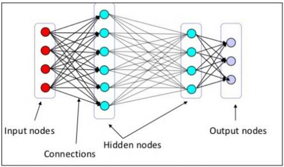
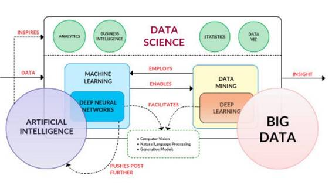
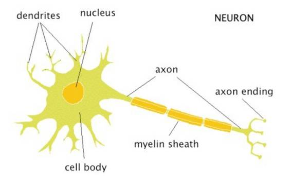
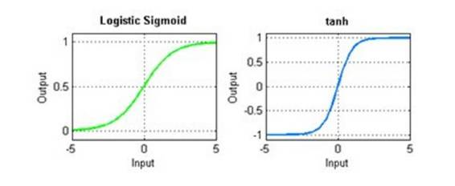
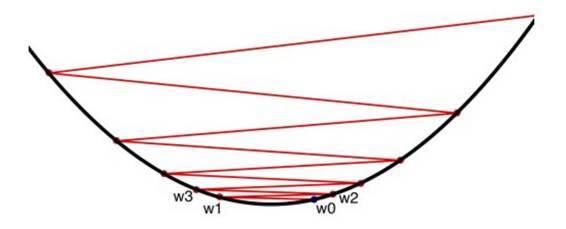
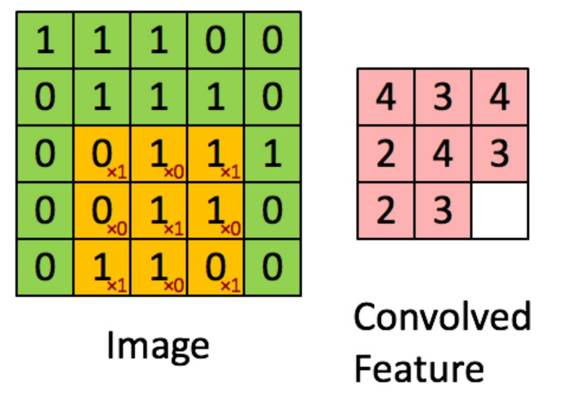
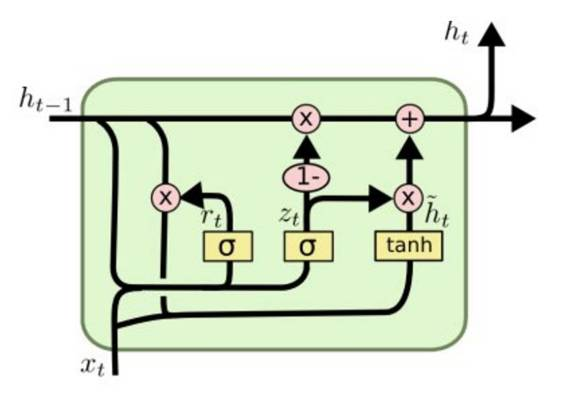

# 入门 | 初学者必读：解读 14 个深度学习关键词

选自 KDnuggets

**作者：Matthew Mayo**

**机器之心编译**

**参与：Xuwen Wang、Chen Chen**

> *本文介绍了包括 LSTM、ANNS、生物神经元、反向传播、多元感知机等 14 个深度学习关键概念，对初学者来说，搞清楚这些关键词的含义对理解深度学习至关重要。机器之心曾在九月的[一篇文章](http://mp.weixin.qq.com/s?__biz=MzA3MzI4MjgzMw==&mid=2650719393&idx=1&sn=41ed306d26dd209acfd61ee70efc8cf6&chksm=871b00dfb06c89c9dc8d5da87a0be1b3666c439909b41559097e952b7ccec29bae09823521bf&scene=21#wechat_redirect)中介绍过有关深度学习的其他专业术语。*

尽管在最近的在线搜索中已经占据高的搜索量，深度学习仍然是一个相对较新的概念。由于在各个不同的领域都获得了巨大的成功，机器学习在研究和生产领域中大量涌现。机器学习是应用深度神经网络技术的一个过程——也就是有着多个隐藏层的神经网络构架——去解决问题。像数据挖掘一样，深度学习也是一个进程，它采用了神经网络构架——一种特定的机器学习算法。

近段时间来深度学习已经积累了可观的研究成果。据此，在我看来，将以下下几点牢记在心对机器学习十分重要：

*   机器学习不是万灵药——它不能够解决所有的问题。

*   它并不是一个传说中的大师级的算法——深度学习不能够替代其他机器学习的算法和数据科学的技术，或者说，至少它至今还未被证明可以

*   我们需要对它持以平和的期待——尽管最近各种分类问题，特别是计算机视觉和自然语言处理，强化学习以及其他领域都已取得显著进步，深度学习目前还没有到达可以解决诸如「实现世界和平」这种复杂问题的水平。

*   深度学习和人工智能并非同义词。

*   深度学习可以通过向一大堆数据提供附加的操作和工具从而解决问题。由此，深度学习在数据科学领域是一个十分有用的辅助。

 

就像上图所示，深度学习深度学习之于数据挖掘，就像（深度）神经网络之于机器学习（进程 VS 构架）。同时我们也可以看到深度神经网络绝大程度属于当前人工智能的情况。两者概念相互交织几乎已经到了相同意思的程度（但实际上这两者并非相同的事物，人工智能除了神经网络还含有大量其他的算法和技术）同时，在深度学习过程和神经网络技术的带领下，近几年来在相关领域有了卓越的跨越。其中起重要作用的，深度学习／深度神经网络和计算机视觉，自然语言处理，生成模型之间的联系值得关注。由此，让我们通过简明扼要的定义，来了解深度学习和相关术语。

**1\. 深度学习**

就像上述定义的一样，深度学习是应用神经网络解决问题的过程。深度神经网络是有着至少一个隐藏层的神经网络（如下图）。像数据挖掘一样，深度学习所指的是一个特定的过程。其中采用了深度神经网络-一种特定的机器学习算法的框架。

**2\. 人工神经网络（ANNs）**

机器学习构架最早的灵感来源于生物大脑（尤其是神经元）深度学习就运用到了神经元的概念。事实上，单一的人工神经网络（并非深度神经网络）在很早之前就被发现，在过去已经能解决一些特定的问题。然而，相较于现在，目前的神经网络构架都被设计为包含数个隐藏层（除了简单的输入和输出层）。层数的增加提高了网络的复杂度，使得网络能够进行深度学习，成为一种更强大的问题解决工具。

 实际上，人工神经网络 ANN 一族结构差别很大，因此，目前没有一个确切的神经网络定义。目前两个主流的适用于所有 ANN 的特征，一个是拥有一个可调整的权重集合，另一个是具有模拟输入信号到神经元的非线性功能的能力。

**3\. 生物神经元**

在生物和人工神经网络之间的关系已经有了明确的定义。大量传播开的出版物渲染出这样一个概念：ANN 是某种对发生在人（或其他生物）大脑的过程的完全复制。这种观念显然是不准确的。充其量我们只能说早期的人工神经网络是受到生物学的启发。两者间抽象的关系不比原子的组成和功能与太阳系间的抽象关系明确。

也就是说，如果仅仅了解是什么启发了 ANN，这提供了一种高层次的解读，可帮助我们去理解生物神经是如何工作的。

以下是我们对生物神经元的最感兴趣的部分，包括：

*   携带着遗传信息的细胞核（如 DNA）

*   处理输入刺激并转化为输出刺激的细胞体。

*   从其他神经元接受刺激的树突。

*   信息传给其他神经的轴突。

*   轴突末端，和相邻树突之间形成的突触结构。

在轴突末端与相邻树突形成的突出间隙中，扩散着一种叫做神经传递素的化学物质，他实现了神经传递。神经中最关键的部分，是神经通过树突接收到刺激，处理后，通过轴突末梢传输出去。在末梢处会经过突触间隙，然后到达许多接受神经的树突。该过程将重复进行。

**4\. 感知机**

感知机是一个简单的线形二进制分类器。它接收输入和与其相连的权重（表示输入变量的相对重要性），将它们结合来产生输出。输出接下来被用于分类。感知机已经存在很长一段时间了，最早的使用可追溯到 1950 年代，其中一个也是应用到早期的人工神经网络中。

**5\. 多层感知机**

一个多层感知机（MLP）是由几个含有全邻接层的感知机组成，形成一个简单的前馈神经网络（见下）。这个多层感知器在非线性激活函数上有许多好处，这些都是单层感知器不具备的。

**6\. 前馈神经网络**

在非周期性连接的神经网络结构中，前馈神经网络是最简单的形式。最初的人工神经网络中，前馈网络中的信息从输入节点单方向前进，而后通过所有隐藏层，到达输出节点，不存在任何周期。前馈网络不同于之后的连接构成有向循环的周期性网络架构（见下文）。

**7\. 循环神经网络**

和上文所提到的前馈神经网络不同，循环神经网络的连接构成有向循环。这种双向流动允许内部时间状态表示，继而允许序列处理。并且值得注意的是，它提供了用于识别语音和手写的必要能力。

**8\. 激活函数**

在神经网络中，激活函数通过组合网络的加权输入来产生判定边界输出结果。激活函数的范围从标识（线性）到 Sigmoid 函数（逻辑或软步长），双曲线（正切）和超越。为了采用反向传播（见下文），神经网络必须使用可微的激活函数。

**9\. 反向传播**

我所见过的对反向传播的定义中，最基本、简洁的定义是数据科学家 Mikio L. Braun 在 Quora(*https://www.quora.com/How-do-you-explain-back-propagation-algorithm-to-a-beginner-in-neural-network/answer/Mikio-L-Braun*) 上给出的答案。我在此列出原文，以防破坏这份答案简洁的完美。

> *反向传播只是在个别错误上进行梯度下降。通过比较对神经网络预期输出的预测，而后计算相对于神经网络的权重的误差梯度。然后得出了权值空间中减小误差的方向。*

我将它列在这里。

**10\. 成本函数**

在训练神经网络时，必须评估网络输出的正确性。众所周知，预期上正确的训练输出数据和实际的训练输出是可比拟的。成本函数便能测量实际和训练输出之间的差异。实际和预期输出之间的零成本将意味着训练神经网络成为可能。但这显然是理想化的。

 所以，通过什么机制来调整成本函数，以实现将其最小化的目标呢？

**11\. 梯度下降**

梯度下降法是求函数局部极小值的一个优化算法。虽然它不能保证全定义域内的最小值，但梯度下降对于难以通过分析（例如通过将导数取 0 获得最优解）求得精确解的问题十分有用。

正如上文所述，在神经网络的情况中，随机梯度下降用于对网络参数做出知情调整，以达到使成本函数最小化的目标，从而使网络的实际输出迭代性地愈加接近在培训期间的预期输出。这种迭代最小化采用微积分，即微分。在训练步骤之后，网络权重根据成本函数的梯度和网络的当前权重接收更新，使得下一个训练步骤的结果可以更加接近正确值（通过更小的成本函数测量）。反向传播（关于错误的反向传播）便用于将这些更新以小份的形式送到网络。

**12\. 梯度消失问题**

由于反向传播使用链式规则来计算梯度（通过微分），朝向 n 层神经网络的「前」（输入）层将使其修改的梯度以一个较小的值乘以 n 次方，然后再更新之前的固定值。这意味着梯度将指数性减小。n 越大，网络将需要越来越多的时间来有效地训练。

**13\. 卷积神经网络**

卷积神经网络（CNN）通常与计算机视觉和图像识别相关联，并采用卷积的数学概念来模仿生物视觉皮层的神经连接网格。

首先，正如 Denny Britz 所描述一样(*http://www.kdnuggets.com/2015/11/understanding-convolutional-neural-networks-nlp.html*)，卷积可以被认为是在图像的矩阵表示之上的滑动窗口（见下文）。

*来源：斯坦福*

在神经网络结构中，至少在计算机视觉实现该概念将导致专用于处理局部图像的神经元的集合。当在某些例如自然语言处理的其他领域中使用时，鉴于输入（字，句子等）可以置于矩阵中并以类似的方式处理，故可以采取同样的方法。

**14\. 长短期记忆网络（LSTM）**

*****来源：Christopher Olah(http://colah.github.io/posts/2015-08-Understanding-LSTMs/)*

长短期记忆网络（LSTM）是经优化以用于从时间相关数据中学习和作用的循环神经网络，而这些数据可能在相关事件之间具有未定义的或未知的时间长度。它们的特定架构给予 ANN「内存」并允许其持久性。最近手写识别和自动语音识别的突破便得益于 LSTM 网络。

这显然只是深度学习术语的一个小部分以及许多衍生的从基础到高级的概念。若欲了解更多关于机器学习研究当前领先的领域，您需要自行探索。

******©本文由机器之心编译，***转载请联系本公众号获得授权******。***

✄------------------------------------------------

**加入机器之心（全职记者/实习生）：hr@almosthuman.cn**

**投稿或寻求报道：editor@almosthuman.cn**

**广告&商务合作：bd@almosthuman.cn**

