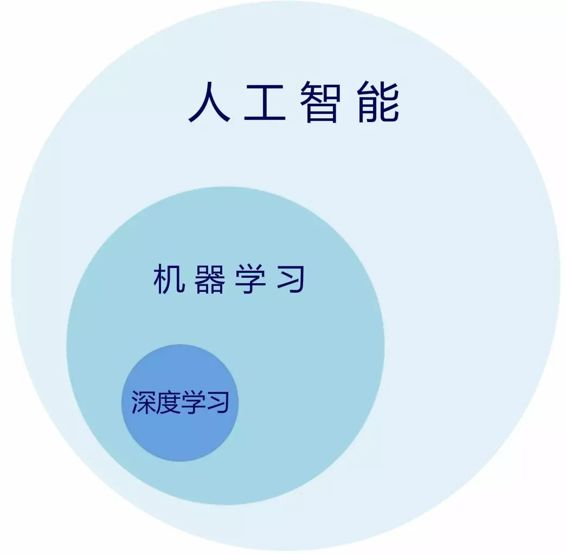
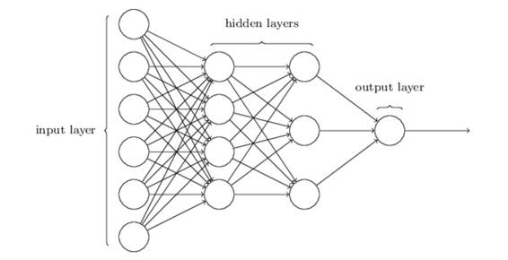
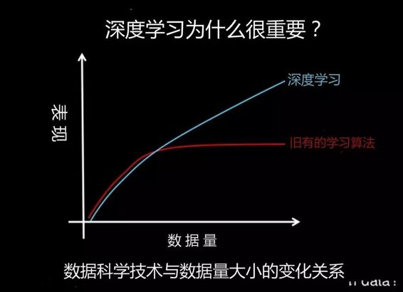
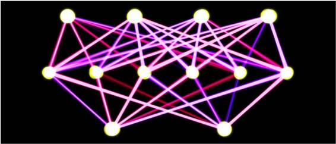

# 入门 | 智能时代每个人都应该了解：什么是深度学习？

选自 algorithmia

**机器之心编译**

**参与：武竞**

> *本文通过介绍人工智能、深度学习和机器学习三者之间的关系来阐明深度学习及其重要性。传统的机器学习智能处理一定量数据，而对于深度学习来说，数据越多，深度学习的技术表现越好。此外该文还介绍了深度学习的几大框架以及优秀在线课程和书籍。*

要理解深度学习是什么，我们首先需要了解深度学习与机器学习、神经网络和人工智能之间的关系。

表示这种关系的最好方法是将它们用同心圆可视化：

 

在最外面的环是人工智能（使用计算机推理）。里面的一层是机器学习。人工神经网络和深度学习在最中心。

广义地说，深度学习是人工神经网络的一个更平易近人的名称。深度学习的「深」是指网络的深度。而一个人工神经网络也可以非常浅。

神经网络的灵感来自大脑皮层的结构。最基本的层次是感知器（perceptron），用数学表示的神经元。与大脑皮层中的结构一样，神经网络可以有几层相互连接的感知器。

第一层是输入层。该层中的每个节点传入一个输入，然后将节点的输出作为输入传递给下一层中的每个节点。在同一层中的节点之间通常没有连接，最后一层输出处理后的结果。

我们称中间部分为隐藏层。这些神经元没有与外部的连接（如：输入和输出），并且只由上一层的节点激活。

 

*来源：Michael A. Nielsen,「Neural Networks and Deep Learning」*

人们认为，深层学习是通过学习神经网络，并利用多层抽象来解决模式识别问题的技术。在 20 世纪 80 年代，由于计算成本和数据量的限制，大多数神经网络只有一层。

机器学习被认为是人工智能的一个分支，而深度学习是一种特殊的机器学习。

机器学习包含了计算机智能，它事先并不知道答案。相反，程序通过运行训练数据来验证其尝试，并根据是否成功相应地修改其方法。机器学习涉及多个学科，从软件工程和计算机科学到统计方法和线性代数。

有两大类机器学习方法：

*   有监督学习

*   无监督学习

在有监督学习中，机器学习算法使用有标签的数据集来训练规则。这需要大量的数据和时间，因为数据需要手工标记。有监督学习是分类和回归问题的绝佳选择。

例如，假设我们在运营一家公司，并希望了解奖金对员工留存率的影响。如果我们有历史数据——即员工奖金金额和任期——我们可以使用有监督机器学习。

无监督学习没有任何预定义或相应的答案。无监督学习的目标是找出数据中隐含的模式。它通常用于聚类和关联的任务，如按行为将客户分组。亚马逊的「购买此商品的客户也买了...」建议是一类关联任务。

虽然有监督学习可能是有用的，但我们经常不得不诉诸无监督学习。深度学习已被证明是一种有效的无监督学习技术。

**为什么深度学习很重要？**

 

长期以来，计算机就有识别图像中特征的技术。但结果并不总是好的。机器视觉一直是深度学习的主要受益者。使用深度学习的机器视觉在许多图像识别的任务上可以与人类媲美。

Facebook 通过使用深度学习在照片面部识别领域取得了巨大的成功。这不仅仅是一个微小的改进，而是一个转折：「当被问及两个不熟悉的面部照片是否显示同一个人时，人类有 97.53％的正确率。由 Facebook 研究人员开发的新软件可以在相同的挑战下有 97.25％ 的正确率，无论照明的变化或者图片中的人是否直接面对相机。」

语音识别是另一个受深度学习影响的领域。口头表达极其丰富并且语义模棱两可。百度——中国领先的搜索引擎之一——已经开发了一种语音识别系统，能比人类更快更准确地在手机上生成文本，不管是英语还是普通话。特别令人着迷的是，概括这两种语言不需要额外的设计工作：「过去，人们将中文和英文看作两种截然不同的语言，因此需要设计非常不同的特征，」百度首席科学家 Andrew Ng 说，「现在的学习算法普适性强，你仅仅需要让计算机学习就行。」

谷歌现在正使用深度学习来优化公司数据中心的能源消耗。他们将冷却能源需求降低了 40％。这意味着公司的电能使用效率提高了 15％，节省了数亿美元。

**深度学习微服务（Deep Learning Microservices）**

下面是一些使用深入学习的微服务的例子。

图片标签（Illustration Tagger）。这是应用 Illustr2Vec 的一个例子，这个微服务可以为图片打上安全性、存疑性、评分、版权以及一般类别的标签，以了解图像中的内容。

DeepFilter 是一种将图像应用于艺术滤镜的图片风格转换服务。

年龄分类器使用面部检测来确定照片中的人的年龄。Places 365 分类器使用预训练的 CNN 并基于 Places 图像数据集（B. Zhou, et al., 2016）来识别图像中特定的位置，例如庭院、药店、酒店房间、冰川、山脉等。最后是 InceptionNet，可以使用谷歌的 TensorFlow 直接应用。它输入一个图像（如一辆汽车），并返回前 5 个与图像相关的预测类别。

**开源深度学习框架**

 

深度学习可以通过一些开源项目来实现。一些最流行的技术包括（但不限于）：Deeplearning4j（DL4j），Theano，Torch，TensorFlow 和 Caffe。决定使用哪个框架的因素有：他们的技术目标，还有是否为低级别、是否作为学术研究或是否以应用程序为导向。以下是每个的概述：

DL4J:

基于 JVM

分布式

与 Hadoop 和 Spark 集成

Theano:

在学术界很受欢迎

相对的入门级

有 Python 和 Numpy 接口

Torch:

基于 Lua

Facebook 和 Twitter 使用的内部版本

包含预训练模型

TensorFlow:

谷歌撰写的 Theano 继承版本

有 Python 和 Numpy 接口

高度多线程

对于某些问题集可能运行速度稍慢

Caffe:

非通用。专注于机器视觉问题

在 C++中实现，速度非常快

不容易扩展

有 Python 接口

**深度学习在线课程**

谷歌和 Udacity 合作开发了免费在线深度学习课程（https://cn.udacity.com/course/machine-learning-engineer-nanodegree--nd009），这也是 Udacity 机器学习工程师 Nano 学位的构成部分。该课程面向经验丰富的软件开发人员，针对希望在机器学习或其子专业有所专长的人员。

另一个选择是非常受欢迎的 Andrew Ng 关于机器学习课程（https://www.coursera.org/learn/machine-learning），由 Coursera 和 Stanford 主办。

**深度学习相关书籍**

虽然许多深度学习课程对学习者的教育背景要求相当高，但 Grokking 深度学习（Grokking Deep Learning）这本书并非如此。用他们的话说：「如果你高中数学及格，并能熟练使用 Python，我就可以教你深度学习。」

另一本流行的书是 Deep Learning Book，内容正如其名。这是一本自下而上内容丰富的书，因为它涵盖了深度学习所需的所有数学知识。

深度学习简要（Deep Learning Simplified）是一个很棒的 YouTube 视频系列，将深度学习分解成日常的词语和概念。下面是该系列第一个视频：

******©本文由机器之心编译，***转载请联系本公众号获得授权******。***

✄------------------------------------------------

**加入机器之心（全职记者/实习生）：hr@almosthuman.cn**

**投稿或寻求报道：editor@almosthuman.cn**

**广告&商务合作：bd@almosthuman.cn**