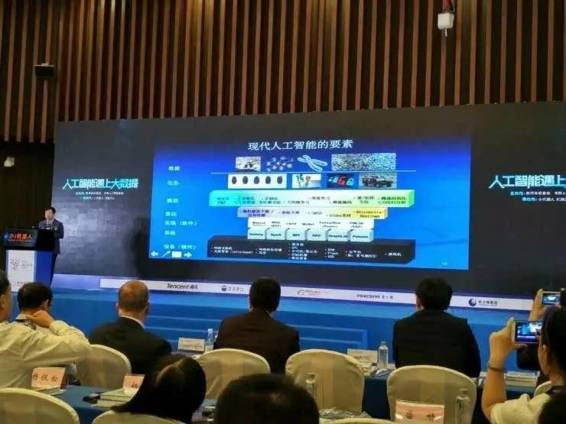
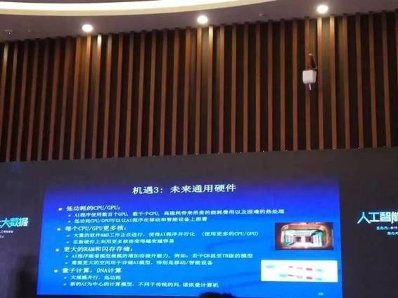

# 演讲 | CMU 教授邢波：人工智能的路径、方向与未来

机器之心编辑整理

**编辑：李亚洲**

> > *在 5 月 26 日，机器之心和小 i 机器人共同承办的「人工智能遇上大数据」分论坛上，我们邀请到了卡耐基梅隆大学计算机科学学院教授邢波发表主题演讲。*
> 
> 
> 
> > *卡耐基梅隆大学计算机科学学院教授，卡耐基梅隆大学机器学习和医疗中心主任。美国新泽西州立大学分子生物学与生物化学博士；美国加州大学伯克利分校（UC，Berkeley）计算机科学博士。主要研究兴趣集中在机器学习和统计学习方法论及理论的发展，和大规模计算系统和架构的开发，以解决在复杂系统中的高维、多峰和动态的潜在世界中的自动化学习、推理以及决策问题。目前或曾经担任《美国统计协会期刊》(JASA)、《应用统计年鉴》(AOAS)、《IEEE 模式分析与机器智能学报》(PAMI)和《PLoS 计算生物学杂志》(the PLoS JournalofComputational Biology)的副主编，《机器学习杂志》(MLJ)和《机器学习研究杂志》(JMLR)的执行主编，还是美国国防部高级研究计划署(DARPA)信息科学与技术顾问组成员，曾获得美国国家科学基金会(NSF)事业奖、Alfred P. Sloan 学者奖、美国空军青年学者奖以及 IBM 开放协作研究学者奖等，以及多次论文奖。曾于 2014 年担任国际机器学习大会（ICML）主席。*
> 
> **以下为邢波教授演讲内容整理：**
> 
> 首先感谢小 i 机器人和主办方邀请我来做这个讲座。我本人是技术出身，所以看到这样对人工智能的关注感到非常荣幸，同时感觉到非常惶恐。因为各种各样的事件，比如 AlphaGo 赢得围棋冠军，使得人工智能这个非常专业，本来躲藏在深宫大院、实验室的工作变成了街头巷尾的讨论，政府层面也在积极探索的题目。这里面包含人们对人工智能各种各样的期望和愿景，当然也包含有各种误解。这里我就从技术角度分享一下人工智能研发的思路、机遇和未来。
> 
> **人工智能的发展和功能性人工智能**
> 
> 人工智能在古代就是被大家所期望的东西，亚里斯多德就有这样的愿景，希望有人工设备来实现人想做的事情，降低人的生活成本或者提高人们生活质量。这是我上小学的时候就看过的一部电影叫《未来世界》，里面有一段很有意思的场景，我现在印象很深刻。
> 
> 故事背景是有一个组织，计划用机器人来消灭人，然后能够达到统治世界的目的。里面包含三段对话，第一我从来不会伤害我的组织；第二我要遵从我组织给我的命令了，去做这样的事情；第三要消灭人类，这是我的原性。这是人类恐惧的愿景，人工智能会不会对人类造成威胁？
> 
> 人工智能作为一门科学，有不同定义的可能性，一种是左边功能性的定义：我们制造一台机器，能够去消化大数据，然后产生预测、假设或者各种各样的推理，帮助人们实现决策上的功能，或者帮助人们寻找事实以及一些有用的东西。右边是造出来一个类人设备，然后去替代人。哪一种愿景，应该是我们准备的一个未来呢？用几分钟回顾人工智能的起步和现在所处的状况，跟大家讲一下，我作为一个研发人员所看到人工智能的愿景。
> 
> 在 60 年代前有一个图灵测试的概念，人跟机器人通过一个界面来交流，或者用通话的方式来交流，当人不能分清幕布后面是人还是机器时，这就说机器达到了人的智能，这是非常美妙的人工智能愿景。这个测试对人工智能一开始的定义产生了影响，很多科学家很严肃的做这个工作。
> 
> 有几个科学家发明了一台叫做逻辑理论家的机器，在自我环境去证明数学定理，把罗素很有名的证明定理证明了 38 道。使人们产生了期望，也许通过符号运算或者逻辑推理的方法，能够找到物质的心灵本质，使这个设备获得一种思想或者一种感情能力，以至于达到所谓的人和机器人不可区分的地步。这个方法被很多科学家推广，在 50-60 年代有很多早期的结果令人兴奋。
> 
> 有人还发明可以做数学应用题的机器，人机对话概念也在那个时候产生。理论上产生了一些突破，比如在 AlphaGo 里面看到增强学习的原型。现在提到深度学习一些基本原理也是在那个时候出现的，叫感知器。这一系列结果，使人们对人工智能产生狂热的乐观，觉得在十年之内可以预计机器在棋牌或者更广泛的范围内打败人类。
> 
> 很不幸最终人们发现这条路径不顺利，布置新的任务或者设置新的功能，有很多障碍不可逾越。还有计算障碍，设备跟不上。因为最后没有达到人类的预期，结果很严重。人工智能经历了第一个冬天。
> 
> 虽然是冬天，还是有很多坚守者在往前走，突破了一些阻力，做了一些进一步的工作。比如 80 年代做了专家系统，帮一个公司节省每年几千万的经费，这是一个巨大的成功。但这个短暂繁荣也没有很长久，很快人们发现实现这些功能的手段是一个相当耗费资源的手段，每个专家系统在公司里面需要很高的维护价格。然后又失去兴趣，再次入冬。
> 
> 人工智能的路径或者目标有一些问题，我们重新冷静思考一下做人工智能是为了什么？我经常跟朋友聊天，他问我会不是哪一天造出一个打扫院子的机器人，然后还可以陪你聊天，让人感觉人工智能是无所不能的产品或者设备，能够很灵活的训练做各种各样的事情？
> 
> 或者是能不能做一个像人的机器？这是一个模糊的概念。人与动物的功能和作用非常多面，在目标不明确的情况下，很难设计产品。比如做一个鸟，本身里面就包含不确定性，做这个东西是为了像鸟？还是为了飞？还是给你唱歌诸如此类的？这使人工智能的学者和技术人员重新思考，做人工智能的目标是比较广泛的定义还是基于实际功能的定义？比如要做一台能飞的机器，是要像鸟一样飞？还是采用机械式的、空气中的力学和燃料技术实现飞行？
> 
> 这就有了两个不同的路径：左边是仿生学或者生物科学的，通过了解生物的结构和原理，然后复制重现他们的功能。这里面有很多的困难，对他们的功能不了解，了解清楚之后，复制方面也有困难等等。
> 
> 而右边的方法不一样，把这个功能做一个直接、简单的数学描述。通过这个数学描述，对形成功能的手段和达到功能的目标之间做出很明显的因果关系，这样可以形成一个明显试错过程。由于这是一个工程上的方法，使得你可以利用很多不对称的资源，比如你可以使用很大的计算能力。这是生物本身不具备的东西。
> 
> 所以，也许人工智能并不见得就是复制人的功能或者神态，而是定义成对功能的追求。于是这里面就产生了一系列的突破，导向对功能尽可能快速和优化的实现。由于这样一种思维方式，大家会遵循比较完整的研发体系，我们通常会把人工智能从数据开始定义，跟今天的大数据很有关系，在不同的区块取得不同的数据，然后对功能做一个准确的定义。比如图象识别、下棋，或者机器人。
> 
> 有了定义，就可以引入一些数据方法，做一个非常直接具体的描述。然后再往下出现很好的算法，一个引擎，把很好的题解出来。
> 
> 设备和实现（软件）中间要有一个操作系统。这里面形成了一个个小块，使得大工程被分成小模块，从而实现产业化。这就是我们看到的现代人工智能，这里面会展现很多研发的机会和挑战。
> 
> 
> 
> **商业机会和前景**
> 
> 由于有这么一种框架，催生出了很多新的技术、新的理论、新的设备，都能够很快引入研发过程，产生很好的功效。功能性的人工智能给我们带来了一个高度，使我们重新燃起对人工智能的热情。很多人关注产业和人工智能经济带来的机会。实际上它并没有直接带来商业方面明显的价值。现有的大部分人工智能方案比较笨重、单一、昂贵。比如某种系统可能需要一千台计算机实现，再配备几十个研发人员，功能上来讲投入和产出不成比例。
> 
> 在我看来，其实有很多的机会，有很多商业的前景，没有被很好的利用起来。
> 
> 大部分人追逐快速取得成果，使得在人工智能人员培养出现了断档，很多人没法掌握这些技术。而现在需要人有很高的技术去训练，才能做有价值的开发，这个矛盾很大。我们看到人工智能的商业前景，其实现在没有被充分的发挥出来。比如垂直行业，目前处在一个比较薄弱的状态。如今数据量很大，技术手段和分析手段却没有达到科学家和用户所需要的功能。这对人工智能提出了一些要求，不是要把人工智能造的多好玩，而是把功能和数据提高。
> 
> 我谈谈挑战和机会。其实并不是没人关注，有很多学者在关注。现在已经有很多大公司  ，有很多学校积极研发通用软件或者通用平台，都希望向为公众提供低门槛、低价位的方案。各个层面的解决方法，都有一个清晰的解决脉络，把各问题解决的步骤，分成了内容、数据、硬件、算法等等各个维度。这样来分，就可以使着力点和工作重心有所集中，使产业和研发的机会能够具体的被定义出来。
> 
> 谈几点我个人对目前产业的机遇或者未来的一些理解和看法。有两方面的路径可以去追逐，把它形容成金矿的话，一方面就是金子本身价值的挖掘，另外就是造挖金子的铁锹。
> 
> 后者也是一个产业，我目前还没看到其获得广泛关注。这里我与大家做一下探讨。
> 
> 关于工具打造，其实会获得很强的成果。首先在方法上展现了很多机会，方法论解决人工智能需要什么正规途径？比如数学模型、算法、形式化等，这几步有很多机遇。比如计算机视觉的一个例子，大概十年前的时候，有一帮学界的、前瞻性很强的人物创造了一个竞赛，鼓励研发人员设计机器学习软件。
> 
> 这个起点使人们开始思索，首先在方法论上取得突破，这样人工智能的工具库或者手段更丰富一点。这里面包含了很多方面的成果，包括设计更强的模型、导入更深的结构、更快的算法等。很多研发人员在里面投了很多精力。
> 
> 
> 
> 在整个流程里面，方法论占据了非常大的作用，但是不是有很完美的方法论提供给所有的人工智能？不是的。实际上存在一个很大的鸿沟，提几个稍微的高光点，比如数据模型中的表达性、迁移性、可调性都有很多未知。
> 
> 
> 
> 下一步需求和供给鸿沟就更大，算法和精度稳定度都非常慢。现在面临很多困难，在不同平台上跑同样的软件，这些问题都没有解决。目前学习的手段已经有很多的成果，但与其去摘低的果子，还不如面向这些挑战，也有很多机遇。
> 
> 如何来实现这个方案的部署？实际上也有很多很多研发问题在里面。通常在大公司里面，尤其在中国大公司里面看到的一个常态，很多公司非常喜欢一个自有完整的体系，把所有的部件、模块都自己来做。基本上是封闭，没有外延和接口。但在美国，公司有互补和外包的机制，使他们不用关注所有的问题。
> 
> 这里面有内在的逻辑，因为在解决部署人工智能软件或者算法的过程中，实际上有很多的规律能够让你充分利用，降低你的运算成本和提高效率。比如在研究部署范式的时候，我们可以有很多方面的选择？包括用什么平台来做实现？包括问题有多大规模？包括什么操作系统和语言？不同的处理，会找到不同的解决方案。使你在金钱或者质量上获得巨大的优势。
> 
> 举个例子说一下这样的事情，比如讲到了分布式计算，很多公司对大规模的客户或者企业进行对接的时候都面临一个计算任务扩增的需求。比如我们要做一个社交媒体圈的定位，通常做研发的时候，写一个在一百万个用户上展示功能的软件，实际上部署的时候，却是一亿用户规模，怎么迁移？
> 
> 有一个幼稚的想法，就是尽可能把机房的规模扩大。实际上却不可行，因为在技术上要实现定型机群的同步，里面有一个很大的瓶颈就是怎么实现多机器的协调？它们的运转速度不一样，总有一台机器比一台机器慢一点，最快的机器要等最慢的机器才能进行下一步。这样就造成了资源的最大浪费。
> 
> 人工智能计算和传统计算不一样，传统计算你一定要算对。人工智能的计算方式是一个爬山的方式，到底怎么爬？用哪种路径爬？并不是那么关键。由于某种原因，走错了，如果不是很严重，并不一定回原点，可以继续往下修正。
> 
> 支持人工智能算法的技术要求和支持传统算法的要求也不一样。传统的技术设备对于同步的要求，就像一个飞行表演队要求每个飞机间距都得严格控制，否则会产生撞击或者不美感。而人工智能是为了完成一个任务，就像一队飞机扑火的时候，它是一种手段，而不是目的，我们只需要提供一个协调，让一个指挥官指挥多台机器。所以，解决方法是要更加模块化，而不是从头到尾的封闭方法，这包含了产业间的配合和研发之间的配合。
> 
> 其实现在人工智能的产业前景里面，我们可以看到其使用的范围已经远远的超出了数据中心的机房，它可以在移动平台上部署，也可以在家用设备上部署，也可以在云端部署。这些不同的硬件环境，都提出了对系统设计的不同要求。
> 
> 所以，观察清楚这里面所需要的解决方法和现在已有的方案的差距可以提供很大的产业机遇。生产铁锹和工具本身有很大的价值。
> 
> 
> 
> 但是不是需要专业的硬件？这个问题不太容易回答。目前所看到的人工智能解决路径或者方案大量使用的硬件，不仅包括网络，还有 CPU、储存等。从技术来看人工智能的潜力很大，技术和界面的革新会产生很多结果。而且现在人工智能有很多的标配，包括 CPU 以及网络等等。
> 
> 但其实硬件的提升空间很大，我们需要设计更多硬件，使核能、储存功能进一步提高。或者是 DNA 计算、量子计算的应用。我看到人工智能或者机器学习整个研发和产品的形态呈现倒三角的趋势，顶端看到数据任务或者数据模型和软件，因为有无穷多任务和数据量，越往下走，越是希望能共享已有的解决方案。到了底端空间会越来越小。
> 
> **对未来的憧憬**
> 
> 最后多讲几句关于未来的憧憬，人工智能让人重新点燃比较浪漫的想法和愿景，会不会对我们产生威胁？或者会不会影响到我们的工作？
> 
> 我从一个研发者的角度，分享这么一个观点，我觉得人工智能和自然智能是较平行，它们功能和目的是完全不一样的，人工智能是很明确，可定量评测的功能；自然智能是比较散泛，非常宽广功能的这么一个空间，然后它的数学模型和硬件是不清晰不明朗的，不清楚的，软件算法也不清楚，所以它整个是一套比较模糊的体例。
> 
> 但人工智能都有比较清晰的定义，比如是一个单一功能的实现，它的设备是电子设备，软件靠算法来执行。
> 
> 至于机器超越本身，被过度解释，以至于形成对人类自身能力的挑战，我们应该比较理性的来看待这个问题。因为机器的功能跟人思维、感情、自主性不是一回事，目前不必从技术上担心会受到人工智能的威胁。我觉得人工智能以后的一个大方向是在长期实践中与人产生共存关系，帮助人实现很多有用的功能，提升人的生活质量、降低风险的功能。
> 
> **总结**
> 
> 总结一下这个方向的市场潜能，人工智能的市场潜能相当巨大，以我有限的视野已经看到在社会、政府、或者在科学、商业有诸多的应用。这里面相当主要的一个基点是我们拥有大数据。数据就是一旦增加到很大程度，机器和人的优势产生了倾斜，人赶不上机器的消化程度。所以使得数据产生了不一样价值，它能提供更多的帮助。包括医疗、法律、健康等很多方面，都将得益于人工智能对数据的挖掘。
> 
> 人工智能在社会的运转，或者是科学的研究，或者是商业的拓展里面进一步赢得了空间，给我们带来就业或者产品功能方面的机遇。而且机器不必等到像人一样聪明才能获得这样的功能，人工智能的目标本身不应该过多关注生物性或者哲学性的对比，更多应该关注功能实现和低价快速的能力提供。
> 
> ***©本文由机器之心编辑整理，***转载请联系本公众号获得授权***。***
> 
> ✄------------------------------------------------
> 
> **加入机器之心（全职记者/实习生）：hr@almosthuman.cn**
> 
> **投稿或寻求报道：editor@almosthuman.cn**
> 
> **广告&商务合作：bd@almosthuman.cn**