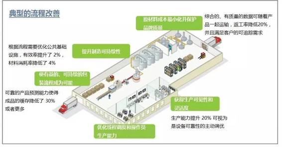
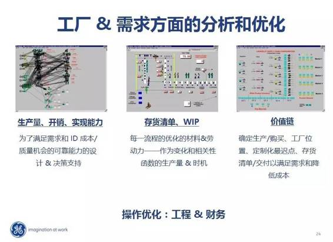
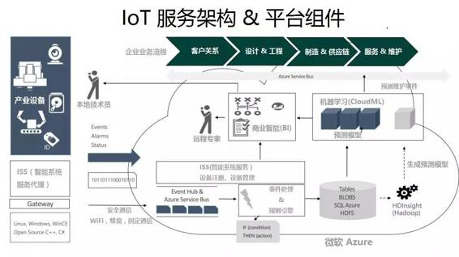
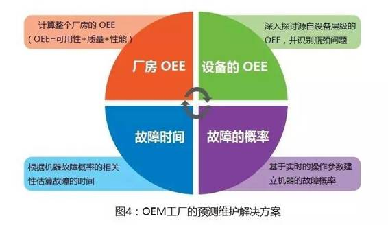
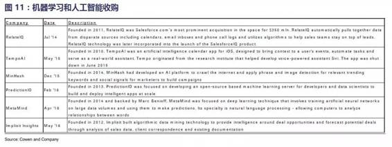

# 业界｜从供应链优化到差异化定价：机器学习十种方式变革制造业

选自 Forbes

**作者：Louis Columbus**

**机器之心编译**

**参与：Quantum Cheese、吴攀**

> *引言：机器学习可以参与到制造业加工的整个生产流程中：在生产过程中通过供应链和维护方案优化降低生产成本和提高生产的效率和质量，最后还能通过差异化的定价获取最大化的利润。*

每个制造商都有很多可能把机器学习运用到自己产业中，通过获得对产品的前瞻性思考会让他们更具竞争力。

机器学习的核心技术正好能解决现今制造商们面临的问题。从努力维持供应链运转，到定制化生产，再到按时完成订单任务，机器学习算法可以为每个生产环节提供更高的预测精准度。开发出的很多算法都是迭代型的，它们能够持续不断地学习并寻求最优解。这些算法能在几毫秒内反复迭代，让制造商在几分钟内就能找到最佳解决方案，而非之前的数个月。

**机器学习变革制造业的十种方式：**

**1、生产力提升 20%，材料消耗率降低 4%。**利用数据预测分析和机器学习的智能制造系统有潜力提升生产单元以及整个制造厂级别中机器的收益率。下面的图片来自通用电气（General Electric），并被国家标准协会（NIST）所引用，总结了预测分析和机器学习的运用给制造业带来的好处。

*数据来源：: Focus Group: Big Data Analytics for Smart Manufacturing Systems*

**2、提供了更多相关数据，因此金融、运作及供应链团队能更好地管理工厂和需求方面的约束。**很多制造业公司的 IT 系统并不完整，导致交叉功能型团队难以完成共同的目标。引入了机器学习，这些团队的洞察力和智慧能被提升到一个全新的水平上，而他们优化产品工作流、存货清单，在制品（WIP）以及价值链决策的目标就会成为可能。 

*数据来源: GE Global Research Stifel 2015 Industrials Conference*

**3、增强组件和局部层级的预测准确度，从而改善预防性维护与维护－修理－大修（MRO）的性能。**把机器学习的数据库、应用和算法集成到云计算平台已经很普遍了，亚马逊、谷歌和微软的云平台公布就可以证明这一点。下面的图片解释了机器学习是如何集成到 Azure 平台上的。微软授权 Krone 使用 Azure 平台，让他们得以把制造运作流程自动化，以实现工业 4.0 目标。 

*数据来源: Enabling Manufacturing Transformation in a Connected World John Shewchuk Technical Fellow DX, Microsoft*

**4、实现状态监控流程，让制造商得以在厂房层级上管理整体设备效率（OEE，Overall Equipment Effectiveness），并将 OEE 从 65% 提高到了 85%。**一家与塔塔咨询服务公司（Tata Consultancy Services）合作的自动化原始设备制造商（OEM）改善了他们的生产流程，此前他们冲压线的 OEE 一度跌至 65%，停工时间达到了 17% 到 20%。他们的解决方法是，12 个月中，每 15 秒从设备上收集 15 个操作参量的传感器数据（比如油压、油粘度、油渗漏以及气压），并进行集合。解决方案的组件图下图所示： 

*Source: Using Big Data for Machine Learning Analytics in Manufacturing*

**5、机器学习给智能客户关系领域带来了变革，Salesforce 迅速成为了行业领头羊。**Salesforce 正在进行一系列的并购活动。下图中的表格来自柯文公司的研究报告（Salesforce: Initiating At Outperform; Growth Engine Is Well Greased），总结了 Salesforce 并购的一系列机器学习和人工智能公司，并分析了他们的新产品发布走向以及并购带来的预估收益贡献。Alex Konrad 在他最近发表的博文（Salesforce Will Acquire Demandware For $2.8 Billion In Move Into Digital Commerce）中分析了 Salesforce 用 28 亿美元收购电子商务供应商 Demandware 一事。柯文公司预测 18 个 财政年度中，Commerce Cloud 会贡献 3.25 亿美元的收入，其中卖出 Demandware 的收入占了很大一部分。

**6、机器学习算法能判断全公司哪些因素对质量的影响最大，哪些影响最小，从而为产品和服务品质带来质的提升。**对很多制造商来说，从公司核心部分的工作流层面上提升产品和服务质量是一项有挑战性的任务。质量通常是孤立的。机器学习通过测定那个内部流程、工作流和因素对达到目标质量贡献最大或最小，从而变革产品和服务质量。机器学习算法还能预测质量和源决策对 DMAIC（定义、测量、分析、改进和控制）框架中的六西格玛性能指标有怎样的影响，从而让制造商的制造过程更加智能化。 

**7、机器学习已经在通过优化团队、机器、供应商和客户需求提高生产效益。**如今，它正在影响航空航天和国防、离散制造业、工业和高科技制造业的日常工作环境。制造商们更有效地利用了生产力，产品更趋于复杂和定制化，机器学习帮助它们优化了机器、受训员工和供应商的筛选过程。 

**8、由于机器学习促成了生产服务订购模式，制造即服务（Manufacturing-as-a-Service）的构想才得以实现。**那些能支持迅速高度定制化流水线生产的制造企业现在能开展新的商业运作，为全球服务和销售提供订购率。那些面临制造成本猛增的快速消费品（CPG）和电子产品的供应商和零售商很有可能订购制造服务，并在品牌化、营销和销售上增大投入。 

**9、机器学习是优化供应链和创造更大规模经济的理想手段。**对于很多复合型制造企业来说，超过 70% 的产品都源自于供应商，这使得他们需要权衡先满足哪一个买家的需求。有了机器学习，买卖双方就能更有效的合作，减少缺货的情况，提高预测精确性，按期或提前完成客户订单。 

**10、在合适的时间知道对特定用户的合适定价以获得最大的利润，而且使用机器学习完成交易将变得随处可见。**机器学习正在扩展今天的企业级价格优化应用所提供的一切。最显著的一处不同是：会有新的建议策略用来实现价格的优化，从而完成交易。

***©本文由机器之心编译，***转载请联系本公众号授权***。***

✄------------------------------------------------

**加入机器之心（全职记者/实习生）：hr@almosthuman.cn**

**投稿或寻求报道：editor@almosthuman.cn**

**广告&商务合作：bd@almosthuman.cn**