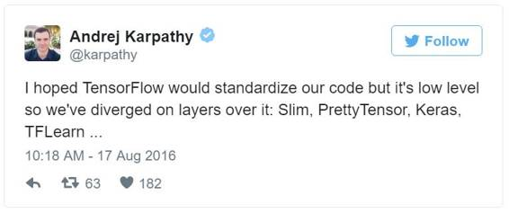
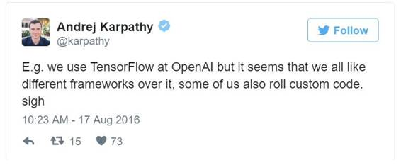

# 深度 | 对比深度学习十大框架：TensorFlow 最流行但并不是最好

选自 Medium

**机器之心编译**

**参与：吴攀、朱思颖、李亚洲**

> *2016 年已经过去，BEEVA Labs 数据分析师 Ricardo Guerrero Gomez-Ol 近日在 Medium 上发表了一篇文章，盘点了目前最流行的深度学习框架。为什么要做这一个盘点呢？他写道：「我常听到人们谈论深度学习——我该从哪里开始呢？TensorFlow 是现在最流行的吧？我听说 Caffe 很常用，但会不会太难了？在 BEEVA Labs，我们常常需要应对许多不同的深度学习库，所以我希望能够将我们的发现和感想分享出来，帮助那些刚刚进入深度学习这一美丽世界的人。」*

**TensorFlow**

链接：https://www.tensorflow.org/

对于那些听说过深度学习但还没有太过专门深入的人来说，TensorFlow 是他们最喜欢的深度学习框架，但在这里我要澄清一些事实。

在 TensorFlow 的官网上，它被定义为「一个用于机器智能的开源软件库」，但我觉得应该这么定义：TensorFlow 是一个使用数据流图（data flow graphs）进行数值计算的开源软件库。在这里，他们没有将 TensorFlow 包含在「深度学习框架」范围内，而是和 Theano 一起被包含在「图编译器（graph compilers）」类别中。

在结束了 Udacity 的 Deep Learning 课程（https://www.udacity.com/course/deep-learning--ud730）之后，我的感觉是 TensorFlow 是一个非常好的框架，但是却非常低层。使用 TensorFlow 需要编写大量的代码，你必须一遍又一遍地重新发明轮子。而且我并不是唯一一个这么想的人。Andrej Karpathy 在 Twitter 上就多次吐过槽：

*推文：我希望 TensorFlow 能标准化我们的代码，但它是低层面的，所以我们在其上面的层上分道扬镳了：Slim、PrettyTensor、Keras、TFLearn ...*

*比如：我们在 OpenAI 使用 TensorFlow，但我们似乎都更喜欢其它框架，我们有些人还写自定义代码。叹*

几个月前，我去参加了「Google Experts Summit: TensorFlow, Machine Learning for everyone, with Sergio Guadarrama」。Sergio 是开发 TensorFlow 的一位工程师，但他在会上没有展示 TensorFlow，而是展示了一个在 TensorFlow 上工作的更高层的库 tf.contrib：https://www.tensorflow.org/tutorials/tflearn/。我的看法是：他们内部已经意识到如果要让更多人使用 TensorFlow，他们就需要以更高的抽象水平在其上创建一些层，从而简化 TensorFlow 的使用。

TensorFlow 支持 Python 和 C++，也允许在 CPU 和 GPU 上的计算分布，甚至支持使用 gRPC 进行水平扩展。

总结：TensorFlow 非常好，但你必须了解它好在哪里。如果你不想什么事都自己手动去做和重新发明轮子，你可以使用更简单的库（安利一下 Keras）。

**Theano**

链接：http://deeplearning.net/software/theano/

Theano 是最老牌和最稳定的库之一。据我所知，深度学习库的开端不是 Caffe 就是 Theano。

和 TensorFlow 类似，Theano 是一个比较低层的库。也因此它并不适合深度学习，而更适合数值计算优化。它支持自动的函数梯度计算，带有 Python 接口并集成了 Numpy，这使得它从一开始就成为了通用深度学习领域最常使用的库之一。

今天，Theano 依然效果良好，但由于它不支持多 GPU 和水平扩展，在 TensorFlow 的热潮下（它们针对同一个领域），Theano 已然开始被遗忘了。

**Keras**

链接：https://keras.io/

「You have just found Keras.」

上面这句话是你打开文档页面时看到的第一句话。我还记得我第一次发现 Keras 的时候。那时候我正在柏林解决 Data Science Retreat 的最后一个项目，为此我努力进入了深度学习库的世界。我在起步时就已经有了足够的深度学习知识，但我没有时间自己手动编写功能，也没有时间探索和学习一个新的库（截止时间不到 2 个月，而我还有课要上）。然后我发现了 Keras。

我真的很喜欢 Keras，因为它的句法是相当明晰的，它的文档也非常好（尽管相对较新），而且它支持我已经掌握的语言 Python。它的使用非常简单轻松；我们也能很直观地了解它的指令、函数和每个模块之间的链接方式。

Keras 是一个非常高层的库，可以工作在 Theano 和 TensorFlow（可以配置）之上。另外，Keras 强调极简主义——你只需几行代码就能构建一个神经网络。在这里你可以比较一下 Keras 和 TensorFlow 实现相同功能时所需的代码：https://gist.github.com/ricgu8086/0ba44ce3aab19ec50425383a4d778b50

**Lasagne**

链接：http://lasagne.readthedocs.io/en/latest/index.html

Lasagne 是一个工作在 Theano 之上的库。它的使命是简化一点深度学习算法之下的复杂计算，同时也提供了一个更加友好的接口（也是 Python 的）。这是一个老牌的库，并且很长时间以来它都是一个扩展能力很强的工具；但在我看来，它的发展速度赶不上 Keras。它们的适用领域都差不多，但 Keras 有更好的文档、也更完整。

**Caffe**

链接：http://caffe.berkeleyvision.org/

Caffe 不只是最老牌的框架之一，而是老牌中的老牌。

在我看来，Caffe 有非常好的特性，但也有一些小缺点。起初的时候它并不是一个通用框架，而仅仅关注计算机视觉，但它具有非常好的通用性。在我们实验室的实验中，CaffeNet 架构的训练时间在 Caffe 中比在 Keras 中（使用了 Theano 后端）少 5 倍。Caffe 的缺点是它不够灵活。如果你想给它来一点新改变，那你就需要使用 C++ 和 CUDA 编程，不过你也可以使用 Python 或 Matlab 接口进行一些小改变。

Caffe 的文档非常贫乏。你需要花大量时间检查代码才能理解它（Xavier 初始化有什么用？Glorot 是什么？）

Caffe 的最大缺点之一是它的安装。它需要解决大量的依赖包……我曾经安装过 Caffe 两次，真正痛苦至极。

但要清楚，Caffe 并不是一无是处。在投入了生产的计算机视觉系统的工具上，Caffe 是无可争议的领导者。它非常稳健非常快速。我的建议是：用 Keras 进行实验和测试，然后迁移到 Caffe 中进行生产。

**DSSTNE**

链接：https://github.com/amznlabs/amazon-dsstne

DSSTNE 的发音同 Destiny，是一个酷劲十足的框架却总是被忽略。为什么？除去其他的因素不谈，原因在于这个框架不具有普适性，不是为一般常见任务所设计的。DSSTNE 框架只做一件事——推荐系统，但把这件事做到了极致。既不是为研究而设计，也不是为测试 idea 而设计（来源其官方网站的宣传语），DSSTNE 框架是为量产而设计。

我们已在 BEEVA 上做一些实验测试了，目前我已经感觉到这是一个运行非常快的工具并且能够得到非常好的运行结果（平均准确率均值——mAP 很高）。为了达到这一速度，DSSTNE 框架用 GPU 运行，这也是它的弊端之一：不同于篇中分析的其他框架或者库，这个框架不支持使用者随意在 CPU 和 GPU 中切换，而这可能会对有些尝试有用，但我们在 DSSTNE 里做这样的尝试时是不被框架所允许的。

其他的感受就是迄今为止 DSSTNE 还不是一个足够成熟的项目，而且它封装的太严密了（「black box」）。如果我们想深入了解这个框架的运行机制是什么，我们必须且只能去看它的源码，并且你需要完成很多必须完成的设置（「TODO」）才可以看到。同时，关于这个框架的在线教程不多，而能让开发者进行操作尝试的指导就更少了。我的意见是再等 4 个月看看 DSSTNE 的最新版本。不能不说 DSSTEN 的确是一个很有意思的项目但还需要一点成长空间。

还想说明一点，这个框架对编程能力没有要求。DSSTNE 框架通过其终端的命令行来执行相关操作。

到目前为止，很多我知道也很流行的框架和库我还没有用过，我不能给出更多具体的细节。

**Torch**

链接：http://torch.ch/

在这个世界上每天仍有很多战争，但是一个优秀的「勇士」（西班牙语「Guerrero」）必须熟知哪些战争是需要去参加作战的，哪些是可以选择不参与的。

Torch 是一个很著名的框架，因巨头 Facebook 的人工智能研究所用的框架是 Torch，并且在被谷歌收购之前 DeepMind 也是用的 Torch（收购之后 DeepMind 转向了 TensorFlow）。Torch 的编程语言是 Lua，这就是我刚才所谈的「战争」的具体所指。在目前深度学习编程语言绝大部分以 Python 实现为主的大趋势下，一个以 Lua 为编程语言的框架的最大劣势莫过于此。我从未用使用过这个语言，如果我想使用 Torch 这个工具，毫无疑问我需要先学习 Lua 语言然后才能使用 Torch。这固然是一个合理的过程，但就我个人情况来说，我偏向于用 Python、Matlab 或者 C++的实现。

**MXNet**

链接：https://github.com/dmlc/mxnet

mxnet 是一个支持大多数编程语言的框架之一，包括 Python，R，C++，Julia 等。但我觉得使用 R 语言的开发者会特别偏爱 mxnet，因为至今为止还是 Python 以不可置疑的态势称霸深度学习语言的（Python 与 R 的对决，猜猜我会站哪边？:-p）

老实说，在此之前我并没有很关注 mxnet。但是当亚马逊 AWS 宣布选择 mxnet 作为其深度学习 AMI 的库时触发我开始关注 mxnet。我必须去了解一下。后来我获知亚马逊把 mxnet 列为其深度学习的参考库并宣称其巨大的横向扩展能力。我感觉到这里面有一些新的改变发生而且我必须深入了解。这也是为什么我们 2017 的 BEEVA 的技术测试名单里有 mnxet 的原因。

我对多 GPU 的扩展能力有点疑虑并且我很原意去了解这样实验的更多细节，但目前我还是对 mxnet 持怀疑态度。

**DL4J**

链接：https://deeplearning4j.org/

我接触这一库，是因为它的 documentation。当时我正在寻找受限玻尔兹曼机、自编码器，在 DL4J 中找到了这两个 documentation。里面的文件很清楚，有理论，有代码案例。我必须得说 DL4J 的 documentation 简直是艺术品，其他库在记录代码的时候需要向它学习。

DL4J 背后的公司 Skymind 意识到，虽然在深度学习圈内 Python 是老大，但大部分程序员起自 Java，所以需要找到一个解决方案。DL4J 兼容 JVM，也适用 Java、Clojure 和 Scala，随着 Scala 的起起落落，它也被很多有潜力的创业公司使用，所以我还会继续紧追这个库。

此外，Skymind 的 twitter 账户非常活跃，不断公开最新的科学论文、案例和教程，及其推荐大家关注。

**Cognitive Toolkit**

链接：https://github.com/Microsoft/CNTK

认知工具包（Cognitive Toolkit）之前被大家所知的缩略是 CNTK，但是最近又重命名回归到 Cognitive Toolkit，很可能是想沾最近微软认知服务（Microsoft Cognitive services）的光。在公开的基准测试上的表现来看，这个工具似乎很强劲，支持纵向和横向的推移。

目前为止，Cognitive Toolkit 似乎不是很流行。我并没有读到很多关于使用这个库的博客、在线实验案例或者在 Kaggle 里的相关评论。但是对我来说，一个背靠微软研究的框架特别强调自己的推移能力让我觉得有些奇怪，毕竟微软研究团队可是在语音识别上打破世界纪录并逼近人类水准。

我在查看他们项目百科的一个范例的时候了解到 Cognitive Toolkit 在 Python 上的语法和 Keras 是非常相类似的（Cognitive Toolkit 也支持 C++），这不禁让我在想（并不是确认）Keras 才是正确的方式。

**结论**

我的结论是：如果你想进入这一领域，你应该首先学习 Python。尽管这一领域还支持其它很多语言，但 Python 是应用范围最广而且最简单的一个。但是为什么要选择 Python 呢——毕竟 Python 速度这么慢？因为大多数的库都使用的是符号式语言（symbolic language）方法而非命令式语言（imperative language）方法。解释一下也就是说：不是一条接一条地执行你的指令，而是根据你给出的所有指令创建一个计算图（computing graph）。这个图被内部优化和编译成可执行的 C++ 代码。这样你就能同时利用上两个世界的最优之处：Python 带来的开发速度和 C++ 带来的执行速度。

人们对深度学习的兴趣越来越大了，但人们并不愿意等待算法训练所需的大量计算时间（而且我说的是 GPU，想都不要想只使用 CPU）。这也是多 GPU 支持、多机器上的水平扩展甚至定制硬件最近开始得势的原因。

深度学习领域非常活跃、易变。很可能我现在所说的在 2017 年的中旬就变了。

我的建议是，如果你是初学者，使用 Keras，如果不是初学者，也可以使用它。如果你参加过 Kaggle 比赛，你肯定注意到了 Kaggle 的两大巨星：Keras 和 XGBoost。

*原文链接：**https://medium.com/@ricardo.guerrero/deep-learning-frameworks-a-review-before-finishing-2016-5b3ab4010b06#.z8zuthuwm*

***©本文由机器之心编译，***转载请联系本公众号获得授权***。***

✄------------------------------------------------

**加入机器之心（全职记者/实习生）：hr@almosthuman.cn**

**投稿或寻求报道：editor@almosthuman.cn**

**广告&商务合作：bd@almosthuman.cn**