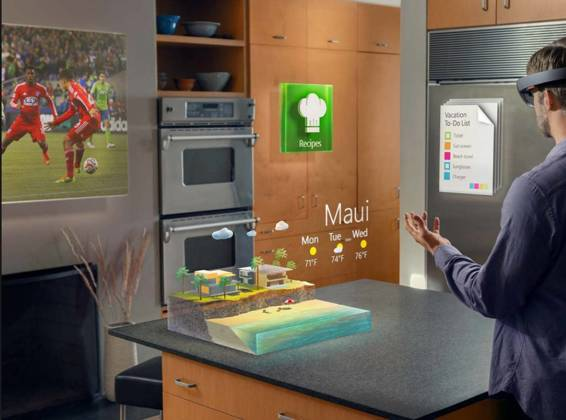
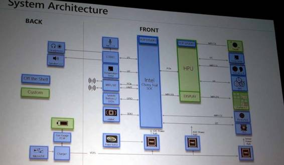
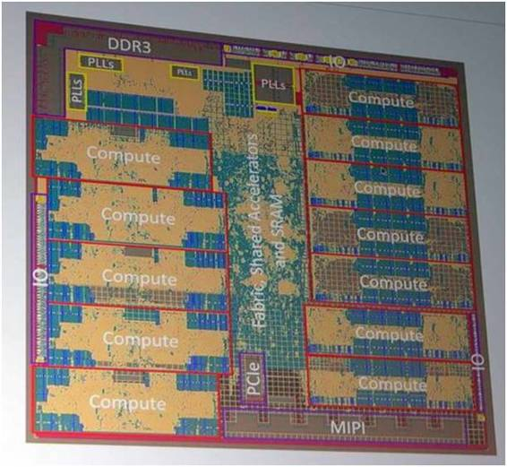

# 专栏 | 当 AI 遇上 AR ——从微软 HoloLens Processing Unit (HPU)说起

机器之心专栏

**作者：痴笑**

**AI+AR**

人工智能（AI）与增强现实（AR）的概念在最近乃是当红炸子鸡，火遍大江南北。AI 与 AR 的概念区别不小，但是也有不少交集。目前，AI 最热门的应用就是在计算机视觉（Computer Vision，CV）领域，而 AR 的实现（图像渲染）自然也离不开 CV 。举个例子吧！《龙珠》想必大家都看过（如果你没看过说明你很年轻！大叔很羡慕你！），里面的战斗力探测眼镜就是 AI + AR 的一个极好例子：战斗力探测眼镜用基于 CV 的 AI 首先做物体识别，把眼镜视野里面的战斗对象与背景区分开，然后用一套 AI 算法去评估该对象的战斗力，最后把战斗力标注到眼镜视野里的目标周围（什么？战斗力只有 5？），从而实现 AR 。

*《龙珠》里的战斗力探测眼镜是 AI+AR 应用的一个极好例子*

**HoloLens 与 HPU**

如今，实现战斗力探测的 AI + AR 技术已经不再为赛亚人所独有，地球人也拥有了这项技术！例如，微软的 HoloLens 在已公布的 AI + AR 设备中可谓佼佼者，凭借微软的金字招牌以及酷炫的演示动画吸引了无数科技爱好者的眼球。

目前，用于 AI / AR 的处理器架构该如何设计仍然处于探索阶段，Intel 想借机推自己基于 CPU 的方案，Nvidia 想利用 GPU 弯道超车，而 Qualcomm 也拼接 Snapdragon 平台在一边虎视眈眈。在今年的商用芯片峰会 HotChips 上，微软公布了应用在 HoloLens 中的处理器芯片（HoloLens Processing Unit, HPU）。HPU 的架构和 CPU 以及 GPU 都不相同，可谓是开创了 AI / AR 领域芯片的新范式。我们采访了 UCLA 从事人工智能芯片和硬件研究的 Li Du, Yuan Du 以及 Yilei Li 博士，接下来将详细分析 HPU 芯片架构并展望未来 AI / AR 芯片设计中的范式转换。

*HoloLens 可以实现众多 AI/AR 应用*

微软公布的 HoloLens 系统架构如下图所示。就在绝大多数移动设备的处理器都基于 ARM 结构的今天，HoloLens 的主处理器使用的仍然是 Intel 的 Cherry Trail SoC（包括 CPU 与集成的 GPU），让人感叹维持了二十余年的 Wintel 联盟坚不可破。微软最新公布的 HPU 也可以在图上看到，HPU 严格来说是一款协处理器，其作用是协助主处理器加速运算一些专门的运算（如用于 CV 的矩阵运算，用于 CNN 的卷积运算等）。

在 UCLA 有多年异构运算与互联研究经验的 Yuan Du 博士表示，「由于 CPU 必须要考虑通用性而无法对一些 AR / VR 运算进行优化，因此在应用场景中会大量遇到的专门运算如果都交给 CPU 做会使系统的整体性能变得很差，于是我们需要设计一款专用的加速器来协助加速这些运算，微软在这里的加速器就是 HPU 。HPU 通过 PCIe 高速接口与主处理器所在的 SoC 通信，不过 PCIe 的功耗其实是比较大的，未来可望会用上更先进的互联技术。」

微软公布的 HPU 处理能力达到每秒 1T（10¹²）次像素运算，功耗则小于 4W。HPU 能够融合来自 5 个摄像头、一个深度传感器以及运动传感器的输入信息，将信息压缩并传送到主处理器。此外 HPU 还能实现 AI 手势识别。据说微软曾评估了来自于各大厂商的商用芯片，却没有找到任何一款产品能满足系统算法对性能的要求。这款微软自己开发的 HPU 是采用台积电 28nm 工艺，内含 24 颗可重配置的 Tensilica 数字信号处理器（DSP）核心以及高达 8MB 的 Cache。除此以外，还有专用加速器用于给各类专门任务加速。

*HoloLens 系统架构，HPU 与显示设备紧密耦合并且和主处理器 Intel Cherry Trail SoC 由高速 PCIe 接口互联*

**HPU 有何不同**

如果仔细观察 HPU 架构，会发现它与目前借着 AI / AR 及人工智能风口飞地很高的 GPU 有点像，但并不相同。说它们“有点像”是因为 HPU 和 GPU 都有不少计算核心，这样可以实现数据的并行处理。HPU 和 GPU 要处理的都是画面中的一个个像素，而像素之间其实并没有关联性，因此可以由并行处理来提高执行效率。与之相对的是 CPU，为了照顾通用性 CPU 无法放置大量的计算核心来实现大规模并行运算，因此完全用 CPU 来处理 AI / AR 操作会导致速度很慢。另一方面，HPU 与 GPU 之间也有很大的不同。首先，HPU 上的计算核心是可配置 DSP 而非类似 Nvidia GPU 里面的 CUDA core。另外，HPU 的片上 Cache（用于快速存取数据）高达 8MB，远大于 GPU 的片上 Cache 容量（Tegra X1 上 Cache 仅有 2 MB）。这是为什么呢？

Du Li 和 Yilei Li 博士表示，「归根到底，这些都是因为应用的区别。GPU 就像一艘巨轮，设施豪华（运算精度高），耗油巨大（功耗巨大），在处理海量的数据时可以实现非常高的吞吐率，但是实时性并不好：你可以想象巨轮在行驶前需要做许多准备工作，并不是指令一下说走就走（延迟较大）。当然在需要处理的数据量足够大时，这些准备时间相对于计算时间来说可以忽略不计。HPU 就像一艘小船，轻便而省油（功耗较小），而且指令一下可以说走就走（延迟较小），虽然运算的吞吐量不能和 GPU 相比但是实时性很好。

在 HoloLens 中，实时性非常重要：例如，在你的头部移动时，你显示的内容也要相应改变，如果在你头部移动和现实内容改变之间存在明显延迟则使用者会感到晕眩（这也是为什么很多人在玩 3D 游戏时会头晕的原因）。另外，由于 HoloLens 是移动设备，因此芯片的功耗需要严格控制，功耗巨大的 GPU 架构并不适合。」

*HPU 芯片结构，可见 DSP 计算核心以及大容量片上 Cache（SRAM）*

让我们来看看 HPU 和 GPU 的几点不同是如何对应应用场合的要求的。首先，HPU 选择了可重配置的 DSP。使用可重配置的 DSP 可以根据应用场合切换配置来实现性能－功耗的最优折衷，可以说 HPU 使用可配置 DSP 是为了实现在给定功耗下的最佳性能。其次，HPU 使用很大的片上 Cache。使用片上 Cache 可以实现低延迟数据存取，从而满足 HoloLens 对于实时性的要求。HPU 与显示设备紧密耦和也能帮助降低延迟。与之相反，通常 GPU 的片上 Cache 都较小，而绝大部分数据都存在片外 DRAM 中并使用高速 GDDR 接口实现数据传送。这样做既增大了数据存取延时又消耗了很大的功耗，并不适合 HoloLens 这样的应用。

最后，值得注意的是，HPU 还集成了许多专用加速器。这些专用加速器可以帮助 HPU 快速执行一些算法（单靠 DSP 往往无法满足这些算法的性能需求）。这使得 HPU 又有点像 Qualcomm 的 Snapdragon SoC，因为 Snapdragon 也是在芯片上会集成许多特定算法（如视频编解码，AES 加密）的加速器。这些加速器的功耗往往很低，但是使用这些加速器也是要付出代价的：专用加速器在不需要使用的时候会处于闲置状态无法用做其他用途，这部分用于专用加速器的芯片面积在加速器闲置的时候相当于是浪费了。因此，专用加速器就能量而言效率非常高（即完成运算需要的能量很小），但是就芯片面积而言效率很差（即增加了芯片成本）。因此集成哪些专用加速器需要经过性能－功耗－成本三方面的仔细折衷。HPU 集成的这些专用加速器相信会在一些关键的应用中起很大的加速作用，从而保证 HoloLens 能以很高的性能实现算法同时消耗很低的功耗。

根据微软的数据，使用专用加速器配合 DSP 可以实现 200 倍以上的性能改善，效果可谓惊人。

**芯片 IP 随着 AI / AR 概念变得更重要**

近来 AI / AR 技术发展非常快。为了实现新的算法以及满足新的应用需求，往往要速度更快功耗更低的硬件，这就需要相应的芯片也能快速迭代以满足算法和应用的需求。另一方面，许多传统只在软件领域活动的巨头（如 Google，Facebook）在这波风潮里也在向着硬件领域蠢蠢欲动，为了使自己的 AI / AR 硬件性能达标，使用通用的 CPU / GPU 很困难，必须有定制芯片。以往的先三年技术积累再开始量产芯片的做法根本无法跟上现在的高速节奏，必须有能从头开始在一年内就交付的快速芯片设计方法。为了满足这两个需求，使用芯片 IP 几乎是必须的。当使用购买的芯片 IP 时，设计者只需把精力集中在整体架构设计上，所有没有时间或者资源做具体设计的芯片模块都可以向第三方购买。相比从头设计所有模块，基于 IP 的芯片设计方法大大加快了设计速度，而整个芯片中第三方 IP 所占的比例也会越来越多。在之前的芯片巨头靠出售芯片盈利，而芯片中每一个第三方 IP 都要付出权利金，因此高通这类公司不到万不得已不会使用第三方 IP，而是会倾向于自己做模块。举例来说，高通芯片面积中使用第三方 IP（不包括 ARM 的架构授权）的比例通常小于 5%。然而，这些从软件领域过来做硬件的巨头制造芯片并不指望靠芯片盈利，而是要用在自家硬件里。对于它们来说，硬件是否能盈利甚至都不重要，它们需要的是营造自己的生态圈抢占市场。因此，对它们来说芯片最关键的是性能要强，而且上市速度要快，所以它们完全不介意买许多第三方 IP。前面讨论的微软 HPU 就是一个极好的例子。微软的芯片设计团队相对于 Intel 和高通等半导体业界巨头来说非常小，但是借助于从 Cadence 购买的 Tensillica DSP IP，微软仍然能够在短时间内快速完成高性能大型芯片的设计，而且第三方 IP 占的芯片面积高达 60% 以上。可以说，随着 AI / AR 概念越来越普及，相应的芯片 IP 也会越来越热门。

除了 Tensillica 之外，也有其他公司在提供 AI / AR 方面的芯片 IP。老牌 DSP 和通讯 IP 供应商最近发布了针对 AI 和 CV 的 XM6 DSP 平台。该 DSP 平台为深度学习优化，从而可以较高效地完成 AI / AR 运算。在各大高校和科研机构，AI IP 的开发也是一个热点，例如 MIT 由 Yu-Hsin Chen 开发的 Eyeriss 深度学习加速器 IP 可以以很低的功耗完成高速卷积运算，自从在 2015 年的 ISSCC（国际固态半导体电路会议）上发表后收到了巨大的关注。此外，UCLA 的 Yilei Li，Li Du 和 Yuan Du 所在的团队也在积极开发一种新架构的 AI 加速器，这种加速器采用类似乐高积木的形式，每一块芯片完成一层网络的部分运算，通过把不同的芯片用封装内互联连接起来，可以实现任意大小的网络，同时可以减小因访问内存造成的性能损失。我们预期在不久的将来，AI/AR IP 领域会越来越红火。

**结语**

作为 AI / AR 处理器芯片的先锋，HPU 的架构与 GPU 相似（多核并行运算）但又有很大不同（使用定点 DSP 和大容量片上 Cache），另一方面它又从用于手机的多媒体 SoC（如 Snapdragon）借鉴了集成专用加速器的方法，可谓是博采众长又不拘泥于一家之说。另外，为了追上算法和应用的发展，AI / AR 芯片可能会大量使用第三方芯片 IP。我们预期在未来的 AI / AR 处理器芯片架构中看到如下的设计范式转移：GPU 追求高吞吐量-> AI / AR 芯片追求低延时；CPU／GPU 追求通用性-> AI / AR 处理器为特定应用集成大量专用加速器；CPU / GPU 模块多为自己设计-> AI / AR 处理器大量使用第三方 IP。

******©本文由机器之心发布，***转载请联系本公众号获得授权******。***

✄------------------------------------------------

**加入机器之心（全职记者/实习生）：hr@almosthuman.cn**

**投稿或寻求报道：editor@almosthuman.cn**

**广告&商务合作：bd@almosthuman.cn**