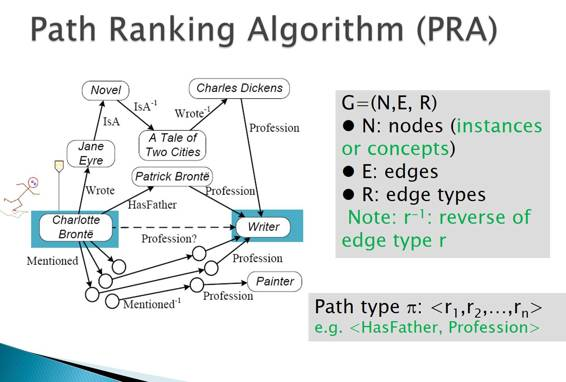

# 专访 | 东南大学漆桂林教授：知识图谱不仅是一项技术，更是一项工程

机器之心原创

**作者：吴攀**

7 月 22 日，中国信息学会语言与知识计算专委会在深圳主办了一场主题为「人工智能×机器人——知识图谱」的专场论坛。中国中文信息学会秘书长、中科院软件所孙乐研究员、清华大学李涓子教授、英国阿伯丁大学 Jeff Z. Pan 教授、浙江大学陈华钧教授、东南大学漆桂林教授、Gowild 智能科技 CTO 王昊奋博士等众多国内外知识图谱顶级专家和青年新锐共同探讨了知识图谱技术的发展和应用。现场干货十足，作为本次论坛的协办方之一，机器之心有幸对东南大学漆桂林教授进行了专访。漆桂林教授做了题为《知识图谱中的推理技术介绍》的报告（报告演讲内容附于文后，对应幻灯片可点击文末「阅读原文」下载），讲解了中文知识图谱的发展现状与应用，并详细阐释了非结构化数据处理的相关技术。

 

> *漆桂林教授简介：东南大学教授、博导，担任中国中文信息学会语言与知识计算专业委员会副主任和中国计算机学会中文信息技术专业委员会专委委员。漆教授于 2006 年从英国贝尔法斯特女皇大学获得计算机科学博士学位，师从人工智能界著名专家 Weiru Liu 教授。2006 年 8 月至 2009 年 8 月，在德国 Karlsruhe 大学 AIFB 研究所做博士后研究，师从语义 Web 界国际知名专家 Rudi Studer 教授。在人工智能和知识图谱的科研和实践方面有近 20 年的经历。发表高质量学术论文 100 余篇。特别是在国际人工智能联合会议（IJCAI）、AAAI 人工智能会议（AAAI）、知识表示与推理会议（KR）、不确定性推理会议（UAI）、语义网会议（ISWC）发表论文 20 余篇。担任语义 Web 权威期刊 Journal of Web Semantics 的编委。担任 Journal of Advances in Artificial Intelligence 的副主编。与欧洲科学院院士 Frank van Harmelen 合作，主编了 Annals of Mathematics and Artificial Intelligence 的一个特刊（special issue）；与 ECCAI Fellow Henri Prade 教授合作，主编了 Journal of Applied Logic 的一个特刊。连续 10 多年担任国际著名会议 AAAI、IJCAI 、WWW、ISWC 等会议的程序委员，并担任过中国语义 Web 和 Web 科学联合会议主席（CSWS2012）等职务。先后承担包括国家自然科学基金和欧盟第七框架项目 Marie Curie IRSES 在内的多项科研项目，作为第二负责人参与了由科大讯飞牵头的 863 课题「高考机器人」的一个子课题，并且承担华为、百度等著名公司项目。*

**机器之心：能介绍下你目前所做的研究吗？**

**漆桂林：**我们现在所做的研究主要涉及人工智能领域的三个部分。第一个非常重要的部分是知识表示与推理（Knowledge Representation and Reasoning），这是人工智能领域里较为传统的一个分支，这部分工作主要偏重于符号逻辑——怎么把我们人类的知识用符号逻辑表示或表达出来，以及当我们能把人类的知识用符号逻辑表达出来以后，我们怎么能够使用符号逻辑的推理机从这些知识里推理出隐含的知识——这也是我们人类智能里非常重要的一部分。

第二部分就是目前比较火的知识图谱。我们目前关注的是知识图谱的构建，这里面会用到许多机器学习技术，包括深度学习以及传统的机器学习技术。知识图谱的构建我们分为两类：一是「事实性知识（fact knowledge）」，这类知识包括人与人之间的关系、企业与企业之间的关系；另一类是更抽象的知识，称作「模式知识（schema knowledge）」，比如投资的关系，里面包含了投资人和被投资公司（个人）——我们要知道它的定义域是什么，它有什么样的人物和事物来做投资，它的宾语又是什么，就是说你要知道投资的是什么受众。这种更抽象的知识的表示方式也更复杂，作用也非常大——它可以帮助我们更好地对知识进行组织和推理。

第三部分叫做规则。这实际上兴起于七八十年代，在深度学习出现之前就非常火了，在很多公司里也用得非常普遍。我们在做各种规则的推理引擎，以及一些基于规则的自动和半自动的学习算法。

除了以上三大方面，我们也关注图像，但和传统的机器学习研究不大一样的是，我们做的是多模态图像理解。多模态有很多种，比如图像和语音的混合多模态，我们研究的是图像和文字的多模态。

**机器之心：就像是现在比较流行的 image caption（图像描述）?**

漆桂林：部分对，image caption （图像描述）方面我们也在研究，不过我们不会局限于 image caption。以上就是就是我们目前在人工智能领域的布局，以及我们实验室未来几年准备做的事情。我们也会做一些上层的应用，比如利用这些技术来做一些问答、推荐和情感分析，这都是我们关注的领域。

**机器之心：刚才你提到在做知识图谱时会用到深度学习，能否解释一下它们之间的关系？**

**漆桂林：**前面说了知识图谱方面目前的工作有两类。其中一种是学习各种实体之间的关系，比如企业之间的关系、合作伙伴之间的关系、人物之间的关系（比如领导关系、父子关系等），这是自然语言处理领域里一个比较传统的问题——关系抽取（relation extraction）。这个任务可以使用机器学习来完成，但也有使用规则的。最近几年随着深度学习的兴起，我们会考虑使用深度学习模型来抽取关系，当然前提是你已经积累了足够的语料——没有足够语料，深度学习是做不了的。对于我们来说，深度学习是我们实现自然语言理解的一个工具。当然，我们也在考虑从知识表达的角度来融合知识图谱和深度学习，提出新的深度学习模型。

**机器之心：在与中文理解的相关研究中，我们是否经常面临语料缺失的问题？**

**漆桂林：**对，这是一个很大的问题。特别是当我们要做一个各种领域的知识图谱时，语料缺失是导致我们很难快速做出比较高质量的知识图谱的最大障碍。就是说，当你面临一个新的领域时，你首先需要一些比较低级的方法，比如写一些规则，然后再使用这些规则来抽取一些比较高质量的关系，其中你需要做很多人工标注，把里面的关系对正确标注出来作为训练样本（当然人也可能犯错，但一般我们认为是正确的）。但我们可能不会马上就使用深度学习，我们会使用一些简单的机器学习方法来做关系的学习。当语料比较多了以后，可能才会采用深度学习的方法。一般都有一个过程，不会一开始就使用深度学习。另外可以考虑的一个方法是结合深度学习和迁移学习（transfer learning）。

**机器之心：现在还有一些传统方法和深度学习的结合？**

**漆桂林：**从业界的角度来看，用传统的方法还是比较多一点。但是各种方法结合其实是很正常的，比如说谷歌的 AlphaGo 采用的就是深度学习和增强学习（reinforcement learning）的结合。而最近很多人关注怎么把规则和深度学习结合，提出新的混合模型。

**机器之心：目前基于深度学习的关系抽取的效果是否比传统的翻译模型更好呢?**

**漆桂林：**在某些特定的条件下，比如标注数据足够的情况下，深度学习会好一些，但也不会好多少。比如说我用传统的方法可能能达到 85%，用深度学习也最多只能到 86% 或 87%；所以我们会想这样的代价是否是值得的。就是说，如果我花了大量的时间给数据做标注，结果只提升了一到两个点，那从业界的角度来看这就很不值得。但如果你有足够的资源，你也可以做。你标注的数据越多，模型越来越复杂，学习的效果肯定会越好。

**机器之心：有的观点认为之后所有的商业都是数据商业，那数据再往后可能就是知识。从实践角度，传统行业如何去构建这种数据的知识图谱关系？**

**漆桂林：**具体还是要看实际应用。不能说给你一个领域，就开始构建知识图谱。这是不行的，这样不是目标驱动的。一旦你的应用和需求确定了，你才能确定要从怎样的数据源去抽取信息。比如说电商这一领域，如果我是一家电商公司，我肯定有一些电商的数据，而且这些数据是结构化的，可以直接用于知识图谱。然后我们可以使用一些外部的数据源，比如淘宝、天猫和京东的数据源——我们可以用爬虫技术把这些数据爬下来，把这些数据抽取出来然后进行集成。这些从电商网站获取的数据也是结构化比较好的。另外还有一些来自各种论坛或新闻的数据，从这些数据中进行抽取的难度就更大了。所以说你是说各种不同的数据源中进行数据抽取。 总的来说，首先你要把你的应用确定好，然后再确定要从哪些数据源获取所需的数据，然后再考虑要用怎样的方式将这些数据集成起来。这样的考虑是必需的。

**机器之心：来自社交网络或新闻等的数据很多是非结构化的，我们可以怎样解决这个问题？**

**漆桂林：**对非结构化数据的处理是知识图谱的一个非常有用的地方。其实我们知道大数据里面很多数据都是非结构化的——所谓的大数据，更多的并不是企业内部关系数据库里面的数据，更多的是互联网上每天通过各种媒体产生的数据，这种数据的量是非常大的。如果我们把这个看作大数据，根据 IBM 等公司的统计，其中大部分——80% 以上——是非结构化数据。非结构化数据可以分成几类，一类是音频数据，比如说我们今天的录音；第二类是文本数据，比如你们记录下来放在本子上的数据；第三类是图像数据。

处理这三类数据所用的技术是不一样的。音频数据目前都在用深度学习了，图像数据处理也基本如此。深度学习在这两方面已经比传统的处理方法好很多了，但在文本方面，深度学习还没显示出那么强大的威力。这方面也有各种讨论：文本的东西可能和我们人类的智能存在关联，图像这些感知方面的处理可能层次更低一点，而人的语言则更偏向于认知方面，处理的难度也更大。深度学习不一定适合做这样的事情。目前的学术成果也能够验证这样的说法。可以说在很多自然语言处理和自然语言理解的任务中，深度学习并没有那么强大的表现。

深度学习可能在某些方面比传统方法更好，但它其实需要付出很大代价，比如说要做很多人工标注。而且事实上即便是在音频和图像方面，采用深度学习的代价也是很大的，同样需要很多人工标注。自然语言更复杂，对自然语言进行标注是很困难的，也很难做到高效，因为换一个领域就需要重新标注。所以深度学习虽然是一个很好的方法，但它并不是唯一的方法。我认为在非结构化数据的处理方面，对文本数据的处理是非常重要的一块；从技术上来说，我们会把人工智能领域的一些技术都利用起来。从大的方面来说，我们会用到基于规则的技术和基于学习的技术，比如 SVM（支持向量机）、以及现在比较热的深度学习技术。而在文本分析这一特定领域，还有一些特定技术，比如我们前面提到的对知识图谱的构建非常重要的关系抽取，另外还有自然语言处理里面的命名实体识别——比如文本里面有一个机构或人名，你能不能将其准确识别出来？你至少要识别到这个人，才能识别到其两者之间的关系。当你把这个事情做好了以后，我们还需要考虑怎么把这些数据集成起来。比如说在一个文本里提到的某个人在另一个文本里也出现了，但命名却不一样（比如我们在一个文本里说「习近平」，在另一个文本里说「习大大」），你怎么知道这两个人是同一个人？我们构建知识图谱时就需要解决这个问题。这种实体之间的消岐对提高质量来说是非常重要的技术。

有了知识图谱之后，我们还需要做什么事情呢？只有结构化的数据是不够的，如果新来一个文本会怎样？我怎么对这个文本做理解呢？我们需要把我们已有的知识图谱中的各种实体和实体之间的关系链接到新来的文本中，这样才能做到对文本的理解——这里面有一种叫做实体链接的技术。如果要想得到我刚刚所说的抽象的 schema 知识，那就还需要做对 schema 知识的学习，这也是单独要做的一种技术。此外当数据来自于不同的人的时候，schema 知识也需要做匹配。

从图谱构建的角度来说，它有很多技术，除了刚才提到的，另外还有推理技术。比如说，如果有一个知识图谱里面两个节点之间的边是缺失的，但它们之间其实是有关系的，只是没有显示的抽取出来；那么我们就可以通过与这两个节点关联的节点将它们之间的关系推理出来。这就是推理技术，而推理技术也可以分为很多种，包括：逻辑推理和统计推理。所以在知识图谱的构建上存在很多技术。

**机器之心：所以知识图谱是非常复杂的技术。**

**漆桂林：**就像我经常在外面做讲座时强调的那样：如果你要理解知识图谱，你要知道它不仅仅是一种技术，而是一种工程。它是自七八十年代以来在人工智能领域慢慢兴起的一个分支——知识工程。我刚刚说的知识表示和推理其实也是知识工程的一部分。知识工程是老一代人工智能学者提出来的——94 年的图灵奖获得者 Feigenbaum 提出了知识工程这个概念。80 年代时，人工智能里面的专家系统非常盛行，它也使用的是知识工程。要理解知识工程，做计算机的人可以思考一下软件工程：软件都有需求分析，然后用各种技术去构建软件，有各种开发流程，还有各种质量验证等等。知识工程也是一样，只是其中的知识对应了软件工程中的软件，所以也同样是一项工程。就像我们刚才说的，如果你要构建电商的知识图谱，你首先要了解需求，没有需求就不要说图谱。你不能说我要建电商知识图谱，这是没法建的，你必须告诉我具体需求是什么。有了需求，我才知道该从什么数据源抽取什么知识，然后我才能选择合适的技术来做这件事，还要做好质量控制。

此外，就和软件工程里的软件更新一样，知识库和知识图谱同样需要动态更新。知识图谱不是静态的东西，如果你做的是静态的，那就没有价值，是死的；只有当它是动态时，才具有生命力。你还要让别人经常使用，有了使用才有反馈，你可以使用这些反馈对你的知识图谱做各种修改和更新，这样它才能变成真正的商品，它的价值才能真正体现出来。

**机器之心：所以这是一个知识不断积累、不断学习的过程。现在在深度学习领域里有一个比较火的研究方向是 learn to learn，人们认为深度学习很难做到，因为它没有知识管理，不擅长推理。如果我们要实现 learn to learn 的目标，知识图谱是一种很重要的方式吗？**

**漆桂林：**对，深度学习最大的一个问题是没有可解释性。对于知识图谱，一旦构建好了以后，在对于任务进行推理时，不管你用的是基于规则的推理还是逻辑推理，都是可以解释的。就是说我们知道为什么推理出了这个结果，而不是另一个结果；我们也知道我们是从哪个数据源进行抽取的。这些数据我们都是可以保留的，这就是知识的溯源性。

（要实现 learn to learn 的目标，）知识图谱是一种很重要的方式，但我们不能说它是唯一的方式。现在在机器学习领域里面有不少学者提出来可以用非监督的学习方法，也就是说不再需要人去标注数据，能实现机器的自主学习。这也是一种方式。但现在还没有人能真正把无监督学习做出来，所以具体我们还不太清楚。但它可能会结合知识图谱来完成这个任务。对于我们做知识图谱的人来说，我们也会把机器学习作为一种手段来实现知识的自学习。

**机器之心：在知识图谱方面，我们知道百度有知心，搜狗有知立方，你对这些科技公司的知识图谱项目有了解吗？**

**漆桂林：**我们请过百度和搜狗的人到一些中文知识图谱的会议上做过报告，我只能从听过这些报告里谈谈我的认识。但我没有具体参与他们的工作，所以我不能比较和乱评价，但我觉得百度和搜狗在知识图谱方面都是做得非常好的。他们都是中国知识图谱方面比较先驱的公司，做得非常早，所以他们也能很早就到我们这些特邀的会议上做报告。前期来看，我觉得百度的知心和搜狗的知立方这两者的差异性不是特别大，前期还主要是集中在百科的数据上。百度有百度百科的数据，这是天然的优势；搜狗也能通过一些渠道获取数据，比如互动百科、维基百科，或也可能会爬百度百科的数据。在这一块，他们都做得非常好。比如说，他们可以用他们构建好的「通用知识图谱」来回答问题，比如回答「王菲的老公是谁？」这种娱乐圈里面比较热门的话题。这些用户比较关注的问题他们应该都能回答得很好。包括人物的关系链推理等等，他们都有涉及。

但是他们公司的定位和侧重点不一样。据我所知，百度知心在教育、游戏和医疗这些领域投入比较大，他们做了一些比较垂直的知识图谱构建和应用。比如在医疗方面，我们和百度有一个合作，我们的学生去百度实习，帮助他们完成了一个医疗网站，把医疗器械等医疗方面信息利用起来构建了一个医疗方面的知识图谱，能帮助他们进行一些决策，比如保健品的推荐等等。他们在这方面投入了一些力量，做得也比较好。而搜狗还在推广自己的搜索引擎。据我所知，搜狗也做了一些人物关系的知识图谱，这主要是在娱乐圈方面做得比较多。另外搜狗也可能会把知识图谱应用到他们的智能输入法里面。所以我们不能说他们谁强谁弱，他们只是侧重点不一样。

但是从技术方面来说，百度可能在知识图谱上的积累更多一点。据我所知，百度有两个知识图谱团队，在深圳有一个，在北京有一个，而且都有上百人。所以他们的投入比较大。但我不清楚搜狗的投入有多大，这里就不妄下评论了。另外，百度在自然语言处理方面在国内是比较领先的。自然语言处理和知识图谱是息息相关的，所以我个人认为百度在知识图谱的技术和整体布局上是非常强的。

**机器之心：知识图谱的概念比自然语言处理更大一些吗？**

**漆桂林：**我们可以把知识图谱看作是自然语言理解。自然语言处理是什么呢？比如说给定一个句子，我们怎么知道这个句子的结构，我们能否构建出一个语法树出来，我们能不能做好分词的工作。

而知识图谱则更接近自然语言理解，也就是说我们不仅要把这个句子解析出来，而且还需要知道句子中的每个词的含义是什么、词跟词之间的关系是什么、每个词有什么属性等等。我们要了解其中方方面面的信息。就像我们见到一个人，如果我只是知道他是个人，那我也谈不上了解这个人。但如果我知道他的职业、他的朋友圈、他的子女和他擅长的事这些信息，我就能对他进行逻辑推理，从而对这个人有很好的理解。这和仅仅识别他是一个人是有很大区别的。

**机器之心：在大数据以及机器学习技术兴盛的今天，您如何看待知识图谱的前景与挑战？**

**漆桂林：**我觉得目前最大的挑战不是技术上的，因为实际上大家在技术和算法上做得都还可以，和国外的技术差距也并不是特别大；真正的挑战是我们没有一些成型的工具。为什么深度学习能得到大家的广泛使用呢？因为它有很多工具，比如 TensorFlow。这些工具能让我们很快做出一些基于深度学习的应用，比如图像理解，所以它能让很多不是很有专业水平背景人应用起来。但知识图谱不是这样的：第一是缺工具，第二是缺数据。我们很少有开放的数据，这也是我们知识图谱正在大力解决的一个问题。我们正在打造一个知识图谱开放平台，能够把知识图谱的数据和工具开放出来让大家都能够使用，从而扩大其受众，让业界能开发出各种好的应用；这样才能更好地促进我们的技术的发展，实现更好的前景。

* * *

**知识图谱中的推理技术介绍**

**报告摘要**

知识图谱的概念于 2013 年以后开始在学术界和业界普及，并在智能问答、医疗、反欺诈等应用中发挥重要作用。本次报告将系统介绍知识图谱中的推理技术，包括基于符号逻辑的推理和基于统计的推理。并且探讨基于逻辑和基于统计推理的结合。

**演讲内容**

非常荣幸来这里和大家做交流。今天我讲的是关于知识图谱中的推理，并且会讲到我们最近做的高考机器人的工作怎么和推理结合起来。今天早上陈华钧教授为我们做了非常精彩的知识图谱的介绍，大家对知识图谱将来有什么样比较好的应用场景充满期待，我们当然希望将来高考机器人能做出来，以及能够把我们知识图谱以及推理技术真正用起来。

我今天首先会给大家介绍知识工程的历史，也就是知识图谱的历程；二是给大家讲一下我们在知识图谱中的知识表述以及推理的简要作用介绍；三是讲我们做的高考机器人的推理例子，最后会总结一下。

其实我们要谈到知识图谱的时候，大家千万不要把它看成一个图，这样理解有局限。你要把它看成一个工程，其实它是一个知识工程，它涉及到怎么把图构建起来，怎么把图用起来，其实是一整套的方法。

 

我们如果从这个方面理解，我们应该非常感谢图片上的这位先生，是他提出了知识工程的概念，其实是人工智能领域在 80 年代兴起来的非常里程碑的概念。知识工程不仅仅在 80 年代火了一下，其实它有很深远的历史。从 60 年代开始其实就有很多学者开始关注这方面的研究了，最早做认知科学的人想做什么呢？他说人类的自然语言是非常复杂的，它和计算机里面信息存储的差别是非常大的，计算机把人类的自然语言是看成符号，不知道是什么，都是字符串。我们如何把人的自然语言用一种形式化的方式能够表示出来？这其实是以前的人在想的事情。最后想出来一个东西：它可以用有向图把人类的自然语言表述或者表达出来，这样计算机可以利用这个东西做一些事情。

70 年代，人工智能最顶级的 IJCAI，国际人工智能联合会议里面有很多论文都是关于这个的。80 年代，随着规则的兴起，大家都用这些规则，以及各种专家的知识，这时候专家系统非常流行。而这时候费根鲍姆和他的学生提出知识工程的概念。因为大家对这个东西期待很高，而且因为知识工程不像机器学习那样，能够比较容易上手，能够非常快的根据数据跑出结果，他要把知识能用人工的方式写出来，这个代价很大。这就导致一个问题，比如我在医学领域，我能够把知识库构建的很好，能做各种应用，感觉很不错。但是换一个领域又得重新做，而且可能比较困难。一开始大家期望很高，又没有出现达到了全人工智能或者做通用的人工智能的产业，大家的期望值一下降下来了，缺少经费导致知识工程举步维艰。当然，还是有些人继续研究语义网络和知识工程，比如说前雅虎首席科学家 Ron Brachman。语义网络的问题是，一个句子不同的人用不同的方式表述，而且规则也不一样，最后跑出来的结果，不同的人推理后跑出来的结果不一样。

为了把这个东西做的更形式化，Brachman 等人引入了逻辑，使得语义网络的推理更加严谨。而到了 2000 年左右，就像陈教授介绍的，随着语义 Web 的提出，大家觉得逻辑必不可少，然后各种标准就出来了，「逻辑」实在太强大了，但是有时候又和现实的生活离的太远。到 2009 年的时候语义网络又开始走下坡路，因为大家一开始以为这个东西会很有用，结果又没有达到期望。谷歌在这样的背景下提出了知识图谱的概念，他们只关注数据，关注怎么把自然语言里面把各种关系获取出来，然后用这些东西做各种提高搜索引擎的效果，以及做一些问答等等，使得这个知识图谱的实用性大大增强。它的实用性增强以后，我们做研究的人才有经费，才可以做各种实用的推理。

讲推理首先要讲表示，为什么呢？你都不知道你的知识怎么表示或者表达，你怎么做推理？到底用图表示还是用什么表示？首先要有语言表示。有几个标准的语言：RDF、RDFS、OWL。RDF 其实很简单，就是主谓宾结构，但不是那么简单，因为它多了一个 URI 的东西，它要有一个唯一的标识，给你一个有利的标识，然后会有一些自定义的东西。这个东西其实就是我们现在大家非常熟悉的知识图谱，就是用这个东西表述的，就是主谓宾结构表述的。

这还是不够，所以研究者又提出了 RDFS，引入了「类」这个东西，类是指实例的集合。比如「狗尾草」是一个公司，而「人工智能公司」是一个类，很多公司都在这个类里面。我们有了这个类以后可以做各种分类体系，比如可以说人工智能公司都是高科技公司，我可以分类了——我有这样的分类，还有 subclass 的关系。还有一个是关系，比如投资关系，我们要知道它是由什么样的一类人或者一类事物来投资什么样一类人或者一类事物。如果是投资关系，一般我们大家想的更多的一般是由投资人来投资公司。如果我把这个东西给形式化出来，后面就有作用了。

 

我们先看第一个推理，假设我知道 Gowild 是一个人工智能公司，我知道人工智能公司是高科技公司，那我就可以说 Gowild 是高科技公司，这样没有问题，大家很容易理解。投资是投资人投资公司，然后我发现胡海泉投了 Gowild，当然我就可以推出它是一个投资人，因为投资的关系，左边出现的必须是一个投资人，右边出现的是一个公司。所以我可以推出胡海泉是一个投资人，Gowild 是一个公司，这是非常简单的推理。

OWL 可以做得更复杂，人类的自然语言不是那么简单的，如果那么简单，那我们人类智商也太低了。我们可以知道火车和汽车不是同一类东西，知道一个东西是火车，那肯定不是汽车，这是不相交的，这就要引进否定，否定就不是前面的东西能搞定的，你可以加进来。然后你还可以有些存在的东西，比如说交响乐是包含乐章的大型管弦乐曲。交响乐是大型管弦乐曲，这里存在包含至少一个乐章的东西，所以这里面就说我要有这样的量词，要有一个量词来处理这个事。我直接加这个就可以了。

 

为什么还可以加量词和否定？其实你加进来的时候，每加一个东西，它表达的能力就会有所提升，推理的复杂度也会随之提升。表达能力和计算复杂度的权衡怎么做好，这是我们要考虑的，这里面很多坑，看起来很简单，但是做起来不是这么回事。你怎么做好权衡，特别是应用的时候，具体细节我不再介绍。

 另外是规则，在公司很多人都非常苦逼的写规则，你不写智能就体现不出来，所以你必须不停地写规则。比如说沉积岩岩层越往下，形成年代越早。这时候写一个规则如果 A 是沉积岩，B 是沉积岩，A 在 B 的下面，A 的年代比 B 的年代更早。它可以否定，如果某个区域有断层，那就不适合修建水库，A 如果是断层，那就否定它不是做这个事情。

 

我们还可以做约束，一个地区不可能是平原又是高原。所以规则可以做很多事情，甚至可以做到前面说的事情，但是它的表述方式是不一样的。刚刚刘知远老师讲的还可以做关系补全的工作，因为刘老师普及了这方面的知识，我就不再介绍。我可以把知识图谱看成有向的带标签的图，我知道两个节点是不是有某个关系，就可以用一个算法或者表示学习的算法，然后判断出来这两个东西是不是有这样的关系。

比如说这么复杂的图，这个人和这样的词之间，这样的概念之间，是不是有关系，你想知道这个人和这个词有关系，你就要它们的边，然后来计算这种关系成立的概率有多大，这里用的就是 path ranking。这是统计关系推理很重要的一部分。我今天不可能列举所有的，我们还要处理各种空间的推理，像今天早上讲的时间、空间等维度的推理，这个东西很复杂，因为我们有很多推理的方式，我们做地理的题目麻烦的不得了，还有这种图，地图等等，这中间要标出来，各种国家、地区之间的位置关系等等，你都要标出来。我们可能要引入距离模型还有空间模型，可能还要有扩展表示的对象，我们可能要考虑动态对象，然后线和点，所以很多表示是很复杂的。空间类不讲太多。

 

我具体讲一下推理的框架。比如我们做地理的时候，有一个地理知识库，我们有这个题目，题目也可以提取一些知识，然后生成一些知识库，先推空间推理，然后到规则，再做其他推理的事情。比如看到这个题目，我不知道有没有人有做地理试题的，可能高中很痛苦，看到这个有人都要流眼泪了。这个很复杂，首先要读图，读图以后再回答问题，图还分各种岩层，石灰岩、砂岩、页岩、沉积物等，比如这个层到下面去，因为有洪水，你读图要回答 ABCD 哪个是对的。

 

我们做这种事情要各种知识，比如要知道石灰岩是沉积岩，页岩是沉积岩，我要知道沉积岩同层形成年代一致，我们还要做图片的标注。我们现在是人的手工标，以后还有自动标注的方法，这就是目前所谓的深度学习的方法处理不了这种标注。我们要用各种方法来标，这涉及到图像理解。你要理解这个东西是什么，要理解它的方位等等。这是人标出来的，有这个东西还要形式化表示出来，页岩是沉积岩，石灰岩是沉积岩等，我们会做什么事呢？还要把规则写出来，就是这里的规则。完了以后我才能去到这里，上面是我从地理课本、各种百科里面拿出来的知识，下面是我从图片里面标出来的东西，把它放到临时的知识库里面。我会先对方位做推理，然后得到新的关系，岩层的上下位关系。我再扔回来，再扔到推理里面用规则推，就得到岩层 3 形成年代比岩层 2 更早，这就是我们前面的选项 A 就可以直接获取。

我们再看一个试题，这是 2016 年考试的题目，我们要知道在这个时间段，这个会在北京举办，前面是在哪里举办。

 

然后读图，让我们回答这个问题，到底是 ABCD 哪个对。这里面我们又要把一些课本或者百科里面的知识拿出来，要有一些原则，比如说处暑是公历 8 月 23 日，华盛顿位于哪个区，还有一些规则，我们又要把它形式化出来，处暑我们就写成三元组的形式，时间段也要写出来，全部形式化出来。我们还要有些大于，时间大于什么时间，把这些拿出来，我们把它推理好。还要把规则形式化出来，然后我们把这些知识、规则用推理机跑出结论，然后把答案 A 给找出来，因为 A 说的是处暑和这个时间是相似的。我们用这种推理的好处是什么呢？我们是可以没错的，我们用这种知识图谱或者逻辑的推理，它和我们统计的，特别是深度学习也有推理，它的好处是我推出来的东西我知道它为什么是这样的，我可以知道它是用这些知识点，用了这个规则，把这样的新的事实给推出来，我可以告诉你，这个东西有什么用呢？非常有价值。假设这个东西做出来了，那么将来可以做什么？将来高考的辅导老师其实都没啥用了，因为我们可以搞在线教育，你学生到这里解题，解完以后还可以告诉你这个题目为什么这么解，这样老师就没有什么作用了。这是非常有用的，但是也不知道能不能做出来。

总结一下，知识图谱中本体和规则都是很有用的，我们可以推理出隐含的知识，可以检测一个知识图谱是不是有些逻辑的冲突。做搜索或者问答的时候，我可以用我已有的知识做各种查询，以及处理各种异常。为什么要处理异常，比如我刚刚说的火车和汽车是不相交的，但是知识不是永远是对的，随着时间的推移，保不准将来出什么交通工具，火车变成汽车，汽车变成火车，所以会有异常。将来的工作，我觉得还是要很多事情要做，比如地理知识怎么表示，空间知识怎么表示，空间推理怎么做，这都是非常困难的。而且目前空间推理这块是缺少比较好的工具。现在大家比较关注的是我们怎么把逻辑的推理和统计推理能够去结合起来，这当然也是陈华钧教授上午讲到的，深度学习的创始人 Hinton 等人也想这个事情，他以前做过很多工作，包括分布式表示、语义网络等，他在并行知识表示和推理上做得很不错，也许他设计深度置信网络（deep belief network）的时候就考虑到了语义网络跟神经网络的结合。

******©本文由机器之心原创，***转载请联系本公众号获得授权******。***

✄------------------------------------------------

**加入机器之心（全职记者/实习生）：hr@almosthuman.cn**

**投稿或寻求报道：editor@almosthuman.cn**

**广告&商务合作：bd@almosthuman.cn**