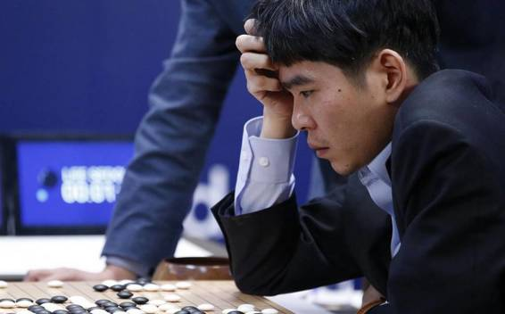

# 深度 | 人工智能全局概览：通用智能的当前困境和未来可能（附 PDF）

选自 Oreilly

**作者：Mike Loukides、Ben Lorica **

**机器之心编译**

**参与：Rick、吴攀、微胖、李亚洲**

> *我们的未来将不可避免地与人工智能捆绑在一起，于是我们就必须要问：人工智能的现状是怎样的？我们将走向何方？（可点击阅读原文下载原版 PDF）*

**目录**

*   如今人工智能的能力和局限

*   迈向通用人工智能

*   训练还是不训练

*   智能的意义

*   助理还是主角？

*   为何人们对人工智能的兴趣大增？

*   建立知识数据库

*   产生结果

*   道德和未来

*   总是在未来

定义人工智能不是困难，而简直是不可能，这完全不是因为我们并不理解人类智能。奇怪的是，人工智能的进步更多的将帮助我们定义人类智能不是什么，而不是定义人工智能是什么？

但不管人工智能是什么，过去几年我们确实已经在从机器视觉到玩游戏等众多领域取得了很多进展。人工智能正在从一项研究主题向早期的企业采用转变。谷歌和 Facebook 等公司已经在人工智能上投入了巨大的赌注，并且已经在它们产品中应用了这一技术。但谷歌和 Facebook 只是开始而已：在未来十年，我们将见证人工智能蔓延进一个又一个的产品。我们将与 Bot 交流——它们不是照本宣科的机器人拨号程序（robo-dialer），我们甚至不能意识到它们不是人类。我们将依赖汽车进行路线规划，对道路危险做出反应。可以毫不夸张地估计：在未来几十年中，我们所接触的每一种应用程序都将整合进一些人工智能功能，而如果使用应用程序，我们将无法做任何事。

鉴于我们的未来将不可避免地与人工智能捆绑在一起，我们就必须要问：我们现在发展得如何了？人工智能的现状是怎样的？我们将走向何方？

**如今人工智能的能力和局限**

对人工智能的描述围绕着以下几个中心：强度（有多智能？）、广度（解决的是范围狭窄的问题，还是广义的问题？）、训练（如何学习？）、能力（能解决什么问题？）和自主性（人工智能是辅助技术还是能够只靠自己行动？）。这些每一个中心都有一个范围，而且这个多维空间中的每一个点都代表着理解人工智能系统的目标和能力的一种不同的方式。

在强度（strength）中心上，可以很容易看到过去 20 年的成果，并认识到我们已经造出了一些极其强大的程序。深蓝（Deep Blue）在国际象棋中击败了 Garry Kasparov；沃森（Watson）击败了 Jeopardy 的常胜冠军；AlphaGo 击败了可以说是世界上最好的围棋棋手李世石。但所有这些成功都是有限的。深蓝、沃森和 AlphaGo 都是高度专业化的、目的单一的机器，只能在一件事上做得很好。深蓝和沃森不能下围棋，AlphaGo 不能下国际象棋或参加 Jeopardy，甚至最基本的水平都不行。它们的智能范围非常狭窄，也不能泛化。沃森已经在医疗诊断等应用中取得了很多成果，但它基本上仍然只是一个必须为特定领域专门调制的问答机器。深蓝拥有大量关于国际象棋策略的专门知识和百科全书式的开放知识。AlphaGo 是用更通用的架构构建的，但其代码中仍然有很多人工编码的知识。我不是轻视或低估他们的成就，但认识到他们还没有做成的事也是很重要的。

 

我们还没能创造出可以解决多种多样不同类型问题的人工通用智能（artificial general intelligence）。我们还没有听一两年人类对话的录音就能自己说话的机器。尽管 AlphaGo 通过分析数千局比赛然后又进行更多的自我对弈而「学会」了下围棋，但这同样的程序却不能用来掌握国际象棋。同样的一般方法呢？也许可以吧。但我们目前最好的成就离真正的通用智能还很远——真正的通用智能能灵活地无监督地学习，或能足够灵活地选择自己想要学习的内容，不管那是玩棋盘游戏，还是设计 PC 板。

**迈向通用人工智能**

我们如何从狭窄的、特定领域的智能迈向更通用的智能呢？这里说的「通用智能」并不一定意味着人类智能；但我们确实想要机器能在没有编码特定领域知识的情况下解决不同种类的问题。我们希望机器能做出人类的判断和决策。这并不一定意味着机器将实现创造力、直觉或本能等没有数字类比的概念。通用智能将具备处理多种类型的任务和适应未曾预料的情形的能力。一个通用智能无疑可以实现「正义」和「公平」这样的概念：我们已经在谈论人工智能对法律系统的影响了。

我们先以自动驾驶汽车来证明我们所面临的问题。要实现自动驾驶，汽车需要将模式识别和其它能力整合到一起，包括推理、规划和记忆。它需要识别模式，这样才能对障碍物和街道标志做出反应；它需要推理，这样才能理解交通规则和解决像避开障碍物等任务；它需要规划以获得从当前位置到目标位置的路径，并同时考虑到交通状况等其它模式。

它需要不断重复做这些事，不断更新它的解决方案。但是，即使一辆自动驾驶汽车整合了所有这些人工智能，它也不具备我们所期望的通用智能应该具备的灵活性。你不会期待一辆自动驾驶汽车能和你交谈或布置你的花园。将从一个领域学习到的知识应用到另一个领域的迁移学习是非常困难的。你也许可以重新加工其中许多软件组件，但那只能指出缺少了什么：我们当前的人工智能能为特定问题提供范围狭窄的解决方案；它们并不是通用的问题解决者。你可以将范围狭窄的人工智能叠加到一起（一辆车可以带有能谈论去哪里、进行餐厅推荐和与你下棋让你不会感觉无聊的 Bot），但狭窄人工智能的叠加永远不能得到一个通用人工智能。通用人工智能的关键不是有多少种能力，而是这些能力的整合。

尽管神经网络这样的方法原本是为模拟人脑过程而开发的，但许多人工智能计划已经放弃了模仿生物大脑的概念。我们不知道大脑的工作方式；神经网络计算是非常有用的，但它们并没有模拟人类的思维。在《Artificial Intelligence: A Modern Approach》一书中，Peter Norvig 和 Stuart Russell 写道：「当莱特兄弟和其他人停止模仿鸟类并开始学习空气动力学时，对『人工飞行』的追求才获得成功。」类似地，要取得成功，人工智能不需要将重点放到模仿大脑的生物过程上，而应该尝试理解大脑所处理的问题。可以合理地估计，人类使用了任意数量的技术进行学习，而不管生物学层面上可能会发生什么。这可能对通用人工智能来说也是一样：它将使用模式匹配（类似 AlphaGo），它将使用基于规则的系统（类似沃森），它将使用穷举搜索树（类似深蓝）。这些技术没有一种能与人类智能直接对应。人类比任何计算机都做得更好的是构建他们的世界的模型，并根据这些模型采取行动。

超越通用智能后的下一步是超智能（super-intelligence 或 hyper-intelligence）。目前我们还不清楚如何区分通用人工智能和超智能。我们期望超智能系统会具备创造力和直觉等性质吗？鉴于我们对人类的创造力还不甚理解，思考机器的创造力就更为困难了。围棋专家称 AlphaGo 的一些落子是「创造性的」；但它们源自与其它所有落子完全一样的过程和模式，而并非以一种新的视角看待这项游戏。同样算法的重复应用可能会产生让人类感到惊讶或意外的结果，但仅仅的惊讶并不是我们所说的「创造力」。

将超智能看作一个规模问题会更容易一点。如果我们可以创造「通用智能」，可以很容易估计出它将很快就比人类强大成千上万倍。或者，更准确地说，通用人工智能要么将显著慢于人类思维，难以通过硬件或软件加速；要么就将通过大规模并行和硬件改进而获得快速提速。我们将从数千个内核 GPU 扩展到数千个芯片上的数以万亿计的内核，其数据流来自数十亿的传感器。在第一种情况中，当加速变缓时，通用智能可能不会那么有趣（尽管它将成为研究者的一次伟大旅程）。在第二种情况中，其增速的斜坡将会非常陡峭、非常快。

**训练还是不训练**

AlphaGo 的开发者声称使用了远比深蓝更通用的算法来训练人工智能：他们制作了一个只具备最少围棋知识策略的系统，学习主要是通过观察围棋比赛获得。这指明了下一个大方向：我们可以从机器基于标注数据的监督学习走向机器依靠自己组织和结构化数据的无监督学习吗？

Yann LeCun 曾在 Facebook 的一篇帖子中说到：「在我们想要得到真正的人工智能之前，我们必须解决无监督学习的问题。」要对照片分类，一个人工智能系统首先会获得数百万张已经正确分类了的照片；在学习了这些分类之后，它还要使用一系列标注了的照片进行测试，看它们是否能够正确标注这个测试集。如果没有标注，机器又能做什么？如果没有元数据告诉机器「这是鸟，这是飞机，这是花」，它还能发现照片中重要的内容吗？机器能像人和动物一样，只需观察远远更少的数据就能发现模式吗？

人类和动物都可以从相对很少的数据中构建模型和抽象：比如，我们不需要几百万张图像才能识别出一种新的鸟或在一座新城市找到我们的路。研究者正在研究的一个问题是对视频的未来画面的预测（前沿 | MIT 人工智能实验室在视觉预测领域取得突破性进展，让机器预测下一秒的世界），这将需要人工智能系统构建对世界运作方式的理解。有可能开发出能应对全新环境的系统吗？比如在冰面汽车会难以预料的打滑。人类可以解决这些问题，尽管它们不一定很擅长。无监督学习指出，光是靠更好更快的硬件，或开发者只是用当前的库进行开发，问题将无法得到解决。

有一些学习方法处在监督学习和无监督学习的中间。在强化学习中，系统会被给予一些代表奖励（reward）的值。机器人可以穿过一片地面而不跌倒吗？机器人可以不用地图就驾驶汽车穿过市中心吗？奖励可以被反馈给系统并最大化成功的概率。（OpenAI Gym 是一个很有潜力的强化学习框架）。

在一端，监督学习意味着再现一组标记，这在本质上是模式识别，而且容易发生过拟合。在另一个极端，完全无监督学习意味着学习归纳性地推理关于一个情形的情况，这还需要算法上的突破。半监督学习（使用最少的标注）或强化学习（通过连续决策）代表着这些极端之间的方法。我们将看到它们能达到哪种程度。

**智能的意义**

我们所说的「智能」是一个根本性的问题。在 Radar 2014 年的一篇文章中，Beau Cronin 出色地总结了许多人工智能的定义。我们对人工智能的期待严重依赖于我们希望用人工智能做什么。对人工智能的讨论几乎总是开始于图灵测试。图灵假设人们可以通过聊天的方式与计算机交互：他假设了一种与计算机的沟通方式。这个假设限制了我们期望计算机做的事：比如，我们不能期望它能驾驶汽车或组装电路。这也是一个故意的模棱两可的测试。计算机的答案可能是闪烁其词的或完全不正确的；正确无误不是重点。人类智能也可能会是闪烁其侧或不正确的。我们不大可能将正确无误的人工智能误解为人类。

如果我们假设人工智能必须被嵌入到能够运动的硬件中，比如机器人或自动驾驶汽车，我们会得到一组不同的标准。我们会要求计算机在它自己的控制下执行一个定义不清的任务（比如开车到一家商店）。我们已经打造出了在路线规划和驾驶上比大多数人类都做得更好的人工智能系统。谷歌的自动驾驶汽车负有责任的那次事故的原因是该算法被修改得更像人类一样驾驶，并由此带来了人工智能系统通常不会具备的风险。

自动驾驶汽车还有很多没能解决的困难问题：比如在暴风雪的山路上行进。不管人工智能系统是嵌入在汽车里，还是无人飞行器或人形机器人里，其所面临的问题本质上是类似的：在安全、舒适的环境中执行是很容易的；而在高风险、危险的情形中则艰难得多。人类也不擅长这些任务；尽管图灵所期望的对话中人工智能是回避式的或甚至会错误地回答问题，但在高速路上驾驶时，模糊或不正确的方案却是不能接受的。

可以执行物理行为的人工智能迫使我们思考机器人的行为。应该用什么样的道德来规范自主机器人？阿西莫夫的机器人定律？如果我们认为机器人不应该杀死或伤害人类，武器化的无人机已经打破了这道界限。尽管典型的问题「如果事故不可避免，自动汽车应该撞向婴儿还是老奶奶？」是虚假的道德，但这个问题也有一些更为严肃的版本。为了避免会杀死其内部乘客的事故，自动驾驶汽车应该冲向人群吗？抽象地回答这个问题很容易，但很难想象人类会愿意购买会牺牲他们而不伤害旁观者的汽车。我怀疑机器人将来能够回答这个问题，但它也必然会在福特、通用、丰田和特斯拉的董事会上得到讨论。

我们可以通过对话系统或自主机器人系统的复杂度分布来更为简单地定义人工智能，并说人工智能只是单纯关于构建能回答问题和解决问题的系统。能够回答问题和推理复杂逻辑的系统是我们已经开发了好些年的「专家系统」，其中大部分都嵌入在沃森中。（AlphaGo 解决的是不同类型的问题。）但是，正如 Beau Cronin 指出的那样，解决对人类来说存在智力挑战的问题是相对简单的；更困难的是解决对人类来说很简单的问题。很少有三岁孩童能下围棋。但所有的三岁孩童都能认出自己的父母——而不需要大量有标注的图像集。

我们所说的「智能」严重依赖于我们想要该智能所做的事。并不存在一个能够满足我们所有目标的单个定义。如果没有良好定义的目标来说明我们想要实现的东西或让我们衡量我们是否已经实现了它的标准，由范围狭窄的人工智能向通用人工智能的转变就不会是一件容易的事。

**助手还是主角？**

人工智能的新闻报道聚焦于能够自主行为的机器自主系统。这么做有充足的理由：它有趣、性感、且有点令人害怕。在观看人类辅助 AlphaGo 下棋的同时，很容易去幻想一个由机器主宰的未来。然而相较于自动化设备，人工智能有更多超过人类的东西。真正的价值——人工智能或者智能增强——都在哪里？人工智能还是智能增强？这个问题自对于人工智能的初次尝试起就被问到，并由 John Markoff 在《Machines of Loving Grace》中深入探讨过。我们可能不想由一个人工智能系统来做决定；而可能会想为自己保留决定权。我们或许想让人工智能通过提供信息、预测任何行动过程的后果、提出建议来增强智慧，而把决定权留给人类。尽管有点《黑客帝国》的感觉，但这个被人工智能所服务的增强我们的智慧而非推翻我们的未来会比服侍一匹脱缰的人工智能有着更大可能性。

GPS 导航系统是一个人工智能系统用来增强人类智慧的绝佳案例。给定一张适宜的地图，大多数的人都能从 A 点导航到 B 点，尽管这对于自身能力还有很多要求，尤其是在我们不熟悉的领域。绘制两个位置之间的最佳路线是一个棘手的问题，特别是当你考虑到糟糕的交通和路况时。但是有了自动驾驶车辆的除外，我们从未把导航引擎连接到方向盘上。 GPS 是一种严格意义上的辅助技术：它给出了建议，而不是命令。当一个人已经作出忽略 GPS 建议的决定（或错误）时，你都会听到 GPS 说「重新计算路线中」，那是它正在适应新情况。

在过去几年中，我们已经看到许多各种意义上有资格作为人工智能的应用程序。几乎所有「机器学习」框架下的事物都有资格成为人工智能：事实上「机器学习」是在人工智能学科陷入声名狼藉之时，被指称回人工智能更为成功的那部分。你不必一定要构建带有人类声音的人工智能，像是亚马逊的 Alexa，当然它的推荐引擎肯定是人工智能。类似 Stitchfix 的 web 应用也是人工智能，它增加了由时尚专家们运用推荐引擎所做出的选择。我们已经习惯了那些处理客户服务电话的聊天机器人（并经常被它们气坏）——准确度或高或低。你可能最后还是得和人类对话，而其中的秘密就是使用聊天机器人清理掉所有例行问题。让某个人类去抄录你的地址、保单号码和其他标准信息没什么意义：如果内容不是太多，计算机可以做得至少同样准确无误。

下一代助理将是（并已经是）半自主性的。几年前，Larry Page 说《星际迷航》中的计算机是理想的搜索引擎：它是一台能够理解人类、已消化所有可用信息、能在被提问之前就给出答案的计算机。如果你现在正在使用谷歌，当它第一次告诉你由于交通堵塞要你早点出发赴约时，你可能会感到惊讶。这就需要纵观多个不同的数据集：你目前所在的位置、你的约会地点（可能在你的日历或联系人列表中）、谷歌地图数据、目前的交通状况、甚至是有关预期交通模型的时间先后数据。它的目的不是回答某个问题；而是甚至在用户意识到需求之前就提供帮助。

**为何人们对人工智能的兴趣大增？**

为什么人工智能在遭受「人工智能的冬天」（AI winter）的几十年声名狼藉之后，会成为当下如此热门的话题？当然，人工智能的新闻也出现深蓝之后，之后又有沃森的故事；但这些风潮都没能持久。看到目前的人工智能崛起为另一次风潮是很有诱惑力的。这能让我们忽视过去十年的变化。

人工智能的兴起依赖于计算机硬件的巨大进步。列举计算机性能和存储技术自人工智能之冬起（维基百科追溯到 1984 年）的 30 多年间的巨大进步是很乏味的。但这是此篇文章无法回避的一部分，特别是如果你已经见过 IBM 的沃森机器支架。据报道 AlphaGo  运行于 1920 个 CPU 和 280 个 GPU 上；击败了 Lee Sedol 的机器可能更加庞大，并且它使用了谷歌用于构建神经网络所开发的定制硬件。即使人工智能算法在普通笔记本上运行很慢，但在像 AWS、GCE 和 Azure 的云平台上配置一些重要的算力是容易且相对便宜的。机器学习得以实现，部分也是因为这种存储大量数据的能力。1985 年时的千兆字节（GB）还很罕见且重达数百磅；现在它已司空见惯，廉价而小巧。

除了存储和处理数据的能力，我们现在还能生成数据。在上世纪 80 年代，大多影像都是模拟信号。现在它们全是数字的，并有很多存储于像是 Flickr、Google Photos、Apple Photos、Facebook 等的网络服务商那里。许多在线照片已经被贴上了一些描述性的文本，这使得它们成为了训练人工智能系统的良好数据集。我们的许多对话也都是线上的，通过 Facebook、Twitter 和许多聊天服务。我们的购物历史也是一样。所以我们（或者更准确的说是 谷歌、苹果、雅虎、 Facebook、亚马逊等）就有了训练人工智能系统所需的数据。

我们在算法上也取得了显著的进展。神经网络并不是特别的新，但是「深度学习」却堆叠了一系列通过反馈来自我训练的网络。因而深度学习试图解决机器学习中最难的人类问题之一：从数据中学习最优表征。处理大量数据很简单，但是特征学习就更像是一门艺术而非科学。深度学习是要实现那门艺术的部分自动化。

我们不仅取得了算法上进展，更让它得到了广泛的使用，例如 Caffe、 TensorFlow、Theano、Scikit-Learn、 MXNet、 CNTK 等等。人工智能并不局限于学术界的计算机科学研究者；而是像 Pete Warden 所展示的那样，越来越多的人都能够参与进来。你无需了解如何实现一个复杂的算法并让它在你的硬件上运行得多么好。你只需要知道如何安装库并标注训练数据就行了。正如计算机革命本身所发生的那样，计算机被搬出了机房并被广大市民所使用，同样的民主化进程正在制造一场人工智能革命。来自许多背景和环境的人利用人工智能做试验，我们将会看到许多新型应用。有些会看起来像科幻小说（尽管自动驾驶汽车被看做科幻小说还只是几年前的事）；肯定会有我们甚至无法想象的新应用出现。

**建立知识数据库**

世界充满了「暗数据」：不存在于良好、有序的数据库中的非结构化信息。它在网站上、埋于表格里、被珍藏在照片和电影中；但它不易被机器智能或其他智能所捕获。像 diffbot 和 deepdive 这样的项目是利用半监督学习来找出非结构化数据中的结构——无论是大量的科学论文还是众多网站的碎屑。一旦他们创建了一个数据库，就能用更传统的工具—— API、SQL 语句或者桌面应用程序——访问该数据库。

知识数据库和图表已被应用到许多智能应用中，包括谷歌的知识图谱（Knowledge Graph）。在我们走向聊天应用时，挖掘暗数据并找出其中结构的能力将变得更加重要。在聊天应用从脚本化和目标狭隘型迈向为用户返回任意问题的答案型的道路上，暗数据的有效利用将成为这一转变的关键。我们可能看不到这样的应用程序被用于问题「理解」，而是会成为未来辅助技术的中心。它们将依靠已被机器分解并结构化的知识库：其中包含的大量数据将超出人类的标记能力。

**产生结果**

不像人工智能冬天的黑暗时期，那时数据有限、计算机很慢，现在我们到处都能看到成功的人工智能系统。谷歌翻译肯定不会像人类翻译员那样好，但是它经常能够提供一个可用的翻译结果。尽管语音识别系统还没有达到随处可见的程度，也也已经是司空见惯的了，且其准确度令人惊叹；一年前谷歌声称安卓手机可以正确无误地理解 92% 的问题。如果一台计算机能够准确地将问题转化为文本，那么下一步就是把问题变成答案。

同样，图像识别和图像处理也已经变得司空见惯。尽管存在一些被广泛报道的尴尬错误，计算机视觉系统能够以在几年前还不可想象的精确度来识别人脸。理所当然地，对此问题的适宜约束在其成功中起着巨大作用：Facebook 可以识别照片中的面孔，是因为它假定照片里的人很可能是你的朋友。计算机视觉是（或将是）从寻常到可怕等各种层次的人工智能应用的中心。视觉显然是自动驾驶车辆的关键；它对于监控、自动锁定无人机和其他不令人舒服的应用也同样重要。

深度学习和神经网络在过去的一年里已经吸引了大量的关注：它们已经实现了计算机视觉、自然语言和其他领域的进步。然而几乎所有打着机器学习旗号的都是人工智能：分类与聚类算法（classification and clustering algorithms）、各种决策树（decision trees）、遗传算法（genetic algorithms）、支持向量机（support vector machines）、分层式即时记忆（HTM：hierarchical temporal memory）等等。这些技术可以被自己使用，也可以与其他技术结合使用。IBM  的沃森是集成学习（ensemble learning）一个很好的例子：它是一个基于规则的系统，并依据所要解决的问题来结合使用其他算法。这个规则在很大程度上是手工制定的，而其他算法则需通过精心调整来获得良好效果。

像 Watson 一样令人印象深刻的、需要大量手动调整的系统是一块通向智能道路上的最好的踏脚石。任何的通用人工智能和大多数的狭义人工智能系统都将可能结合多种算法，而不是使用单一的、尚未被发现的主算法。但这种用来得到良好结果的调整是一个主要的限制：AlphaGo 团队负责人 Demis Hassabis 说这样的调整「几乎像是一种艺术形式。」如果取得好结果需要花几年时间，并且只有一些专家（Hassabis 说有几百人）有能力做这项工作，那么它还是「人工智能」吗？类似 Watson 这样的引擎的创造过程是科学，然而也需要许多艺术。另外，手动优化的需求表明人工智能系统的建立方式本质上是狭隘的，只能解决单一的问题。很难想象去优化一个能够解决任何问题的「通用智能」引擎。如果你正在做这件事，那么几乎可以肯定，那是一些特定应用。

人工智能方面的进步取决于更好的算法，还是更好的硬件？如果这个问题还算有意义，那么答案就是「同时」。即使 GPU  进展的时间速率已经停止，我们把更多东西塞进一张芯片的力还没有停滞：AlphaGo 的 280 个 GPU 能够轻松平均 20 万个核心。更重要的是，我们已经看到了许多用于 GPU 的数学库和工具方面的改进。我们可能还会看到 ASIC（application-specific integrated circuit ）和 FPGA（ field-programmable gate arrays）在未来的人工智能引擎中的使用。反过来，ASIC 和 FPGA 将成为在许多需要硬实时状态（hard real-time）运行的硬件系统（想想自动驾驶汽车）中嵌入人工智能的关键。

但即使有了更好的硬件，我们仍然需要分布于成千上万个节点中的算法；我们需要能够飞速地重新编程 FPGA 的算法，以适应待解决问题所使用的硬件。MapReduce 在数据分析中很流行是因为它提出了一个并行化一大类问题的方法。

并行显然在人工智能中起作用；但它的限制是什么？并行的残酷现实是，其不可被并行的部分能把你折磨死。而大多数并行算法的标志是，你需要一个用以收集部分结果并产生单一结果的阶段。AlphaGo 在计算下一步棋时可能正在查看成千上万个选择；但在某一点上，它需要浏览所有的选项，评估哪个是最好的，并给出一个单一结果。AlphaGo 可以利用 280 个 GPU 的优势；那么一台有 280,000 个 GPU 的计算机怎么样？毕竟，迄今为止我们所制造的最大计算机的计算能力只相当于一只老鼠大脑的一小部分，更不要说与人类相比了。如果是不依赖于并行设计和神经网络的算法呢？在一个路线中的每个元素都采取不同方法来解决问题的系统当中，你如何运用反馈？像这样的问题有可能在不久的将来推动人工智能的研究。

在人工智能算法中使用更多（更快）的硬件有可能使我们获得更好的围棋手、国际象棋手和 Jeopardy 玩家。我们将能更快更好地分类图像。不过这是我们目前可解决问题的一项改进而已。更多计算能力将会把我们从监督学习领到无监督学习吗？它会把我们从狭义的智能引到通用智能中吗？这还有待观察。无监督学习是一个难题，而且我们并不清楚能否只通过使用更多硬件来解决它。我们仍然在寻找一个可能并不存在的「主算法」。

**道德和未来**

对超智能的谈论很容易把人吓到。而且据一些人说，现在是时候决定我们想要机器做什么了，趁现在还未为时已晚。尽管这种立场可能过于简化了，但思考如何限制我们还未造出来的设备是非常困难的；而且它们的能力我们现在还无法想象，可能未来永远也无法理解。拒绝人工智能也是很困难的，因为没有任何技术是在人类事先考虑周全之后才被发明出来的。在历史的不同时期人们害怕的许多技术现在已经司空见惯：在某个时候，很多人认为以超过每小时 60 英里的速度旅行是致命的。苏格拉底反对书写，因为他担心这会导致健忘：想象一下他会如何看待我们今天的技术！

但我们可以思考人工智能的未来，以及我们开发协助我们的人工智能的方式。这里给出了一些建议：大部分对超人工智能的恐惧都不是在害怕我们已经知晓或理解的机器。他们害怕的是最糟糕的人性加上无限制的力量。我们无法想象一个思考着我们不能理解的想法的机器；我们想象那是不可战胜的希特勒或斯大林——我们确实能理解他们的想法。我们的恐惧本质上是人类的恐惧：对像人类一样行为的万能机器的恐惧。

这并不是诋毁我们的恐惧，因为我们已经见到机器学习确实能向人类学习。微软不幸的 Tay 是对话型人工智能 Bot 从网络对话中「学会」种族主义和偏见的完美案例。谷歌的图像分类曾将黑人夫妇识别为「猩猩」，这个糟糕的测试结果的原因是训练数据集中没有足够的合适标注的黑人图片。机器学习成为种族主义者的方式和人类差不多一样：因为这是我们教它们那样做的，不管是有意还是无意。这是一个人类问题，而且是一个可以解决的问题。我们可以在人工智能学习的内容和方式上更加小心。我们可以对我们的训练集中的内容以及这些训练集的标注方式更加谨慎；我们可以过滤我们认为可以接受的答案类型。这些没什么是特别困难的；但却是必须要做的。更困难的是在目前的环境中让人们达成共识：认为种族主义和仇恨是不好的。

这是人类价值观的问题，而不是机器智能的问题。我们会构建出反映了我们自身价值观的机器：我们已经在那样做了。它们是我们想要反映的价值吗？白宫对数据科学的报告《Big Risks, Big Opportunities: the Intersection of Big Data and Civil Rights（大风险、大机遇：大数据和民权的交集）》在总结章节中提到，我们需要研究审核算法的方法，以「确保人们被公平对待」。随着我们从「大数据」走向人工智能，对算法的审核以及确保它们反映我们所支持的价值观的需求将只会增长。

将对人工智能的深入研究开放给大众，让公众可以见证到，这一点极其重要。这并非因为我们相信，大众会对研究少些「恐惧」（这一点，或许是对的，也可能是错的），也不是因为大众多少会对超级智能的观念「习以为常」；而是因为较之公之于众的研究，人们对闭门研究会投以更大的关注。实际上，《不道德的研究（ Unethical Research）》这篇论文建议，打造一个健康的人工智能生态系统的最好方式就是将打造恶毒机器的想法公开。研究会继续在背后进行；认为军方研究和情报部门没有致力于人工智能的想法，很天真。但是，如果没有公开状态下进行人工智能研究，我们就会受到军方或者情报部门研究的支配。（一个公司，比如谷歌或者 Facebook，是闭门研究抑或开诚布公，是个值得讨论的问题）这也就是 OpenAI 的宗旨：「以尽可能从整体上让人类受益的方式推进数字化智能的研究，不受需要财务收益的限制。」 OpenAI 是一个激动人心而且让人吃惊的应答（针对人们对人工智能恐惧）：尽可能远地推进这项研究，但是公开确保公共领域的研究领先于闭门研究。

对于研究来说，开放且公开也同样重要，因为研究起源时常决定了研究的应用。核能就是个好例子。我们可以打造安全、高效的核反应堆。但是，我们从来没有打造过钍反应堆，因为他们不会帮你制造炸弹，而且对核能的深入研究是由国防部门控制的。核反应堆不是不会产生可用数量的钚吗？为什么任何人都想要核反应堆？再一次，认为军方和国家情报部门不会做出优秀的人工智能研究，这种想法太天真。但是，如果人工智能变成国家情报部门的专属领域，那么，就会有秘密窃听和理解对话的优秀系统。当思考人工智能还能为我们做些什么时，我们的想象力会受到限制，而且也很难想象人工智能的应用到底会有哪些，除了杀人无人机、老大哥（Big Brother，典出乔治·奥威尔的名著《1984》）的耳目。我们或许永远无法研发出智能医疗系统和机器人护士助理。

如果我们想要让人工智能服务于人类，就必须公开进行研究：作为人工智能研究人员这一更大社区的一部分，作为更为广泛的公众讨论（讨论目标和宗旨）的一部分。我们必须小心，不要打造出人类自己的最糟梦魇；但是，也许需要认识到，噩梦只不过是一个更强大的、真实的人类自身的版本。

**总是在未来**

扎克伯格最近说道，未来五到十年，人工智能会比人类更善于做一些最基础的任务。也许他是对的，但是，同样清楚的是，他讨论的是狭义人工智能：从事特别任务，比如语音识别，图像分类以及游戏。他继续说，「那并不意味着计算机将会思考...」。根据你的交谈对象，一个真的通用智能可能距离我们 10 到 50 年。考虑到预测科技未来的难度，最好的答案是「十多年以后」，而且可能更久。啥时候可以做出人类水平的机器智能？一份最近的专家调查（Future Progress in Artificial Intelligence: A Survey of Expert Opinion）显示，可能是 2040-2050 年左右（概率为 50%）。正如 LeCun 所言，「人类水平的通用智能距离我们几十年。」

因此，如果真的可以，我们什么时候会到达那里？几年前，Jason Huggins 对机器人的评价，可谓先见之明。机器人，他说，总是在未来。机器人片段一次又一次地中断，成为现在的一部分；但是，当那发生时，它们不再被视为机器人。上世纪二十年代，我们就将一台现代洗碗机视为一个超级智能机器人；如今，不过是一个洗碗机。

这种情形也将不可避免地发生在人工智能身上。实际上，已经发生了。我已经避免对机器智能和人工智能做出区分；「机器智能」是一个术语：当人工智能这个词声名狼藉时，这个术语被用于指代人工智能研究中的一些想法。如今，那些想法中的很多都变得很常见了。我们不会对亚马逊的推荐系统或者 GPS 导航思虑再三  ；我们将之视为理所当然。我们或许发现 Facebook 和谷歌的图像标签功能很诡异，但是，看到它时，你不会认为那是人工智能。所有严肃的象棋玩家会对阵象棋程序；围棋菜鸟也是如此，而且在 AlphaGo 获得成功后，对弈计算机也会延伸到专家层面。这些就是人工智能，他们已经中断并成为当今世界的一部分。这一过程中，人工智能变化了形态，成为 IA（智能增强）：碾压人类能力的自动化技术开始变得具有辅助性。

我们能否指着某件东西说，「是的，那就是人工智能？」是的，当然可以；我们现在就可以这么做了。更重要的是，我们将不可能避免地被人工智能围绕着，甚至在我们知道这些东西人工智能之前。我们将管道、电力视为理所当然之物，我们的孩子将流媒体音乐视为理所当然。我们也会视人工智能为理所当然，当它们在生活中越来越普遍时。

***©本文由机器之心编译，***转载请联系本公众号授权***。***

✄------------------------------------------------

**加入机器之心（全职记者/实习生）：hr@almosthuman.cn**

**投稿或寻求报道：editor@almosthuman.cn**

**广告&商务合作：bd@almosthuman.cn**

**点击「阅读原文」，下载 PDF↓↓↓**