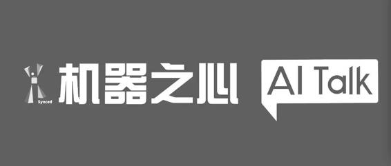

# AI Talk | 视频访谈百度 IDL 林元庆：百度大脑如何在人脸识别上战胜人类「最强大脑」

机器之心原创

**机器之心**

2017 年 1 月 6 日，百度首席科学家吴恩达带着小度机器人来到了《最强大脑》现场，与人类选手展开了对决，并在人脸识别比赛里以 3:2 的比分赢得胜利。Master 事件引发大众热议人工智能的余热未退，小度机器人又在跨年龄人脸识别挑战中战胜了本届最强大脑队长王峰——拥有数个世界冠军头衔的「世界记忆大师」。与以往主要考验空间搜索能力的人机 PK 不同，此次比拼主要集中在识别领域，而识别过程中需要模糊推理的能力，百度深度学习实验室（IDL）主任林元庆坦言，这场应战也并不轻松。 

对于此次比赛任务，百度 IDL 人脸团队主要是使用了「度量学习」，即通过学习一个非线性投影函数把图像空间投影到特征空间中。在这个特征空间里，跨年龄的同一个人的两张人脸的距离会比不同人的相似年龄的两张人脸的距离要小。同时考虑到跨年龄人脸数据的稀缺性，百度大脑使用了一个用大规模人脸数据训练好的模型作为「底座」，然后用跨年龄数据对它做更新。这样不容易过拟合。然后再将这两点结合起来做端到端的训练，从而大幅度地提升了小度跨年龄人脸识别的识别率。

从这期节目开始，机器之心将通过访谈视频「AI Talk」持续为大家解读百度参加最强大脑比赛的多项技术原理，还原 IDL 筹备比赛的细节故事。

下面是机器之心对百度深度学习实验室（IDL）主任林元庆独家专访完整版文字：

*机器之心：请简单介绍一下人脸识别。*

**林元庆**：人脸识别简单说就是给你一张人脸的照片，然后我希望能识别照片里面是哪一个人。

人脸识别其实有两种技术。

一种技术我们经常叫 1：1 的人脸比对，比如像银行的应用场景，就是你给一个身份证信息，然后再给一张人脸，通过比对希望知道这张人脸是不是身份证上面的那个人。系统会拿这个身份证的信息给到公安的系统里面取一张照片回来，然后跟你现在的照片比对看是不是同一个人。

还有一种更通用的 1:N 人脸识别，N 可以是几千、几万或者几十万进行比对，这叫 1：N 的比对或者是 1：N 的人脸识别。

*机器之心：机器是通过哪些特征进行人脸识别的?*

**林元庆**：深度学习还没有特别流行起来之前，一般会设计一些特征对人脸进行识别。现在用深度学习的方法其实是一层一层的去学不同的特征，底层会是非常低级别的特征，越往上会学到一些非常高级别的特征。像我们的系统应该是千万到亿的低级别特征，慢慢一层一层学上去，最后那一层其实只有 128 个特征。

*机器之心：在不同的应用场景中，机器学习算法如何决定人脸特征点的的数目？*

**林元庆**：像我们现在做的方法，在不同的应用场景里面其实特征数目是确定的，只是可能会是不同的特征。特征数目的大小是由深度学习的架构决定的。一旦我们把神经网络的架构确定下来，这个数目就是固定的。我们只是根据不同的场景（不同的场景意思就是不同的训练数据）训练出来的特征可能是很不一样的。因此在不同的场景里面特征数目可能是一样的，但具体特征会是很不一样的。

*机器之心：比赛中，小度机器人能将少年时期和中年时期的人脸识别出来，如果是将年龄扩大拉长，婴儿和老人的照片是否可以识别和匹配出来？*

**林元庆**：跨年龄识别是非常难的。就我们现在的系统，年龄跨度在 20 到 30 岁的时候我们仍然能做到比较高的精度。当我们把这个跨度进一步增加到 50 岁或 60 岁的话，难度肯定也会进一步增加，精度会下降。我们还没有很仔细地做过这么大年龄跨度的实验。这是我们下一步要做的事情。

*机器之心：介绍一下跨年龄人脸识别使用的度量学习？*

**林元庆**：我们这次去参加《最强大脑》的这套系统，使用的其实是基于深度学习的端到端的度量学习方法 (Metric Learning)。这个方法通过学习一个非线性映射函数（用深度神经网络模型），把图像空间投影到一个 128 维的特征空间中。深度学习要实现的是，对于同一个人的两张照片，不管年龄差距有多大，它们映射到这 128 唯特征空间的两个点（即两个 128 维的向量）要离得很近；对于不同人的两张照片，它们映射到这 128 唯特征空间的两个点要离得足够远 – 即使他们年龄相近。当这个映射函数学习好之后，看两张照片是否是同一个人变得简单：把他们映射到这个 128 维的空间了，如果映射到的两个点离得近，那这两张照片就是同一个人，否则就是不同人。因此核心是如何训练这个用深度神经网络建模的映射函数，即通过调整深度神经网络的参数。我们用大规模人脸数据训练出深度神经网络模型，实现高识别率。

*机器之心：百度通过非线性投影函数进行映射减少训练损失，那么这个非线性投影函数是如何得出来的，是通过训练集得出来的吗？*

**林元庆：**定义度量学习的目标函数之后，我们是通过梯度下降法来进行训练，慢慢把目标函数给降下来。梯度下降法是很通用的做法。这里面很重要的是要定义度量学习的目标函数，然后要定义深度神经网络的架构，最后通过训练实现目标函数的逐渐优化。

*机器之心：人脸识别业务的核心问题是人脸关键特征点的定位，错误的特征定位会导致提取的人脸描述特征严重变形，进而导致识别性能下降，百度是如何解决这个问题的？*

**林元庆**：其实是两个方面。一个方面是我们要想办法去做出非常好的特征点定位的算法，然后要训练非常好的模型。在一些极端的情况下，得到的特征点定位可能不准确，因此我们希望后面的识别模块有一定的容错能力。我们是在训练的时候制造一些数据，在定位上人为地产生一些误差，然后拿这些数据放在深度神经网络里面一起去参加训练，这样的话最后训出来的模型对定位的误差会有一定的容错能力。

*机器之心：百度大脑的这种能力的培养使用了多少的训练样本？训练了多长时间？*

**林元庆**：我们的训练其实是分两部分，最重要的一部分叫通用的人脸识别的能力，就是百度这几年来一直在积累搭建的技术，到比赛为止我们大概用了 200 万人的 2 亿张照片进行人脸识别基础模型训练。

另一方面，为了这次比赛，我们也收集了一些跨年龄的数据，根据跨年龄这个场景再进一步优化模型，跨年龄数据大概在几千张这个级别，并不算特别的多。

*机器之心：角度、表情、光线、阴影化妆、和配饰等会在多大程度上影响人脸识别准确率？*

**林元庆**：我们主要是针对人脸角度在 45 度之内的应用场景，因此我们的训练模型基本上在 45 度之内识别的还是比较准确的。在这个范围之内，角度影响不会特别大。但是在大于 45 度之后精度就会开始下降。如果是 90 度，特别是当我们没办法检测到五官的时候，精度就会下降比较严重，比如说一边眼睛看不到的情况下下降会比较严重。

化妆肯定会有影响，但如果只是很局部的化妆其实还好。像美瞳只是造成一个局部被改变，人脸整体基本上变化不是那么大。这些其实我们的算法都能够比较好的处理。整形整容就很难，属于比较大的改变，识别难度就比较大。

*机器之心：小度机器人是通过安装的摄像头直接观察还是接入图像信号？*

**林元庆**：在录制的现场，节目组会在选手前面的显示屏上给出一路信号，同样的信号也给到小度这边。我们的系统得到的信号和选手肉眼可以看到的信号是一样的。

*机器之心：小度机器人分析处理是在本地完成还是在云端？此次使用的计算资源情况如何？*

**林元庆**：训练都是在云端。云端我们有非常多、非常大的一个计算集群来专门做刚才提到的 200 万人的 2 亿张照片的训练。但真正训练完之后，计算是在本地完成的，我们在本地只用了一个 GPU。

实际上，我们希望我们的人脸识别技术能够广泛应用到各个领域，甚至是让很多人在手机上就可以用到这一功能。因此，我们希望在训练的时候用非常多的计算机，但是真正应用时的计算量不要太大。

*机器之心：节目中，人类选手在介绍判断方法时也提到选取一些人脸特征，是否意味着这方面机器和人类的识别原理类似，就像 CNN 从某种程度上来说是借鉴了人类的视觉原理一样？*

**林元庆**：从广义上来说肯定都是通过特征来识别，但是区别在于提取的是什么特征。深度学习系统其实是从海量的数据里学一些共同特征，对共性的特征也更加敏感。但是人其实不仅仅会用共性的特征，还会用一些很特别的特征。举个例子，假如说一个人的鼻子上有一颗痣，目前我们的这个系统是不会学出来的，因为它在我们数据库里的两百万人身上不常见，它就会把这个特征忽略掉，但人去识别的时候，他会把这颗痣变成一个非常重要的特征去跟踪。

CNN 架构毫无疑问在相当程度上都是模仿人的视觉系统。和人的视觉系统类似，CNN 有很多层，然后一层层进行非线性映射，从非常低级别的特征一层层映射上去，最后生成一个非常高级别的有分辨能力的特征。

*机器之心：作为机器学习和计算机视觉领域的专家，你认为一家公司在人脸识别技术方面足够领先的标准是什么？*

**林元庆**：关键在于看技术能力的强大与否，具体还要看三个层次。第一个是算法层次，大家通常会选择在一些通用和公开的测试集上进行测试，看这套算法究竟有多强。但这种方法也是有局限性的，公开测试集的样本量可能比较小，所以你在这种测试集上的表现做得很好，并不代表你在实际问题上也能做得很好。因此，在百度内部，我们会搭建的一些规模很大的测试集。我们通常的做法是，在我们算法研发的过程中，我们会在这些大测试集上去测。如果要和别人比的话，我们会在公开的测试集上进行测试。

下一个层面是技术层面。其实技术不单单是算法，它需要的是算法加数据。前面我们提到的公开测试集，它等于假设说我们不需要去管数据了。而实际上非常重要的是算法要跟数据一起发展。人脸的数据就是这样的例子。我们有两百万人的人脸，有的算法可能没办法在这上面应用，因为你需要非常长的时间去训练。并且有些算法可能不能完全利用大数据里面的一些特点。所以，算法和技术一定要一起发展的。

最后一个层面是应用层面。非常重要的是研发出一些技术，并在实际问题的解决上拥有较高的精度。这既是技术是否满足实际应用的重要指标，更是检验人工智能技术最重要的一个指标。不同公司的技术有多好在于他们能解决多少实际的问题。特别是对于人工智能而言，被应用的广度和深度就是衡量一项人工智能技术是否强大的一个重要指标。

所以总的来说就是算法、技术和应用三个层面。我们希望能够研发出非常好的技术和算法来满足更多实际场景应用的需要。人工智能领域里的很多技术是需要不断增长的数据去训练，从而不断提高模型精准度的。大应用是非常重要的一环。所以，即便你的公司搭建了一套非常好的基础技术，但如果你背后没有大的应用给你形成闭环的话，这个技术也很难往前发展。拿图像识别来说，它需要算法加数据，然后再将这项技术应用。有了应用，用户会给你提交更多数据，这又会帮你训练出更好的模型。然后你就有了更好的技术。这是一个正循环，直到把技术发展到极致。因此大应用是非常重要的。对人工智能来说，研发一项技术要短期做到极致是不太可能的，一定是要有很好的应用场景能够迭代起来，最后才能把技术做到极致。

*机器之心：接下来，百度会将人脸识别这项技术重点应用于哪些领域？*

**林元庆：**我们这次决定去参加人机 PK，最重要的出发点就是希望看看百度通过这几年的研发积累，我们的人工智能水平跟最顶尖的人类相比处于哪一个水平上。节目组跟我们定的「图片识别」和「声音识别」两个方向，我们也非常喜欢。其实之前有很多次人机 PK 的比赛，最早的「深蓝」，后来的 Watson 在《危险边缘》节目上的比赛，还有最近的 AlphaGo，这些更多是在比这一步棋我该怎么走、下一步该怎么走，或是去寻找答案，和这次 PK 有较大区别。这次应该是人类历史上第一次在图像和声音的识别能力上跟人进行高水平 PK。

之所以我们会对这两个技术特别感兴趣，是因为这两个技术有非常多应用，实用性很强。人脸识别的应用领域中很重要的一个场景是互联网金融的身份认证。百度有一个金融事业部，他们的主营业务就是互联网金融，已经用到我们的人脸识别技术。我们认为要做好互联网金融，身份认证是第一件你必须做的非常好的事情，你一定要知道在计算机或手机前面的那个人到底是谁，身份认证甚至可以说是互联网金融的第一步。我们也希望以后这项技术不单单用在百度，也可以用到更多的金融公司里面。

另一个很重要的应用是人脸识别可以用在门禁系统中，百度大厦现在就使用了人脸闸机。是去年在互联网大会时，我们在乌镇落地了一个人脸识别的闸机，之前景区使用的是指纹认证系统，在乌镇参观游玩的游客会需要多次进入，需要身份认证。如果每一次要进出的时间过长，非常影响用户的体验，甚至要排很长的队。在这样的场景下，人脸识别系统跟指纹系统相比，有相当大的优势，乌镇现在用这种 1：N 的认证，游客走到附近就被识别出来，马上可以通畅进出。为什么这些原来没有，其实也是因为最近百度在人脸识别上有非常好的技术突破，今年我们真正实现了高精度 1：N 的人脸识别，我们现在外面公布的是能做到 99% 以上的精度，这应该在国内是首创。

*机器之心：首期节目之后，我们还有哪些收获？*

**林元庆**：我们希望百度的人脸识别以后能有更多的人来用起来。之前更多的是应用在互联网上，比如打开百度的图片搜索，搜「刘德华」会出来很多刘德华的照片，里面就使用了人脸识别，因为照片库里既会有刘德华也会有梁朝伟，系统需要通过人脸识别知道哪一张照片是刘德华哪一张是梁朝伟。这背后其实是我们做了全网的明星人脸的索引，这是之前我们人脸识别一个非常重要的用处，但后面我们希望能让人脸识别用在更广的地方，给大家的生活带来更多便利。

*机器之心：细粒度视觉分类（FGVC/Fine-Grained Visual Categorization）是今年 CVPR 的热门研究方向，可否分享一下 IDL 在人脸细粒度识别的研究方面有何进展？*

**林元庆**：细粒度图像识别其实跟通常我们说的图像识别有不太一样的地方，比如我们普通的识别可能只需要知道这是一只狗、一只猫、一个桌子，但细粒度图像识别，就要明确这一只猫是哪一个品种、这个桌子是哪个厂家哪个型号的。

举个例子，百度有一个非常疯狂的项目是菜品识别，我们希望能实现这样的场景：你在餐馆里拍一张菜品照片就能识别它是哪一个餐馆的哪一道菜，你能想象其中的难度会非常大。这里面用到的很多技术跟普通的图片识别也有很大区别。更多方面的信息需要通过算法去估计。比如，对于鸟类识别，可能得粗略的知道这是鸟的头部，这是鸟的尾巴，鸟头部是长这个样子，等等。从学术上来讲，我们称之为注意力模型。现在百度在这方面做了很多研发工作。

我们最近在 CVPR 提交了一篇文章，我们充分利用位置信息自动地去学习物体位置信息和位置上的特征信息，最后得到非常高的识别精度。在几个公开的测试集上，我们的表现应该都是业界最好的。同时，我们也把这项技术用到百度的产品里。在去年的乌镇互联网大会上，我们结合百度糯米在景区里的 18 家餐馆应用了菜品识别的功能，实现了我之前描述的场景。乌镇只是一个起点，我们现在其实早期能覆盖大概 4000 家国内餐馆，然后希望能一步一步地覆盖到国内上大部分的餐馆。

*机器之心：菜品识别这个应用，实现大规模推广所面临的挑战是什么？*

**林元庆：**从难度上讲，基本上有两个方面。一个是数据，我们需要收集足够多的数据来训练模型，这就需要跟百度糯米等产品端配合才能去各个餐馆里收集数据，而全国餐馆数量是百万级别的，我们要训练的模型的类别会是几千万或上亿类别。二是技术方面。这里，我们的技术跟普通普通识别的差别在于我们要能够处理千万个类别，还要处理非常小的类间区别和非常大的类内区别。比如，麻婆豆腐长得都很像，不同餐馆的麻婆豆腐只有非常细微差别，然而从不同角度，用不同光线拍的即使同一个餐馆的麻婆豆腐也会很不一样。因此，对于识别来说，这就是很难的问题。通常大家也会把人脸识别当成一个非常特殊的细粒度图像识别的例子，我们不单单要识别照片里有人脸，还要识别出是哪个人的人脸。

*机器之心：要实现李彦宏所说的「让百度大脑像人类大脑」这个目标，接下来人工智能是不是也应该从人脑和神经科学中获得更多线索和灵感？*

**林元庆**：在最强大脑比赛现场，对于一个识别对象，我们的系统只看到的一张或者是几张这个人的照片，然后去做比对。从一定程度上来说，我们用的是迁移学习（transfer learning），这在一定程度上跟人很类似。平常看了很多的人，人慢慢学会了辩脸的能力，机器也一样，在这个能力上有很强的通用性。从更长远来看，在推理方面，人比机器要强很多，机器还需要从人脑机理等各个方面再去学习，设计出更好的算法，希望机器能够跟人一样思考推理。

*机器之心：通过《最强大脑》这类面向大众的节目，百度希望传递关于人工智能的哪些理念？*

**林元庆**：我们参与这次活动很重要的一个目的是希望能让大众能深切感觉到人工智能能做什么。我们配合节目播出的同时也会把我们辩脸技术做成 App 开放出来，大家可以上传照片直接去体验一下。我们希望通过节目让大众深刻体验到人工智能技术，这对人工智能技术的推广有非常好的作用。像 AlphaGo，他们做得非常棒的一个事情就是一下子让很多人都知道人工智能，之前可能还只是停留在行业内。这其实非常重要，因为后面的人工智能能够做得非常好，需要大众的这种接受度，他们觉得这些技术真的很有价值、愿意使用这些技术才是整个行业发展至关重要的一步。

*机器之心：这次在节目的现场比拼中，百度大脑击败了顶级选手，您认为这有什么样的意义？*

**林元庆**：我其实不太同意用「击败」这个词。这次我们和最强大脑选手比赛，在人脸识别这个特定任务上，我们证明了通过海量数据、深度学习算法，机器学习系统能够学到非常强的人脸识别的能力。目前这方面我们做的水平还不错，但人类除此之外还有非常多的能力。另一方面，其实也等于说验证了我们在这条路上探出了非常有效的研发路径，后面我们可以把类似的经验应用到更多更广的范围。人工智能在很多方面仍然并不强于人类，从研发角度来讲，我们希望我们的技术能越来越强大，能做的事情越来越多。

*机器之心：在机器越来越智能的今天，我们应该如何对待人类与机器之间的关系？*

**林元庆**：其实，机器在一些能力上超过人是很正常的，比如我们之前也发明了汽车，汽车肯定跑得比人快。但人工智想要整体全面地超越人类还有非常长的路要走，现在还只是做了一些非常小的事情，离智能机器的威胁还非常远。对这个行业里面的研究人员来说，我们还有很多的事情要做，这条路还很长。

> ***「AI Talk」*** *是机器之心最新出品的视频访谈栏目，旨在邀请国内外人工智能顶级专家分享对技术和行业的观点，为大家呈现更为直观、丰富的内容。*

***©本文由机器之心原创，***转载请联系本公众号获得授权***。***

✄------------------------------------------------

**加入机器之心（全职记者/实习生）：hr@almosthuman.cn**

**投稿或寻求报道：editor@almosthuman.cn**

**广告&商务合作：bd@almosthuman.cn**