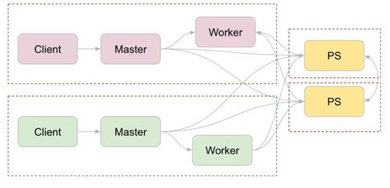

# 资源 | TensorFlow 生态系统：与多种开源框架的融合

选自 Github

**机器之心编译**

**参与：李亚洲**

> *该 repository 包含 TensorFlow 与其他开源框架融合的样例。这些样例是有限的，但可以作为模板使用。用户也可以根据自己的使用情况特制这些模板。*

**项目地址：https://github.com/tensorflow/ecosystem**

内容：

*   docker-Docker 配置用来在 cluster managers 上运行 TensorFlow

*   kubernetes-用来在 kubernetes 上运行分布式 TensorFlow 的模板

*   marathon-使用 Marathon 用来运行分布式 TensorFlow 的模板，在 Mesos 上部署

*   hadoop-为 Hadoop MapReduce 和 Spark 备录 InputFormat/OutputFormat 的 TFRecord 文件

**分布式训练的常见设置**

每个分布式训练项目都有一些常见设置。首先，定义 flags，以便于该 worker 知道其他 works 在分布式训练中扮演的角色：

> **# Flags for configuring the task
> flags.DEFINE_integer("task_index", None,
>                     "Worker task index, should be >= 0\. task_index=0 is "
>                     "the master worker task the performs the variable "
>                     "initialization.")
> flags.DEFINE_string("ps_hosts", None,
>                    "Comma-separated list of hostname:port pairs")
> flags.DEFINE_string("worker_hosts", None,
>                    "Comma-separated list of hostname:port pairs")
> flags.DEFINE_string("job_name", None, "job name: worker or ps")**

然后，开始自己的 server。因为 worker 和 parameter servers（ps jobs）通常共享常见的程序，parameter servers 应该在此停顿，所以他们和该 server 可以结合。

> **# Construct the cluster and start the server
> ps_spec = FLAGS.ps_hosts.split(",")
> worker_spec = FLAGS.worker_hosts.split(",")
> 
> cluster = tf.train.ClusterSpec({
>    "ps": ps_spec,
>    "worker": worker_spec})
> 
> server = tf.train.Server(
>    cluster, job_name=FLAGS.job_name, task_index=FLAGS.task_index)
> if FLAGS.job_name == "ps":
>  server.join()**

之后，代码的不同由你打算做的分布式训练的形式所决定。最常见的形式是图间复制（between-graph replication）。

**Between-graph Replication**

在此模式中，每个 worker 独立构建同一图。然后每个 worker 独立运行该图，只和 parameter servers 共享梯度。该设置可又下图进行解释，注意每个虚线框表示一个任务。

在为该训练模式构建图之前，你必须明令设置此设备。下面的代码显示了该设置：

> **with tf.device(tf.train.replica_device_setter(
>    worker_device="/job:worker/task:%d" % FLAGS.task_index,
>    cluster=cluster)):
>  # Construct the TensorFlow graph.# Run the TensorFlow graph.**

**运行这些样例的需求**

为了运行这些样例，Jinja 模板必须被安装：

> **# On Ubuntu
> sudo apt-get install python-jinja2
> # On most other platforms
> sudo pip install Jinja2**

Jinja 是用作模板的扩展。还有其他的特定框架需求，请阅读 README 文件查看每个框架的需求。

******©本文由机器之心编译，***转载请联系本公众号获得授权******。***

✄------------------------------------------------

**加入机器之心（全职记者/实习生）：hr@almosthuman.cn**

**投稿或寻求报道：editor@almosthuman.cn**

**广告&商务合作：bd@almosthuman.cn**