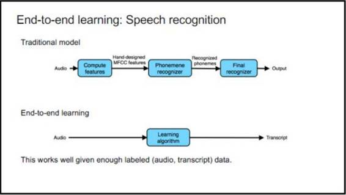
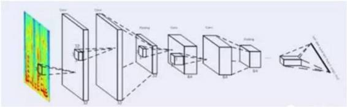
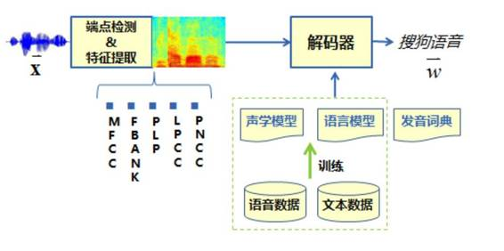
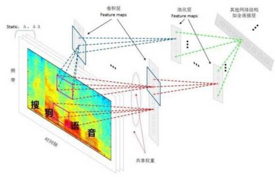
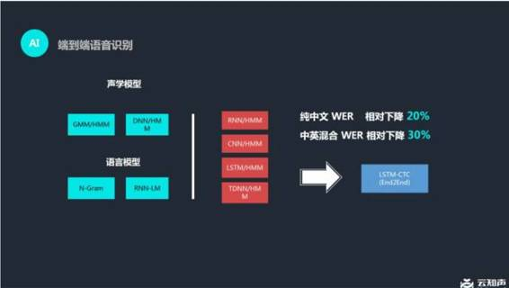

# 机器之心年度盘点 | 从技术角度，回顾 2016 年语音识别的发展

机器之心原创

**作者：李亚洲**

得益于深度学习与人工神经网络的发展，语音识别在 2016 年取得了一系列突破性的进展，在产品应用上也越来越成熟。作为语音交互领域中极其重要的一环，语音识别一直是科技巨头研究的重点，国内外也涌现出了一批优秀的创业公司。

 

今年年初，机器之心发布来自 ACM 中文版的文章《[深度 | 四十年的难题与荣耀——从历史视角看语音识别发展](http://mp.weixin.qq.com/s?__biz=MzA3MzI4MjgzMw==&mid=401894776&idx=1&sn=e963169d912f307104b97e0d7cd03cb7&scene=21#wechat_redirect)》，文中微软首席语音科学家黄学东为我们深入解读了语音识别的历史以及发展难题。

长久以来，人与机器交谈一直是人机交互领域内的一个梦想。语音识别做为很基础的技术在这一年中再次有了更大的发展。

一年中，机器之心拜访过科大讯飞，接触过云知声、思必驰等创业公司，在微软的英语语音识别取得突破后更是深度专访了微软的黄学东、俞栋，不久之前的百度语音开发平台三周年的主题活动上我们也向百度首席科学家吴恩达了解过百度的语音识别发展。我们希望从机器之心文章中梳理出的线索，能为接下来语音识别的发展提供一丝洞见。

在这篇文章中，我们会依次梳理 2016 年机器之心关注到的语音识别领域的突破性研究、未来待解决的难题、语音识别发展历史中较为重要的时间点。

**一、2016 年语音识别有哪些突破？**

这一部分盘点了 2016 年机器之心所关注到的在语音识别准确率上取得的突破，主要涉及的公司包括百度、IBM 和微软等。根据这些突破，我们梳理出了一条语音识别技术发展的线路。

1\. [百度 Deep Speech 2 的短语识别的词错率降到了 3.7%](http://mp.weixin.qq.com/s?__biz=MzA3MzI4MjgzMw==&mid=2650720285&idx=2&sn=3308e3bcea1cdeb2eaee13c241081ad6&chksm=871b0c63b06c85751f06672a9d714f1b414f959e9129120d5d00532b72adeaf7cb9577a0989b&scene=21#wechat_redirect)

发生时间：2016 年 2 月

Deep Speech 2 于 2015 年 12 月首次发布时，首席科学家吴恩达表示其识别的精度已经超越了 Google Speech API、wit.ai、微软的 Bing Speech 和苹果的 Dictation 至少 10 个百分点。到今年 2 月份时，Deep Speech 2 的短语识别的词错率已经降到了 3.7%

不久之前，百度又将 Deep CNN 应用于语音识别研究，使用了 VGGNet，以及包含 Residual 连接的深层 CNN 等结构，并将 LSTM 和 CTC 的端对端语音识别技术相结合，使得识别错误率相对下降了 10%（原错误率的 90%）以上。

据百度语音技术部识别技术负责人、Deep Speech 中文研发负责人李先刚博士介绍说，百度正在努力推进 Deep Speech 3，这项研究不排除将会是 Deep Speech 3 的核心组成部分。

技术提升基础：1\. 端到端深度学习方法；2\. 深层卷积神经网络技术（Deep CNN）应用于语音识别声学建模中，与基于长短时记忆单元（LSTM）和连接时序分类（CTC）的端对端语音识别技术相结合。

[2.IBM Watson 会话词错率低至 6.9%](http://mp.weixin.qq.com/s?__biz=MzA3MzI4MjgzMw==&mid=2650715201&idx=4&sn=4555a0f8732224da7055e120a3f9112f&scene=21#wechat_redirect)

发生时间：2016 年 5 月

2015 年，IBM Watson 公布了英语会话语音识别领域的一个重大里程碑：系统在非常流行的评测基准 Switchboard 数据库中取得了 8% 的词错率（WER）。到了今年 5 月份，IBM Watson 团队再次宣布在同样的任务中他们的系统创造了 6.9% 的词错率新纪录。

技术提升基础：声学和语言建模两方面技术的提高

3\. [微软新系统英语语音识别词错率低至 6.3%](http://mp.weixin.qq.com/s?__biz=MzA3MzI4MjgzMw==&mid=2650719135&idx=1&sn=012d179f83a6c3b38c6e58b4ac9ba82f&scene=21#wechat_redirect)

发生时间：2016 年 9 月

在产业标准 Switchboard 语音识别任务上，微软研究者取得了产业中最低的 6.3% 的词错率（WER）。

技术提升基础：基于神经网络的声学和语言模型的发展，数个声学模型的结合，把 ResNet 用到语音识别。

4\. [微软英语语音识别词错率达到了 5.9%，媲美人类](http://mp.weixin.qq.com/s?__biz=MzA3MzI4MjgzMw==&mid=2650719843&idx=1&sn=0c6387d422cf9765b9b10c178d160680&chksm=871b021db06c8b0b0b0447124c5c07818f53a17ba470305049af1d7d49806c87e07307a93811&scene=21#wechat_redirect)

发生时间：2016 年 10 月

微软人工智能与研究部门的团队报告出他们的语音识别系统实现了和专业速录员相当甚至更低的词错率（WER），达到了 5.9%。5.9% 的词错率已经等同于人速记同样一段对话的水平，而且这是目前行业标准 Switchboard 语音识别任务中的最低记录。这个里程碑意味着，一台计算机在识别对话中的词上第一次能和人类做得一样好。

技术提升基础：系统性地使用了卷积和 LSTM 神经网络，并结合了一个全新的空间平滑方法（spatial smoothing method）和 lattice-free MMI 声学训练。

虽然在准确率的突破上都给出了数字基准，但百度与微软、IBM（switchboard 上测试）有较大的不同。微软的研究更加学术，是在标准数据库——口语数据库 switchboard 上面完成的，这个数据库只有 2000 小时。

微软研究院的研究关注点是基于 switchboard 数据库，语音识别最终能做到什么样的性能。而据百度语音识别技术负责人李先刚介绍，他们的关注点是语音技术能够深入到大家的日常应用中，他们用的数据长达数万小时。

黄学东在之前接受机器之心专访时也表示他们的这个语音识别系统里面没有 bug，因为要在标准数据上做到这样的水平，实际上体现了工程的完美。

就各项突破的技术提升基础，我们可以很明晰的梳理出一条线：

1\. 之前 LSTM 这样的模型开始成功应用于语音识别，今年的后续研究不断提升 LSTM 的模型效果。

2\. 另外一个比较大的进展是 Deep CNN。Deep CNN 比起双向 LSTM（双向效果比较好）有一个好处——时延。所以在实时系统里会更倾向于用 Deep CNN 而不是双向 LSTM。

3\. 端到端学习，这也是百度首席科学家吴恩达在 NIPS 2016 上重点提到的。比如语音识别，输入的是语音，输出的是文本，这是比较纯粹的端对端学习。但是它也有缺点——需要足够大的训练集。

** 

*图：吴恩达 NIPS 2016 ppt*

这方面现在的研究工作主要集中在两类模型上。一类就是 CTC 模型，包括 Johns Hopkins 大学的 Dan Povey 博士从 CTC 发展出来的 lattice-free MMI；还有一类是基于注意的序列到序列模型。今天它们的表现也还是比混合模型逊色，训练的稳定性也更差，但是这些模型有比较大的潜力（参考机器之心对俞栋老师的专访）。

国内还有其他几家做语音识别的公司，这里对科大讯飞、搜狗、云知声的语音识别系统做个简单介绍。

去年年底，科大讯飞提出了以前馈型序列记忆网络（FSMN, Feed-forward Sequential Memory Network）为代表的新一代语音识别系统。

今年，科大讯飞又推出了全新的深度全序列卷积神经网络（Deep Fully Convolutional Neural Network, DFCNN）语音识别框架，使用大量的卷积层直接对整句语音信号进行建模，更好的表达了语音的长时相关性。据介绍，该框架的表现比学术界和工业界最好的双向 RNN 语音识别系统识别率提升了 15% 以上。其结构图如下：

 

*科大讯飞 DFCNN 的结构图*

同时，我也附上搜狗、云知声提供的各自的语音识别系统的流程，以供大家学习、比较、参考：

 

*语音识别系统流程：语音信号经过前端信号处理、端点检测等处理后，逐帧提取语音特征，传统的特征类型包括 MFCC、PLP、FBANK 等特征，提取好的特征送至解码器，在声学模型、语言模型以及发音词典的共同指导下，找到最为匹配的词序列作为识别结果输出。* 

 

*搜狗 CNN 语音识别系统建模流程*

 

*云知声语音识别系统*

**二、难题与前沿方向**

在语音识别高速发展的一年，我们曾专访过黄学东、俞栋等多位领域内的专家，不可避免的探讨了未来语音识别领域所面临的方向、挑战、抑或是难题。现如今整理如下，希望能对大家接下来的语音识别研究有所帮助：

**1\. 语义理解**

黄学东认为，要做好语音识别需要更好的语义理解，二者相辅相成。「人的鲁棒性非常好，一个新的课题过来，他可以通过会话的方式跟你沟通，也能得到很好的结果。而机器对噪音的抗噪性不够强，对新的课题会话沟通能力比较差。最重要的一点是，语音识别并没有理解你的语义。理解语义是人工智能下一个需要攻克的难题，这也是我们团队花很多时间和精力正在做的事情。」

**2\. 值得关注的四大方向**

在之前机器之心对俞栋的专访中，他为我们指出了语音识别领域的几大前沿：

> *在安静环境下并使用近距麦克风的场合，语音识别的识别率已越过了实用的门槛；但是在某些场景下效果还不是那么好，这就是我们这个领域的 frontier。现在大家主攻几点：*
> 
> ***首先，是不是能够进一步提升在远场识别尤其是有人声干扰情况下的识别率。****目前一般远场识别的错误率是近场识别错误率的两倍左右，所以在很多情况下语音识别系统还不尽如人意。远场识别至少目前还不能单靠后端的模型加强来解决。现在大家的研究集中在结合多通道信号处理（例如麦克风阵列）和后端处理从拾音源头到识别系统全程优化来增强整个系统的表现。*
> 
> ***另外，大家还在研究更好的识别算法。****这个「更好」有几个方面：一个方面是能不能更简单。**现在的模型训练过程还是比较复杂的**，需要经过很多步骤。如果没有 HTK 和 Kaldi 这样的开源软件和 recipe 的话，很多团队都要用很长时间才能搭建一个还 OK 的系统，即使 DNN 的使用已经大幅降低了门槛。现在因为有了开源软件和 recipe，包括像 CNTK 这样的深度学习工具包，事情已经容易多了，但还有继续简化的空间。这方面有很多的工作正在做，包括如何才能不需要 alignment 、或者不需要 dictionary。现在的研究主要还是基于 end-to-end 的方法，就是把中间的一些以前需要人工做的步骤或者需要预处理的部分去掉。虽然目前效果还不能超越传统的 hybrid system，但是已经接近 hybrid system 的 performance 了。*
> 
> ***另外一个方面，最近的几年里大家已经从一开始使用简单的 DNN 发展到了后来相对复杂的 LSTM 和 Deep CNN 这样的模型。****但在很多情况下这些模型表现得还不够好。所以一个研究方向是寻找一些特殊的网络结构能够把我们想要 model 的那些东西都放在里面。我们之前做过一些尝试，比如说人在跟另外一个人对话的过程中，他会一直做 prediction，这个 prediction 包括很多东西，不单是包括你下一句想要说什么话，还包括根据你的口音来判断你下面说的话会是怎样等等。我们曾尝试把这些现象建在模型里以期提升识别性能。很多的研究人员也在往这个方向走。*
> 
> ***还有一个方向是快速自适应的方法—就是快速的不需要人工干预的自适应方法（unsupervised adaptation）。****现在虽然已经有一些自适应的算法了，但是它们相对来说自适应的速度比较慢，或者需要较多的数据。有没有办法做到更快的自适应？就好像第一次跟一个口音很重的人说话的时候，你可能开始听不懂，但两三句话后你就可以听懂了。大家也在寻找像这种非常快还能够保证良好性能的自适应方法。快速自适应从实用的角度来讲还是蛮重要的。因为自适应确实在很多情况下能够提升识别率。*

**三、语音识别历史的梳理**

在这一部分我简单的梳理了一下语音识别历史上比较关键的一些时间点，至于详细的语音识别技术研究历史可参考之前提到的黄学东老师写的《四十年的难题与荣耀——从历史视角看语音识别发展》。

*   1952 年，贝尔实验室 Davis 等人研制了世界上第一个能识别 10 个英文数字发音的实验系统，但只能识别一人的发音。

*   1962 年，IBM 展示了 Shoebox。Shoebox 能理解 16 个口语单词以及 0-9 的英文数字。

*   1969 年，贝尔实验室的 John Pierce 预言成熟的语音识别在数十年内不会成为现实，因为它需要人工智能。

*   1970 年，普林斯顿大学的 Lenny Baum 发明隐马尔可夫模型（Hidden Markov Model)。

*   20 世纪 70 年代，卡耐基梅隆大学研发 harpy speech recognition system，能够识别 1011 个单词，相当于 3 岁儿童的词汇量。

*   20 世纪 80 年代，语音识别引入了隐马尔可夫模型（Hidden Markov Model)。

*   20 世纪 90 年代出现首个消费级产品 DragonDictate，由国际语音识别公司 Nuance 发布。

*   2007 年，Dag Kittlaus 和 Adam Cheyer 创立 Siri.Inc。后被苹果收购并于 2011 年首次出现在 iPhone 4s 上。

*   2009 年以来，借助机器学习领域深度学习研究的发展以及大数据语料的积累，语音识别技术得到突飞猛进的发展。

*   2011 年微软率先取得突破，使用深度神经网络模型之后，语音识别错误率降低 30%。

*   2015 年，IBM Watson 公布了英语会话语音识别领域的一个重大里程碑：系统在非常流行的评测基准 Switchboard 数据库中取得了 8% 的词错率（WER）。

语音识别，在这一年有了极大的发展，从算法到模型都有了质的变化，在加上语音领域（语音合成等）的其他研究，语音技术陆续进入工业、家庭机器人、通信、车载导航等各个领域中。当有一天，机器能够真正「理解」人类语言，并作出回应，那时我们必将迎来一个崭新的时代。

  **拓展阅读：**

[深度 | 四十年的难题与荣耀——从历史视角看语音识别发展](http://mp.weixin.qq.com/s?__biz=MzA3MzI4MjgzMw==&mid=401894776&idx=1&sn=e963169d912f307104b97e0d7cd03cb7&scene=21#wechat_redirect)

[独家 | 专访微软首席语音科学家黄学东： CNTK 是词错率仅 5.9% 背后的「秘密武器」](http://mp.weixin.qq.com/s?__biz=MzA3MzI4MjgzMw==&mid=2650719843&idx=2&sn=4611f810734df8a72286567e90c65a92&chksm=871b021db06c8b0b283ac93f267d95365392be02b3cde5d2fe6df85b359aa96368f25318e2f5&scene=21#wechat_redirect)

[专访 | 顶级语音专家、MSR 首席研究员俞栋：语音识别的四大前沿研究](http://mp.weixin.qq.com/s?__biz=MzA3MzI4MjgzMw==&mid=2650720189&idx=1&sn=10a3630e7f65d7b845c1fd032970d46e&chksm=871b03c3b06c8ad527a7dffd215be5b128a7aaf88ec09a131d68a249e9ff77c3edff6204d3d2&scene=21#wechat_redirect)

[专访｜百度语音识别技术负责人李先刚：如何利用 Deep CNN 大幅提升识别准确率？](http://mp.weixin.qq.com/s?__biz=MzA3MzI4MjgzMw==&mid=2650720285&idx=2&sn=3308e3bcea1cdeb2eaee13c241081ad6&chksm=871b0c63b06c85751f06672a9d714f1b414f959e9129120d5d00532b72adeaf7cb9577a0989b&scene=21#wechat_redirect)

[重磅 | 语音识别新里程碑：微软新系统词错率低至 6.3%（附论文）](http://mp.weixin.qq.com/s?__biz=MzA3MzI4MjgzMw==&mid=2650719135&idx=1&sn=012d179f83a6c3b38c6e58b4ac9ba82f&scene=21#wechat_redirect)

[重磅 | 微软语音识别实现历史性突破：语音转录达到专业速录员水平（附论文）](http://mp.weixin.qq.com/s?__biz=MzA3MzI4MjgzMw==&mid=2650719843&idx=1&sn=0c6387d422cf9765b9b10c178d160680&chksm=871b021db06c8b0b0b0447124c5c07818f53a17ba470305049af1d7d49806c87e07307a93811&scene=21#wechat_redirect)

[公司｜IBM Watson 团队取得语音识别新突破，会话词错率低至 6.9%](http://mp.weixin.qq.com/s?__biz=MzA3MzI4MjgzMw==&mid=2650715201&idx=4&sn=4555a0f8732224da7055e120a3f9112f&scene=21#wechat_redirect)

[深度 | 在语音识别这件事上，汉语比英语早一年超越人类水平（附论文）](http://mp.weixin.qq.com/s?__biz=MzA3MzI4MjgzMw==&mid=2650720050&idx=1&sn=da2e46b031173adc25d16a68e2fcb54b&chksm=871b034cb06c8a5a1984b1158e83e94095ce12aff6fd0fe42126429e6e942aa786714c904589&scene=21#wechat_redirect)

[业界 | 语音识别软件太傻？斯坦福研究表明语音输入比打字快三倍、准确率更高](http://mp.weixin.qq.com/s?__biz=MzA3MzI4MjgzMw==&mid=2650718578&idx=4&sn=05badbcd6230247e75b57e3df6a8e131&scene=21#wechat_redirect)

***©本文由机器之心原创，***转载请联系本公众号获得授权***。***

✄------------------------------------------------

**加入机器之心（全职记者/实习生）：hr@almosthuman.cn**

**投稿或寻求报道：editor@almosthuman.cn**

**广告&商务合作：bd@almosthuman.cn**