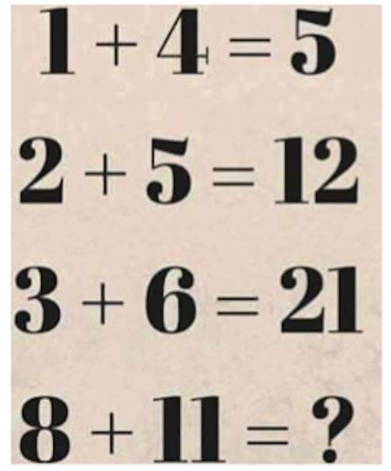
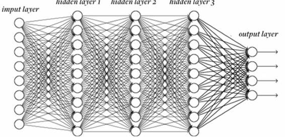

# 业界 | 机器学习的基本局限性：从一个数学脑筋急转弯说起

选自 Nautilus

**作者：JESSE DUNIETZ**

**机器之心编译**

**参与：李亚洲、吴攀**

数月之前，我阿姨给其同事发送了一封主题为「数学难题！答案是什么？」的邮件，邮件包含了一个谜题：

 

她认为自己的答案明显是正确的，她的同事们却认为他们自己的答案才是对的——但这两个答案却不一样。那是他们的答案有一个是错的呢？还是谜题本身有问题？

我阿姨和她的同事偶然间发现了机器学习中的一个基本问题。我们期望计算机做的所有学习以及我们人类自身的学习都是将信息归纳成基本的模式，然后再用其来推断未知。她的谜题也毫不例外。

作为人类，我们面临的挑战是发现所有模式。当然，我们有直觉来限制自己的猜测。但计算机没有这样的直觉。从计算机的角度来看，模式识别中的难题是只采用一个模式：在多种模式实际上都可行的情况下，什么决定了哪个模式是「正确」的？其它模式都是「错误」的？

这个问题在近期才成为人们实际考虑的问题。20 世纪 90 年代之前，人工智能系统几乎不做太多学习。例如，Deep Blue 的前身国际象棋系统 Deep Thought，通过从成功与失败对赛中学习却并没能很好掌握国际象棋。相反，国际象棋大师和编程人员谨慎的书写规则，教计算机哪个落子位置是好还是坏。这样庞大的人工工作是「专家系统」时代的典型方法。

为了解决该谜题，专家系统的方法是需要一个人类来发现前三排问题的模式：

1 * (4 + 1) = 5

2 * (5 + 1) = 12

3 * (6 + 1) = 21

然后，人们就可以命令计算机遵循 x * (y + 1) = z 模式。将该规则应用到最后一题，答案就是 96。

尽管早期专家系统很成功，但需要人工设计、调整、更新系统，这会使得它们变得很笨重。相反，研究人员将注意力转移到了设计能自己推断模式的机器上。也就是一个程序能够检查数千张图片或市场交易数据，并提取出表明一张脸或一个紧急价格峰值的统计信号。这种方法很快成为了主流，也从此增强了从自动邮件分拣到垃圾邮件过滤和信用卡诈骗检测等各种任务。

如今，虽有有着如此多的成功，但这些机器学习系统仍需要工程师。再次回到上面的谜题，我们假设每个等式有 3 个相关组件（等式中的 3 个数值）。但也存在潜在的第四个元素：前面一个等式的结果。一个等式的属性，用机器学习的说法也就是特征，也考虑在内，那就生成了一个另外一种合理的模式：

0 + 1 + 4 = 5

5 + 2 + 5 = 12

12 + 3 + 6 = 21

按此逻辑，最后的答案应该是 40。

所以，哪种模式是正确的？两个都正确，当然或者两个都不正确。这完全由允许使用哪种模式所决定。你甚至还可以这么做：第一个数乘以第二个数，然后加上上一行答案加上 3 后的五分之一，然后取离结果最近的整数。（这很诡异，但却有效）而且，如果我们允许包含数值视觉形式的特征，我们可能还能得到一些关于字形和字体的模式。该模式匹配取决于观察者的假设。

在机器学习中这也是正确的。即使机器能自我学习，首要模式也由人来选择：面部识别软件应该推断明确的 if/then 规则吗？它应该将每个特征作为每个可能的人的附加证据吗？系统应该注意哪些特征？它是否应该关注每个像素？还是明亮区与暗区之间的锐利边缘？这些选择限制了系统认为像是甚至可能的模式。发现完美的结合成为了机器学习工程师的新工作。

 

*叠层的蛋糕：在神经网络中，数据从一个「神经元」层传递到另一个「神经元」层，在每一步都经过一些简单的转换。中间层能学习更高层次的特征，这对最终输出很重要。*

然而，自动化的过程在此并未结束。如同他们曾经厌倦了写规则一样，工程师开始更少设计这些特征。「如果计算机能够自己搞清楚内部特征不是更好吗？」所以，他们设计了深度神经网络，这是一种很显著的机器学习技术，能从更基础的信息中推断更高层次的特征。向神经网络输入一堆像素，它将学习边缘、曲线、甚至纹理这样的特征，都不需要明确的指令。

不，还不完美。神经网络仍不能完美适配所有问题。即使在最好的案例中，它们也需要少量的调整。神经网络包含带有「神经元」的层，每个层进行输入上的计算并将结果传向下一层。但应该有多少神经元？多少层呢？每个神经元应该从前一层的每个神经元中获取输入吗？还是选择一些神经元？每个神经元应该对输入采用什么转换，从而得到输出呢？等等一系列问题。

这些问题限制了将神经网络应用到新问题；擅长面部识别的网络在自动翻译上却不合适。再一次的，人类选择的设计元素暗中影响了网络选择哪些模式、抛弃哪些模式。对博识的人类来说，不是所有的模式都是平等创造的。工程师还未失业。

当然，理论上发展的下一步是能自动搞清需要包含多少神经元、使用什么类型的连接等等这样的神经网络。探索这些主题的研究已经进行了数年了。

能发展到什么程度？机器能否依靠自己很好地学习，外部指导成为历史？理论上，你可以想下理想的通用学习器（Universal Learner），它能自我决定所有事情，而且总是选择针对手头任务的最佳模式。

但在 1996 年，计算机科学家 David Wolpert 证明没有这样的学习器的存在。在其著名的「No Free Lunch」定理（参看：http://no-free-lunch.org/）中，他表示一个学习器善于学习某种模式，那就有其他该学习器不擅于学习的模式。这把我们带回了我阿姨的谜题——有无限的模式匹配无限量的数据。选择一个学习算法就意味着在选择了机器不擅长的模式。也就是说，可能所有的视觉模式识别任务将最终开始于一个包罗万象的算法。但没有学习算法能擅长所有学习。

这使得机器学习惊人地类似于人类大脑。像我们的思维那样智能，我们的大脑也不能完美地学习。大脑的每一部分通过进化而被精调，无论我们看到了、听到了什么，实体目标表现了什么行为，大脑各部分都能定位特定类型的模式。但当涉及到发现股票市场中的模式时，大脑不擅长；机器在这上面比我们强得多。

机器学习的历史表明会有许多的模式。但最有可能的一种是：在接下来数年，我们将教授机器如何自我学习。

*来源：http://nautil.us/blog/the-fundamental-limits-of-machine-learning*

******©本文由机器之心编译，***转载请联系本公众号获得授权******。***

✄------------------------------------------------

**加入机器之心（全职记者/实习生）：hr@almosthuman.cn**

**投稿或寻求报道：editor@almosthuman.cn**

**广告&商务合作：bd@almosthuman.cn**