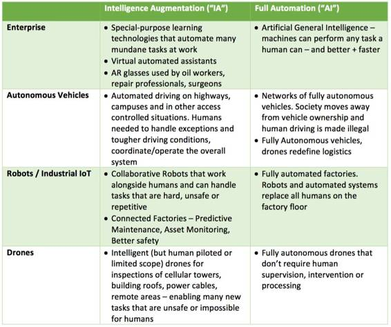
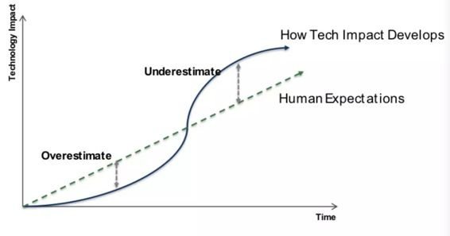
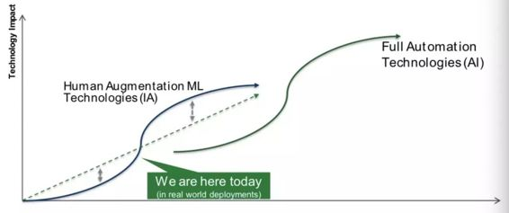

# 观点 | 人们都在说人工智能，其实现在我们真正做的是智能增强

选自 CB Insights

**机器之心编译**

**参与：Rick、林静、吴攀**

> *智能增强技术有助于提高人类的潜能——通过提高工人生产力、减轻一般任务的工作量以及为我们的生活提供更多方便。本文的作者是 Anupam Rastogi，他是 NGP 的成长期技术投资者，专注于企业中的物联网、数据与机器学习的交叉领域。*

自 20 世纪 50 年代以来，人工智能（The Artificial Intelligence/AI）与智能增强（Intelligence Augmentation/IA）之间的争论已经持续了半个多世纪。一般来说，智能增强指的是利用信息技术来增强人类能力。这个想法自 1950 年被首次提出后，现在已经变得无处不在。如今人工智能越来越多地被用于广泛描述那些能够模仿人类功能（比如学习和解决问题）的机器，但它最初所建立的前提条件是：人类智能可以被精确描述，且能够用所制作的机器进行模拟。人工通用智能（Artificial General Intelligence/AGI）这个术语通常仅仅表示后者，该定义较前者更严格。当下存在许多人工智能方面前所未有的炒作——其近来令人难以置信的增长曲线、无数的潜在应用、及其潜在的社会威胁。

更广泛的人工智能定义给一些人造成了困惑，特别是那些或许不太紧跟技术潮流的人。机器学习应用近期所带来的一些十分显著的进步有时会被错误理解和推断，使我们以为人类即将取得 AGI 方面的进展、正在逼近为了社会秩序所需要的一切。

智能增强与人工通用智能技术之间可能会有一段持续进步的过程。我在本文中谈到，我们所目睹的人工智能领域的快速进展是来自于机器学习对其产生的强大驱动力。然而，满足人工智能——以及人工通用智能——的原始前提条件是大量的、额外的、在近期进展之上的技术突破。智能增强技术有助于提高人类的潜能——通过提高工人生产力、减轻一般任务的工作量以及为我们的生活提供更多方便。我们目前所看到的是机器在任务执行方面的能力提升，在这方面它们几十年前就胜过人类了。而未来十年中，我们会看到机器学习技术进一步渗透众多行业和生活领域，推动这种能力进一步地快速提高。

**旧闻新炒**

如今所使用的许多人工智能和机器学习算法是几十年前发明的。国防机构使用高级机器人、自动驾驶车辆和无人机的时间已将近半个世纪。第一个虚拟现实原型开发于 20 世纪 60 年代。然而截至 2016 年底，没有一份主流出版物不对人工智能即将产生的社会影响发表高论。根据 CB Insights 的数据，对利用人工智能的创业公司的投资资金将于 2016 年达到 42 亿美元，仅仅四年就翻了 8 倍以上。

发生了哪些变化？

影响因素有很多，但也有这样一个共识：最近的许多事态发展，比如近期谷歌翻译的巨大进展、谷歌 DeepMind 在围棋游戏中的胜利、亚马逊 Alexa 的自然会话接口以及特斯拉的自动驾驶功能，都由机器学习的进步所推动，更确切地说是深度学习神经网络——它是人工智能的一个分支。深度学习理论已经存在了几十年，但是它开始看到了新一轮的焦点，以及自 2010 年左右开始显著加快的进展速度。我们当下所看到的现象是一个雪球效应——深度学习在用例与行业中的影响——的开端。

影响因素有很多，但也有这样一个共识：最近的许多事态发展，比如近期谷歌翻译的巨大进展、谷歌 DeepMind 在围棋游戏中的胜利、亚马逊 Alexa 的自然会话接口以及特斯拉的自动驾驶功能，都由机器学习的进步所推动，更确切地说是深度学习神经网络——它是人工智能的一个分支。深度学习理论已经存在了几十年，但是它开始看到了新一轮的焦点，以及自 2010 年左右开始显著加快的进展速度。我们当下所看到的现象是一个雪球效应——深度学习在用例与行业中的影响——的开端。

**机器和人类**

在某些类型的任务上，机器的表现长期以来一直优于人类，尤其是那些与计算速度和规模相关的任务。三位学院派经济学家（Ajay A. et al）在最近的一篇论文和哈佛商业评论上一篇文章假定最近机器学习的进展可以归为机器「预测」中的进展一类。

> *机器的工作原理是机器使用了之前的苹果图像中的信息来预测当前的图像中是否有苹果。为什么会用『预测』这个词？预测使用的信息是你没有的但必须要生成的信息。机器学习使用的数据是从传感器、图像、视频、输入的注释、或者其他任何能被用比特/二进制（bit）表示的东西。这就是你拥有的信息，机器用这样的信息去填补它缺失的信息来识别物体，并预测下面会发生什么。这是你没有的信息。换句话说，机器学习是一种预测技术。*

完成任何的主要任务都涉及这几个要素：数据收集、预测、判断和行动。人类仍然在基于判断的任务（广义）上远超机器，而且 Ajay 等人假设这些任务的价值会随着机器学习带来的预测成本下降而增加。

 过去几年中，在深度学习的驱动下，虽然已经有了能够展示类似人类软技能的机器，机器在这些领域的能力几乎无法达到「预测」中的水平。下面是一些人类擅长的领域，让机器来模拟这些技能可能需要的新技术突破：

*   **学会学习**：最近机器学习使用中一些惊人的成果包括，观察人类在多种实例任务中的行为（这种在手问题输入和输出的大数据集），同时「学习」使用深度神经网络方法。

*   **常识**：人类擅长运用「常识」，即用一种不加开放思考或无需大数据集的通用方法来做出判断。在这个领域，除了在使用深度学习处理自然语言任务上有大进展外，机器相对来说还处在初步阶段。研究常识推理的科学家估计机器想要运用常识就需要其他新的技术进展。我们（或者我们的孩子）在和 Alexa 或 Siri 时都要面对这个问题。

*   **直觉和归零**：人类大脑擅长直觉和归零，例如从一个非常大的复杂又模糊的选择集合中发现某个事实、想法或者行动过程。学界一直有人在尝试做将直觉带给机器的研究，但是在这个维度上的机器智能还普遍处于初级阶段。

*   **创造力**：虽然有很多机器已经能生成一些和人类艺术大师的作品难以区分的作品，但它们在很大程度上还是基于学习这些大师已经创造出的模式。真正的创造力需要为问题生成之前从未见过的全新解决方案或真正创新的艺术成果。

*   **共情**：理解情绪、价值系统、设置愿景、领导力和其他仍然还是人类专属的软能力。

*   **多功能**：同样一个人可以合理地执行许多人物，比如拿起盒子、驾驶汽车去工作、带小孩和发表演讲。目前的机器和机器人都还是为特定的任务而打造的。

**IA 和 AI**

根据以上的总结，我们可以得知：机器已经在学习（或者被称为「预测」）的技能方面取得了长足的进展，它们进入了模仿「人类」真正的技能的早期阶段。我们建议的分类方式是：将预测、第一阶段的机器学习以及需要人类参与的自动化功能（human-in-the-loop automation capabilities）归为「IA」技术。这些技术通常是使用机器独有的能力（处理巨大数据集的能力）来有效地增强人类能力，系统最终的输出通常还是由设计和训练它们的人来决定，因为系统设计者会提供一些与机器互补的技能。

从根源上讲，很容易把它与 AGI 弄混淆，所以我们使用了术语 AI 来描述我们在前面提到的机器拥有的那些属于人类的判断、学习和具备常识的能力以及具有先天创造力和同情心的特征。对于强大的 AGI 而言，这也许只是它的一部分，但是要实现复杂的工作流程的全自动化就需要具有大多数这些技能的机器。

明确了这些概念以后，我们就可以知道如何对当前或者即将出现的那些可能会影响我们日常生活和工作的技术进行分类了：

**IA 和 AI 带来的影响**

有一个众所周知的谚语：「我们总是更倾向于在短期内高估技术产生的影响，而在长远上低估它」。这也被称为「阿马拉定律（Amara』s Law）」，人们经常用下图来表示它。

我们可以在这个图上看到，这条曲线在任何一个轴上都没有刻度。对于曲线开始处的任何一点，我们不能准确地知道它距离拐点有多远。但是这条曲线确实说明了一个很重要的趋势——一项新技术的影响在其初始阶段十分缓慢，然后随着技术的发展和市场的大规模采用，该技术的影响显著变大，最终趋于饱和。人们对于市场预期通常都会忽视这个趋势。

然后，当进入了所谓的著名的「市场炒作周期」，人们对于技术初期影响的预期远远超过了技术的真实影响力，因此，人们就会陷入一种失望的境地。随着技术的影响继续扩大并且达到一种较大的规模之后，该技术会达到生产率的巅峰。

我相信我们今天所看到的有关于术语「AI」的那些重大的发展和认知其实是「IA」曲线的上升阶段，其中使用人工神经网络的深度学习（以及前面提到的一些驱动力如硬件、数据 、云经济学、连接性和其他算法上的进步）正在推动我们走向该曲线上拐点。在许多情况下，相对于回归（regression）和其他统计工具以及基于规则的系统和人工编码实现的逻辑等现有「预测」方法而言，深度学习进行了进一步的提升。机器学习通过提高模型精度，增加处理数据能力以及提高对输入的适应性而推动了发展的速度。

由于机器智能仍然存在上述限制，所以我认为全自动化技术的发展应该是一条全新的曲线。并且我相信我们还处于这条曲线的早期阶段。

 

之前已经有多个和 AI 以及奇点（singularity）相关的并且预测不准确的炒作周期了。许多 AI 先驱在 20 世纪 50 年代的早期认为，具备人类所有能力的机器将在十年或二十年之内就出现。这个目标没有实现的原因不是因为没有足够强大的计算能力，而是在多个新的维度上的科学还没有突破。然而这种根本性突破的时间很难预测以及调整。根据斯蒂芬·霍金所言，截至到 2015 年，「人工智能研究员还不能明确什么时候可以建造出拥有或超过人类的 AI 机器。」

我们可能正处于对于「AI」进行炒作的巅峰阶段。然而，IA（如同上边定义的那样）提供了一个 5 至 10 年的巨大的投资机会。人类和机器正处于一个互补的阶段，他们都有一些不同于对方的卓越的才能。这表明人类能够专注于他们独有的技能同时还可以享受锻炼的乐趣，而机器专注于处理大多数那些不需要人类的判断力，创造力和同情心等能力就能完成的常规任务。目前有很多文章已经写了关于 IA 技术将会引起工作和劳动的性质的变化，并且这些变化并不容易。这篇文章就很好地进行了总结：「你使用机器的能力将决定你未来的薪资。」

**即时创新和投资机会在何处？**

我相信智能增强技术（运用深度学习以及其他机器学习技术实现人工增强自动化）在中期阶段的影响比多数人认为的要大，而全自动化的影响则远远超出近期相关报道中指出的范围。

本文无意揣测人工通用智能（AGI）是否还远在十年或百年之后，亦非讨论其将成为对社会的威胁与否。我的立足点在于，你是否对正在进行的投资或者即将创立的公司亦或项目有着五至十年的大规模愿景。由机器学习推进的智能增强或人类增强技术具有立竿见影且显著的价值，况且，在这条商业和社会成功之路上鲜有阻力，可谓是一片坦途。

一如传统的 B2B 模式，我们寻找的方案是止痛药而不是维他命，不仅能够做到解决明显的现有痛点，展示其强劲的投资回报率，与现有的工作流程高度合拍，还能与企业中买方、用户和协调人三者利益一致。在这个领域，我保证有人参与的智能技术（智能增强）将有助于提高整体生产力、优化投资成本、提供个性化解决方案、或者助力为客户提供新的产品。

机器学习技术正被应用于各大垂直产业的许多方面。这是一个关乎整体投资立论的全景话题（至少是独立于其中），但我们可以通过一个简明的列表来窥见一斑，看业内如何通过机器学习这一优势来增强人类自身的能力、提高生产力以及优化资源使用方式。

*   **企业**——完成单调重复任务的机器人助手将更具功能性，并将在十年之内更加深入企业各个方面。使用增强技术实现的可穿戴式设备将有助于顺利完成危险或者成本高昂的工作。

*   **生产制造**——合作型的智能机器人可以安全地与人类共事，并且完成那些复杂高危或者重复性的劳动，从而提高生产效率。

*   **交通和运输**——各大科技公司和传统制造商们正在就自动驾驶汽车开发进行一场公开而激烈的角逐。而一般驾驶情况下的减少驾驶员工作量的相关技术在短期内其收效是更可预见的。比如：高速公路，降低因人工驾驶车辆造成的误操作率和交通意外，改善交通车流量及提高燃料使用效率。假以时日，完全自主的生态保障系统将改变都市生活结构，并随之带来更多衍生发展机会。

*   **医疗保健**——机器学习技术基于更为广泛的数据库，从而有助于医疗人员提供高精度，实现个性化诊疗。

*   **农业**——各类农用机器人、作物优化技术、自动灌溉技术以及虫害预警系统将有助于大幅提高农业生产力。

**到了术语更迭的时候了**

由于人工智能的范畴已经远远超出了其在科技工业的既有领域而渗入到各大传统行业当中，它开始触及许多并不深谙人工智能科技相关术语的普罗大众。

我们最好谨慎地使用「人工智能」这个术语。为避免混淆，减小不利趋势和监管的风险，以及更好地认知即将到来的术语更为丰富的时代，我们应该使用例如「智能增强」（IA）这类的术语来指代近期使用机器学习技术所取得的先进成果。我认为智能增强可以更好地阐释人类与机器的共生关系，而现有技术的影响力正取决于这种关系。之所以这样提，是因为我们不乏先例。随着机器变得越发无所不能，从前被认为需要智能的情形就会从人工智能的定义中清除。比如，光学字符识别（OCR）曾被认为是一种人工智能科技，但它如今已相当普遍，并不在人工智能考虑范围之内了。

还是把人工智能这个词用做描述全自动技术吧，那些我们已经论证过的，那些让我们纠于现状却不甚明朗的技术。而与此同时，我们更应该抓住因为智能增强的高歌猛进而带来的机会。

***©本文由机器之心编译，***转载请联系本公众号获得授权***。***

✄------------------------------------------------

**加入机器之心（全职记者/实习生）：hr@almosthuman.cn**

**投稿或寻求报道：editor@almosthuman.cn**

**广告&商务合作：bd@almosthuman.cn**