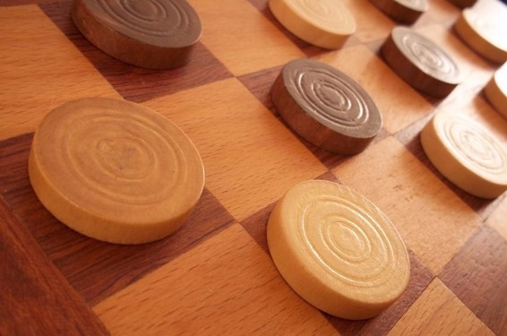

# 业界 | 人工智能、机器学习、深度学习，三者之间的同心圆关系

选自 blogs.nvidia

**作者： Micheal Copeland**

**机器之心编译**

**参与：Rick. R 、李亚洲**

> *今年早些时候，当谷歌 DeepMind 团队的 AlphaGo 打败了李世石时，媒体就用人工智能、机器学习和深度学习这三个术语来描述 DeepMind 是如何取得胜利的。这三个名词都是 AlphaGo 大胜李世石的原因中的一部分，但是它们并不相同。下面我们就来解释一下。*

理解三者之间关系的最简便方法就是将它们视觉化为一组同心圆——首先是最大的部分人工智能——然后是后来兴旺的机器学习——最后是促使当下人工智能大爆发的深度学习——在最里层。  

 **从萧条到繁荣**

自从 1956 年几个计算机科学家在达特茅斯会议上聚集并开辟了人工智能这一领域，人工智能就进入了我们的想象，并在实验研究中进行着酝酿。在过去的几十年里，人工智能以及轮番被誉为人类文明取得最美好未来的关键，或者是作为一个头脑发烧的轻率概念被扔进了科技垃圾堆中。坦白说直到 2012 年，它就这样在二者之间交杂。

过去的几年里，尤其从 2015 年开始，人工智能开始爆发了。这很大程度上与 GPU 的广泛应用有关，为了使并行处理更快、更便宜、更强大。这也与近乎无限的存储能力和各类数据洪流（所有的大数据运动）——图像、文本、交易、测绘数据，只要你说得出来——一道进行。

让我们梳理一遍计算机科学家是如何从萧条——直到 2012 年——到繁荣，开发出每天由成千上百万的人使用的应用。

**人工智能——机器诠释的人类智能**

**** 

*King me：下西洋跳棋的计算机程序是上世纪 50 年代造成过一阵轰动的一些早期人工智能案例*

回到 1956 年夏天的那场会议，人工智能先驱们的梦想是借由新兴计算机构建具有人类智力特征的复杂机器。这就是所谓的「通用人工智能（General AI）」的概念——拥有人类的所有感觉（甚至可能更多）、所有理智，像人类一样思考的神奇机器。

你已经在电影中无休止地看到过这些被我们当做朋友的机器，比如《星球大战》中的 C-3PO  以及成为人类敌人的机器——终结者。通用人工智能机器向来有充足的理由出现在电影和科幻小说中；我们不能阻止，至少现在还不行。

我们能做什么？这就到了「狭义人工智能（Narrow AI）」的概念。指的是能够将特殊任务处理得同人类一样好，或者更好的技术。狭义人工智能的相关案例比如有 Pinterest 上的图像分类、Facebook 中的人脸识别。

这些是狭义人工智能在实践中的例子。这些技术展示了人类智能的一些方面。但是如何做到的呢？那个智能来自哪里？所以接下来看第二个同心圆，机器学习。

**机器学习——实现人工智能的一种方式**

*****Spam free diet：机器学习帮你清理收件箱中的（大部分）垃圾邮件。*

机器学习最基础的是运用算法来分析数据、从中学习、测定或预测现实世界某些事。所以不是手动编码带有特定指令设定的软件程序来完成某个特殊任务，而是使用大量的数据和算法来「训练」机器，赋予它学习如何执行任务的能力。

机器学习直接源自早期那帮人工智能群体，演化多年的算法包括了决策树学习（decision tree learning）、归纳逻辑编程（inductive logic programming）。其他的也有聚类（clustering）、强化学习（reinforcement learning）和贝叶斯网络（Bayesian networks）等。我们知道，这些早期机器学习方法都没有实现通用人工智能的最终目标，甚至没有实现狭义人工智能的一小部分目标。

事实证明，多年来机器学习的最佳应用领域之一是计算机视觉，尽管它仍然需要大量的手工编码来完成工作。人们会去写一些手写分类器，像是边缘检测过滤器（edge detection filters）使得程序可以识别对象的启止位置；形状检测（shape detection）以确定它是否有八条边；一个用来识别单词「S-T-O-P」的分类器。从这些手写分类器中他们开发出能够理解图像的算法，「学习」判定它是否是一个停止标志。

这很好，但还不够好。特别是有雾天气标志不完全可见的情况下，或者被树遮住了一部分。计算机视觉和图像检测直到目前都不能与人类相媲美，是因为它太过脆弱，太容易出错了。

是时间和正确的学习算法改变了这一切。

**深度学习——一种实现机器学习的技术**

**** *Herding cats：从 YouTube 视频中挑选猫咪图片，是深度学习的第一次突破性表现之一*

源自最早进行机器学习那群人的另一种算法是人工神经网络（Artificial Neural Networks），它已有几十年的历史。神经网络的灵感来自于我们对大脑生物学的理解——所有神经元之间的相互连接。但是不像生物大脑中的任何神经元，可以在一定的物理距离内连接到任何其他神经元，这些人工神经网络的层、连接和数据传播方向是离散的。

比如你可以把一个图像切成一堆碎片并输入到神经网络的第一层中。然后第一层的单个神经元们将数据传递给第二层。第二层神经元将数据传给第三层，如此一直传到最后一层并输出最终结果。

每个神经元分配一个权重到它的输入——评估所执行的任务的准确或不准确。然后最终的输出由所有这些权重来确定。所以想想那个停止标志的例子。一个停止标志图像的特征被切碎并由神经元来「检查」——它的形状、它的消防红色彩、它的独特字母、它的交通标志尺寸以及和它的运动或由此带来的缺失。神经网络的任务是判定它是否为一个停止标志。这提出了一个「概率向量」，它真是一个基于权重的高度受训的猜测。在我们的例子中，系统可能有 86% 的把握认为图像是一个停止标志，7% 的把握认为这是一个限速标志，5% 的把握认为这是一只被卡在树上的风筝，等等——然后网络架构告诉神经网络结果的正确与否。

甚至这个例子都有些超前了，因为直到现在，神经网络都被人工智能研究社区避开了。自从最早的人工智能起，他们一直在做这方面研究，而「智能」成果收效甚微。问题很简单，即最基本的神经网络属于计算密集型，这并不是一个实用的方法。不过，由多伦多大学的 Geoffrey Hinton 带领的异端研究小组一直在继续相关研究工作，最终在超级计算机上运行并行算法证明了这个概念，但这是直到 GPU 被部署之后才兑现的诺言。

如果我们再回到停止标志的例子，当网络正在进行调整或者「训练」时，出现大量的错误答案，这个机会是非常好的。它需要的就是训练。它需要看到成千上万，甚至数以百万计的图像，直到神经元的输入权重被精确调整，从而几乎每一次都能得到正确答案——无论有雾没雾，晴天还是雨天。在这一点上，神经网络已经教会了自己停止标志看起来会是什么样的；或者在 Facebook 例子中就是识别妈妈的脸；或者吴恩达 2012 年在谷歌所做的猫的图片。

吴恩达的突破在于从根本上使用这些神经网络 并将它们变得庞大，增加了层数和神经元的数量，然后通过系统运行大量的数据来训练它。吴恩达使用了 1000 万个 YouTube 视频的图像。他将「深度」运用在深度学习中，这就描述了这些神经网络的所有层。

如今，在一些场景中通过深度学习训练机器识别图像，做得比人类好，从识别猫咪到确定血液中的癌症指标和磁共振成像扫描中的肿瘤指标。谷歌的 AlphaGo 学会了游戏，并被训练用于 Go 比赛。通过反复与自己对抗来调整自己的神经网络。

**感谢深度学习，让人工智能有一个光明的未来。**

深度学习 已经实现了许多机器学习方面的实际应用和人工智能领域的全面推广。深度学习解决了许多任务让各种机器助手看起来有可能实现。无人驾驶机车、更好的预防医疗，甚至是更好的电影推荐，如今都已实现或即将实现。人工智能在当下和未来。有了深度学习，人工智能甚至可以达到我们长期所想象的科幻小说中呈现的状态。我拿走你的 C-3PO，你可以留着终结者。

***©本文由机器之心编译，***转载请联系本公众号获得授权***。***

✄------------------------------------------------

**加入机器之心（全职记者/实习生）：hr@almosthuman.cn**

**投稿或寻求报道：editor@almosthuman.cn**

**广告&商务合作：bd@almosthuman.cn**