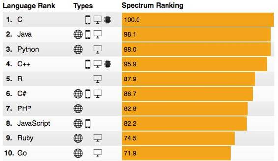
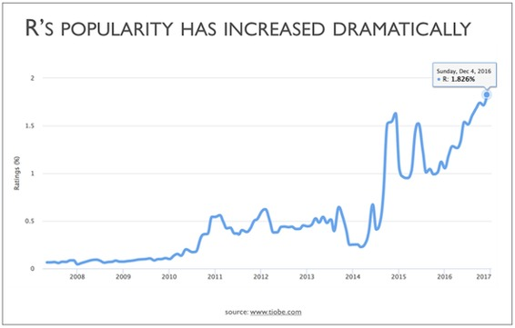
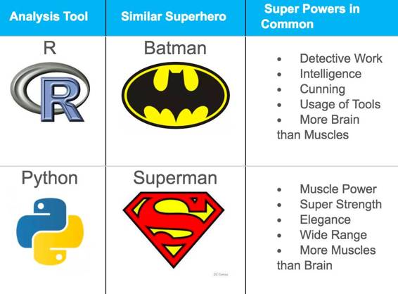
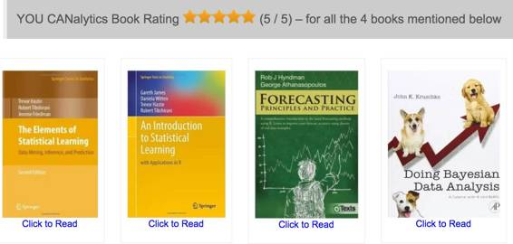
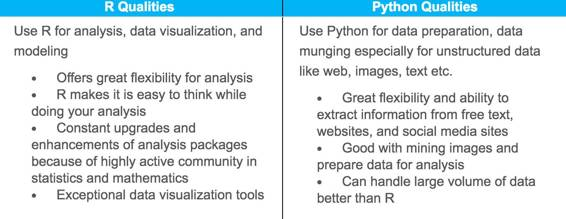

# 深度 | R vs Python：R 是现在最好的数据科学语言吗？

选自 r-bloggers

**机器之心编译**

> > *Sharp Sight Labs 近日在 r-bloggers 上发表了一篇文章，论述了为什么当今的数据科学工作者应该学习 R 语言的原因。为了给大家提供一个明晰的对比，我们在后面补充了 2016 年初的一篇文章：R vs.Python。*
> 
> 在前一段时间的博客中，我解释了为什么你应该掌握 R 语言（即便它最终可能过时）：http://sharpsightlabs.com/blog/master-r-obsolete/。我写这篇文章是为了向那些声称掌握 R 语言浪费时间的人致辞。（因为它最终会变得过时）。
> 
> 但是当我认为 R 语言最终会变得过时时，这似乎引起了恐惧——仿佛 R 语言已经过时了。
> 
> 我想要消除你的恐惧：R 语言仍然很流行。
> 
> R 语言是过去十年中发展最快的编程语言之一。
> 
> 事实上，如果你开始学习数据科学，我仍然推荐从 R 语言开始。
> 
> 所以，我想向你保证。R 语言绝对没有过时的。事实上，R 语言是非常受欢迎的而且是最好的数据语言。
> 
> 为此，我想解释为什么我对 R 语言的长期前景非常乐观，以及为什么我认为这也许是今天可以学习的最好的数据科学语言。
> 
> **R 语言始终是最好的语言之一**
> 
> 我想让你们明白的一件事情是：目前 R 语言是存在的最受尊敬、排名最高、增长最快的语言之一。
> 
> 在很多方面，R 语言就代表了数据语言。在数据科学领域，这是一个仍处于顶端的语言（只有 1 到 2 个真正的竞争者）。
> 
> 为什么这么说呢？让我们看看几个重要的调查和编程语言排名的结果，看看 R 语言排在哪里。
> 
> **IEEE：R 语言排名第 5**
> 
> 世界上最大的技术专业协会 IEEE 在几年前已经创建了一个编程语言排名。
> 
> 这个 IEEE 的排名系统使用一组 12 个指标，包括比如谷歌的搜索量、谷歌的趋势、Twitter 的点击次数、GitHub 的库、Hacker News 的帖子等等。
> 
> 使用这种方法，他们将几十种编程语言进行排名和分类。
> 
> 在他们对 2016 年顶级编程语言的回顾中，R 语言已经攀升到了第 5
> 
> 
> 
> IEEE 的方法是非常全面的，所以这对于 R 相对于其他语言的力量和学习的相对价值是一个很好的指示。
> 
> **TIOBE：R 的排名高，且具有连续的上升趋势**
> 
> 另一个排名系统，TIOBE 索引，为各种编程语言创建了相似的分数和排名。
> 
> 如果我们看看 R 语言在 TIOBE 索引上的表现，我们可以看到近十年以来一个稳定的上升趋势。
> 
> 
> 
> 请记住，TIOBE 索引的结构是「编程语言受欢迎程度的指示」。索引每个月更新一次，评分是基于世界范围内的精尖工程师、课程和第三方供应商的使用量。像谷歌、Bing、雅虎、维基百科、亚马逊、油管和百度等热门搜索引擎则用来计算排名。
> 
> 到 2016 年 12 月，R 语言的总排名是 17（在所有编程语言中）。它的最高排名是 2015 年 5 月的第 12 名。
> 
> 这表明，如果你想学习数据科学，目前学习 R 语言仍然是一个很好的选择。（要清楚，Python 在 TIOBE 索引上的排名较高，但是很难从 Python 相关使用的严格数据中分离出网络和软件开发的使用情况，因此这可能不是一个公平的比较）。
> 
> **Redmonk:R 语言排名 12**
> 
> 另一个经常选择的语言排名系统是 Redmonk 编程语言排名，它是从 GitHub（代码行数）和 Stack Overflow（标签数量）上的流行度衍生出来的。
> 
> 截至 2016 年 11 月，R 语言在所有编程语言中排名第 13 位。
> 
> 此外，R 语言几年来一直呈上升趋势
> 
> 在前 20 种语言的后半部分中，随着时间的推移，R 语言显示出最一致的上升趋势。从 2012 年的第 17 位开始，它随着时间的推移稳步上升，但似乎在 13 这个位置上停留了连续三个季度。然而这一次，R 语言代替了排名 12 位的 Perl，使其跌落到 13 位。虽然仍然有大量的 Perl 语言在流通，但是更加专业的 R 语言已经夺取了这个一度被认为是网络粘结剂的 Perl 语言的位置。当然这与 R 语言的支持者们无关。R 语言相对独特的前 20 路径是值得它们的粉丝所欢呼的。
> 
> **O’Reilly：R 语言可以说是最常见的数据编程语言**
> 
> 最后，媒体 O'Reilly 在过去的几年里进行了一次数据科学调查，他们使用调查数据来分析数据科学的趋势。除了其他的之外，它们分析工具的使用情况来确定哪些工具是数据科学家最常使用的。
> 
> 在 2016 年的调查报告中，R 语言是最常用的编程语言（如果我们排除 SQL，这不是我在这里所指的编程语言）。57% 的受访者使用 R 语言（相比之下，使用 Python 的有 54%）
> 
> （另外，有 70% 的受访者使用 SQL。如果你正在寻找 R 之后的另一个语言去学习，我会推荐 SQL）
> 
> 他们还调查了人们去识别数据可视化的工具。他们发现 ggplot2 是最常见的可视化工具。我会在一篇即将发布的博客中解释为什么我喜欢 ggplot2，但如果我们只跟踪人气，O'reilly 的调查表明 ggplot2 时最常被使用的工具之一，甚至可能就是最常被使用的。
> 
> **R 语言是学习数据科学的极佳语言**
> 
> R 语言成为一门极佳的数据科学语言，在普遍性之外，另一大原因是：它是一门非常好的学习数据科学的语言。
> 
> **R 语言是真正的「数据语言」**
> 
> R 语言之所以如此适合数据科学的原因部分跟它本身的语言特性有关。自 R 语言发明之初，数据及统计的观念便融入其中。R-Project 形容其为「为统计计算而准备的编程语言及环境」。也就是说，R 语言的 DNA 中就含有统计及数据的基因。
> 
> 如此说来，R 语言在众多编程语言中可谓独树一帜。它是一门为统计而生的语言，是一门为（处理）数据而设计的语言。当你在学习数据科学的时候，这将带来很大的优势——因为几乎所有的统计测试或方法都能够在 R 语言及其拓展库中找到。
> 
> **最好的书籍和资源都使用了 R 语言**
> 
> 俨然，R 语言已是一门「统计计算」语言。与之相关的是，许多很好的书籍及学习资源都采用了 R 语言。
> 
> 这非常重要。如果你是一名初学者，在数据科学领域才刚刚起步，那么你将需要学习很多知识。要真正掌握数据科学，你需要学习包括概率论、统计学、数据可视化、数据处理及机器学习在内的诸多子领域。所有这些领域都包含了理论基础（也就是你需要学习的内容），同时你也需要通过编写程序实际使用它们。
> 
> 也就是说，你需要这样一种语言：
> 
> 1.  能够在这些领域都能够发挥作用（如数据可视化、数据处理、机器学习（也叫做统计学习））。
>     
>     
> 2.  这门编程语言在这些领域内还有高质量的学习、训练素材。
>     
>     
> 
> 尽管市面上有很多关于数据科学的书籍与课程，但其中最好的大多都是基于 R 语言的。
> 
> **使用 R 语言学习概率论**
> 
> 以概率论为例，两本关于概率论的优秀书籍都是用 R 语言来编写书上的上手案例的。这两本书分别是：
> 
> *   《Probability with Applications and R》。这本书语言朴实、通俗易懂、条理清晰。
>     
>     
> *   《Introduction to Probability》。这本书基于哈佛著名的统计学课程编写。
>     
>     
> 
> 这只是两个简单的例子。如果你进一步发掘的话，你会发现几乎所有的关于概率论的书籍都使用了 R 语言。
> 
> **使用 R 语言学习频率论统计学（frequentist statistics）**
> 
> 对于统计学方面的书籍也是如此。
> 
> 因为统计学已经深入 R 语言的骨髓，所以许多统计学课本使用 R 语言作为其学习工具。
> 
> 《Statistics: an Introduction using R》是一本介绍频率论统计学的优秀书籍。
> 
> 一样的，如果你在亚马逊上快速搜索一下，你找到的大部分统计学入门的教材都使用了 R 语言作为它们的学习工具。
> 
> **使用 R 语言学习贝叶斯统计学**
> 
> 当你正在寻找一本关于贝叶斯统计学的入门书籍时，这种趋势变得更为明显。
> 
> 几乎所有的关于贝叶斯统计及推断的书籍都是用了 R 语言。尽管有些例外（有些书使用了 C 语言或者 Python），但主导的仍然是 R 语言。
> 
> 如果你对贝叶斯统计学感兴趣，你可以查看这几本书：
> 
> *   Introduction to Bayesian Statistics
>     
>     
> *   Statistical Rethinking
>     
>     
> *   Doing Bayesian Data Analysis
>     
>     
> 
> 如果你对贝叶斯方法感兴趣的话，这些书是你最棒的选择了，并且它们都使用了 R 语言。
> 
> **学习如何在 R 中进行数据可视化**
> 
> 当你在学习数据可视化的时候，尽管你会有相对更多的编程语言可以选择，但笔者还是认为，大多数最优的编程资源都使用了 R 语言。
> 
> 如果你正在学习数据可视化，那么你可以参考 Nathan Yau 的工作。他经常在他的博客（flowingdata.com）上上传一些使用 R 语言的数据可视化教程。（笔者同时推荐他所写的《Data Points》作为参考，在这本书中主要讲授的是数据可视化的一些法则而非编程实现。）
> 
> 笔者亦推荐 Hadley Wickham 所著的书。如果你对使用 R 语言进行数据可视化感兴趣的话，那么你应该拥有 ggplot2 这本书。它不仅教会你如何使用 R 语言中数据可视化库的使用方法，还能够改变你对数据进行可视化的观念。
> 
> 同时，你还可以参考这本书：R for Data Science。这本书包含了对数据可视化非常棒的介绍，还有对很多 R 语言数据可视化工具库的介绍，是一本学习 R 语言的必备书籍。
> 
> **使用 R 语言来学习机器学习**
> 
> 最后，如果你想开始学习机器学习，有很多优秀的使用 R 语言描述的机器学习的书籍可以参考。
> 
> 我承认，现在有各种各样使用不同的编程语言的来描述机器学习的书籍，但我认为，在最好的那一部分书籍中有很大比例都是使用的 R 语言。
> 
> 下面有两个使用 R 语言来介绍机器学习的优秀的教程：
> 
> 1.  统计学习导论（An Introduction to Statistical Learning）
>     
>     
> 2.  应用预测建模（Applied Predictive Modeling）
>     
>     
> 
> 这些书写得十分严谨同时也很容易理解。书中会提及一些理论知识（但是不会用很复杂的数学知识来为难你），同时也会教授你一些实用的技术。
> 
> 毫无疑问，这是我给想学习机器学习的初学者最常推荐的两本书，并且它们都使用的是 R 语言。
> 
> **如果你想学习数据科学，R 语言是一个绝佳的选择**
> 
> 最后强调一下，R 是一种学习数据科学的优质语言，因为许多优秀的书籍（以及一些其它的教程）都使用 R 来作为编程语言。
> 
> 所以，如果你是数据科学的初学者，由于数据科学学习材料的数量和质量所限制，所我认为 R 语言是最好的选择。
> 
> **一个关于 Python 的快速注解**
> 
> 就数据科学编程语言来说，Python 是目前唯一可以替代 R 的语言。（因为其它的替代方案缺乏完善的软件包生态系统或者是非开源/免费的）。
> 
> 我不会在这里阐述我对 Python 的全部理解，但是我必须要讲的是，Python 的确是一种优秀的语言。我爱 Python。
> 
> 话虽如此，对于数据科学的初学者来说，我仍然认为 R 是更好的选择，其中的原因我在上文中已经进行了概述。
> 
> 再者，我认为关于基础数据科学概念（概率、统计、贝叶斯统计、机器学习）的许多最好的教科书和教程都是基于 R 的。当然，这并不是说没有优秀的数据科学书籍使用 Python，我只是认为基于 R 的书籍的平均质量高于用其它编程语言描述的书籍。
> 
> 有关于 Python 的另一个问题是，很多学生在开发过程中会遇到一些困难。他们在学习的过程中并没有花多少时间来学习统计数据、数据可视化、数据操作、概率等，而是花费了大量的时间去学习数据结构、循环、流程控制、面向对象的编程和 Web 框架。这些技能可以用来完善核心的数据科学工具包，但它们不是我们想要了解的数据科学范畴的相关内容。事实上，我建议大多数初学者先学习基本数据科学相关的内容（如数据操作、可视化、分析等）后再学习软件开发。
> 
> 虽然大多数的初学者在以后会学习软件开发的技术，但是很多使用 Python 来作为入门数据科学的初学者会陷入到软件开发和 Web 开发等领域。我认为之所以会出现这样的问题，是因为在许多方面，Python 都是运用于这些领域的。大多数关于 Python 的书籍并不是真正的数据科学书籍，而是讲述一些有关于编程和开发的内容。所以，有些数据科学的初学者选择使用 Python 描述的书籍来学习数据科学，然而他们最终却花费了数月甚至数年来学习软件和 web 开发而不是数据科学。
> 
> 当然，我非常爱 Python，但是对于初学者而言，我认为选择 Python 有一些冒险。最好还是从 R 语言开始，因为统计学和数据科学就像「它的 DNA」一样和它绑定在一起。使用 R 语言，不仅更容易学习，也不容易偏离我们的学习范畴。
> 
> **如果你想学习数据科学，那么就学习 R 语言吧**
> 
> 你应该记住的是，如果想要学习数据科学，R 是可以说是最好的选择。在人气方面，R 拥有非常高的排名，并且还处于上升趋势。此外，有很多最好的数据科学的书籍和教程都是使用 R 语言来描述的。
> 
> 如果你想要开始学习数据科学，我的建议如下：
> 
> *   学习 R 语言
>     
>     
> *   重点学习 ggplot2、dplyr、tidyr、lubridate 和一些其它用于实现数据的可视化和控制的 Hadleyverse 工具
>     
>     
> *   学习同时使用这些工具来进行数据分析。
>     
>     
> *   当你对这些 R 工具包有所了解之后就可以开始学习概率、统计学和机器学习的内容了 (我推荐大家使用我在本文中所谈到的那些资料)
>     
>     
> 
> **R vs Python - 超级英雄**
> 
> R 这么好，也不要忘记 Python。在这一部分我们对比一下数据科学家的两个超级英雄——R 和 Python。
> 
> Python 就像是超人，而 R 和蝙蝠侠之间有几点相似之处。让我们创建一个表来列出这些相似之处。
> 
>  
> 
> **R 就像蝙蝠侠**
> 
> *   侦探工作
>     
>     
> *   智慧
>     
>     
> *   狡黠
>     
>     
> *   使用工具
>     
>     
> *   动脑多于蛮力
>     
>     
> 
> **Python 就像超人**
> 
> *   肌肉力量
>     
>     
> *   超级力量
>     
>     
> *   优雅
>     
>     
> *   应用面广
>     
>     
> *   蛮力多于动脑
>     
>     
> 
> 接下来解释一下 R 和 Python 之间的区别及原因。此外，让我们帮助数据科学家找到更好用的编程语言。
> 
> **R vs Python / R 和 Python : 哪一种更好用？**
> 
> R 和 Python 都是开源的、免费的高级编程语言。R 专门用于统计计算。它有大量附加包（package）/工具来支持机器学习和数据分析。另一方面，Python 是一种通用的强大的编程语言，在数据准备、数据调试和数据分析方面有特殊的应用。
> 
> 这种区别也是不同分析人士喜欢这些编程语言的原因。Python 通常被尝试开发数字处理和分析技能的计算机程序员所青睐。另一方面，R 被数学家和统计学家优先选择。这些差异在这些语言的学习资源（书籍和网上论坛）中是显而易见的。例如，考虑以下 4 本免费的在线图书。
> 
> 
> 
> 所有这些书都是高质量的统计教材，用 R 作为首选编程语言。这些只是几个例子。请注意，第一本书不是专门用于 R，与第二本书有相同的作者。你很少会找到用 Python 作为首选语言的书籍。因此，R 更有能力处理数据挖掘和统计分析的相关问题。另一方面，Python 提供了非常好的应用程序来处理非结构化和复杂的数据集，如图像、书面文本（网络、电子邮件等）、基因、声音等。
> 
> 实质上，Python 和 R 一起构成了数据科学家的工具包。因此，对于务实的和面向应用的数据科学家来说，了解这两种语言的超级能力和特点是至关重要的。
> 
> 
> 
> 使用 R 进行分析、数据可视化与建模：
> 
> *   为分析提供了极好的灵活性
>     
>     
> *   R 使你在分析的时候更容易思考
>     
>     
> *   由于有着十分活跃的统计与数学社区，可以持续的更新和增强分析功能优秀的数据可视化工具
>     
>     
> *   优秀的数据可视化工具
>     
>     
> 
> 使用 Python 进行数据预处理、数据清洗，特别针对于非结构化数据（如网页，图像，文本等）：
> 
> *   极强的灵活性，能够从自由文本、网站和社交媒体网站提取信息
>     
>     
> *   便于图像挖掘和为分析准备数据
>     
>     
> *   处理大量的数据的时候比 R 语言更好
>     
>     
> 
> 对于一个认真的数据科学家来说，R 和 Python 都应该了解。我们需要的是 R+Python，而不是 R vs Python。
> 
> ***©本文由机器之心编译，***转载请联系本公众号获得授权***。***
> 
> ✄------------------------------------------------
> 
> **加入机器之心（全职记者/实习生）：hr@almosthuman.cn**
> 
> **投稿或寻求报道：editor@almosthuman.cn**
> 
> **广告&商务合作：bd@almosthuman.cn**