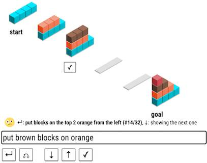

# 前沿 | 斯坦福 NLP 团队介绍交互式语言学习：从语言游戏到日程规划

选自 Stanford University

**机器之心编译**

目前，计算机或手机上的自然语言接口通常是一次性训练成型并配置使用，且用户不得不忍这种一次性训练和配置所得到的语言接口的各种制约。支持用户向计算机展示内容或者说教导计算机，似乎成为了构建更自然和更可用的自然语言接口的一个中心模块。

回顾语言习得的相关研究，与被动的吸收语言相反（如：看电视的情形。相关研究 Kuhl 等人, 2003, Sachs 等人, 1981 )，有相当多的证据表明人类的孩子需要通过交互来学习语言。研究表明当学习一门语言时，人类通过有意义的交互（Kreshen, 1983）来提升语言能力而不是有意识的去分析复杂度不断增强的语言结构（如：句型，词变位）。

相反，惯用的机器学习数据集并没有交互设置，任何情况下反馈保持相同，即不会随着系统当前的状态或者采取行动的不同而不同。我们认为交互是重要的，一个可交互的语言学习设置将会使可适应和可定制化的系统成为可能，特别是对于资源贫乏的语言学习和在无法避免的几乎从头开始的新语言环境里。

我们描述了可交互语言学习的两种尝试——一个操作积木的智能体和一个日程安排程序。

**语言游戏：在积木的世界里交互的学习语言**

由人类的语言习得过程所启发，我们研发了一个从零开始学习语言的简单程序。我们探索了语言游戏背后的理念，在这款游戏中，计算机和使用者需要协作完成一个共同的目标虽然他们最初并不说同一种语言。具体来说，我们在试验中创建了一款叫 SHRDLURN 的游戏来对 Terry Winograd 的开创性工作表示敬意。

如图 1a 所示，目标是把初始状态转换为目标状态，但是人类能做的唯一举动就是输入一种言语表达。计算机对这种表达方式进行解析，并根据它现有的模型生成这个言语表达的所有可能解释的排名表。人可以滑动这张表然后选择想要的解释，同时，推进积木的状态并提供反馈给电脑。人类和计算机都想要尽可能少的滑动来到达目标状态（但只有人类知道目标状态）。对于计算机来说，它如果想要成功的话，就不得不在游戏的过程中快速学习人类的语言，这样一来，人类就可以更高效的到达目标状态。反过来，人类也可以通过理解计算机现在能做什么和不能做什么来加速目标达成的进程。

我们把计算机建模成一个语义解析器（Zettlemoyer and Collins, 2005); Liang and Potts, 2015），将自然语言的表达方式（比如 remove red）映射到相应的逻辑形式（比如，remove（with（rend）））。语义解析器没有种子词汇和注解过的逻辑形式，所以，它只是生成许多待选的逻辑形式。系统通过调整与简单和通用（generic）语词特征对应的参数，从人类反馈中学习。关键是，计算机能快速学习，否则使用者就会很沮丧，系统也会变得不太可用。除了特征工程和调整在线学习算法以外，通过吸收语用学，我们实现了更快的学习速度。

然而，这里特殊的地方在于实时学习的性质，其中，人类也能学会并适应计算机，因此，取得好的任务表现也更容易。尽管人类可以教会计算机任何一种语言——在我们的试点中，机械的土耳其用户尝试了英语，阿拉伯语，波兰语以及一个定制化的程序许愿——一个好的人类完全会挑选表达，这样计算机才更有可能快速学习。

更多信息：SHDLURN paper (https://arxiv.org/abs/1606.02447)；

demo (http://shrdlurn.sidaw.xyz/)；

CodaLab(https://worksheets.codalab.org/worksheets/0x9fe4d080bac944e9a6bd58478cb05e5e) 的代码，数据和实验；

以及 client side code (https://github.com/sidaw/shrdlurn/tree/acl16-demo)。

*1a 上方:SCHRDLURN*

*1b 下方:SCHEDLURN*

图像 1:1a:通过用户交互学习语言的实验。为了响应用户指示，系统尝试做出动作，用户暗示这一动作是否正确。这样的反馈能让系统学会语词意思和语法。

1b:日历领域的交互式学习接口。

**采用示范下的社区学习的日历**

把自然语言接口推广到更多领域中，依然面临很多挑战。首先，为了规模化到更加开放、复杂的动作空间，需要更加丰富的反馈，这些反馈对于人类来说很自然，对于机器而言很有用。第二，考虑到快速且泛化的数据收集，我们在基于社区的学习框架上试图支持集合性（而不是个人）语言。现在，我们将第一次试着解决这些问题并将框架扩展到日历语境下的战果公布出来。（视频总结：https://youtu.be/PfW4_3tCiw0）。

事件安排这个任务，很常见但仍然没有被解决：尽管几个现成的日历程序允许有限自然语言输入，但是，根据我们的体验，一但遇到稍微复杂的事情，比如，「把周二下午所有的会见推迟一个小时」，这些系统就会失灵。我们认为，交互式学习会给日历提供更好的自然语言接口，对真实世界（而不是 blocks world）产生影响。而且，为了把我们的方法论从定义扩展到描述，我们选择了这个领域，因为大多数用户都已熟悉日历图形用户界面，也知道怎么操作。另外，因为已经采用了日历自然语言接口，特别是在手机上，因此，我们希望用户能自然而然地趋向使用自然语言方式的遣词造语，而不是使用一个更加技术化的语言，就像我们在 blocks world 里看到的那样。最后，日历是相当复杂的领域，当有了一套更广泛的基元（primitives）和可能动作后，我们就可以用更大的动作空间来测试我们的框架。

**从示范和社区学习**

在我们的实验中，用户通过滑动，并针对给定表达选择一个合适的动作，来给予反馈——对大型动作空间来说，这个过程不自然也不可扩展。人类交流中的反馈信号包括再形成（reformulation）、意译、修补序列等。我们扩展了我们的系统来接收描述的反馈，因为它 1）对人来说非常自然，特别在使用日历时，允许进行简单的数据搜集；2）对于语言学习有益，当前机器学习方法可以加以利用。实践中，如果正确的解释并没有在排名高的选项里，那么，系统会退回到 GUI，用户通过 GUI 向系统表明自己的意思。从指示符号中学习的算法非常适用于这类问题，这些问题中，交互式有望帮助搜索潜在逻辑形式。

虽然学习和适应每个用户为试点研究提供了一个干净的设置，但是，如果每个人都必须从头开始教计算机，就不会有好的覆盖。虽然存在个体差异，但是用户也应该有很多共同点，这些共同点使得计算机学地更快，泛化地更好。就我们的日历而言，我们放弃了个性化的特定用户语言模型，转而采用一个集体社区模型，这个模型包含了一套语法规则以及从所有用户和交互中搜集到的参数。每一个用户都对语言的表达性和复杂性做出了贡献，其中行话和习俗以一种分布式的范式得以发明、修改、或拒绝。

**初步结果**

通过使用亚马逊土耳其机器人（Amazon Mechanical Turk ），我们支付了 20 名工人每位 2 美金来玩我们的日历。在 356 种表达、196 种情况中，工人从建议排名列表中选择了其中一种状态作为想要的日历状态。通过示范，有 68 次工人使用日历 GUI 来人工修改和提交描述反馈。

搜集到的一个小型包含命令的子集如图 2 所示。尽管有很大一部分是相对简单的命令，AMT 工人还是使用了不是那么琐碎的措辞，确实挑战了复杂任务系统。正如我们期待的那样，用户非常倾向于使用自然语言，并没有发展出一种技术性的人工语言。少量日历命令因为不平常的日历命令，其自然属性受到了质疑。（请看 Questionable）

 

图 2：目录化命令的分类样例。为评估学习表现，我们测量了系统在一个给定自然语言命令的条件下正确预测出正确日历动作的能力。我们看到排名最高的动作有 60% 的正确率。80% 的时候，正确意思位于三个系统动作排名中的首位。

**讨论**

关键挑战是找出哪一个反馈信号既对计算机有用又对人类来说很自然。通过提供备选方案和从示范中学习，我们对此进行了探索。我们也正在尝试定义和重新表述。比如，当一位用户将「明天早上的会议」的表述改为「明天早上七点之后中午之前的会议」后，我们就能够推断「早晨」的含义。

我们相信，未来，自然语言接口一定是从与用户的交互中进行学习并随着时间推移不断得以改善。自然语言界面有望在许多任务上替代 GUIs 和改写，而且这样做能够弥合数字技术之间的巨大鸿沟，让我们更好地使用计算机。

******©本文为机器之心编译，***转载请联系本公众号获得授权******。***

✄------------------------------------------------

**加入机器之心（全职记者/实习生）：hr@almosthuman.cn**

**投稿或寻求报道：editor@almosthuman.cn**

**广告&商务合作：bd@almosthuman.cn**