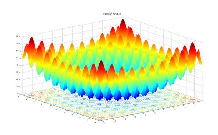
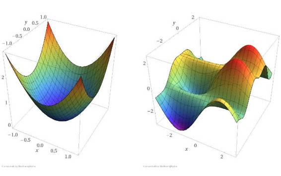

# 技术 | 斯坦福大学副教授 Reza Zadeh：神经网络越深就越难优化

选自 O'Reilly

**机器之心编译**

**参与：武竞、吴攀、蒋思源**

> *本文作者 Reza Zadeh 是斯坦福大学副教授及 Matroid 公司创始人兼 CEO。他的研究工作主要涉及机器学习、分布式计算和离散应用数学。他同时也是微软和 Databricks 的技术顾问委员会的成员。对于这篇文章，他总结说：「神经网络越深，往往就越难优化。」*

*Rastrigin 函数*

优化是非常困难的一类问题，而这正是深度学习的核心。优化问题是如此困难，以至于在神经网络引入几十年后，深度神经网络的优化问题仍阻碍着它们的推广，并导致了其 20 世纪 90 年代到 21 世纪初的衰落。自那以后，我们解决了这个问题。在这篇文章中，我会探讨优化神经网络的「困难度（hardness）」，并发掘其背后的理论。简而言之：网络越深，优化问题就越难。

最简单的神经网络是单节点感知器，其优化问题是凸优化的。凸优化问题的好处是其所有的局部最小值也是全局最小值。现在有各种各样的优化算法来处理凸优化问题，且每隔几年就有更好用于凸优化理论的多项式时间算法（polynomial-time algorithms）出现。运用凸优化很容易得到单个神经元的优化权重（见下图）。从单个神经元开始，让我们看看会发生什么。

*图 1。左：凸函数。右：非凸函数。沿着函数表面，凸函数比非凸函数更容易找到表面的最小值。（来源： Reza Zadeh）*

下一步是保持单层网络下添加多个神经元。对于单层、n 节点的感知机神经网络，如果存在一组边权重使得网络可以正确地分类给定的训练集，则这样的权重可以通过线性规划用 n 的多项式时间找到，这也是凸优化的特殊例子。所以下个问题是：对于更深的多层神经网络，我们是否可以类似地使用这种多项式时间方法？不幸的是，我们无法保证。

能够有效解决两层或多层的广义神经网络的优化问题并不容易，这些算法将会涉及计算机科学中的一些最棘手的开放性问题。因此，要想机器学习研究人员找到可靠的深度网络最佳优化算法可能性十分渺茫。因为该问题是 NP-hard（非确定性多项式困难 non-deterministic polynomial hard）的，也就意味着如果可以在多项式时间的计算复杂度中解决它，也将解决数十年来悬而未决的几千个开放性问题。事实上，1988 年 J.Stephen Judd 阐述的以下问题就是 NP-hard：

> *给定一个广义神经网络和一组训练集样本，是否存在一组网络边权重（edge weight），使网络能够为所有的训练样本产生正确的输出结果？*

Judd 还表明，即使只需要神经网络正确输出三分之二的训练样本，但还是 NP-hard 的，这意味着即使在最坏的情况下，训练一个不精确的神经网络在本质上也是困难的。1993 年，Blum 和 Rivest 证明了更坏的消息：即使训练一个只有两层和三个节点的简单神经网络也是 NP-hard！

理论上，对比深度学习与机器学习中的许多更简单的模型（例如支持向量机和逻辑回归），这些模型可以在数学上保证优化能在多项式时间中执行。对于这些更简单的模型，我们能够保证优化算法在多项式时间内就会找到最佳模型。但是，对于深度神经网络的优化算法，并没有这样的保证。根据你的设置来看，你不知道你训练的深度神经网络是否是你可以找到的最好的模型。所以你也并不知道如果继续训练是否能得到更好的模型。

幸运的是，实践中我们可以非常有效地解决这些「困难」结果：运用典型梯度下降（gradient descent）优化方法可以给出足够好的局部最小值，让我们在许多问题上取得了巨大进步，例如图像识别、语音识别和机器翻译。我们只是忽略困难的部分，在时间允许下尽可能多地运用梯度下降迭代。

似乎最优化问题的传统理论结果是很笨拙的，我们很大程度上可以通过工程和数学技巧、启发式方法、增加更多的机器或使用新的硬件（如 GPU）来解决它们。有意思的是，仍有很多人研究为什么典型的优化算法如此有用，当然除了那些困难的部分。

深度学习流行的原因远远不止是解决了优化问题。深度学习在许多机器学习任务中获得领先，它的网络的架构、训练的数据量、损失函数和正则化都起着关键作用。

******©本文为机器之心编译文章，***转载请联系本公众号获得授权******。***

✄------------------------------------------------

**加入机器之心（全职记者/实习生）：hr@almosthuman.cn**

**投稿或寻求报道：editor@almosthuman.cn**

**广告&商务合作：bd@almosthuman.cn**