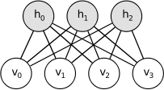
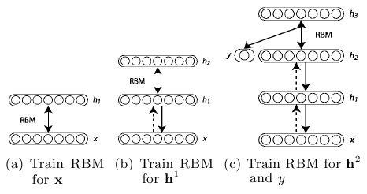
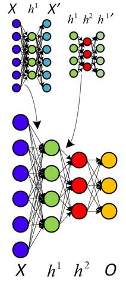
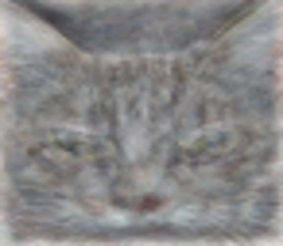
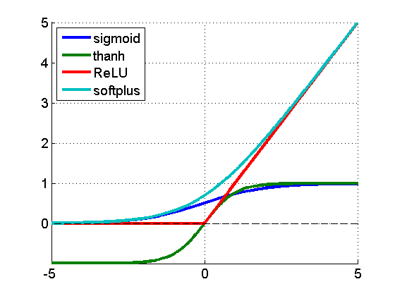
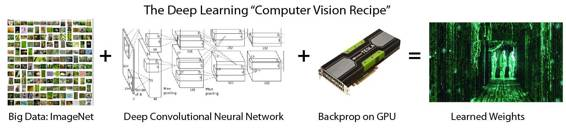
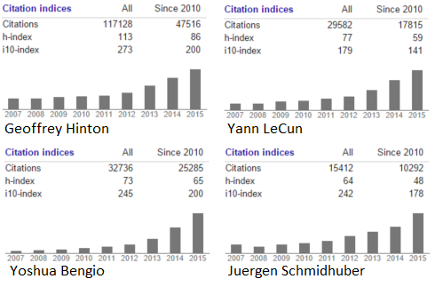
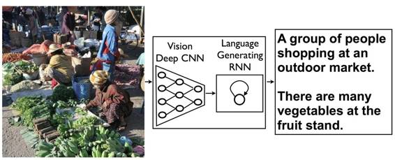
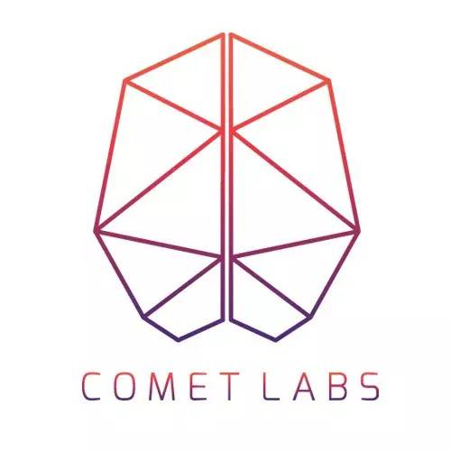

# 深度 | 神经网络和深度学习简史第四部分：深度学习终迎伟大复兴

选自 andreykurenkov

****机器之心编译出品****

**翻译：****微胖、Ben、Sane、Salmoner、Chen、柒少**

> 导读：这是《神经网络和深度学习简史》第四部分。前三部分的链接分别是：
> 
> [神经网络和深度学习简史（一）](http://mp.weixin.qq.com/s?__biz=MzA3MzI4MjgzMw==&mid=402032673&idx=1&sn=d7e636b6d033cbcf8a74dfaf710e9ccf&scene=21#wechat_redirect)：从感知机到 BP 算法
> 
> [神经网络和深度学习简史（二）](http://mp.weixin.qq.com/s?__biz=MzA3MzI4MjgzMw==&mid=402115604&idx=2&sn=740b0378af1e754b1790a432b4cad5a6&scene=21#wechat_redirect)：BP 算法之后的又一突破——信念网络
> 
> [神经网络和深度学习简史（三）](http://mp.weixin.qq.com/s?__biz=MzA3MzI4MjgzMw==&mid=402228099&idx=1&sn=a8e664d332f7d28250fbbf357c773f62&scene=21#wechat_redirect)：90 年代的兴衰——强化学习与递归神经网络

我们终于来到简史的最后一部分。这一部分，我们会来到故事的尾声并一睹神经网络如何在上世纪九十年代末摆脱颓势并找回自己，也会看到自此以后它获得的惊人先进成果。

「试问机器学习领域的任何一人，是什么让神经网络研究进行下来，对方很可能提及这几个名字中的一个或全部: Geoffrey Hinton，加拿大同事 Yoshua Bengio 以及脸书和纽约大学的 Yann LeCun。」

**深度学习的密谋**

当你希望有一场革命的时候，那么，从密谋开始吧。随着支持向量机的上升和反向传播的失败，对于神经网络研究来说，上世纪早期是一段黑暗的时间。Lecun 与 Hinton 各自提到过，那时他们以及他们学生的论文被拒成了家常便饭，因为论文主题是神经网络。上面的引文可能夸张了——当然机器学习与 AI 的研究仍然十分活跃，其他人，例如 Juergen Schmidhuber 也正在研究神经网络——但这段时间的引用次数也清楚表明兴奋期已经平缓下来，尽管还没有完全消失。在研究领域之外，他们找到了一个强有力的同盟：加拿大政府。CIFAR 的资助鼓励还没有直接应用的基础研究，这项资助首先鼓励 Hinton 于 1987 年搬到加拿大，然后一直资助他的研究直到九十年代中期。…Hinton 没有放弃并改变他的方向，而是继续研究神经网络，并努力从 CIFAR 那里获得更多资助，正如这篇例文（http://www.thestar.com/news/world/2015/04/17/how-a-toronto-professors-research-revolutionized-artificial-intelligence.html）清楚道明的：

「但是，在 2004 年，Hinton 要求领导一项新的有关神经计算的项目。主流机器学习社区对神经网络兴趣寡然。」

「那是最不可能的时候」Bengio 是蒙特利尔大学的教授，也是去年重新上马的 CIFAR 项目联合主管，「其他每个人都在做着不同的事。莫名其妙地，Geoff 说服了他们。」

「我们应该为了他们的那场豪赌大力赞许 CIFAR。」

CIFAR「对于深度学习的社区形成有着巨大的影响。」LeCun 补充道，他是 CIFAR 项目的另一个联合主管。「我们像是广大机器学习社区的弃儿：无法发表任何文章。这个项目给了我们交流思想的天地。」

资助不算丰厚，但足够让研究员小组继续下去。Hinton 和这个小组孕育了一场密谋：用「深度学习」来「重新命名」让人闻之色变的神经网络领域。接下来，每位研究人员肯定都梦想过的事情真的发生了：2006 年，Hinton、Simon Osindero 与 Yee-Whye Teh 发表了一篇论文，这被视为一次重要突破，足以重燃人们对神经网络的兴趣：A fast learning algorithm for deep belief nets（论文参见：https://www.cs.toronto.edu/~hinton/absps/fastnc.pdf）。

正如我们将要看到的，尽管这个想法所包含的东西都已经很古老了，「深度学习」的运动完全可以说是由这篇文章所开始。但是比起名称，更重要的是如果权重能够以一种更灵活而非随机的方式进行初始化，有着多层的神经网络就可以得以更好地训练。

「历史上的第一次，神经网络没有好处且不可训练的信念被克服了，并且这是个非常强烈的信念。我的一个朋友在 ICML（机器学习国际会议）发表了一篇文章，而就在这不久之前，选稿编辑还说过 ICML 不应该接受这种文章，因为它是关于神经网络，并不适合 ICML。实际上如果你看一下去年的 ICML，没有一篇文章的标题有『神经网络』四个字，因此 ICML 不应该接受神经网络的文章。那还仅仅只是几年前。IEEE 期刊真的有『不接收你的文章』的官方准则。所以，这种信念其实非常强烈。」

*受限的玻尔兹曼机器*

那么什么叫做初始化权重的灵活方法呢？实际上，这个主意基本就是利用非监督式训练方式去一个一个训练神经层，比起一开始随机分配值的方法要更好些，之后以监督式学习作为结束。每一层都以受限波尔兹曼机器（RBM）开始，就像上图所显示的隐藏单元和可见单元之间并没有连接的玻尔兹曼机器（如同亥姆霍兹机器），并以非监督模式进行数据生成模式的训练。事实证明这种形式的玻尔兹曼机器能够有效采用 2002 年 Hinton 引进的方式「最小化对比发散专家训练产品（Training Products of Experts by Minimizing Contrastive Divergence）」进行训练。

基本上，除去单元生成训练数据的可能，这个算法最大化了某些东西，保证更优拟合，事实证明它做的很好。因此，利用这个方法，这个算法如以下：

1.  利用对比发散训练数据训练 RBM。这是信念网络（belief net）的第一层。

2.  生成训练后 RBM 数据的隐藏值，模拟这些隐藏值训练另一个 RBM，这是第二层——将之「堆栈」在第一层之上，仅在一个方向上保持权重直至形成一个信念网络。

3.  根据信念网络需求在多层基础上重复步骤 2。

4.  如果需要进行分类，就添加一套隐藏单元，对应分类标志，并改变唤醒-休眠算法「微调」权重。这样非监督式与监督式的组合也经常叫做半监督式学习。

*Hinton 引入的层式预训练*

这篇论文展示了深度信念网络（DBNs）对于标准化 MNIST 字符识别数据库有着完美的表现，超越了仅有几层的普通神经网络。Yoshua Bengio 等在这项工作后于 2007 年提出了「深层网络冗余式逐层训练（ “Greedy Layer-Wise Training of Deep Networks）」，其中他们表达了一个强有力的论点，深度机器学习方法（也就是有着多重处理步骤的方法，或者有着数据等级排列特征显示）在复杂问题上比浅显方法更加有效（双层 ANNs 或向量支持机器）。

*关于非监督式预训练的另一种看法，利用自动代码取代 RBM。*

他们还提出了为什么附加非监督式预训练，并总结这不仅仅以更优化的方式初始权重，而且更加重要的是导致了更有用的可学习数据显示，让算法可以有更加普遍化的模型。实际上，利用 RBM 并不是那么重要——普通神经网络层的非监督式预训练利用简单的自动代码层反向传播证明了其有效性。同样的，与此同时，另一种叫做分散编码的方法也表明，非监督式特征学习对于改进监督式学习的性能非常有力。

因此，关键在于有着足够多的显示层，这样优良的高层数据显示能够被学习——与传统的手动设计一些特征提取步骤并以提取到的特征进行机器学习方式完全不同。Hinton 与 Bengio 的工作有着实践上的证明，但是更重要的是，展示了深层神经网络并不能被训练好的假设是错误的。LeCun 已经在整个九十年代证明了 CNN，但是大部分研究团体却拒绝接受。Bengio 与 Yann LeCun 一起，在「实现 AI 的算法（Scaling Algorithms Towards AI）」研究之上证明了他们自己：

「直至最近，许多人相信训练深层架构是一个太过困难的优化问题。然而，至少有两个不同的方法对此都很有效：应用于卷积神经网络的简单梯度下降[LeCun et al., 1989, LeCun et al., 1998]（适用于信号和图像），以及近期的逐层非监督式学习之后的梯度下降[Hinton et al., 2006, Bengio et al., 2007, Ranzato et al., 2006]。深层架构的研究仍然处于雏形之中，更好的学习算法还有待发现。从更广泛的观点来看待以发现能够引出 AI 的学习准则为目标这事已经成为指导性观念。我们希望能够激发他人去寻找实现 AI 的机器学习方法。」

他们的确做到了。或者至少，他们开始了。尽管深度学习还没有达到今天山呼海应的效果，它已经如冰面下的潜流，不容忽视地开始了涌动。那个时候的成果还不那么引人注意——大部分论文中证明的表现都限于 MNIST 数据库，一个经典的机器学习任务，成为了十年间算法的标准化基准。Hinton 在 2006 年发布的论文展现出惊人的错误率，在测试集上仅有 1.25%的错误率，但 SVMs 已经达到了仅 1.4%的错误率，甚至简单的算法在个位数上也能达到较低的错误率，正如在论文中所提到的，LeCun 已经在 1998 年利用 CNNs 表现出 0.95%的错误率。

因此，在 MNIST 上做得很好并不是什么大事。意识到这一点，并自信这就是深度学习踏上舞台的时刻的 Hinton 与他的两个研究生，Abdel-rahman Mohamed 和 George Dahl，展现了他们在一个更具有挑战性的任务上的努力：语音识别（ Speech Recognition）。

利用 DBN，这两个学生与 Hinton 做到了一件事，那就是改善了十年间都没有进步的标准语音识别数据集。这是一个了不起的成就，但是现在回首来看，那只是暗示着即将到来的未来——简而言之，就是打破更多的记录。

**蛮力的重要性**

上面所描述的算法对于深度学习的出现有着不容置疑的重要性，但是自上世纪九十年代开始，也有着其他重要组成部分陆续出现：纯粹的计算速度。随着摩尔定律，计算机比起九十年代快了数十倍，让大型数据集和多层的学习更加易于处理。但是甚至这也不够——CPU 开始抵达速度增长的上限，计算机能力开始主要通过数个 CPU 并行计算增长。为了学习深度模型中常有的数百万个权重值，脆弱的 CPU 并行限制需要被抛弃，并被具有大型并行计算能力的 GPUs 所代替。意识到这一点也是 Abdel-rahman Mohamed，George Dahl 与 Geoff Hinton 做到打破语音识别性能记录的部分原因：

「由 Hinton 的深度神经网络课堂之一所激发，Mohamed 开始将它们应用于语音——但是深度神经网络需要巨大的计算能力，传统计算机显然达不到——因此 Hinton 与 Mohamed 招募了 Dahl。Dahl 是 Hinton 实验室的学生，他发现了如何利用相同的高端显卡（让栩栩如生的计算机游戏能够显示在私人计算机上）有效训练并模拟神经网络。」

「他们用相同的方法去解决时长过短的语音中片段的音素识别问题，」Hinton 说道，「对比于之前标准化三小时基准的方法，他们有了更好的成果。」

在这个案例中利用 GPU 而不是 CPU 到底能变得有多快很难说清楚，但是同年《Large-scale Deep Unsupervised Learning using Graphics Processors》这篇论文给出了一个数字：70 倍。是的，70 倍，这使得数以周记的工作可以被压缩到几天就完成，甚至是一天。之前研发了分散式代码的作者中包括高产的机器学习研究者吴恩达，他逐渐意识到利用大量训练数据与快速计算的能力在之前被赞同学习算法演变愈烈的研究员们低估了。这个想法在 2010 年的《Deep Big Simple Neural Nets Excel on Handwritten Digit Recognition》（作者之一 J. Schimidhuber 正是递归 LTSM 网络（recurrent LTSM networks）的投资者）中也得到了大力支持，展示了 MNIST 数据库能够达到令人惊叹的 0.35%错误率，并且除去大型神经网络、输入的多个变量、以及有效的反向传播 GPU 实现以外没有任何特殊的地方。这些想法已经存在了数十年，因此尽管可以说算法的改进并不那么重要，但是结果确实强烈表明大型训练数据集与快速腭化计算的蛮力方法是一个关键。

Dahl 与 Mohamed 利用 GPU 打破记录是一个早期且相对有限的成功，但是它足以激励人们，并且对这两人来说也为他们带来了在微软研究室实习的机会。在这里，他们可以享受到那时已经出现的计算领域内另一个趋势所带来的益处：大数据。这个词语定义宽松，在机器学习的环境下则很容易理解——大量训练数据。大量的训练数据非常重要，因为没有它神经网络仍然不能做到很好——它们有些过拟合了（完美适用于训练数据，但无法推广到新的测试数据）。这说得通——大型神经网络能够计算的复杂度需要许多数据来使它们避免学习训练集中那些不重要的方面——这也是过去研究者面对的主要难题。因此现在，大型公司的计算与数据集合能力证明了其不可替代性。这两个学生在三个月的实习期中轻易地证明了深度学习的能力，微软研究室也自此成为了深度学习语音识别研究的前沿地带。

微软不是唯一一个意识到深度学习力量的大公司（尽管起初它很灵巧）。Navdeep Jaitly 是 Hinton 的另一个学生，2011 年曾在谷歌当过暑假实习生。他致力于谷歌的语音识别项目，通过结合深度学习能够让他们现存的设备大大提高。修正后的方法不久就加强了安卓的语音识别技术，替代了许多之前的解决方案。

除了博士实习生给大公司的产品带来的深刻影响之外，这里最著名的是两家公司都在用相同的方法——这方法对所有使用它的人都是开放的。实际上，微软和谷歌的工作成果，以及 IBM 和 Hinton 实验室的工作成果，在 2012 年发布了令人印象深刻的名为「深层神经网络语音识别的声学建模：分享四个研究小组的观点」的文章。

这四个研究小组——有三个是来自企业，确定能从伤脑筋的深度学习这一新兴技术专利中获益，而大学研究小组推广了技术——共同努力并将他们的成果发布给更广泛的研究社区。如果有什么理想的场景让行业接受研究中的观念，似乎就是这一刻了。

这并不是说公司这么做是为了慈善。这是他们所有人探索如何把技术商业化的开始，其中最为突出的是谷歌。但是也许并非 Hinton，而是吴恩达造成了这一切，他促使公司成为世界最大的商业化采用者和技术用户者。在 2011 年，吴恩达在巡视公司时偶遇到了传说中的谷歌人 Jeff Dean，聊了一些他用谷歌的计算资源来训练神经网络所做的努力。

这使 Dean 着迷，于是与吴恩达一起创建了谷歌大脑（Google Brain）——努力构建真正巨大的神经网络并且探索它们能做什么。这项工作引发了一个规模前所未有的无监督式神经网络学习——16000 个 CPU 核，驱动高达 10 亿权重的学习（作为比较，Hinton 在 2006 年突破性的 DBN 大约有 100 万权重）。神经网络在 YouTube 视频上被训练，完全无标记，并且学着在这些视频中去辨认最平常的物体——而神经网络对于猫的发现，引起了互联网的集体欢乐。

*谷歌最著名的神经网络学习猫。这是输入到一个神经元中最佳的一张。*

它很可爱，也很有用。正如他们常规发表的一篇论文中所报道的，由模型学习的特征能用来记录标准的计算机视觉基准的设置性能。

这样一来，谷歌训练大规模的神经网络的内部工具诞生了，自此他们仅需继续发展它。深度学习研究的浪潮始于 2006 年，现在已经确定进入行业使用。

**深度学习的上升**

当深度学习进入行业使用时，研究社区很难保持平静。有效的利用 GPU 和计算能力的发现是如此重要，它让人们检查长久存疑的假设并且问一些也许很久之前被提及过的问题——也就是，反向传播到底为何没什么用呢？为什么旧的方法不起作用，而不是新的方法能奏效，这样的问题观点让 Xavier Glort 和 Yoshua Bengio 在 2010 年写了「理解训练深度前馈神经网络的难点」（Understanding the difficulty of training deep feedforward neural networks）一文。

在文中，他们讨论了两个有重大意义的发现：

1.  为神经网络中神经元选取的特定非线性激活函数，对性能有巨大影响，而默认使用的函数不是最好的选择。

2.  相对于随机选取权重，不考虑神经层的权重就随机选取权重的问题要大得多。以往消失的梯度问题重现，根本上，由于反向传播引入一系列乘法，不可避免地导致给前面的神经层带来细微的偏差。就是这样，除非依据所在的神经层不同分别选取不同的权重 ——否则很小的变化会引起结果巨大变化。

*不同的激活函数。ReLU 是**修正线性单元***

第二点的结论已经很清楚了，但是第一点提出了这样的问题：『然而，什么是最好的激活函数？』有三个不同的团队研究了这个问题：LeCun 所在的团队，他们研究的是「针对对象识别最好的多级结构是什么？」；另一组是 Hinton 所在的团队，研究「修正的线性单元改善受限玻尔兹曼机器」；第三组是 Bengio 所在的团队——「深度稀缺的修正神经网络」。他们都发现惊人的相似结论：近乎不可微的、十分简单的函数 f(x)=max(0,x)似乎是最好的。令人吃惊的是，这个函数有点古怪——它不是严格可微的，确切地说，在零点不可微，因此 就 数学而言论文看起来很糟糕。但是，清楚的是零点是很小的数学问题——更严重的问题是为什么这样一个零点两侧导数都是常数的简单函数，这么好用。答案还未揭晓，但一些想法看起来已经成型：

修正的激活导致了表征稀疏，这意味着在给定输入时，很多神经元实际上最终需要输出非零值。这些年的结论是，稀疏对深度学习十分有利，一方面是由于它用更具鲁棒性的方式表征信息，另一方面由于它带来极高的计算效率（如果大多数的神经元在输出零，实际上就可以忽略它们，计算也就更快）。顺便提一句，计算神经科学的研究者首次在大脑视觉系统中引入稀疏计算，比机器学习的研究早了 10 年。

相比指数函数或者三角函数，简单的函数及其导数，使它能非常快地工作。当使用 GPU 时，这就不仅仅是一个很小的改善，而是十分重要，因为这能规模化神经网络以很好地完成极具挑战的问题。

后来吴恩达联合发表的「修正的非线性改善神经网络的语音模型 」（Rectifier Nonlinearities Improve Neural Network Acoustic Models）一文，也证明了 ReLU 导数为常数 0 或 1 对学习并无害处。实际上，它有助于避免梯度消失的问题，而这正是反向传播的祸根。此外，除了生成更稀疏的表征，它还能生成更发散的表征——这样就可以结合多个神经元的多重值，而不局限于从单个神经元中获取有意义的结论。

目前，结合 2006 年以来的这些发现，很清楚的是非监督预训练对深度学习来说不是必要的。虽然，它的确有帮助，但是在某些情况下也表明，纯粹的监督学习（有正确的初始权重规模和激活函数）能超越含非监督训练的学习方式。那么，到底为什么基于反向传播的纯监督学习在过去表现不佳？Geoffrey Hinton 总结了目前发现的四个方面问题：

1.  带标签的数据集很小，只有现在的千分之一.

2.  计算性能很慢，只有现在的百万分之一.

3.  权重的初始化方式笨拙.

4.  使用了错误的非线性模型。

好了，就到这里了。深度学习。数十年研究的积累，总结成一个公式就是：

> 深度学习=许多训练数据+并行计算+规模化、灵巧的的算法

*我希望我是第一个提出这个赏心悦目的方程的，但是看起来有人走在我前面了。*

更不要说这里就是希望弄清楚这点。差远了！被想通的东西刚好是相反的：人们的直觉经常出错，尤其是一些看似没有问题的决定及假设通常都是没有根据的。问简单的问题，尝试简单的东西——这些对于改善最新的技术有很大的帮助。其实这一直都在发生，我们看到更多的想法及方法在深度学习领域中被发掘、被分享。例如 G. E. Hinton 等的「透过预防特征检测器的互相适应改善神经网络」（ Improving neural networks by preventing co-adaptation of feature detectors）。

其构思很简单：为了避免过度拟合，我们可以随机假装在训练当中有些神经元并不在那儿。想法虽然非常简单——被称为丢弃法（dropout）——但对于实施非常强大的集成学习方法又非常有效，这意味着我们可以在训练数据中实行多种不同的学习方法。随机森林——一种在当今机器学习领域中占主导地位的方法——主要就是得益于集成学习而非常有效。训练多个不同的神经网络是可能的，但它在计算上过于昂贵，而这个简单的想法在本质上也可取得相同的结果，而且性能也可有显著提高。

然而，自 2006 年以来的所有这些研究发现都不是促使计算机视觉及其他研究机构再次尊重神经网络的原因。这个原因远没有看来的高尚：在现代竞争的基准上完全摧毁其他非深度学习的方法。Geoffrey Hinton 召集与他共同写丢弃法的两位作家，Alex Krizhevsky 与 Ilya Sutskever，将他们所发现的想法在 ILSVRC-2012 计算机视觉比赛中创建了一个条目。

对于我来说，了解他们的工作是非常惊人的，他们的「使用深度卷积神经网络在 ImageNet 上分类」（ImageNet Classification with deep convolutional neural networks）一文其实就是将一些很旧的概念（例如卷积神经网络的池化及卷积层，输入数据的变化）与一些新的关键观点（例如十分高性能的 GPU、ReLU 神经元、丢弃法等）重新组合，而这点，正是这一点，就是现代深度网络的所有深意了。但他们如何做到的呢？

远比下一个最近的条目好：它们的误差率是 15.3%，第二个最近的是 26.2%。在这点上——第一个及唯一一个在比赛中的 CNN 条目——对于 CNNs 及深度学习整体来说是一个无可争议的标志，对于计算机视觉，它应该被认真对待。如今，几乎所有的比赛条目都是 CNNs——这就是 Yann LeCun 自 1989 年以来在上面花费大量心血的神经网络模型。还记得上世纪 90 年代由 Sepp Hochreiter 及 Jürgen Schmidhuber 为了解决反向传播问题而开发的 LSTM 循环神经网络吗？这些在现在也是最新的连续任务比如语音处理的处理方法。

这就是转折点。一波对于其可能发展的狂欢在其无可否认的成绩中达到了高潮，这远远超过了其他已知方法所能处理的。这就是我们在第一部分开头所描写的山呼海应比喻的起点，而且它到如今还一直在增长，强化。深度学习就在这儿，我们看不到寒冬。

*我们列举了对深度学习的发展做出重要贡献的人物。我相信我不需要再指出自从 2012 年以来其飞涨的趋势了。*

**后记：现状**

如果这是一部电影，2012 年 ImageNet 比赛将是其高潮，而现在在电影结束的时候，我们将会出现这几个字：「他们如今在哪里」。Yann Lecun：Facebook； Geoffrey Hinton： 谷歌； 吴恩达： Coursera、谷歌、百度； Bengi、Schmidhuber 及 Hochreiter 依然还留在学术界——但我们可以很容易推测，这个领域将会有更多的引用及毕业生。

虽然深度学习的理念及成绩令人振奋，但当我在写这几篇文章的时候，我也不由自主地被他们所感动，他们在一个几乎被人遗弃的领域里深耕数十年，他们现在富裕、成功，但重要的是他们如今更确信自己的研究。这些人的思想依然保持开放，而这些大公司也一直在开源他们的深度学习模型，犹如一个由工业界领导研究界的理想国。多美好的故事啊啊。

我愚蠢的以为我可以在这一部分写一个过去几年让人印象深刻的成果总结，但在此，我清楚知道我已经没有足够的空间来写这些。可能有一天我会继续写第五部分，那就可以完成这个故事了。但现在，让我提供以下一个简短的清单：

1.LTSM RNNs 的死灰复燃以及分布式表征的代表

*去年的结果。看看吧！*

2.利用深度学习来加强学习

3.附加外部可读写存储

参考文献：

Kate Allen. How a Toronto professor’s research revolutionized artificial intelligence Science and Technology reporter, Apr 17 2015 http://www.thestar.com/news/world/2015/04/17/how-a-toronto-professors-research-revolutionized-artificial-intelligence.html

Hinton, G. E., Osindero, S., & Teh, Y. W. (2006). A fast learning algorithm for deep belief nets. Neural computation, 18(7), 1527-1554.

Hinton, G. E. (2002). Training products of experts by minimizing contrastive divergence. Neural computation, 14(8), 1771-1800.

Bengio, Y., Lamblin, P., Popovici, D., & Larochelle, H. (2007). Greedy layer-wise training of deep networks. Advances in neural information processing systems, 19, 153.

Bengio, Y., & LeCun, Y. (2007). Scaling learning algorithms towards AI. Large-scale kernel machines, 34(5).

Mohamed, A. R., Sainath, T. N., Dahl, G., Ramabhadran, B., Hinton, G. E., & Picheny, M. (2011, May). Deep belief networks using discriminative features for phone recognition. In Acoustics, Speech and Signal Processing (ICASSP), 2011 IEEE International Conference on (pp. 5060-5063). IEEE.

November 26, 2012\. Leading breakthroughs in speech recognition software at Microsoft, Google, IBM Source: http://news.utoronto.ca/leading-breakthroughs-speech-recognition-software-microsoft-google-ibm

Raina, R., Madhavan, A., & Ng, A. Y. (2009, June). Large-scale deep unsupervised learning using graphics processors. In Proceedings of the 26th annual international conference on machine learning (pp. 873-880). ACM.

Claudiu Ciresan, D., Meier, U., Gambardella, L. M., & Schmidhuber, J. (2010). Deep big simple neural nets excel on handwritten digit recognition. arXiv preprint arXiv:1003.0358.

Hinton, G., Deng, L., Yu, D., Dahl, G. E., Mohamed, A. R., Jaitly, N., … & Kingsbury, B. (2012). Deep neural networks for acoustic modeling in speech recognition: The shared views of four research groups. Signal Processing Magazine, IEEE, 29(6), 82-97.

Le, Q. V. (2013, May). Building high-level features using large scale unsupervised learning. In Acoustics, Speech and Signal Processing (ICASSP), 2013 IEEE International Conference on (pp. 8595-8598). IEEE. ↩

Glorot, X., & Bengio, Y. (2010). Understanding the difficulty of training deep feedforward neural networks. In International conference on artificial intelligence and statistics (pp. 249-256).

Jarrett, K., Kavukcuoglu, K., Ranzato, M. A., & LeCun, Y. (2009, September). What is the best multi-stage architecture for object recognition?. In Computer Vision, 2009 IEEE 12th International Conference on (pp. 2146-2153). IEEE.

Nair, V., & Hinton, G. E. (2010). Rectified linear units improve restricted boltzmann machines. In Proceedings of the 27th International Conference on Machine Learning (ICML-10) (pp. 807-814).

Glorot, X., Bordes, A., & Bengio, Y. (2011). Deep sparse rectifier neural networks. In International Conference on Artificial Intelligence and Statistics (pp. 315-323).

Maas, A. L., Hannun, A. Y., & Ng, A. Y. (2013, June). Rectifier nonlinearities improve neural network acoustic models. In Proc. ICML (Vol. 30).

Hinton, G. E., Srivastava, N., Krizhevsky, A., Sutskever, I., & Salakhutdinov, R. R. (2012). Improving neural networks by preventing co-adaptation of feature detectors. arXiv preprint arXiv:1207.0580.

Krizhevsky, A., Sutskever, I., & Hinton, G. E. (2012). Imagenet classification with deep convolutional neural networks. In Advances in neural information processing systems (pp. 1097-1105). 

http://www.technologyreview.com/news/524026/is-google-cornering-the-market-on-deep-learning/

***©本文由机器之心原创编译，***转载请联系本公众号获得授权***。***

✄------------------------------------------------

**加入机器之心（全职记者/实习生）：hr@almosthuman.cn**

**投稿或寻求报道：editor@almosthuman.cn**

**广告&商务合作：bd@almosthuman.cn**

机器之心是**Comet Labs**旗下的前沿科技媒体。Comet Labs 是由联想之星发起、独立运作的全球人工智能和智能机器加速投资平台，携手全球领先的产业公司和投资机构，帮助创业者解决产业对接、用户拓展、全球市场、技术整合、资金等关键问题。旗下业务还包括：Comet 旧金山加速器、Comet 北京加速器、Comet 垂直行业加速器。

↓↓↓点击「**阅读原文**」查看机器之心网站，获取更多精彩内容。