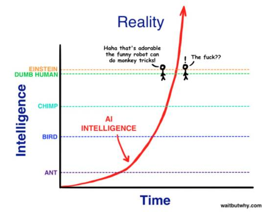

# 业界 | 深度学习十大飙升趋势

选自 Medium

**作者：Carlos E. Perez**

**机器之心编译**

**参与：杜夏德**

> *自 2012 年起，深度学习的各个方面的真实发展速度可能会超过你的想象。*

无论你怎么解释强调，有些人就是不理解它。但是有了图表你或许就能说服他们了。

从下面这张图表开始：

2010 年，图像识别还远远比不上人眼识别，但是到了 2015 年，图像识别超过了人类识别！是什么加速了图像识别的发展？

2012 年出现了一种叫「深度学习」东西。让我们来看一下谷歌搜索趋势图：

 

事实证明学术界确实在做一些重要的研究。

 

这是另一个学术会议上的研究趋势 ：

 

但这些是学界的所有数据吗？让我们来看一下谷歌上的峰值： 

 

人才的需求是什么样的情况？

 

前 1% 的投资者在投什么？

 

 这些公司正在收购什么？

 

大众投资的是什么？

深入学习是人工智能的主要驱动力？

 

*蓝色是「人工智能」，红色是「深度学习」*

下面是最重要的趋势： 

 

*原文链接：https://medium.com/intuitionmachine/8-exponential-hockey-stick-charts-for-deep-learning-74bba7a0284c#.q0810jhea*

******©本文为机器之心编译文章，***转载请联系本公众号获得授权******。***

✄------------------------------------------------

**加入机器之心（全职记者/实习生）：hr@almosthuman.cn**

**投稿或寻求报道：editor@almosthuman.cn**

**广告&商务合作：bd@almosthuman.cn**