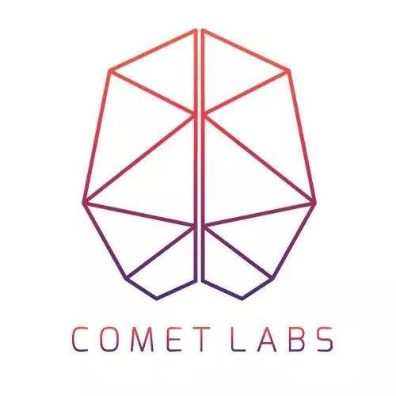

# 深度 | 深度学习简明入门，以及它在物联网和智慧城市中的角色

来自 dataplumbing

****作者：Ajit Jaokar（futuretext 创始人）****

****机器之心编译出品****

****参与：Chen Xiaoqing，曾㶲，汪汪****

> 本文作者 Ajit Jaokar 是 futuretext 的创始人。本文中，他简要讲述了深度学习的基本原理，以及在物联网和智慧城市中的未来应用。文中提到几篇优秀论文，可进入公众号界面后回复数字「**18**」和「**19**」下载。

*   回复数字「**18**」，下载论文：*Deep Learning for Time Series Modeling*

*   回复数字「**19**」，下载论文：*Multi-Scale Compositionality: Identifying the Compositional Structures of Social Dynamics Using Deep Learning*

这文主要讲述一个正在演化的论题。现在，我将主要解释深度学习的基础，以及深度学习算法如何应用于物联网及智慧城市等。尤其是，像我接下来论述的一样，我对于使用物联网数据来完善深度学习算法很感兴趣。我在物联网数据科学课程项目中阐述过这些想法，这个课程的目的是培养物联网数据科学家（与我在牛津大学和马德里理工大学的课程类似）。我还会在上海同济大学城市科学国际会议、旧金山物联网大会（IoTworld event）上针对这些理论进行论述。如果你希望获得最新信息，请在我的 linkedin 上联系我。（https://uk.linkedin.com/in/ajitjaokar）  

****深度学习****

深度学习经常会被认为是模仿大脑的一系列算法。但更加精确的定义应该是「利用神经层进行学习」的算法。深度学习涉及通过让计算机从简单概念之上建立起复杂概念的神经层进行学习。

深度学习逐渐从黑暗中摸索出了光明的道路，谷歌的研究员为他们的试验性深度学习系统输入了数千万张来自于 YouTube 的随机图像，继而指导系统去识别图像的基本元素，以及如何将这些元素相互整合。这个有着 16000 个 CPU 的系统能够识别出有着共同特点的图像（例如猫咪的图像）。谷歌权威性的实验展示了深度学习的无限潜力。深度学习算法可以应用在多种领域，包括计算机视觉、图像识别、模式识别、语音识别以及行为识别等。

****计算机如何学习？****

为了理解深度学习算法的惊人之处，首先必须了解计算机如何思考和学习。从很早以来，研究员就尝试过创造可以思考的计算机。直至最近，这种努力最近已经成为了「自上而下」方法的规则。这种方法包括了为所有可能的情况写出足够的规则。但是此方法很明显受限于规则的数量，以及其有限的规则依据。

为了克服这些限制，一个由下至上的方法被提出来。这种想法是从经验中学习。「标识数据」提供这些经验。标识数据输入到系统中，系统基于回应进行训练。这种方法对过滤垃圾邮件这样的应用十分有效。然而，大部分数据（图像、视频、语言等）并没有标识，即使有，也并不完善。

另一个问题是解决无限的问题域。例如，国际象棋的问题域非常复杂，但是有限，因为它有着有限的基元（32 个棋子）以及有限的可采取步骤（在 64 个格子上）。但是在真实生活中，无论何时，我们都有着无限多的变量。问题域因此而变得非常大。

像国际象棋这样的问题可以根据一系列形式化规则向电脑进行描述。而反过来，许多真实世界的问题能够被人们容易地理解（直觉）但是却不是那么容易地向计算机表达。像这样需要直觉的例子包括了在图片上识别文字与脸。这样的问题很难向计算机表达，因为问题域是无限的。因此，问题描述承受着维度的诅咒——当维度增加，空间的体积会增加得非常迅速，使可用的数据变得稀疏。计算机无法在稀疏数据中训练。这样的情景很难描述，因为没有足够的数据去合适地表达由维度代表的组合。即使如此，这样「无限的选择」问题在日常生活中也很常见。

****深度学习算法如何学习？****

深度学习涉及「困难/直觉性」的高维度无规则问题。在此，系统必须在不知道规则的前提下学习去处理未预料的情况。许多现存的系统例如 Siri 的语音识别与 Facebook 的脸部识别就在这些宗旨下运作。深度学习系统现在有着完善的可能，因为三个原因：高 CPU 配置，更好的算法，以及更多的数据。在接下去的许多年，这些因素会带来深度学习算法更多的应用。

深度学习算法基于大脑的运作进行模拟。大脑可能会被视为一种大规模并行模拟计算机，有着 10¹⁰ 个简单处理器（神经元）——每一个都只需要几毫秒去对输入进行回应。为了从理论上模拟大脑的运行，每个神经元都被设计为一个小型电子设备，有着与生物神经元相似的传输功能。我们继而可以连接这些神经元，模拟大脑的运作方式。从实践上来说，这证明了这个模型并不是那么容易去完善，并且很难训练。

因此我们制作了一些模型的简化版本。这类神经网络叫做「前馈反向传播网络」。简化和限制在于：我们改变了神经元之间的相连方式，这样它们可以位于不同层。每层中的每个神经元都与下一层的每个神经元相连。信号只能在一个方向上传播。最终，我们简化了神经元的设计，使其基于其他神经元传来的简单、权重驱动的输入做出反应。这样简化的网络（前馈神经网络模型）在更容易构建和使用。

这样：

1.  每个神经元都收到上一层神经元传来的信号

2.  每个信号都乘上了一个权重

3.  加权后的输入值加总起来，通过一个限制的功能，将输出值的范围缩小为一个固定范围。

4.  通过限制器后的输出值继而向下一层的所有神经元传播

人工神经网络最常见的学习算法叫做反向传播（Back Propagation，简称 BP），即「误差反向传播」。为了利用神经网络，我们给第一层施加输入值，让信号通过网络传播，读取输出。一个 BP 网络通过例子学习，也就是说，我们必须提供一套学习模式，由一些输入值和已知的正确输出值组成。这样，我们将这些输入-输出的例子展示给网络，告诉它哪些行为是我们期望得到的。BP 算法通过网络反向传播误差值，调整权重值，并以此让网络适应。这些神经元的每个链接都有着独一无二的权重值。网络的「智能」就隐藏于权重的值中。随着每个误差迭代返回，权重以此得到调整。每个案例中整个过程都在重复。因此，为了检测目标函数，程序员将会通过迅速发送许多包含目标的数字化数据版本（例如图片）来训练网络。如果网络没有准确识别一个具体的模式，权重就会被调整。训练的最终目的是去让网络能始终如一地识别我们能够识别的模式（例如猫咪）。

****深度学习如何帮助解决直觉问题？****

深度学习的总体目标还是要去解决一个「直觉」问题，也就是以高维度和无规则为特征的问题。前文介绍的机制展示了一个基于有限神经元模型的监督式学习算法——但是我们需要理解更多。

深度学习让计算机解决直觉问题，这是因为：

1.  有了深度学习，计算机可以不仅从经验中学习，还可以根据概念的层级结构来理解世界——这个层级结构中，每个概念都由更简单的概念来定义。

2.  概念的层级结构是通过解决「表示问题」而「自下而上」地构建，并没有提前定义好的规则。

这与孩子们学习「狗狗是什么」的方式相似，通过理解概念中的一个组成部分，如行为（例如狗吠），脑袋的形状，尾巴，皮毛等等，继而将这些概念组成为一个更大的概念，也就是狗本身。

（知识）表征问题在计算机科学中是一个重复出现的主题。

知识表征与心理学中的理论相结合，后者主要研究理解人们如何解决问题，以及表征知识。这个想法是：如果像人类一样，计算机可以从经验中整合知识，它就不再需要人类操作者正式指定解决问题所需的所有知识。

对于计算机来说，表征的选择对机器学习算法的成果有着巨大的影响。例如，基于音调的高低可以知道讲话者是一个男人、女人还是孩子。然而，对于很多应用来说，知道哪些特征表示着准确的信息并不容易。例如，在检测汽车图像中，轮子应该是圆形的——但是实际上轮子的照片有着很多不同的部分（例如金属部分）。因此，表征学习的概念就是要同时找到映射与表征。

如果我们能够自动（即没有人类的干预）找到知识的表征和它们的映射，我们就有了一个灵活的设计去解决直觉问题。我们可以适应新的任务，甚至可以不需观察就可以产生新见解。举个例子，基于音调的高低我们可以知道其主人的口音，从而了解种族。这种机制是自我学习。深度学习最适用于数据庞大、参数之间关系复杂的环境。训练一个神经网络涉及重复地向它展示：「给定一个输入，就会有一个正确的输出」。如果这个过程被进行了足够多次，这个网络就拥有了有效的训练，它就能模仿出你所模拟的方程。它会忽视与解无关的输入。但反过来，如果你没有给出关键性的输入，它就无法给出一个正确的解。这种模型可以应用于很多情况，如以下所给出的简单案例。

****多层学习的案例****

深度学习涉及到通过神经层学习，让计算机能够基于简单概念构建起复杂概念的层级结构。这种方法对很难表达的主观与直觉问题很有用。

来看看图像数据吧。计算机无法理解像素集合的意义。从一组像素中映射出复杂的目标函数，是非常困难的事。

有了深度学习，这个问题被分解为一系列层级化的映射——每个映射都由一个具体的神经层描述。

将输入（表征我们实际观察的变量）展现给可见层。接着，一系列隐藏层从涉及到某个具体映射的输入中提取出越来越抽象的特征。然而请注意，这个过程并不是提前定义好的，也就是说，我们并不会指定每层选择的内容。

举个例子：从像素中，第一个隐藏层识别出边缘

从边缘，第二个隐藏层识别角和轮廓。

从角和轮廓，第三个隐藏层识别目标的部分

最终，从目标的部分中，第四个隐藏层识别出整个物体

*图片及案例来源：Yoshua Bengio 的书：Deep Learning*

****对物联网的启示****

让我们扼要重述：

1.  第一，深度学习算法可应用于多个领域，包括计算机视觉、图像识别、模式识别、语音识别、行为识别等。

2.  第二，深度学习系统现在有着完善的可能性，因为三个原因：高配置 CPU、更好的算法及更多可用的数据。在接下来的几年里，这些因素会为深度学习系统带来更广泛的应用。

3.  第三，深度学习是最适合于数据庞大、参数之间关系复杂的情况。

4.  第四，解决直觉性问题：训练一个神经网络需要重复地向它展示：「给定一个输入，就会有一个正确的输出」。如果这个过程被进行了足够多次，这个网络就拥有了有效的训练，它就能模仿出你所模拟的方程。它会忽视与解无关的输入。但反过来，如果你没有给出关键性的输入，它就无法给出一个正确的解。这种模型可以应用于很多情况。

另外，我们在这种技术上依然还有局限性。例如，我们还要走很漫长的路，深度学习系统才能发现你因为你的猫咪死掉了而很伤心（尽管 IBM 的沃森所衍生的认知玩具似乎正向着这个方向前进）。目前的关注点更多在于识别图片，猜测图片中人物的年龄（基于微软的 Oxford 项目的 API）。

正如吴恩达所提醒我们的那样，用建造火箭飞船的方法去思考人工智能。我们在这一点也的确还有进步的空间。

> 「我认为 AI 类似于建造一艘火箭飞船。你需要一个巨大的引擎和很多燃料。如果 你有一个大引擎但是燃料却很少，你就无法让它飞上轨道。如果你有一个小引擎，但是却有上吨的燃料，你甚至没法让它飞起来。这和深度学习（创造人工智能的关键过程之一）的相似点在于，火箭引擎是深度学习的模型，燃料则是我们供给算法的海量数据。 」

今天，由于技术的限制，我们仍然受限于规模化。谷歌推出的识别猫的神经网络有着 16,000 个节点。但是，一个人类大脑足足有着 1000 亿个神经元！

下列是反向传播神经网络适用于的情景：

*   有着大量的输入/输出数据，但是你并不确定如何与输出相关联。因此，我们有大量「给定一个输入，就有一个正确的输出」这样的情景可利用于训练神经网络，因为很容易创造出许多正确行为的样本。

*   问题看起来有着极端的复杂度。复杂度产生于低规则、高维度以及很难表征的数据。然而，这里肯定有一个解决方法。

*   问题的解决方法可能会随时间改变，在给出的输入与输出参数范围中（也就是说，今天的 2+2=4，但是未来我们也许会发现 2+2=3.8）。输出可能很「模糊」，或者是非数值的。

*   某个领域的专业技能并不是必须的，因为输出可以纯粹来源于输入：这里存在一些争议，因为建立一个输出只依赖于输入的模型并不总是可能。不过，想想预测股市的例子吧。在理论上，有了足够多的股票价格的输入和输出例子，如果利用深度学习技术进行合适的训练，你可以创造出一个能够预测未知情景的模型。

*   推论：我们需要在缺乏观察的情况下，也能够推出新见解。例如，基于音调的高低——我们可以推测出讲话者口音与种族。

说到物联网领域，我们要考虑的首要问题是：

*   哪些已有的应用可以通过增加直觉型成分（过去曾用在智慧城市），用深度学习技术来进行补充？

*   测量和预测时采用什么度量指标？我们如何给这个指标增加一个直觉型的成分？

*   哪些存在于计算机视觉、图像识别、模式识别、语音识别、行为识别等等的应用还可以应用于物联网？

现在为了更加深入该领域，下面有一些我很感兴趣且正在关注的领域。

****利用物联网数据库补充深度学习算法****

从根本上来说，这些技术/策略用物联网数据库来补充深度学习算法。

1.  **深度学习算法和时间序列数据**：来自传感器的时间序列数据可以被认为是一种以规则的时间间隔取样的一维网络，而图像数据可以被认为是一种像素组成的二维网络。这让我们可以用深度学习算法为时间序列数据进行建模（大部分传感器/IoT 数据都是时间序列）。探索深度学习和时间序列的做法不太常见，但是这种方法已经有了许多相关的案例（例如这篇论文，回复数字「**18**」可下载：*Deep Learning for Time Series Modelling to predict energy loads using only time and temp data*）。

2.  **多模态**：深度学习的多模态（multimodality）。深度学习算法中，多模态被研究得很多，尤其是交叉模态特征学习。在交叉模态特征学习中，如果在特征学习的过程中展示了多模态（如音频+视频），那么，对单一模态（例如视频）就能学到更好的特征。

3.  **深度学习的时间模式**：卡耐基梅隆大学电子和计算机工程系的博士学生 Huan-Kai Peng 与教授 Radu Marculescu 在他们最近的论文中，提出了识别多时间尺度中互动模式内在动态的新方法。他们的方法需要构建一个深度学习模型，由多层组成；每一层捕捉一个具体时间尺度的相关模式。

这种新的模型还可以应用于解释短期模式与长期模式相关联的可能方式。举个例子。利用这种方法，就有可能解释 Twitter 上 的某个长期模式是如何保持，并由一系列短期模式来加强的——这些短期模式包括人气、忠实度、传染度和互动性等。（回复数字「**19**」可下载论文：*Multi-Scale Compositionality: Identifying the Compositional Structures of Social Dynamics Using Deep Learning*）

****智慧城市的畅想****

我把智慧城市看为一种物联网的应用领域。智慧城市/未来都市的定义有许多。从我们的角度看，智慧城市是指用数字技术来加提高人们的生活与福利，减少成本与能源消耗，并更有效更活跃地参与到居民活动中。关键的「智慧」部分包括运输、能源、医疗、水与垃圾处理等领域。

更加全面的智慧城市/物联网应用领域包括：智能运输系统（自动化交通工具），医疗、环境、废物管理、空气质量、水质量、事故与紧急服务、能源（可再生能源等）。在这些领域内，我们可以找到一些应用，添加上面所讲述的直觉型组分。

还有一些典型的领域包括计算机视觉、图像识别、模式识别、行为识别。目前人们比较感兴趣的新兴领域则有自动驾驶车——例如 Lutz pod，甚至更大的汽车，例如自动驾驶卡车。

****结论****

深度学习设计到通过多层学习，让计算机基于简单概念构建复杂概念的层级结构。深度学习被用于解决高维度直觉性应用。它是一个新兴领域，在未来几年，由于科技的进步，我们可能会看到更多深度学习的应用。

我自己则非常感兴趣于物联网数据库如何补充深度学习算法。从上面的几个案例来看，它尚为雏形。我相信它会有着广泛的应用，并且有许多我们的探索还没有完成（例如智慧城市）。

> 本文提到的论文下载方法

> *   回复数字「**18**」，下载论文：*Deep Learning for Time Series Modelling to predict energy loads using only time and temp data*
>     
>     
> *   回复数字「**19**」，下载论文：*Multi-Scale Compositionality: Identifying the Compositional Structures of Social Dynamics Using Deep Learning*

***©本文由机器之心原创编译，***转载请联系本公众号获得授权***。***

✄------------------------------------------------

**加入机器之心（全职记者/实习生）：hr@almosthuman.cn**

**投稿或寻求报道：editor@almosthuman.cn**

**广告&商务合作：bd@almosthuman.cn**

机器之心是**Comet Labs**旗下的前沿科技媒体。Comet Labs 是由联想之星发起、独立运作的全球人工智能和智能机器加速投资平台，携手全球领先的产业公司和投资机构，帮助创业者解决产业对接、用户拓展、全球市场、技术整合、资金等关键问题。旗下业务还包括：Comet 旧金山加速器、Comet 北京加速器、Comet 垂直行业加速器。

↓↓↓点击「**阅读原文**」查看机器之心网站，获取更多精彩内容。