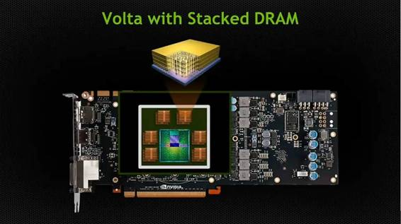
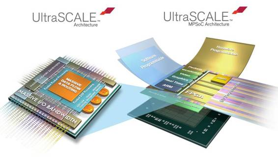
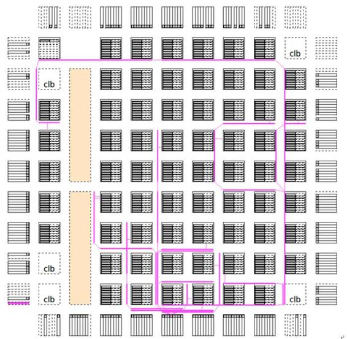
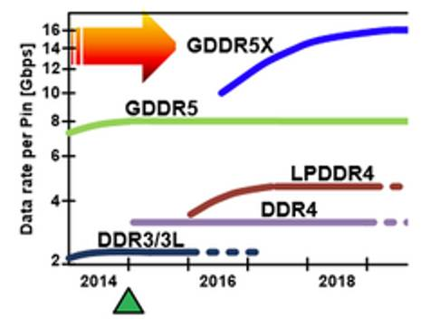
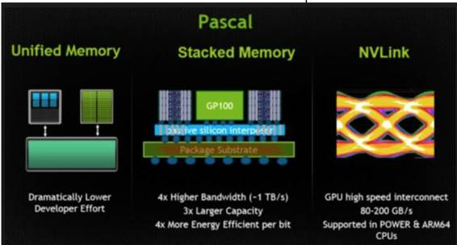
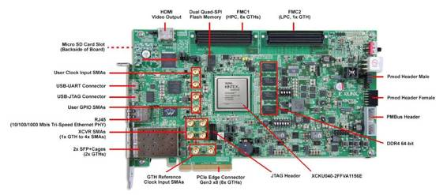
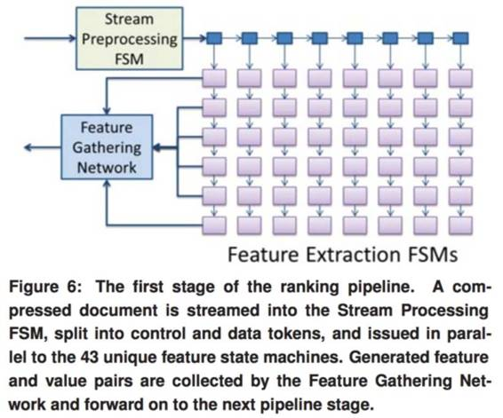
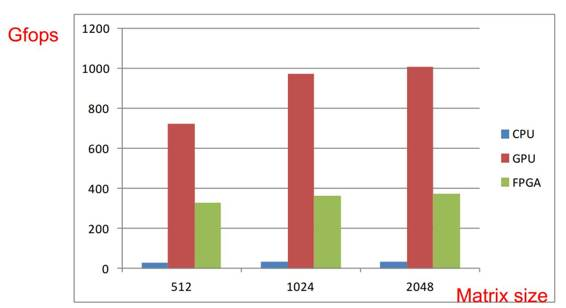
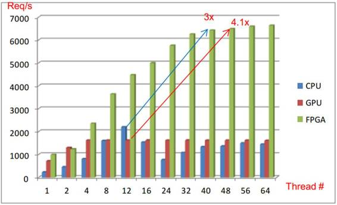

# 专栏 | 服务器端人工智能，FPGA 和 GPU 到底谁更强？

机器之心原创

**作者：李一雷**

**UCLA 博士**

> *眼下人工智能硬件之争是百花齐放，各有所长。机器之心曾发过一篇李一雷博士写的[《FPGA vs. ASIC，谁将引领移动端人工智能潮流？》](http://mp.weixin.qq.com/s?__biz=MzA3MzI4MjgzMw==&mid=2650719294&idx=3&sn=d23a6d7c03732f7218f70447336801bd&chksm=871b0040b06c89564722f7292215997f474374d43d26761700f00b240e83a9c5dc2dd7595a26&scene=21#wechat_redirect)，比较了 FPGA 与 ASIC 的优劣势。今天他又将 FPGA 与眼下最火的 GPU 一较高下，比较了二者在峰值性能、灵活性、平均性能功耗和能效比上的差异。那么在与 GPU 的 PK 中，FPGA 的表现又会如何呢？*

随着 AlexNet 的划时代论文横空出世，GPU 就开始在服务器端的机器学习加速领域称霸。然而，随着研究的深入，人们发现了比 GPU 架构更灵活的 FPGA 在机器学习加速领域也有自己的优势，并有多家公司和学校发表了相关研究结果。那么，现在服务器端人工智能应用 GPU 和 FPGA 到底哪个强？本文将作深入分析。

**为什么 GPU 和 FPGA 能加速机器学习算法？**

 

 

*GPU（上图）与 FPGA（下图）*

在很久很久（其实也没多久，大概五年前），人们在跑机器学习算法时用的主要还是 CPU，因为 CPU 通用性好，硬件框架已经很成熟，对于程序员来说非常友好。然而，当机器学习算法的运算量越来越大时，人们发现 CPU 执行机器学习的效率并不高。CPU 为了满足通用性，芯片面积有很大一部分都用于复杂的控制流，留给运算单元的面积并不多。而且，机器学习算法中运算量最大的矩阵运算是一种矢量（Vector）运算，而 CPU 对于矢量运算只能说是部分支持。这时候，GPU 进入了机器学习研究者的视野。GPU 原本的目的是图像渲染，因此使用完美支持矢量运算的 SIMD（单指令流多数据流，single instruction multiple data）架构，而这个架构正好能用在机器学习算法上。GPU 本来就是为了加速 3D 游戏性能的加速器，这里又被用到了加速机器学习应用上，其实是很有趣的一件事。

GPU 运行机器学习算法比 CPU 快很多，但是毕竟不是为机器学习而设计的。有人就要问，如果做一块完全为机器学习设计的运算单元，会不会比 GPU 更有效率？不过，要真的做一块机器学习专用芯片（ASIC）需要极大的决心，首先为了性能必须使用最好的半导体制造工艺，而现在用最新的工艺制造芯片一次性成本就要几百万美元，非常贵。就算你有钱，你还需要拉一支队伍从头开始设计，设计时间往往要到一年以上，time to market 时间太长，风险很大，所以除了 Google 之外很少有人敢做 ASIC。这时候，FPGA 就吸引了大家的注意力。

FPGA 全称「可编辑门阵列」(Field Programmable Gate Array)，其基本原理是在 FPGA 芯片内集成大量的数字电路基本门电路以及存储器，而用户可以通过烧入 FPGA 配置文件来来定义这些门电路以及存储器之间的连线。这种烧入不是一次性的，即用户今天可以把 FPGA 配置成一个微控制器 MCU，明天可以编辑配置文件把同一个 FPGA 配置成一个音频编解码器。所以说在 FPGA 可以快速实现为机器学习算法开发的处理器架构，而且成本很低（一块 FPGA 开发板大约售价 1000 美金，比真的制造芯片便宜太多）。

ASIC 是一锤子买卖，设计出来要是发现哪里不对基本就没机会改了，但是 FPGA 可以通过重新配置来不停地试错知道获得最佳方案，所以用 FPGA 开发的风险也远远小于 ASIC。

**GPU 与 FPGA 的性能分析对比**

那么在服务器端 GPU 和 FPGA 谁更强呢？在服务器端，有几个指标可供对比：

*   峰值性能

*   灵活性

*   平均性能

*   功耗和能效比

其实这几个指标是会互相影响的，不过还是分开说。

从峰值性能来说，GPU（10Tflops) 远远高于 FPGA(<1TFlops)。GPU 上面成千上万个 core 同时跑在 GHz 的频率上还是非常壮观的，最新的 GPU 峰值性能可达 10TFlops 以上。GPU 的架构经过仔细设计（例如使用深度流水线，retiming 等技巧），在电路实现上是基于标准单元库而在关键路径（即芯片中一个时钟周期内延迟最长的路径，直接决定了电路最高运行速度）上可以用手工定制电路，甚至在必要的情形下可以让半导体 fab 依据设计需求微调工艺制程，因此可以让许多 core 同时跑在非常高的频率。

相对而言，FPGA 首先设计资源受到很大的限制，例如 GPU 如果想多加几个 core 只要增加芯片面积就行，但 FPGA 一旦你型号选定了逻辑资源上限就确定了（浮点运算在 FPGA 里会占用很多资源），好汉也会被尿憋死。而且，FPGA 里面的逻辑单元是基于 SRAM-查找表，其性能会比 GPU 里面的标准逻辑单元差好多。最后，FPGA 的布线资源也受限制（有些线必须要绕很远），不像 GPU 这样走 ASIC flow 可以随意布线，这也会限制性能。

 

*FPGA 布线资源有限，有些线必须走非常长，从而限制了时钟频率*

除了芯片性能外，GPU 相对于 FPGA 还有一个优势就是内存接口。GPU 的内存接口（传统的 GDDR5，最近更是用上了 HBM 和 HBM2）的带宽远好于 FPGA 的传统 DDR 接口（大约带宽高 4-5 倍），而众所周知服务器端机器学习算法需要频繁访问内存，因此内存接口的带宽可以决定机器学习应用的性能。

 

  

*传统显卡用的 GDDR 标准带宽比 FPGA 使用的 DDR4 大 4-5 倍（上图），而高端显卡更是用上了带宽更大的 HBM 接口的（中图），而即使高端 FPGA（如 Xilinx Ultrascale）的内存接口仍然是普通的 DDR4（下图）*

但是从灵活性来说，FPGA 远好于 GPU。FPGA 可以根据特定的应用去编程硬件（例如如果应用里面的加法运算非常多就可以把大量的逻辑资源去实现加法器），但是 GPU 一旦设计完那就没法改动了，没法根据应用去调整硬件资源。目前机器学习大多数适合使用 SIMD 架构（即只需一条指令可以平行处理大量数据），因此用 GPU 很适合。但是有些应用是 MISD（即单一数据需要用许多条指令平行处理，微软在 2014 年 ISCA paper 里面就举了一个 MISD 用于并行提取 feature 的例子），这种情况下用 FPGA 做一个 MISD 的架构就会比 GPU 有优势。不过 FPGA 的编程对于程序员来说并不容易，所以为了能让机器学习程序员能方便地使用 FPGA 往往还需要在 FPGA 公司提供的编译器基础上进行二次开发，这些都是只有大公司才能做。

 

*微软在 2014 年 ISCA paper 里面就 MISD 用于并行提取 feature 的例子*

从上面两条我们可以看出，FPGA 实现的机器学习加速器在架构上可以根据特定应用优化所以比 GPU 有优势，但是 GPU 的运行速度（>1GHz) 相比 FPGA 有优势 (~200MHz)。所以，对于平均性能，看的就是 FPGA 加速器架构上的优势是否能弥补运行速度上的劣势。如果 FPGA 上的架构优化可以带来相比 GPU 架构两到三个数量级的优势，那么 FPGA 在平均性能上会好于 GPU。例如，百度在 HotChips 上发布的 paper 显示，GPU 的平均性能相比 FPGA 在矩阵运算等标准 batch data SIMD bench 上远好于 FPGA；但是在处理服务器端的少量多次处理请求（即频繁请求但每次请求的数据量和计算量都不大）的场合下，平均性能会比 GPU 更好。

 

 

*Baidu 的研究显示，对于矩阵运算 bench GPU 远好于 FPGA，但是当处理小计算量大批次的实际计算时 FPGA 性能优于 GPU*

功耗方面，虽然 GPU 的功耗（200W）远大于 FPGA 的功耗（10W），但是如果要比较功耗应该比较在执行效率相同时需要的功耗。如果 FPGA 的架构优化能做到很好以致于一块 FPGA 的平均性能能接近一块 GPU，那么 FPGA 方案的总功耗远小于 GPU，散热问题可以大大减轻。反之，如果需要二十块 FPGA 才能实现一块 GPU 的平均性能，那么 FPGA 在功耗方面并没有优势。能效比的比较也是类似，能效指的是完成程序执行消耗的能量，而能量消耗等于功耗乘以程序执行的时间。虽然 GPU 的功耗远大于 FPGA 的功耗，但是如果 FPGA 执行相同程序需要的时间比 GPU 长几十倍，那 FPGA 在能效比上就没有优势了；反之如果 FPGA 上实现的硬件架构优化得很适合特定的机器学习应用，执行算法所需的时间仅仅是 GPU 的几倍或甚至于接近 GPU，那么 FPGA 的能效比就会比 GPU 强。

**结语**

FPGA 可以开发出为机器学习算法专用的架构，但是 FPGA 本身的峰值性能较 GPU 要差很多。FPGA 和 GPU 哪个跑机器学习算法更强（平均性能更好），完全取决于 FPGA 架构优化能否弥补峰值性能的劣势。

******©本文由机器之心原创，***转载请联系本公众号获得授权******。***

✄------------------------------------------------

**加入机器之心（全职记者/实习生）：hr@almosthuman.cn**

**投稿或寻求报道：editor@almosthuman.cn**

**广告&商务合作：bd@almosthuman.cn**