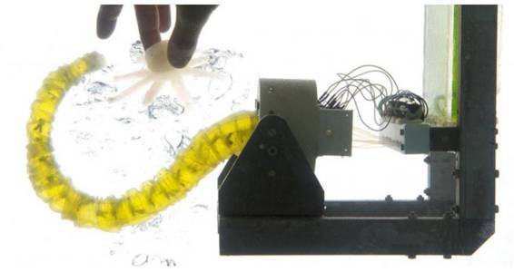
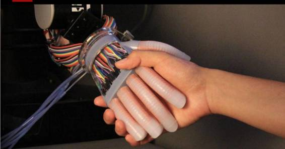
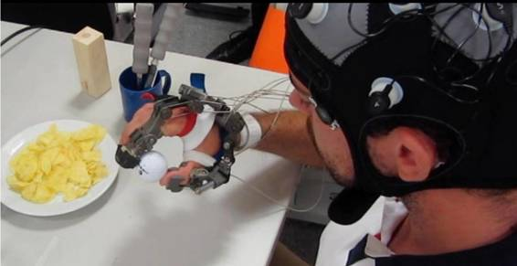
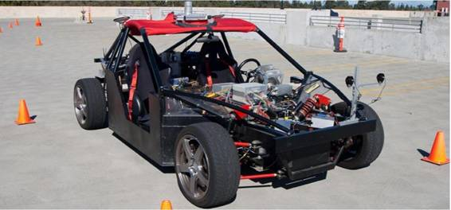

# 重磅 | Science「机器人子刊」创刊号，五大研究解读机器人领域最新进展（附视频及论文）

选自 Science Robotics

**机器之心编译**

**参与：微胖、杜夏德、李泽南**

> *早在今年夏天，机器之心的小伙伴们就得知 Science 要为机器人开个子刊 Science Robotics，为此我们眼巴巴地等了半年，今天终于亮相了。其社论提到，Science Robotics 的目标是推动机器人领域的发展以及不同研究应用领域的交叉发展，将机器人研究深深地根植于基础科学中。点击阅读原文可下载全部论文。*

仅仅 50 年，机器人就已经从一个科幻主题变成了现代社会不可或缺的一部分。现在它们在工厂里随处可见，建造复杂的深海设备，探索人类无法到达的冰川世界，协助外科医生做手术...... 随着这些应用的发展，机器人研究社区也渴望着机器人研究能全球化，满足沟通所有领域的机器人研究的需求，在这样一个背景下，我们很自豪地宣布 Science Robotics 向所有研究者开放。欢迎你们向我们投稿。

————Science Robotics Editor 杨广中, 美国国家科学院主席 Marcia McNutt

从分子机器到大型系统，从外太空到深海探索，机器人变得无所不在，它们对人类生活和社会的影响越来越大。Science Robotics 覆盖了机器人设计、理论和应用领域的最重要的研究进展。Science Robotics 会促进新想法、一般原则和原创研发的沟通交流，其内容横跨多个领域（比如，医疗、工业、陆地、空中、太空、和服务）不同大小级别（纳米和大型）的机器人的重要新应用，包括机器人系统中驱动、传感器、学习、控制、导航的基本原理。除了原创研究文章，本刊还将刊发评论，以及对影响机器人领域的现行政策、伦理和社会议题的意见和建议等等。

Science Robotics 的创刊号研究文章不多，但每篇都非常有趣，展示了机器人研究世界的各个方面。机器之心将您介绍创刊号中的 5 篇最新研究进展。

第一期地址：http://robotics.sciencemag.org/

**一、单腿机器人轻松玩跑酷**

Salto 这个单腿机器人可以轻松弹离墙面玩跑酷（一种极限运动）。在灾难场景中，比如救援或检查损失等，如此矫健的身手非常重要，因为它们都需要机器人在不平坦的地势环境中工作。

Salto 不是跳得最高的机器人。不过，较早的机器人需要过一段时间才能重新起跳。而 120 毫秒之后 Salto 就可以再次起跳，如此迅速足以连续弹跳多次，特别是通过墙面反弹跳得更高——这也是跑酷运动的一个小技巧。

加州伯克利的机械工程师 Duncan Haldane 说：「Salto 与墙面接触时，电机会给系统泵进更多能量。不仅仅是驱动机器人蹦离墙面。」

为了打造 Salto，Haldane 和他的合作者们从自然界最佳跳高运动员——一种小型的非洲灵长类动物夜猴（galago）那里获取灵感。起跳之前，夜猴会蹲伏，将力量上传到伸展的肌腱中。这样，较之单使用肌肉力量，这种机制能让加速度提升 15 倍多。多亏位于机器人电机和腿部之间的天然乳胶，Salto 才能成功模仿这种生物机制的壮举。

这款机器人的名字来自拉丁文 saltare，意思是「弹跳（jump）」，单腿伸直站立后约为 30 厘米高，单次起跳的最高高度达 1 米。由于还不能在三维环境中实现自我稳定，到目前为止，这款机器人仅能连续起跳两次。不过，Haldane 说未来的版本会解决这个问题。至于实际应用就更远一些了，研究人员表示，一台有用的机器可能需要两条腿走路和跳跃。Haldane 团队的这份成果发表在了 12 月 6 日的 Science Robotics 上。

*   **论文题目：通过系列弹性功率调制实现机器人垂直跳跃灵活性（Robotic vertical jumping agility via series-elastic power modulation）**

摘要：从静止开始，几种树栖哺乳动物有能力迅速、重复垂直跳跃 2 米距离。我们用垂直跳跃敏捷性（vertical jumping agility）这个衡量标准来描绘这一行为特征。通过基础动力学关系，我们表明，这一灵活性衡量标准从根本上受限于制动器功率。尽管迅速高度跳跃是一重要表现特征，但是，站时控制力也是成熟行为的一个至关重要的特征。众所周知，夜猴这种具有最高垂直跳跃敏捷性的动物使用了一种功率——调制策略（a power-modulating strategy）来实现更高峰值功率（较之单独使用肌肉）。以前的机器人鲜有使用系列弹性致动调制（实现方式是将系列弹性致动与可变机制的优点结合起来），而且由于马达动力的限制，目前最好的机器人的垂直跳跃高度敏捷性也仅为夜猴的 55%。我们使用一种专门腿部机制（被设计用来提升能力调制）制造了一款弹跳机器人，它的垂直弹跳敏捷性是夜猴的 78%。我们证实，机器人从地面调至墙上然后从墙上跳开的净高度，要比单独一次跳跃的高度更高。结果表明，系列弹性功率调制这种致动机制能够让垂直敏捷性机器人成为一个分支。

**二、本期其他四篇研究摘要**

**1.论文题目：软体机器人：推进机器人能力边界的技术和系统（Soft robotics: Technologies and systems pushing the boundaries of robot abilities）**

摘要：世界范围内的软体机器人研究已经在原则、模型、技术、技巧以及原型方面取得了实质进展。本文根据上述方面为机器人提供的能力为线索，对这些进展进行回顾，在过去，这一处理方式是不可能的。该领域的演化分析表明，2009-2012，在少数几个先锋研究以后，与软体机器人有关的重大科学技术挑战（从致动、传感到建模和控制）为我们带来了一些突破性成果。就机器人能力而言，亦即，从如今机器人可以做什么的角度来说（这多亏了软体机器人的研究进路），软体机器人研究的进一步研究已经取得了非常重要的成功。仅仅基于刚性连接（rigid link），诸如挤压、伸展、攀爬、增长以及变形等能力就不可能实现。该领域面临的挑战是进一步研发机器人的生长、演化、自我治愈、发展以及生物降解等的能力，它们是机器人根据环境变化调试自身形态的方式。

**2.论文题目：通过可伸展光波导实现光电支配软体假手（Optoelectronically innervated soft prosthetic hand via stretchable optical waveguides）**

摘要：由于其连续和自然运动，流体动力软驱动器已经在一系列机器人应用中显示出强大应用潜力，包括假肢与矫形器。尽管有这些优势，使用这些致动器的机器人还需要植入可伸缩传感器用于复杂的功能。目前，可伸缩传感器通常依赖于带有电气性能的材料和用于测量信号的复合材料。很多这样的传感器都有滞后、制造复杂 、化学安全、环境不稳定、材料与软致动器不相容的缺点。如果带有光学性能的材料被用于信号转导，那么上面的很多问题都能解决。我们报告了将可伸缩的光波导用于人工手的应变传感 . 这些光电应变传感器很容易制造，具有化学惰性，而且滞后低，输出信号的精度也高。光子应变传感器用作曲率、伸长和力传感器，并整合进一个纤维增强的软人工手中。这种光电方式支配的假手可以用来进行各种由一个真手的能力启发的活性感觉实验。我们的最后示范了用假体感觉三个西红柿的形状和柔软性，并选择其中成熟的那个。

**3.论文题目：混合 EEG/EOG 脑/神经手外骨骼系统完全恢复四肢瘫痪病人自主生活能力（Hybrid EEG/EOG-based brain/neural hand exoskeleton restores fully independent daily living activities after quadriplegia）**

 

摘要：直接脑控机械系统在医疗行业具有很大前景，它可以恢复四肢瘫痪病人日常生活的能力，例如拿起杯子喝水，用餐具进餐，操纵不同的物体。然而，此类高度集成的脑或神经控制机器人系统尚未进入广泛的临床使用和日常生活环境。在本研究中，我们的机械系统在六位高位截瘫患者（其中五位是男性，30±14 岁）的日常生活场景中帮助他们完全恢复了其独立日常生活活动的能力，包括进食和喝水的能力。非侵入性混合脑/神经手外骨骼（B / NHE）可以帮助病人打开和关闭他们瘫痪的手。本实验表明大脑/神经辅助技术可以帮助四肢瘫痪病人恢复日常生活中的自主性和独立性。

**4.论文题目：Motor learning affects car-to-driver handover in automated vehicles**

 

摘要：在可预见的未来中，汽车要具备在自动驾驶（无人参与）和驾驶员控制两种模式之间切换的功能。在这切换的过程中，还没有进入开车的状态的人却必须恢复对汽车电机的控制从而驾驶汽车。这里的车内研究证明，当人类驾驶员面对与上一次的转向动作不同的动作时，具体来说就是手轮角与车轮角的比值不同时（仿真出车辆速度的变化），他们就会需要一个明显的适应过程，才能回到驾车的状态。然而，驾驶员在转向扭矩变化后回到以前的驾驶状态的过程中就不需要一个适应过程。这些研究结果对从自动化到手动驾驶的车辆设计，以及了解现实世界中的人类控制驾驶的任务都有一定的影响。

最后《Science Robotics》希望能够保持《Science》家族的高质量传统，并涵盖机器人领域的传统学科与新兴趋势，如先进材料与仿生设计。这份刊物将会涵盖所有尺度，从大型系统到微管结构——还有纳米机器人。2016 年诺贝尔化学奖决定授予三位创造了第一个分子机器的科学家。尽管在如此狭小的空间内设计复杂的结构的努力已取得一定进展，距离真正实用的纳米机器人仍任重而道远。在生物体内，纳米机械是普遍存在的，它们可以实现在宏观尺度上能被观察到的很多功能，但人造机械目前还难以实现此类功能。微管机械在生物的竞争对手面前还显得十分弱小，如果这一现状在未来出现变化，医药等领域的面貌就会发生改变。

期待越来越多有关纳米机器人的论文被刊登在未来的《Science Robotics》上，这一领域迫切地需要基础学科与机器人制造开发者相互协同，解决控制、通信和微观尺度下能量转换等问题。

******©本文为机器之心编译文章，***转载请联系本公众号获得授权******。***

✄------------------------------------------------

**加入机器之心（全职记者/实习生）：hr@almosthuman.cn**

**投稿或寻求报道：editor@almosthuman.cn**

**广告&商务合作：bd@almosthuman.cn**