# 教程 | 西红柿还是猕猴桃？一个案例帮你入门机器学习

选自 dzone.com

**作者：Tamis van der Laan**

**机器之心编译**

**参与：吴攀、孙宇辰、李亚洲**

> *过去几十年来，计算机系统已经取得了很多成就。它们已能成功地组织和编目我们整个文明所产生的信息。他们已经将我们从严格的认知任务中解放了出来，并显著增加了我们的生产力。如果要说工业革命实现了劳动力的自动化，那么我们就可以说数字革命正在实现认知劳动的自动化。但这种陈述并不完全正确，否则我们岂不是全部都要失业？所以有哪些工作人类能做而机器却无能为力呢？*

经典的计算机系统可以被视为是一种巨大的信息交换网络，它可以将信息引导到所需要的地方。SAGE 就是这样的一种系统，它是世界上最早的、也是有史以来最大的计算机。SAGE 计算机系统开发于冷战期间，其任务只有一个：将来自美国各地的雷达系统的信息整合起来为国防的目的服务。它所要解决的问题是追踪和识别飞过美国上空的飞行器。因为当时核武器只能通过飞机进行部署，所以为了防备苏联核炸弹，有必要对整个美国领空进行监控。

SAGE 系统可以整合来自所有雷达设施的信息，并将这些信息传送给可以分辨飞机是敌是友的操作员。然后这些信息会被传送给其他操作员并最终到达指挥中心，然后指挥中心做出决定：使用战斗机或地对空导弹系统拦截敌机。我们可以说 SAGE 是有史以来第一个大数据处理系统。这个视频展示了 SAGE 系统的运作：**https://www.youtube.com/watch?v=06drBN8nlWg**

尽管 SAGE 系统很了不起，但我们不能说它是非常智能的。这个系统所做的不过是按一种固定顺序的方式将信息传送给操作员而已。因为可以将信息自动传送给相应的工作站，所以工作任务可被划分给不同的操作员，每个操作员只需要专门应付自己的特定任务。由此可以更快地做出决策，从而可以及时地将敌机拦截下来。但 SAGE 系统并不智能，因为它严重依赖于操作员的认知能力来进行复杂决策。然而，它却提供了一种能够极大提升操作速度的信息流动基础架构。

由于计算能力的增长，现在的计算机已能自行进行复杂的决策。但它们仍有一项限制：需要人工的编程它们应该在那哪种情况下做出哪种决策。我们可以天真地认为只要有足够多的程序员和时间，我们就可以让计算机接管我们所有的认知任务。然而，事实并非如此，有的应用根本无法通过经典的编程方式实现。脸部识别问题就是一个很好的例子。事实证明，人工编写一个能够识别脸部的算法是非常困难的。

其中的一个问题是：如果你让一个人描述他们是如何识别人脸的，他们会告诉你他们不知道，自然而然就完成了。

第二个问题是我们很难描述是什么构成了一张脸。也许有人会说一张脸有一个椭圆的外形，但要准确描述这种形状以及不同的人脸之间的差异是极其困难的，更不要说因为观察角度不同而引起的形状变化。

第三个问题是事物往往会随时间改变。比如说，蓄须在近些年来变得越来越流行了，这可能会让系统难以应对。

**机器学习**

机器学习已经在计算机科学领域存在了很长时间，其关注的重点是创造能够从数据中进行学习的算法，从而让我们可以解决不能直接通过人工编程解决的问题，比如面部识别。其中的基本思想是：我们不直接编写识别人脸的算法，而是编写能够间接地根据样本学习识别人脸的算法。这样的算法可以根据这些样本学习出一个能够量化是否构成一张脸的特征的算法。因为这样的系统基于样本进行学习，所以我们可以以一种连续的方式送入样本，从而使该算法可以连续地更新其内部模型。这将确保我们总是能够识别出面部，即使面部毛发的流行趋势发生了改变。机器学习的定义是非常宽泛的，即：能够从数据中学习并因此常被应用在语境中的算法。其中一些应用领域包括计算机视觉、语音识别和自然语言处理。机器学习常常和大数据系统联合在一起使用。比如说用于分析大量文本文档以提取主题。伦敦市运行着一个能够使用全市的摄像头追踪人群运动的系统。美国开发了一种使用固定于无人机上的单个摄像机临时地观察整座城市的系统。

**机器学习的一个案例**

为了理解机器学习的工作方式，我们将使用一个相当简单的案例进行说明。假设我们将要打造一台需要区分西红柿和猕猴桃的工业分拣机。这台工业机器使用了一款特别的测量设备——该设备使用激光来检测流水线上的物体的颜色，并将它们分成红色和绿色两类。这台分拣机必须使用这些信息来决定将一个目标放进西红柿箱或猕猴桃箱。一种能让我们区分不同类别的机器学习算法被称为分类器（classier）。

**判别式（Discriminative）分类器**

为了开始我们机器学习的旅程，我们需要一些西红柿和猕猴桃作为样本：假设有 50 个不同的西红柿和 50 个不同的猕猴桃。然后我们运用我们的测量工具测量样本。结果为 100 个代表着水果红色或是绿色的测量，此外我们也记录水果属于哪个种类的测量结果——属于西红柿或是猕猴桃。我们标记西红柿为 -1，猕猴桃为 +1。因此我们有两个有 50 个测量值和 50 个标签的集合。让我们把我们的测量结果放到 x 轴上，标签放到 y 轴上。

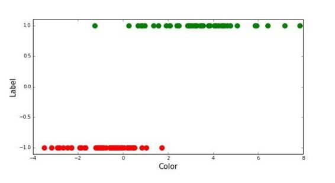 

我们看到西红柿和猕猴桃往往位于水平轴上它们自己的空间之中。尽管这两个类之间还存在一些重叠。这是可以预料的，因为有一些还没有成熟的西红柿是绿色的。这也告诉我们，只是测量颜色并不能提供足以区分西红柿和猕猴桃的足够的信息，但这里只是为了演示，我们可以将问题简化一下。

如果我们对一个未知的水果进行测量，我们现在可以通过简单的观察水果在哪个区域里，区分它是西红柿还是猕猴桃。这里我们所构造出来的即被称为判别式分类器。有辨别能力的部分参照的是根据所属的种类划分空间到不同区域的性质。这种类型的分类器已经非常成功，并在许多应用中得到了使用。下一步进展就是要建立模型，使我们能将两种水果分开。我们通过设置一个西红柿区域为 -1、猕猴桃区域为 +1 的函数来完成这项任务，从而将空间划分成了两个种类的区域。

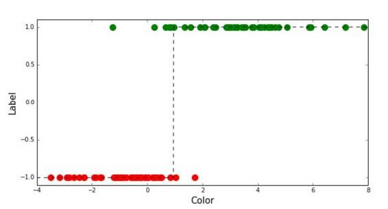 

两个种类区域间的分界线被称之为分类边界（classification boundary）。目标是用这样的方式划分空间，使得更多的水果通过我们的模型可以尽可能正确地标记出来。这个过程被称为学习（learning），我们将要在这篇文中的后面讨论这个过程。有了我们的模型，我们现在可以基本上放弃我们的样本，直接用模型区分新的目标是西红柿还是猕猴桃。我们通过观察事物的颜色，根据它的测量结果落在哪个区域决定它是什么种类。

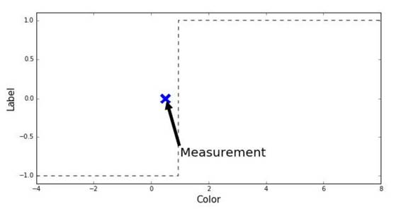 

在上述的例子中，我们发现我们的测量结果落到 -1 区域，因此将该目标标记为西红柿。这种方法是正确的，但是需要注意与其相关的一件事。对于我们的测量结果，我们的模型没有保留数据的密度或是频率。为了解释这是什么意思，考虑如下场景：如果我们新样本离我们的训练样本非常远呢。

现在的问题是：我们是找到了一个特别的红色西红柿，还是什么地方出了错误，例如一块明亮色彩的红塑料以某种方式进入到了系统中？这是我们的判别式分类器所不能回答的问题。

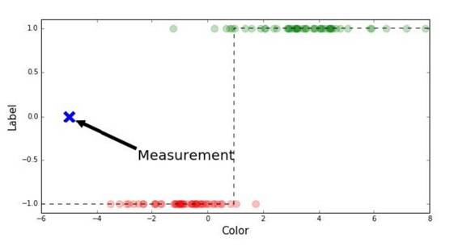 

**生成式（Generative）分类器**

**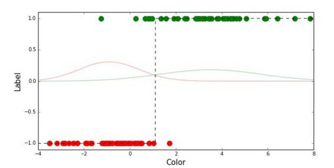** 

为了解决上述的限制，我们引入了生成式分类器。我们的生成式分类器将要用两个正态分布为我们的两种水果建模。每个正态分布代表着根据给定的颜色测量结果所属种类的概率。即每个正态分布是对它们所属种类的似然性的建模。

为了能区分西红柿和猕猴桃，我们现在观察两个概率密度函数哪个更大，从而对一种新的测量进行分类。事实上，我们正如之前那样将空间划分到两个区域，之后如果我们想，我们就可以舍弃所有正态分布。

但我们不会这么做，因为正态分布中还包含了我们可以使用的附加信息。即正态分布可以告诉我们一个样本是否可能属于或不属于其中的种类。

考虑一下上图中的测量结果，其所在区域距离我们训练集中的样本很远。我们发现不仅根据我们的训练集，测量结果是奇异的，根据我们的模型（即正态分布）也是不大可能发生的。因此我们能够通过我们的模型检测出这一点，并让操作员停掉流水线来检查问题。你可能怀疑「生成（generative）」这个单词从何而来。这个词来源于：我们可以根据我们的正态分布提取出样本，并在实际上生成测量。

**学习与优化**

到这里，我们已经看到了两种机器学习的算法，判别式（discriminative）与生成式（generative）。我们假设我们有一个能构成我们模型的样本集（事实上称为训练集）。下面我们看一下如何使用训练数据构建一个模型，这个过程被称之为学习。

让我们从生成式分类器开始，我们希望调整两个正态分布符合我们的数据。两个正态分布通过它们的均值 μ 以及标准差 σ 量化。所以如果我们能找到那些参数，我们就可以构建我们的模型并调整该正态分布以适应它们各自的类数据。为了计算均值，我们在每个类上对我们的测量结果求样本均值。为了计算标准差，我们在每个类的数据上对样本方差求其平方根。样本均值与方差根据以下两条公式计算得出：

 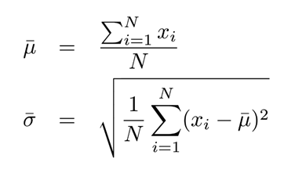 

接下来我们回到了判别式分类器。这可以通过我们的判别式分类器进行解释。我们的判别式分类器使用如下函数作为它的模型：

f(x) = sign[a · x + b]

我们有度量结果 x，常数 a 和 b 决定度量结果将在什么地方分为 -1 和 +1 区域。我们的目标是找到可以使尽可能多的样本被分类正确的 a 和 b 的值。

寻找参数不总是通过分析的方法处理的，这也是我们判别式分类器的情况；在这种情况下我们需要一些能迭代地寻找参数的优化方法。我们使用下列优化算法寻找 a 和 b 的值：

**算法 1：优化算法（Optimization Algorithm）**

1\. 首先，对参数 a、b 值进行随机的猜测。

2\. 根据所有样本的测量 x 和标签 y 更新变量：

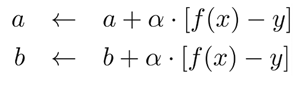 

3\. 如果没有达到最大迭代次数，就返回到步骤 2.

在这个算法中，f(x) 是将我们的模型应用于测量 x 的结果。这将产生一个 -1 或 +1 的分类。之后我们比较这个结果与样本相应的标签 y。接着我们根据比较的结果更新参数，例如我们以某种方式移动决策边界（decision boundary），使样本更倾向于被更新。更新的大小取决于 α，其被称为学习率（learning rate）。

**监督和无监督学习**

现在我们知道生成式和判别式分类器之间的差别了，也知道在进行无监督学习时如何学习这样分类器的参数。你可以没意识到，但上面的案例中我们已经使用到了监督学习。我们有一个包含测量标准（水果颜色）和标签（西红柿或者猕猴桃）的训练集。但如果我们不知道我们的样本标签怎么办？换言之，我们有水果的测量，我们知道它们要么是西红柿要么是猕猴桃，但我们不知道具体是哪个。

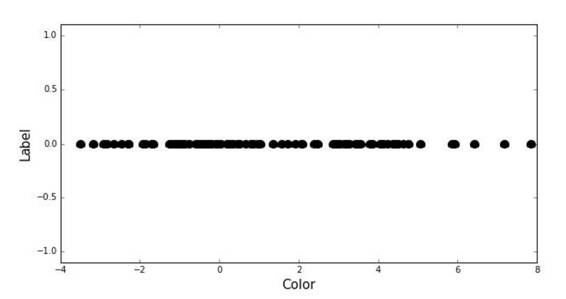 

这就是无监督学习的问题了，它要比监督学习复杂的多。解决该问题的方式是回到分类的生成式方法上。使用生成式方法，我们在类别数据上拟合两个高斯函数。然而，在无监督学习中我们没有分类数据，而且需要在不知道数据分类的情况下拟合高斯函数。做到这一点的方式是尝试拟合两个高斯函数，以便于它们能最大可能好地解释数据。我们想要最大化由两个正态分布生成的数据的似然性，通过使用一个被称为期望最大化（expectation maximization）的复杂优化算法做到这一点。该算法是一个发现最大化后验参数评估的迭代过程。

该算法不在本文的讨论范围之内，但有很多这样的资源可以查看。在应用期望最大化优化算法之后，我们得到平均值和方差，得到如下结果：

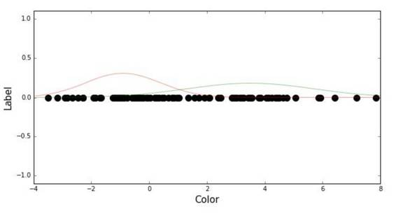 

现在，我们可以像之前一样通过比较似然性来分类这些点。

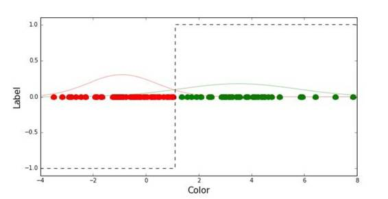 

**参数算法与非参数算法**

接下来，我们打算探讨参数和非参数分类器之间的差别。参数算法（parametric algorithm）一词指你用来定义模型的参数。使用参数算法，我们在训练数据中提取用于完整定义模型的参数值。我们前面看过的两个模型都使用参数。判别式模型使用两个参数：a 和 b，生成式模型使用四个参数：两个平均值（μ1、μ2），两个方差（σ1, σ2）。在找到这些参数之后，我们就不再需要训练集。

非参数算法（non-parametric algorithms）不使用参数对模型进行特征化，而是直接使用训练数据。这经常需要更大的计算花费和存储能力。但这些非参数分类器往往也更加准确，相比于参数分类器更容易在小训练集上开展。

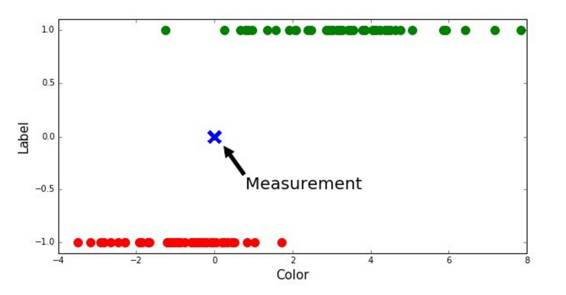 

一个典型的非参数算法是 K 最近邻分类器（k nearest neighbor classifier）。给定一个新的测量，我们寻找 k 最近邻值，并将最常见的类别标签分配给该标准。在我们采用测量标准的 5 个最近邻值时得到 -1,-1,-1,+1,-1 这 5 个标签。我们看到 -1 出现最频繁，因此我们准确地将测量分配给 -1，即西红柿类。

**过拟合**

目前，我们假设只有一个机器学习模型、一个样本训练集、一个从这些样本中进行学习的优化算法。我们将讨论的下一件事是过拟合问题。如果我们采用一个判别式分类器处理样本，我们可以看到它将空间分成两个区域。我们也可以考虑用一个分类器将空间划分为多个区域进行分类。在我们的样本之下，得出了如下结果：

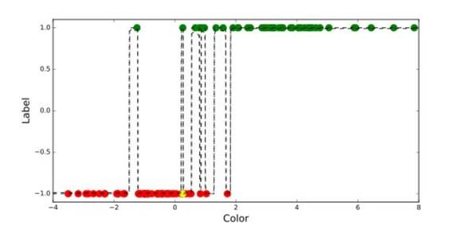 

我们看到，模型将空间划分为多个区域，而且设法在我们数据集上准确的分类更多样本。因此，它现在将更多西红柿标记为西红柿、猕猴桃标记为猕猴桃。你可以认为我们对模型进行了改进，但其实我们所做的恰恰相反。要记得一些西红柿比猕猴桃更绿，而一些猕猴桃比西红柿更红。这意味着基于我们单一的测量标准，这两个分类之间会发生重叠，彼此之间难以清晰辨别。

**测试与验证**

为了展示过拟合的结果，我们将其它样本集考虑在内。我们现在有一个 100 样本的训练集，使用该训练集学习一个机器学习模型，然后使用另一个包含 100 样本的验证集评估模型。如果将模型应用于评估集我们得到如下结果：

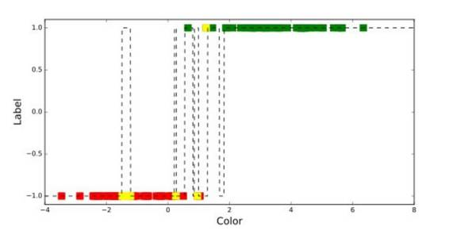 

我们可以看到模型在检验集上的表现比训练集差得多。这是因为我们只使用一个测量标准。这个案例告诉我们，使用一个检验集检查模型是否在训练集上过拟合无论何时都很重要。使用更多复杂的评估技术（比如 n 折交叉验证）能得到更准确的验证，能检验模型在数据上的过拟合程度。

**多维输入**

目前，我们只考虑使用一个测量标准分类水果。我们也看到因为只使用一个标准，分类结果可能会有交叉。因此，我们可以考虑增加第二个标准，以便于更好的分类水果类别。的确如此，而且增加维度（增加更多的测量标准）也将增加准确率。为了展示这一点，我要增加一个额外的标准。我们打算用传感器测量目标的硬度与软度。这个思路是因为苹果外表较硬、猕猴桃软，如此我们在这两种水果间就能更好地分类。我们将对比分别有 1 个和 2 个输入维度测量标准的判别式分类器和生成式分类器:

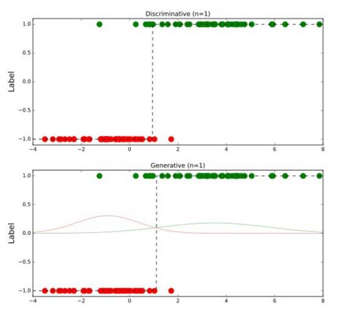 

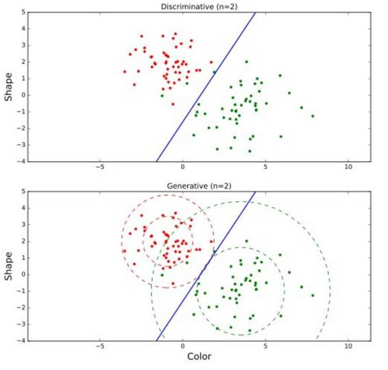 

在上图中，我们看到从 1 维变成 2 维确实提升了我们的分类器的准确度。显然并非所有的测量都会提升我们的算法的表现，事实上，选择糟糕的测量标准还会降低算法的表现。比如说，测量环境的温度或空气运动。这些测量指标与我们分类水果的目标毫无关联，只会给我们的结果带来干扰。

**维度的诅咒**

有一种说法是把增加输入测量标准的数量描述为维度的诅咒。这个描述不难理解，但如果你不知道它，它可能就有欺骗性了。可以超立方（hypercube）的容量来很好地阐述这个问题。超立方是 n 个维度的立方体的广义定义。例如，一个 2 维超立方是正方形。2 维超立方的容量就是边长的平方。一个 3 维超立方是正方体，容量是边长的 3 次方。但我们也可以认为 4 维立方体的容量是边长的 4 次方。

现在我们降低维度。一个 1 维超立方就是简单的一条线，容量（或者长度）就是边长，同样 0 维超立方就是一个点，区域是 0。我们看到，一个超立方的容量等于边长的 n 次方，其中 n 就是维度的数量。

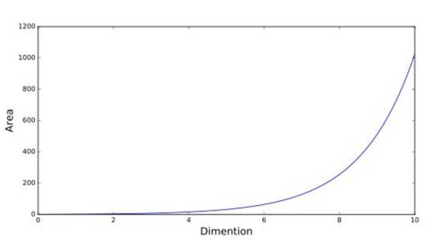 

因此，如果一个超立方的边长为 2，我们将维度从 0 增加到 10，我们就会发现其容量变化会呈指数倍增长。

现在假定我们有一个 5 个样本的训练集，输入测量标准位于 0 到 2。如果我们有 1 个测量标准，本质上我们的输入空间相当于边长为 2 的 1 维超立方的容量。一个 3 维的输入空间覆盖区域的 2 的 3 次方，也就是 8，可能不能被我们的 5 个训练样本很好的覆盖。事实上，你需要 125 个样本才能合适地覆盖这个输入空间。你有越多的输入测量或维度，你能得到越高的准确度，但因为量级呈指数增长，你将也需要指数性的样本数量来覆盖输入空间。

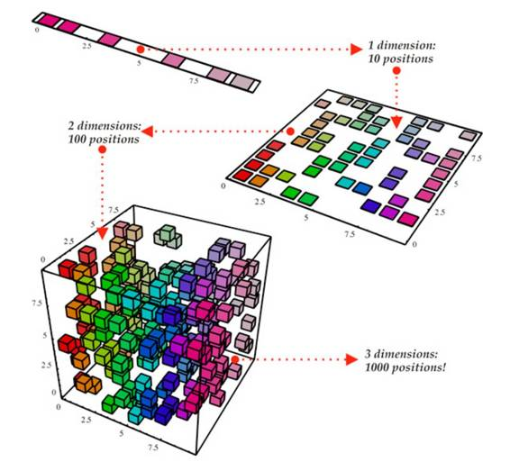 

**降维**

我们已经见过：随着输入的维度的增长，我们所需要的足以适当覆盖整个输入空间的样本的数量会指数式地增长。然而在真实世界中，样本往往具有所谓的多维流形（multidimensional manifold）。尽管多维流形这个词听起来很复杂，但其基本思想却很简单。为了说明，我们想想看一个带有一维流形的二维输入空间。

我们看到我们有两个输入维度，但数据实际上落在 1 维的线（流形）上。我们所能做的是将数据投射这条线上，以为每个样本获取单个值。因此我们已经通过利用我们对流形的知识将该空间从 2 维减少到了仅 1 维。

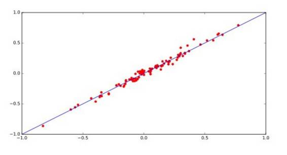 

**特征工程**

到目前为止，当谈到为我们的分类器生成输入时，我们一直都在谈论对目标属性的测量。用机器学习的术语来讲，这些测量被称为特征（feature）。特征也可以从多个测量中进行构建。比如说，除了我们的颜色测量，我们也可以测量目标的形状。我们可以使用一台相机拍摄目标的照片，然后再使用多种图像处理技术，我们可以提取出目标的外形作为附加的特征。

这个过程被称为特征工程（feature engineering），而且其在优秀的分类系统的构建中发挥着重要的作用。请注意，本质上特征工程并没有必要。只要数据足够，一个复杂的机器学习模型应该就能直接从数据中学习出这些特征。这些机器学习系统是存在的，其中最流行和最有效地被称为深度学习系统。因为这样的系统被提供的只有原始的输入数据，，所以它们必须直接从样本中学习特征，它们需要大量的训练数据集才能有效。值得提及的一件事是特征工程存在一个限制。特征工程本质上是一种将特定领域的知识直接从人类迁移到机器的方法。但是，人类将该领域的细微之处编写为特征的能力是有限的。因此，只要数据足够，从原始数据中学习往往会产出更为精准的结果。

***©本文由机器之心编译，***转载请联系本公众号获得授权***。***

✄------------------------------------------------

**加入机器之心（全职记者/实习生）：hr@almosthuman.cn**

**投稿或寻求报道：editor@almosthuman.cn**

**广告&商务合作：bd@almosthuman.cn**